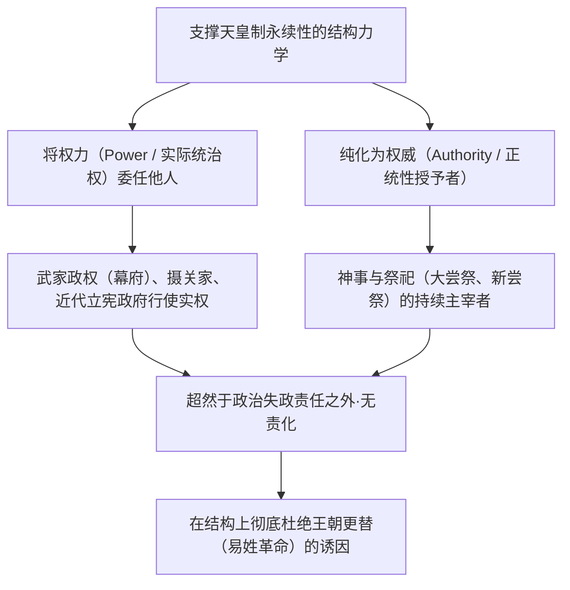
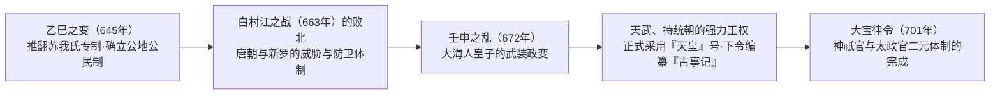
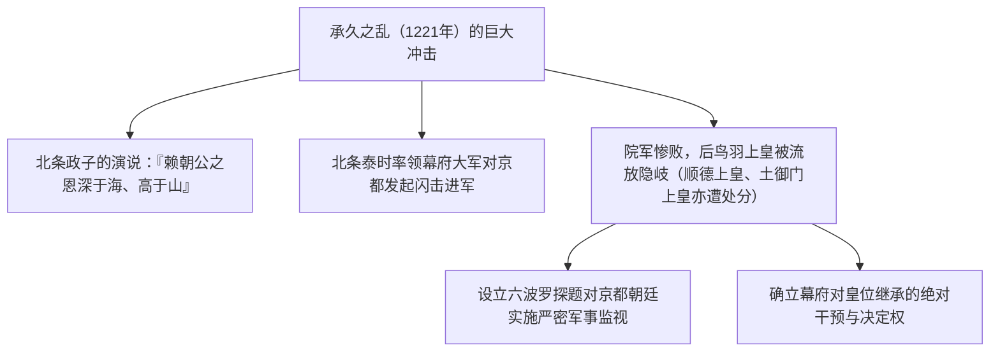
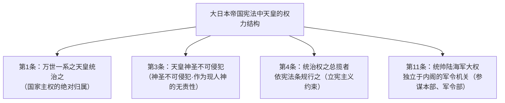
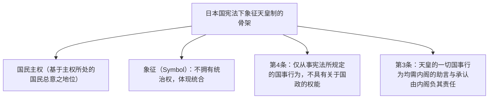
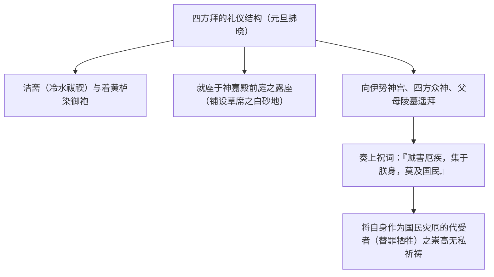
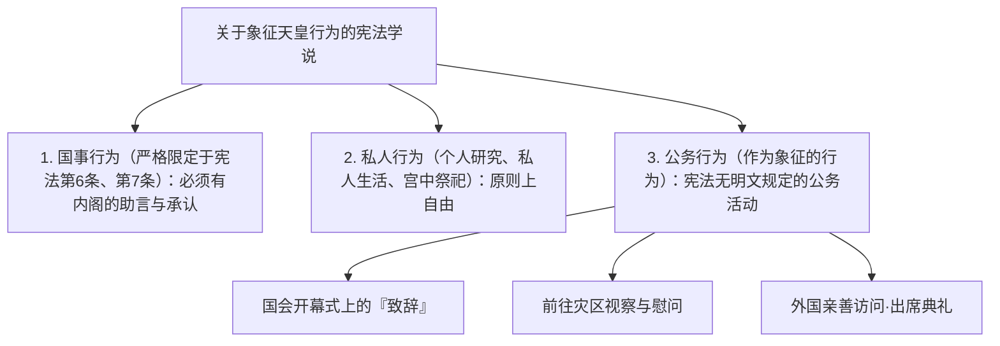

## 1. 序论：世界最古老的世袭王统与“权力与权威的分离”

### 1.1 万世一系之说与历史学、考古学实态

在日本，天皇（Emperor of Japan）及皇室的历史，与当今世界上现存的任何王室或王朝相比，都展现出无与伦比的独特连续性。吉尼斯世界纪录亦将其认证为“现存世界上最古老的世袭君主家族（The oldest continuous hereditary monarchy）”。

近代国学以及《大日本帝国宪法》第1条所高标的“万世一系（Bansei Ikkei：永不中断的单一血统）”论说，虽然带有神话意识形态的色彩，但对照实证历史学与考古学的研究成果，**至少自5世纪后半期的雄略天皇（获加多支卤大王）或6世纪初期的继体天皇以降，在长达约1500年以上的岁月里，单一王统在同一列岛空间内保持了连续性**，这在学术上是无可置疑的历史事实。

纵观世界各大文明的历史，在中国，因天命更迭、改换姓氏的“易姓革命（Dynastic Cycle）”导致前朝皇族被彻底诛灭；在欧洲诸国，诺曼王朝、金雀花王朝、都铎王朝、斯图亚特王朝、汉诺威王朝等王朝更迭亦如走马灯般频仍。与此相对，为何唯独在日本，未曾经历王朝更迭的断绝，单一王统竟能延续至今？



---

### 1.2 “权力与权威的分离”之比较文明论视野

正如丸山真男、鲁思·本尼迪克特（Ruth Benedict）等思想史家与比较文化学者所指出的那样，日本文明统治结构的最大特征，在于**“政治权力（Power：军事力、征税权、日常统治）”与“终极权威（Authority：正统性根源、宗教与象征层面的圣性）”实现了彻底的二元分离**。

西洋的绝对君主（如法国路易十四等）或中国的专制皇帝，既是亲自统帅军队、发号施令的“权力者”，同时也是法律与秩序的“权威者”。在这两者合二为一的体制下，一旦发生施政败绩、对外战败或重大社会动荡，其政治责任将直接冲击君主个人，引发叛乱并连同整个家族被推下宝座。

与此相对，日本的天皇自平安时代的藤原氏（摄关政治）、白河院以来的院政、中世的武家政权（镰仓幕府、室町幕府、江户幕府），直至近代的内阁，始终保持着**“将世俗统治权力（实权）恒常委任给外部辅弼者或武家”**的结构。即便是幕府将军，为了证明自身统治的正当性，也必须由天皇任命为“征夷大将军”。

施政失败的责任永远由行使权力的幕府或内阁承担，并通过倒幕或政变而覆灭。然而，作为正统性源泉的天皇始终处于政治责任的彼岸，因此无论处于何等动荡的时代，任何势力都没有篡夺天皇地位（杀害天皇并自登皇位）的结构性诱因。

---

## 2. 古代国家的形成与“天皇”号、律令祭祀的诞生

### 2.1 从大王（治天下大王）到“天皇”的升华

古坟时代，君临列岛中央的大和王权首领被称为“大王（治天下大王）”。埼玉县稻荷山古坟出土铁剑铭文上所刻的“获加多支卤大王（雄略天皇）”，便鲜明保留着作为强力豪族（氏姓贵族）联合体盟主的性格。

6世纪末至7世纪初，拥立推古天皇的圣德太子（厩户皇子）与苏我马子，创设了冠位十二阶（依据个人才干而非门阀家世的官位制度）并制定十七条宪法（“以和为贵”、“笃敬三宝”、“承诏必谨”）。正如其致隋炀帝的国书所云：“日出处天子致书日没处天子无恙”，这标志着日本脱离中华帝国的册封体制（朝贡秩序），宣告成为独立对等的“天子”。

在645年的**“乙巳之变（大化改新）”**中，中大兄皇子（后来的天智天皇）与中臣镰足（藤原氏始祖）在宫中刺杀了专横跋扈的苏我入鹿。新政权否定豪族对土地和人民的私有占有，提出了将一切土地与人民归属于国家（天皇）的“公地公民制”理想。



---

### 2.2 壬申之乱（672年）与天武天皇的绝对权威

日本古代史上最大的分水岭，是天智天皇死后爆发的皇位继承内战——**“壬申之乱（672年）”**。隐居吉野的大海人皇子动员美浓、尾张等东国军事力量，闪击并消灭了近江朝廷的大友皇子，亲自在飞鸟净御原宫即位（**天武天皇**）。

在天武天皇及其皇后持统天皇的统治时期，古代律令王权的基本框架得以确立。
1. **正式采用“天皇”称号**：
   - 源于道教最高神“天皇大帝（北极星神格化）”的至高尊称“天皇（Tenno）”，开始在木简与金石文中正式使用。
2. **制定国号“日本”**：
   - 取代以往的“倭国”，确立了“日本（太阳升起之国）”这一充满自豪的国号。
3. **开始编纂正史（神话）**：
   - 奉天武天皇敕命，整理诸氏族流传的传承，将皇统的正统性追溯至太阳神天照大神，启动了《古事记》（712年完成）与《日本书纪》（720年完成）的编纂工程。

---

### 2.3 记纪神话的深层结构与三神器

《古事记》与《日本书纪》中所叙述的自皇祖神天照大御神至初代神武天皇的神话体系，为天皇权威提供了宗教与宇宙论层面的依据。

- **天孙降临与“三大神敕”**：
   - 天照大神命其孙琼琼杵尊（尔皇孙）降临地上（高千穗峰）之际，颁布了最为根本的命令——**“天壤无穷之神敕”**：
   > “丰苇原千五百秋之瑞穗国，是吾子孙可王之地也。宜尔皇孙，就而治焉。行矣，宝祚之隆，当与天壤无穷者矣。”
   - 这是一份神圣契约，宣称地上的统治权依照天神意志，被永恒赋予皇孙及其后裔。
   - 此外，还下达了命其将神镜视作天照大神本体加以奉祀的“宝镜奉斋之神敕”，以及命其在地上培育天界斋庭稻穗的“斋庭稻穗之神敕”。
- **三神器（三种神器）**：
   1. **八咫镜**：睿智·太阳的神圣性（伊势神宫内宫之神体，皇居供奉其形代）。
   2. **八尺琼勾玉**：慈悲·灵力（常置于皇居剑玺之间）。
   3. **草薙剑（天丛云剑）**：武威·勇气（热田神宫之神体，皇居供奉其形代）。
   - 在历代天皇的即位礼仪中，继承神器的“剑玺等承继之仪”，被视作皇位不可或缺的正统性证明。

---

### 2.4 律令制度的二元制：神祇官与太政官，以及大尝祭

在701年《大宝律令》中确立的古代官制，虽模仿了唐朝的律令制度，却进行了极为关键且具日本独创性的重大改造。

唐朝制度将祭祀机构（太常寺）置于最高行政机构（尚书省、中书省、门下省）之下；与此相对，日本的律令制将主管众神祭祀的**“神祇官”**，置于与统括国政的**“太政官”**完全对等乃至更居上位的地位，形成了“二官八省制”。

天皇最本质的日常职责并非政务（世俗政治决断），而是**“神事（向不可视的神佛祈祷）”**。
- **新尝祭**：每年11月，将该年收获的新谷供奉给神明，天皇自身亦共同进食，以此实现神人一体（神人共食），祈求国家安宁与五谷丰登的祭礼。
- **大尝祭**：天皇即位后首次举行的、一代仅此一度的最高秘仪。从零开始搭建被称为悠纪殿与主基殿的朴素古代寝殿，彻夜向皇祖神供奉新谷并亲自共食，使天皇灵（皇祖之灵威）寄宿于己身，从而蜕变为真正的神灵君主、完成精神上的重生。

无论政治实权如何风云变幻，这种“为了国家向神明无私持续祈祷的最高主祭者”角色，始终是天皇制不可磨灭的核心。

---

## 3. 中世与近世中权威与权力的双重结构

### 3.1 摄关政治与院政：宫廷内部的权力力学

平安时代，围绕天皇的政治结构经历了高度的精致化与嬗变。

- **藤原氏的摄关政治（10～11世纪）**：
   - 藤原北家（道长、赖通的全盛期）通过将自己的女儿送入后宫作为历代天皇的皇后（中宫），使诞下的皇子在幼冲之年即位，从而以母方祖父（外戚）的身份担任“摄政”，并在天皇成年后出任“关白”。
   - 他们不篡夺天皇的权威，而是凭借外戚地位彻底掌握了人事任免权与国政决策权。
- **院政的建立（11世纪末～）**：
   - 1086年，白河天皇将皇位让给幼年的堀河天皇，自己成为“上皇（太上天皇）”，并在宫廷之外（白河院）设立自己的直属机构（院厅）。
   - 作为“治天之君（天皇家家长）”，排除摄关家，夺回了政治实权。上皇出家成为“法皇”后，更是摆脱了儒教与律令制度对天皇的种种仪轨约束，行使专制权力。

---

### 3.2 武家政权的诞生与承久之乱（1221年）

12世纪后半期，历经平氏政权的覆灭，源赖朝在东国镰仓建立了**“镰仓幕府”**。
赖朝从朝廷获得了“征夷大将军”官职，并获得了在全国设置守护、地头的敕许（文治敕许，1185年）。至此，西方的“朝廷（公家）”与东方的“幕府（武家）”之公武二元统治体制正式确立。

为扭转这一武家占优的潮流，抱负非凡的**后鸟羽上皇**进行了一场孤注一掷的豪赌。
1221年，上皇下达追讨镰仓幕府执权北条义时的院宣，号召全国武士起兵（**承久之乱**）。



承久之乱以武家方面的压倒性胜利告终。武士公开践踏朝廷院宣，甚至将身为“治天之君”的上皇处以流放之刑。这一事件昭示天下：失去军事力量的朝廷根本无法抗衡武家力量。幕府自此直接介入皇位继承，并成为后来裁定大觉寺统（南朝系）与持明院统（北朝系）交替即位（两统迭立）的仲裁者。

---

### 3.3 建武新政与南北朝动乱

1333年，后醍醐天皇动员足利尊氏、新田义贞、楠木正成等武士集团推翻了镰仓幕府，开启了天皇亲政的**“建武新政”**。

然而，新政无视武士的封赏诉求，推行脱离时代实际的偏袒公家政策与复古主义专制，仅仅维持了两年多便告崩溃。反叛的足利尊氏在京都拥立光明天皇（持明院统），建立室町幕府；后醍醐天皇则出逃吉野山中，坚称正统。

此后约60年间，京都的**“北朝”**与吉野的**“南朝”**为争夺正统性爆发长期内战，史称**“南北朝时代（1336–1392）”**。1392年，在室町幕府第3代将军足利义满的斡旋下达成“明德和约（南北朝合一）”，南朝后龟山天皇将三神器移交给北朝后小松天皇（历代天皇之皇统虽作为北朝后小松天皇以降的血统延续至今，但明治以后官方认定持有神器的南朝具有历史正统性）。

室町全盛期，足利义满接受明朝永乐帝册封为“日本国王”，并试图让自己之子继承皇位，被视为最接近“篡夺皇位”之人，但随着其突然暴亡，这一野心化为泡影。

---

### 3.4 德川幕府的《禁中并公家诸法度》与“御学问”规定

战国乱世之中，朝廷财政极其困窘，甚至衰微到后奈良天皇需靠出卖亲笔宸翰（和歌与《般若心经》）来补贴宫廷开支的地步。然而，织田信长、丰臣秀吉、德川家康等天下霸主均未废除天皇，反而进行巨额赋赠，并接受关白、太政大臣、征夷大将军等官职任命，以此强化自身政权的正统性。

统一天下的德川家康于1615年颁布了在法律上彻底约束朝廷的**《禁中并公家诸法度》（全17条）**。其开篇第1条赫然规定：

> **“天子诸艺之事，第一御学问也。”**

这一条款的真实意图冷酷至极：“天皇所当修习者，唯学问、有职故实与和歌之道，绝不可插手干涉政治与军事。”
紫衣事件（1629年：幕府强行废除了朝廷未经幕府许可授予高僧紫衣的敕许，后水尾天皇为表抗议突然退位）充分表明，江户时代的天皇被幽禁于京都御所深处，彻底剥夺了一切政治实权，被完全塑造成无害化、形式化的“礼仪与学问的象征性存在”。

---

## 4. 明治维新与近代“现人神”国家的创出

### 4.1 从尊皇攘夷到王政复古

江户时代中叶以降，随着水户藩编纂《大日本史》与国学（本居宣长等）的兴起，“幕府将军的统治仅是受天皇委任（大政委任论）”的尊皇思想在武士阶层中逐渐蔓延。

1853年佩里叩关（黑船来航）之后，德川幕府在应对外部危机中的无能暴露无遗，下级武士与志士群体中爆发了狂热的“尊皇攘夷”浪潮。孝明天皇颁布攘夷敕定，长州藩与萨摩藩则以朝廷为政治凝聚力实现结盟。

1867年10月，第15代将军德川庆喜上奏“大政奉还”。同年12月9日，在岩仓具视与萨摩藩西乡隆盛等人主导下，朝廷颁布**“王政复古大号令”**：
- 废除幕府、摄政、关白。
- 宣布重归初代神武天皇肇国之初衷，建立天皇亲政的新政府。
- 年仅16岁的明治天皇即位，改江户为“东京”，皇居由京都迁至东京城（原江户城）。

---

### 4.2 《大日本帝国宪法》（明治宪法，1889年）的立宪二元论

伊藤博文等明治元勋以普鲁士（德国）立宪主义为范本，结合日本国情，起草了**《大日本帝国宪法》**。



明治宪法体制下的天皇具有极高程度的“两重性”：
1. **传统与宗教维度**：天皇是神明之后裔、国民道德之源泉，是神圣不可侵犯的现人神。
2. **近代与立宪主义维度**：天皇是“依宪法条规”行使统治权的立宪君主，不能像专制独裁者那样任意发号施令，行使行政权须经国务各大臣之“辅弼”（第55条），行使立法权须经帝国议会之“协赞”。

大正时代，东京帝国大学法学部教授美浓部达吉提出的**“天皇机关说”**（国家为法人，天皇是作为法人之国家的最高机关，主权属于国家法人自身），成为大正民主运动时期政党内阁制的宪法理论支柱。

然而，明治宪法深植了一项致命的制度缺陷，那便是**第11条的“统帅权独立（陆海军统帅不受内阁辅弼，军令机构直属于天皇）”**。进入昭和时代，当军部以统帅权为挡箭牌彻底摆脱内阁与国会控制之时，立宪主义的防线便不堪一击、全面崩溃。

---

## 5. 昭和的激荡与败战，以及向“象征天皇制”的剧烈转型

### 5.1 昭和初期的破局与终战“圣断”

1930年代，经历统帅权干犯问题、五一五事件、二二六事件，政党政治荡然无存，日本步入军部独裁、陷入侵华战争泥潭，并于1941年发动太平洋战争。

国家神道被极度教条化，国民被灌输“为天皇献出生命”是至高美德。然而，昭和天皇本人作为立宪君主，在无法拒绝内阁与统帅部决定的处境与对和平的祈愿之间，陷入了长期的剧烈痛苦与挣扎。

1945年8月，面对广岛、长崎遭受原子弹轰炸以及苏联参战，最高战争指导会议在围绕“护持国体（皇室存续）”究竟是接受降伏还是彻底抗战（本土决战、一亿总玉碎）上，双方势均力敌、陷入僵局。
8月10日及14日在防空洞中举行的御前会议上，面对首相铃木贯太郎的请示，昭和天皇流着泪作出了历史性的**“圣断”**：

> **“朕的职责在于拯救国民。无论朕之一身如何，朕不忍再见国民死于战火、人类文明惨遭毁灭。……朕欲忍其所难忍，耐其所难耐，以此决意终结战争。”**

8月15日正午，随着玉音放送（终战诏书）的播发，战争宣告结束。历史普遍认为，若无天皇以言辞进行的直接介入，本土决战势必导致数百万计的额外生命牺牲。

---

### 5.2 与麦克阿瑟的会面及东京审判免责

败战之后，盟军最高统帅道格拉斯·麦克阿瑟率驻日盟军总司令部（GHQ）进驻日本。美、英、苏等同盟国的主流舆论强烈要求将昭和天皇列为“头号战争罪犯”予以处决，并彻底废除天皇制。

1945年9月27日，昭和天皇孤身前往美国大使馆拜会麦克阿瑟。据麦克阿瑟回忆，昭和天皇绝非前来乞命，而是作出了如下表态：

> **“我是为了对日本国民在执行战争中所作出的一切政治与军事决断及行动承担全部责任，而来将自身托付于阁下的。无论我个人的命运如何均无所谓。唯乞求能给予国民以糊口之粮。”**

麦克阿瑟深受天皇这种无私精神的强烈震撼，当即确立了“保留天皇制并免除对天皇起诉”的占领政策方针。他判断，若处决天皇，全日本将爆发百万人规模的游击反抗，盟军将绝无可能实现和平占领。

1946年1月1日，昭和天皇发表**《关于建设新日本的诏书》（即所谓的“人间宣言”）**，宣告天皇与国民之间的纽带并非建立在神话或现人神的观念之上，而是基于相互的信赖与敬爱。

---

### 5.3 《日本国宪法》第1条：“象征天皇制”的确立

1947年5月3日施行的**《日本国宪法》**，在第1条中从根本上重新定义了天皇的法律地位：

> **第1条：“天皇是日本国的象征，是日本国民统一的象征，其地位基于主权所处的日本国民的总意。”**



- **彻底剥夺统治权**：天皇不再是国家元首（统治者），而是体现国家存在本身与国民统一性的“象征（Symbol）”。
- **禁止干预国政（第4条）**：仅从事宪法所列举的形式性、礼仪性“国事行为”（召集国会、任命内阁总理大臣、批准条约、授予荣誉等），不得行使任何实质政治权能。
- **内阁的助言与承认（第3条）**：一切国事行为均须有内阁的助言与承认，全部政治责任皆由内阁承担。

这种“象征天皇制”常被视为盟军强加的异质制度，但对照前文所述的漫长日本历史，亦完全可以被解读为以最纯粹的形式，回归到自中世以来**“天皇不行使政治权力，唯专心于权威与祈祷”**的传统结构之中。

---

## 2.5 宫中祭祀的礼仪结构与“四方拜”的精神力学

若要理解天皇的存在，便必须触及皇室内连绵传承、作为在《日本国宪法》上与“国事行为”完全切割的私人领域的**“宫中祭祀（Imperial Court Rituals）”**之深奥精义。

在皇居郁郁葱葱的吹上御所深处，庄严肃穆地坐落着**“宫中三殿”**：
1. **贤所**：供奉皇祖神天照大御神之神体——八咫镜（形代）。
2. **皇灵殿**：祭祀自神武天皇以降的历代天皇及皇族之御灵。
3. **神殿**：祭祀天神地祇（八百万众神）。

天皇每年亲自主持数十次严谨庄重的祭祀。其中，最令人精神震撼的仪式，莫过于在元旦拂晓（凌晨5点30分）、于凛冬严寒之中举行的**“四方拜”**。



天皇以冷水清涤身心，身着古制装束，跪坐于白砂地上的露座，面向以伊势神宫为首的四方山川、诸神以及历代天皇之山陵深深遥拜。随后，奏上平安时代仪式书中所载之祝词秘文：
> **“贼害厄疾、水火之难，若将殃及万民，宁先过朕之身（若灾厄必降临于国民，请先穿透朕之躯体）。”**

将自身作为替国家与国民承受一切灾厄的“终极替代者（替罪牺牲）”献祭给神明。这并非用于支配他者的权力，而是归灭自身、唯求他者福祉的绝对自我牺牲之祭祀精神，正是数千年来天皇权威深植于国民深层心理底层的无意识磁场。

---

## 3.5 历代女性天皇的历史实态与“过渡（中继）”论的虚实

在皇位继承讨论中，频繁被援引作为例证的，是日本历史上实际存在过的**“8位10代女性天皇”**。

| 代数 | 天皇名 | 治世 | 即位背景与历史功绩 |
| :---: | :--- | :---: | :--- |
| **第33代** | **推古天皇** | 592–628 | 为平息崇峻天皇遭暗杀后的政局混乱，作为首位女性天皇即位。与圣德太子、苏我马子通力协作，制定冠位十二阶与十七条宪法。 |
| **第35代/37代** | **皇极天皇 / 齐明天皇** | 642–645 / 655–661 | 重祚（两次即位）。作为乙巳之变历史舞台的在位君主；齐明朝时期为应对白村江之战亲征九州，崩逝于战地。 |
| **第41代** | **持统天皇** | 690–697 | 天武天皇之皇后。继承先帝遗志，营建藤原京，施行飞鸟净御原令，稳固地将皇统传递给其孙文武天皇。 |
| **第43代** | **元明天皇** | 707–715 | 迁都平城京（710年），《古事记》成书，下令编纂《风土记》。 |
| **第44代** | **元正天皇** | 715–724 | 元明天皇之女（历史上唯一的母女相传皇位继承）。《日本书纪》成书，制定三世一身法。 |
| **第46代/48代** | **孝谦天皇 / 称德天皇** | 749–758 / 764–770 | 圣武天皇之女。重祚。平定藤原仲麻吕之乱，重用玄法之法王道镜。在宇佐八幡宫神谕事件中成功阻止道镜篡夺皇位。 |
| **第109代** | **明正天皇** | 1629–1643 | 江户时代初期。因后水尾天皇在紫衣事件中抗议幕府突然退位而即位（德川秀忠之外孙女）。 |
| **第117代** | **后樱町天皇** | 1762–1770 | 江户时代中期。在桃园天皇猝逝后，代行执政直至幼冲的后桃园天皇成长成年。近世最后一位女性天皇。 |

历史学的精密考证表明，一个不容争辩的事实是：**“过去所有的女性天皇，其父亲皆为天皇，全部属于‘男系女子’”**（历史上从未有过与民间人士或其他王朝男性通婚、将皇位传递给女系后裔的先例）。

此外，她们大多是在“皇位继承候选人年幼”、“先皇猝崩导致出现政治真空危机”等紧急事态下，以皇室长辈身份即位，在化解皇位继承危机后将权杖交接给下一代男系男子，发挥了“过渡（临时中继）”的作用。

然而与此同时，正如推古天皇与持统天皇那样，超越单纯的过渡角色、展现出强有力领导才能并奠定古代国家骨架的伟大女性君主，亦是确凿的历史存在。在古代日本，女性所具有的“通灵降神的巫女灵力（萨满主义）”与男性的世俗统治权力相互补充的“姬·彦制”传统，也被认为是女性天皇易于被社会接纳的深层文化根源。

---

## 4.6 国家神道的创出与“神社非宗教论”的近代哲学杂技

明治维新政府面临的最大难题，在于“如何构建出能够抗衡西方列强的近代民族国家（Nation-State）之统一整合原理”。

### ① 废佛毁释狂潮与神佛分离
对于千数百年来共生融合的“神佛习合（神社境内建立寺院、佛以神之化身显现的本地垂迹说）”，明治政府通过1868年的**“神佛判然令（神佛分离令）”**实施了强制割裂。
由此，全国范围内掀起了捣毁佛像、焚烧经卷、拆毁五重塔的狂暴**“废佛毁释”**逆流。政府最初试图推行将神道定为国教的“大教宣布运动”，但在民众根深蒂固的佛教信仰以及欧美诸国关于“侵犯宗教信仰自由”的强烈外交抗议面前遭遇重挫。

### ② “神社非宗教论”这一超法规虚构
在此关头，明治领导层（如井上毅等人）构想出了一套惊人的法理——即**“神社神道非宗教（神社非宗教论）”**的意识形态虚构。
- 在《大日本帝国宪法》第28条中保障“信教自由”，承认基督教与佛教为“个人的私法宗教”。
- 与此同时，却定义“在神社（如伊势神宫、靖国神社等）举行的祭祀并非宗教，而是全体国民皆须参与的**‘国家公共道德与敬祖礼仪’**”。
- 借此，构筑起一种即便为基督徒或佛教徒，只要身为帝国臣民，便绝不容许拒绝参拜神社与崇敬天皇的“国家神道（State Shinto）”之超宗教绝对空间。这一逻辑上的惊险杂技，成为后来昭和时期军国主义“现人神”崇拜走向暴走的制度温床。

---

## 5.5 宪法判例与象征天皇制的界线

日本国宪法下的象征天皇制，经过诸多宪法学争论与司法判决的洗礼，逐渐完善了其解释体系。



### ① “公务行为（作为象征的行为）”之肯定
宪法第4条第1款规定：“天皇仅从事本宪法所规定的有关国事之行为”。若作严格字面解释，国事行为以外的一切公务活动（视察灾区、接见外宾、开幕式致辞）都可能被判定为违宪。
判例与政府解释认为，“既然天皇处于日本国象征之地位，从事符合该地位的**‘公务行为（作为象征的行为）’**自属理所当然”，并将这些行为定位为只要在内阁控制（实质助言与责任）之下进行便属合宪。

### ② 政教分离（宪法第20条、第89条）与宫中祭祀
新尝祭与大尝祭等皇室神道仪式，究竟应当由国家公共预算（宫廷费·公款）支出，还是应当由内廷费（天皇家族私财）支出，曾引发激烈诉讼争端。
最高裁判所依照“目的与效果标准”（津地镇祭判决、爱媛玉串料判决：该行为之目的是否具有宗教意义，其效果是否造成援助、压迫或干涉特定宗教），在平成及令和的即位礼中，认定大尝祭属于“具有传统仪式性与公共性质的皇室典礼”，判决由公款（宫廷费）支出属于合宪。

## 6. 当代象征天皇的实践与皇位继承难题

### 6.1 平成的“巡礼”与退位的实现

为象征天皇制注入血肉温度的，是第125代天皇（现上皇明仁）与上皇后美智子的践行历程。
始终叩问“象征应当如何”的上皇，亲赴全日本的各个灾区（云仙普贤岳、阪神大地震、东日本大地震），跪坐在避难所的榻榻米上，以平视的视角握住受灾民众的手，给予他们无尽慰藉。同时，他们远赴冲绳、广岛、长崎，乃至塞班岛、帕劳贝里琉岛、菲律宾等昔日激战之地的海外战场，展开“慰灵之旅”，为使过往战争的记忆不被风化而持续祈祷。

2016年8月8日，天皇罕见地向国民发表了视频讲话（表明“个人心愿”）。坦陈随着年事渐高，自身愈发难以全心全意履行作为象征之职责的心境。回应这一呼吁，国会于2017年制定了《皇室典范特例法》。2019年4月30日，实现了自江户时代光格天皇以来时隔约200年的和平“生前退位”，皇太子德仁即位为第126代天皇，开启了“令和”时代。

---

### 6.2 围绕皇位继承的当代宪政与法律政策争点

迈入21世纪的今天，皇室所面临的最大危机在于“皇族人数骤减与皇位继承资格的极端收窄”。
现行《皇室典范》第1条规定：**“皇位由属于皇统之男系男子继承。”**

当前，拥有下一代皇位继承资格的皇族仅有悠仁亲王一人，局势犹如走钢丝般脆弱。围绕这一课题，日本舆论主要在三种方案之间展开激辩：

| 争点 | 方案内容 | 赞同派依据 | 慎重·反对派疑虑 |
| :--- | :--- | :--- | :--- |
| **① 容许女性天皇** | 承认天皇之女（女性）即位（例如：爱子内亲王即位）。 | 历史上推古天皇至后樱町天皇共有8位10代女性天皇的先例，符合国民情感。 | 若仅限于男系女子尚无不可，但警惕此举会成为通往女系天皇的踏板。 |
| **② 容许女系天皇** | 承认仅通过母方血脉与皇统相连者即位（如女性天皇与民间男子所生子女等）。 | 能够半永久性避免血脉枯竭的唯一现实解决方案，契合男女平等精神。 | 强烈反对认为这会从根本上毁灭传承126代、从未中断的“男系继承传统”这一皇室存立根基。 |
| **③ 旧宫家（男系旧皇族）复籍** | 将1947年遵照GHQ指令脱离皇籍的旧11宫家男系男子后裔，通过收养等方式恢复皇族身份。 | 能够完美维持万世一系的男系男子传统。 | 对于将战后近80年来作为普通国民生活的民间人士突然转为皇族，存在巨大的国民接纳度与情感鸿沟。 |

---

## 7. 结论：祈祷的谱系与日本文明的古层

天皇制在作为一项政治制度之前，首先是日本列岛的风土及其世代生息的人民历经数千年孕育而成的**“精神与祈祷的文化古层”**。

不似总统那般夸耀自身权力，
不似巨贾豪富那般炫耀财富，
而是在宫中森严的幽寂中，于四季流转的祭典中涤净身心，
一心一意为国民的福祉、世界的和平与五谷的丰登恒久祈祷的存在。

无论是古代的强力豪族，中世暴烈骁勇的武士，明治时代推进近代化的维新志士，抑或是战后从废墟中浴火重生的国民，都曾在这座无私的“祈祷之座”面前低下头颅。

作为制度的形式，随着时代的演进，在律令国家、幕府体制、明治立宪帝国以及战后民主主义的象征之间千变万化、自如适应；然而居于其中心位置的“神圣祈祷之连续性”，却未曾有一丝一毫的断绝。

在变动不居的激荡21世纪世界中，作为连通过去数千年与未来数千年时光的活生生的历史枢纽，天皇这一真实存在，将永远是一面映照日本国民探索自身认同的深邃之镜。


### 2.6 大尝祭的祭祀人类学深层：折口信夫“真床追衾”论争与新谷共食的宇宙观

作为即位仪礼顶峰的大尝祭，并非单纯农耕丰收祭典的延伸，而是天皇继承始祖神之灵威、灵性蜕变为“现人神”或“神圣神格”的通过仪式（Initiation）。围绕该祭祀的礼仪结构，近代以降的人类学、宗教学与历史学界展开了极其白热化的学术争鸣。

其代表性学说，便是民俗学者折口信夫提出的“真床追衾”论。折口在《大尝祭之本义》（1928年）中，关注了大尝宫悠纪殿与主基殿深处所设的“坂枕”与“神卧床”。他将其与天孙降临神话中琼琼杵尊身裹“真床追衾”降临地上的记述相结合，主张新帝在神卧床中裹于衾被之中体验假死状态，从而举行让天照大神之灵魂（“天照大神之御灵”或“皇祖之神灵”）与自身肉体合体并接收其附身的密仪。换言之，他将大尝祭诠释为一种“灵魂再生与合体的仪式（镇魂·振魂）”。

```
【围绕大尝祭秘仪结构的两大学术流派】

1. 折口信夫学说（灵魂合体·再生通过仪式论）
   ·核心概念：“真床追衾”、“神卧床”
   ·礼仪诠释：新帝隐匿于衾被之中，通过假死与重生，使祖灵与天照大神之灵附体，实现灵性蜕变的秘仪。
   ·理论背景：柳田国男与折口信夫的外来神（稀人/客人）论、南岛论、宫座与若者组的通过礼仪。

2. 宫廷祭祀·实证史学派（新谷共食·神人合一祭祀论）
   ·核心概念：“献呈神馔”、“神人共食”
   ·礼仪诠释：新帝与祖先神共同饮食新谷米、粟及神酒，缔结共有纽带与统治权的农耕祭礼。
   ·代表研究：冈田庄司、所功、坂本太郎等人对古代文献与《延喜式》典籍的实证再检讨。
```

对此，冈田庄司与所功等历史学者及神道史家对平安时代的《延喜式》大尝祭仪式及各类古代文献进行了严密考证，指出了折口学说文献依据的薄弱。根据其实证研究，大尝祭的核心礼仪始终在于深夜由新帝亲自向神祇供奉神馔（稻米、粟、白酒、黑酒、鲍鱼、鱼介海鲜），并在神前亲自进食相同食物的“神人共食”。通过与神明同飨，表达对农耕社会丰收的感恩，并更新与祖先神之间的神圣盟约。神卧床实为供奉神明休憩的神座，史料中并无天皇如身处寝棺般潜卧其中的记载。

当代学术界共识在肯定折口学说大胆的诗性直觉与人类学跨越的同时，主流观点倾向于将大尝祭的真实历史形态视作古代东亚农耕祭仪体系与即位仪式的多层复合体。然而无论采取何种诠释，大尝祭作为使“政治权力者”蜕变为“祭祀主体”的关键精神界限装置，其历史功能是不争的事实。

---

### 4.3 废佛毁释与大教宣布运动：神道国教化的挫折与“国家神道”的制度工程

明治维新中的“王政复古”，绝非仅仅是政权从武家转向太政官制，更包含着标榜回归古代“祭政一致”的激进宗教与思想革命面向。新政府成立伊始的1868年（庆应四年/明治元年）3月，便以太政官布告颁布了“神佛分离令”。这强制拆解了中世以来作为日本社会基石千数百年的神佛习合体系，将佛教要素（佛像、经卷、梵钟以及僧侣的别当、社僧身份）从神社中彻底驱逐。

此项神佛分离在各地引发了极端的破坏暴行，即所谓的“废佛毁释”。在萨摩藩、苗木藩、隐岐、富山等地，寺院遭到毁灭性摧毁，佛像被焚烧或砸碎。甚至兴福寺五重塔险些仅以25日元的低价被变卖，日本传统文化遗产与佛教寺院经济蒙受了灭顶之灾。

```
【明治初期的祭政一致意识形态演进】

神祇官复兴（1869年）
  -- "激进平田派国学推进祭政一致与神道国教化" -->
神佛分离·废佛毁释狂潮（全国性寺院破坏与佛教打压）
  -- "面临国内外严厉批判与民众思想动荡" -->
大教宣布运动（1870年起：设立宣教使与教部省，尝试教化国民）
  -- "真宗僧侣（岛地默雷等）的信教自由论争与欧美列强的外交压力" -->
神道国教化路线受挫（1875年：大教院解散）
  -- "构筑『神社非宗教论』（确立作为行政制度的神社与国家神道体制）" -->
国家神道体制（由内务省神社局管理，升格为超越一切宗派的国民道德）
```

然而，由激进平田派国学者主导的通过“神祇官”推行神道国教化的路线迅速搁浅。首先，佛教势力（尤其是净土真宗的岛地默雷等人）以欧美近代的政教分离论与信教自由法理为武器展开了顽强抵抗。岛地通过1872年的欧洲考察，论证了信教自由乃近代国家的基本准则，国家绝不可能将特定教义强加于国民。其次，正如1873年撤除禁断基督教的告示牌（高札）所反映的那样，对于急于修改不平等条约的明治政府而言，若被西方列强视为“不准许宗教自由的野蛮国度”，将是灾难性的外交致命伤。

为化解这一两难困局，明治官僚（特别是井上毅等人）构思出了一套精巧的统治工程学——即基于“神社非宗教论”构建“国家神道”。
政府将神社定义为与“个人信仰的宗教（佛教、基督教、教派神道）”截然不同维度的“国家祭祀”与“国民道德的基础”。借此，既在帝国宪法第28条中表面上保障了“信教自由”，又将参拜神社和敬畏宫中祭祀定性为“全体臣民的法定义务”，完成了一套构思精巧的多层意识形态空间。

---

### 4.4 《军人敕谕》与《教育敕语》：大元帅天皇与内心道德的国家统合

在搭建起近代立宪国家外在框架的同时，作为将国民精神与军队纪律绝对绑定于天皇身上的精神装置，1882年（明治15年）的《军人敕谕》与1890年（明治23年）的《教育敕语》发挥了不可替代的作用。

#### 1. 《军人敕谕》与大元帅天皇制
由西周起草、山县有朋等人修改定稿的《军人敕谕》，将军队明确定位为“天皇亲率之军队”，宣告了军人与天皇的直接隶属关系。

> “我国军队，历世皆为天皇所统帅。（中略）朕为汝等军人之大元帅。故朕以汝等为股肱，汝等以朕为头首，其亲爱当尤为深厚。”

在此构架下，军队并非向内阁或帝国议会负责的国家公共机构，而被重构为直接向天皇个人效忠的绝对效忠组织。敕谕将“忠节、礼仪、武勇、信义、质素”五条定为军人德目，训令“当知义重于泰山，死轻于鸿毛”。这种大元帅天皇与军队的直接结合结构，构成了日后内阁总理大臣亦无法干预军队作战统帅的“统帅权独立”之精神依据，成为昭和时期军部暴走而无法被有效遏制的体制陷阱。

#### 2. 《教育敕语》与忠孝一体的国民伦理
作为井上毅与元田永孚相互妥协之产物而颁布的《教育敕语》，并未采取法制敕令的形式，而是采取了天皇向臣民训话的体裁。在阐述孝顺父母、友爱兄弟、夫妇和睦等儒家家族伦理的同时，将其终极目的收敛于“一旦缓急，则义勇奉公，以扶翼天壤无穷之皇运”的国家防卫与皇室献身之上。

《教育敕语》在全日本所有学校的仪式（四大节：纪元节、天长节、明治节、元始祭）上与“御真影（天皇与皇后的御照肖像）”一同被列为最高敬礼对象，深深渗透进臣民的内心世界。1891年（明治24年），第一高等中学校外聘教师、基督徒内村鉴三在宣读教育敕语仪式上因犹豫是否行最敬礼而遭到全社会声讨并被免职的“内村鉴三不敬事件”，深刻折射出《教育敕语》已超越普通道德规范，演变为检验国民对国家绝对忠诚度的准宗教试金石。

---

### 4.5 明治、大正至昭和初期的国体论争：上杉慎吉对决美浓部达吉与“天皇机关说”的悲剧

帝国宪法体制确立之后，在法学界与政治言论场域中，对立最为尖锐的莫过于围绕国家与天皇关系的宪法解释论争。这一交锋的主战场，正是东京帝国大学教授上杉慎吉（主权论·神权学派）与美浓部达吉（国家法人说·机关说学派）之间的著名论战。

```
【宪法学中两大天皇观的对立】

1. 上杉慎吉（神权君主主权说）
   ·国家论：天皇即国家。主权为天皇固有的神权性权利。
   ·统治权解释：统治权绝对且不受限制。宪法仅是天皇用以自我约束的训示性规定。
   ·思想谱系：穗积八束的家长国体论、绝对君主制思想，构成昭和超国家主义的理论源流。

2. 美浓部达吉（天皇机关说·立宪主义国家法人说）
   ·国家论：国家为法人（具备法人格的统治团体），主权（统治权）归属于国家自身。
   ·统治权解释：天皇作为法人国家的“最高机关”，在宪法框架内行使统治权。
   ·思想谱系：格奥尔格·耶利内克（Georg Jellinek）的一般国家学，为大正民主运动与政党内阁制的理论支柱。
```

美浓部达吉的“天皇机关说”绝非轻视天皇，而是以德国公法学家格奥尔格·耶利内克（Georg Jellinek）精密的国家法人说为基石，旨在确保日本成为法治国家、防止专制独裁，并为议会政治（政党内阁制）确立正当性的理论支柱。在大正民主时期，机关说成为官界与学界的通说，甚至被采纳为高等文官考试的标准答案。

然而，进入1930年代后，随着军部与右翼势力的抬头，机关说被猛烈攻击为“将天皇贬低为国家工具（一机关）的大不敬学说”。1935年（昭和10年），以贵族院议员菊池武夫的演说为导火索，军部及在乡军人会大举发难，掀起了狂暴的“国体明征运动”。冈田启介内阁屈服于军部压力，将美浓部的著作（《宪法撮要》等）查封禁毁，美浓部被迫辞去贵族院议员职务。随后政府两次发表“国体明征声明”，在官方定调中宣称“统治权的主体在天皇，机关说违背国体本义”。

扼杀天皇机关说，标志着立宪法治主义在日本的实质终结。不受宪法制约的超验神秘天皇观笼罩了整个国家，大本营与军部以“统帅权神圣不可侵犯”为盾牌，获得了排除任何文官统制（Civilian Control）的逻辑通行证。

---

### 5.4 象征天皇制的比较宪法国制论：与英国型君主制的差异及“元首论争”

《日本国宪法》第1条所确立的“象征天皇制”，在世界各国的立宪君主制中拥有极其罕见的法律结构。通过与立宪君主制代表国家英国（大不列颠及北爱尔兰联合王国）以及欧洲其他君主制国家的对比，其独特性便清晰地显现出来。

#### 1. 与英国君主制的结构性差异
在英国宪政中，君主在形式上仍是“统治权的源泉”，议会作为“议会中的国王（King-in-Parliament）”行使立法权。政府被称为“国王陛下政府（His Majesty's Government）”，军队亦为“国王陛下之军队”。正如白芝浩（Walter Bagehot）在《英国宪政论》（1867年）中所作的著名定式，君主构成了“尊严的部分（dignified parts）”，与作为“效率的部分（efficient parts）”之内阁形成对照。按照白芝浩的论述，君主依然保留着“被咨询权、鼓励权与警告权”，享有实质性的政治影响力运作空间。

与此相对，日本国宪法下的天皇，甚至连统治权的源泉都不是。宪法第1条高调宣告“主权在于国民”，宪法第4条则以明文严厉禁止天皇“拥有关于国政的权能”。天皇所行使的国事行为（宪法第6条、第7条）均必须获得“内阁的助言与承认”，并由内阁承担全部责任（第3条）。天皇凭借自身自由意志发表政治观点或向政治家提出警告的权力，在宪法上被彻底封绝。这是一种相较于欧洲型立宪君主制更为彻底地剥离了政治权能的独特模式，堪称“纯粹象征制”。

```
【英国立宪君主制与日本国宪法下象征天皇制的对比】

┌─────────────────┬───────────────────────────────┬───────────────────────────────┐
│ 比较项目        │ 英国（英国立宪君主制）        │ 日本（日本国宪法下象征天皇制）│
├─────────────────┼───────────────────────────────┼───────────────────────────────┤
│ 主权归属        │ 国王与议会（King-in-Parliament│ 国民（国民主权）              │
│ 国王／天皇地位  │ 形式上元首·统治权源泉        │ 日本国象征·日本国民统合象征   │
│ 国政相关权能    │ 保留形式大权（否决权、任免等）│ 一概不具有（第4条第1款）      │
│ 政治言论与影响  │ 享有咨询、鼓励、警告之权利    │ 政治权能彻底剥夺·需助言承认   │
│ 与军队之关系    │ 国家军队之最高统帅            │ 与自卫队无任何法律指挥关系    │
└─────────────────┴───────────────────────────────┴───────────────────────────────┘
```

#### 2. 战后宪法学中的“元首论争”
正因这一独特的国制，宪法学界与外交实务中长期围绕“天皇是否为元首”展开争论。
元首（Chief of State）在国际公法上指对外代表国家、对内居于统治权之首长地位的角色。

- **肯定说（实务派·保守派）**：着眼于天皇负责接受外国使节国书、认证条约批准书，在国际礼宾（Protocol）上享有与外国元首同等待遇（享有总统或国王规格）的现实，主张天皇即为实质性与对外性的国家元首。
- **否定说（宫泽俊义等多数派宪法学者）**：依据宪法，缔结条约与处理外交事务的权力归属于内阁（第73条），对外代表权的实质由内阁总理大臣掌握。天皇既非行政长官亦无自主决策权，在法律严格意义上不能称为元首。
- **准元首说 / 象征性元首说**：将对内对外功能进行划分，认为天皇是对外礼仪性代表，而首相是实质行政代表的二元论解说。

这一论战绝非单纯的书斋神学争论，在政府官方见解中，至今仍维持着“天皇承担着认证条约批准书、接受国书等对外代表国家的职能，称其为元首亦无不可（或称其为象征性元首）”这种模棱两可的折中文辞。

---

### 6.3 令和改元与《皇室典范特例法》（2017年）：宪法第2条“皇位世袭”与退位法理

2016年（平成28年）8月8日，第125代天皇（现上皇明仁）面向国民发表的《关于象征职责的天皇陛下讲话》，成为战后象征天皇制演进史上划时代的里程碑。天皇因年事渐高而忧虑难以充分履行象征之重责的视频发言，给日本社会带来巨大震动，迅速激起修改《皇室典范》的轩然大波。

《皇室典范》第4条曾规定“天皇崩逝时，皇嗣立即即位”，确立了终身在位原则。其深层背景，在于近代国家构建之初为防范江户时代以前屡见不鲜的太上天皇（上皇）与在位天皇形成“二重权力”的强烈戒备心理。

然而，日本政府在力图与宪法第2条“皇位世袭，依国会议决之皇室典范之所定继承之”保持法理契合的同时，探索出了一种仅限一代适用的法律解法。其产物便是在2017年（平成29年）6月颁布的《关于天皇退位等之皇室典范特例法》。

```
【围绕退位的核心宪政与法制争点】

1. 永久立法（修改典范正文） vs 特例法方式
   ·政府裁量：若永久性容许生前退位，可能引发未来违背天皇意愿的强制退位，或导致随意退位被政治利用的危险；因此以国民普遍敬爱与理解为前提，采取了“仅限一代适用的特别法”。
   ·宪法学质疑：宪法第2条已规定“依皇室典范之所定”，不修改典范正文而另立特例法处置，是否构成对宪法精神的规避（个案法处理皇位继承）存在批评观点。

2. 防范二重权威与二重权力
   ·厘清上皇（退位后天皇）的法律地位与权能。在宫内厅新设“上皇职”，不代行任何公务行为与国事行为，在制度上确保象征功能完全过渡至新天皇。

3. 皇位继承资格的未来图景
   ·随着皇族女性因婚姻脱离皇籍的规定持续，维系皇室的亲族人数急剧减少。
   ·围绕女性天皇（男系女子）、女系天皇（仅母系继承皇统的天皇）、旧宫家男系男子收养复籍等议题的全民大讨论，仍作为悬而未决的课题留给身为国家主权者的全体国民。
```

2019年（令和元年）5月1日德仁亲王的即位与“令和”改元，作为时隔202年通过天皇生前退位实现的皇位交接，在极其平和且洋溢着祝福的氛围中圆满礼成。这一历史性事件生动且深刻地再次印证：象征天皇制的正统性与存续力，并非建立在制度的僵死教条之上，而是稳稳扎根于与身为国家主权者的全体国民之总意所形成的动态共鸣与彼此信任之中。
