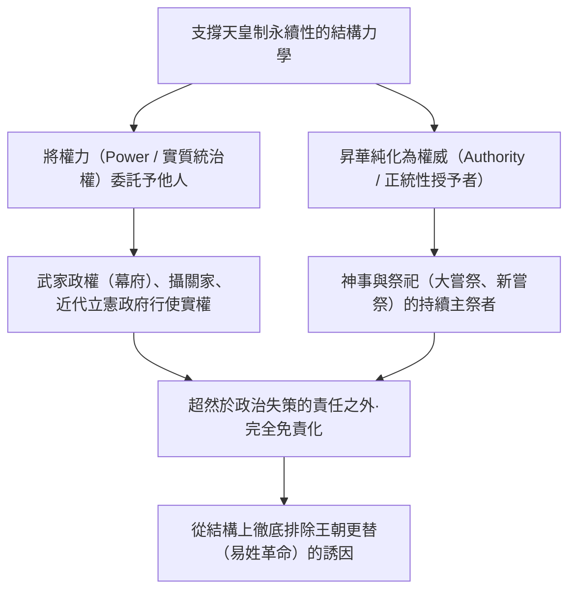
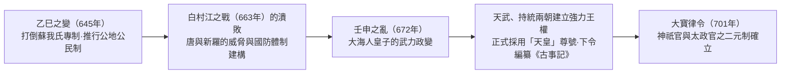
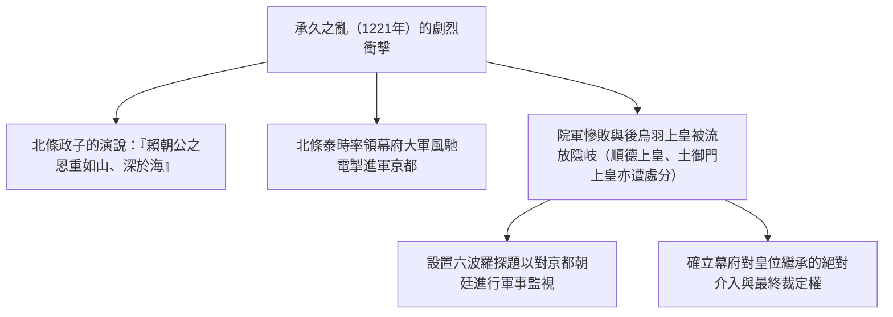
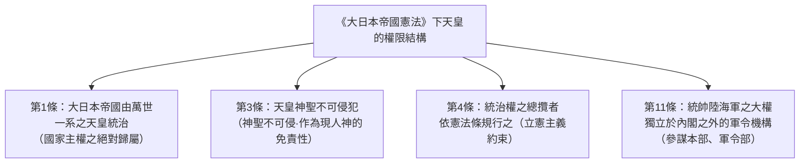
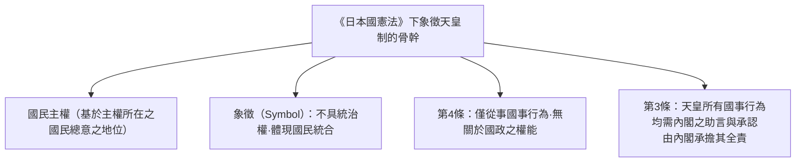
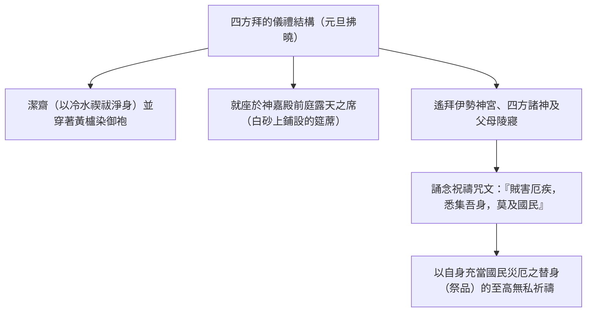
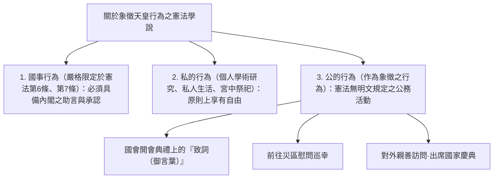

## 1. 緒論：世界最古老的世襲王統與「權力與權威的分離」

### 1.1 「萬世一系」的論述與歷史學、考古學的實相

日本的天皇（Emperor of Japan）及皇室歷史，與當今世上現存的任何王室或王朝相比，都展現出絕無僅有、極具特異性的延續性。在金氏世界紀錄中，日本皇室亦被認證為「現存世界最古老的世襲君主家族（The oldest continuous hereditary monarchy）」。

近代國學以及《大日本帝國憲法》第1條所標榜的「萬世一系（Bansei Ikkei：永不中斷的單一血統）」論述，固然帶有濃厚的宣傳意識形態色彩；然而，即便參照實證歷史學與考古學的學術成果，**至少自5世紀後半葉的雄略天皇（獲加多支鹵大王／若健大王）或6世紀初的繼體天皇以來，大約1500多年間，單一王統在同一個列島空間內延綿不絕**，這在學術上是無可置疑的歷史事實。

回顧世界各大文明的歷史：在中國，因天命轉移、政權更迭的「易姓革命（Dynastic Cycle）」，使得歷代皇帝家族屢遭誅戮殆盡；在歐洲各國，亦經歷了諾曼王朝、金雀花王朝、都鐸王朝、斯圖亞特王朝、漢諾威王朝等王朝的頻繁更替。相較之下，為何唯獨在日本，竟能未曾歷經任何王朝更替的斷絕，讓單一王統延續至今？



---

### 1.2 「權力與權威的分離」之比較文明論觀點

誠如丸山真男與露絲·潘乃德（Ruth Benedict）等思想史家及比較文化學者所指出，日本文明統治結構的最大特質，在於**「政治權力（Power：軍事力、徵稅權、日常統治）」與「終極權威（Authority：正統性之根源、宗教與象徵之神聖性）」徹底實現了二元分離**。

西方的絕對君主（如法國路易十四等）或中國的專制皇帝，既是親率軍隊發號施令的「權力者」，同時亦是法律與秩序的「權威者」。當二者融為一體時，一旦遭遇施政失誤、戰敗或社會劇烈動盪，其政治責任便會直接指向君主個人，進而引發叛亂，導致君主連同整個家族被徹底拉下王座。

與之相對，日本的天皇自平安時代的藤原氏（攝關政治）、白河院以來的院政、中世的武家政權（鎌倉、室町、江戶幕府），直至近代內閣，始終維持著**「將世俗統治權力（實權）恆常委託予外部輔弼者或武家」**的結構。即便是握有天下實權的幕府將軍，為了證明其統治的正當性，也必須由天皇任命為「征夷大將軍」。

因此，施政失敗的責任始終由實際行使權力的幕府或內閣承擔，並因倒幕運動或政變而覆滅。然而，作為正統性源泉的天皇，卻始終置身於政治責任的彼岸；正因如此，無論處於何等動盪的亂世，政治勢力都沒有動機去實質簒奪天皇之位（即殺害天皇而自立為皇）。

---

## 2. 古代國家的形成與「天皇」尊號、律令祭祀的誕生

### 2.1 從大王（大君）昇華為「天皇」

古墳時代，君臨日本列島中央的大和王權首領被稱為「大王（Okimi / 治天下大王）」。埼玉縣稻荷山古墳出土的鐵劍銘文上所鐫刻的「獲加多支鹵大王（即若健大王／雄略天皇）」，便鮮明地保留了作為有力豪族（氏姓貴族）聯合體盟主的性格。

6世紀末至7世紀初，擁立推古天皇的聖德太子（廄戶皇子）與蘇我馬子，制定了冠位十二階（不問門第、依個人才幹授爵的官位制度）與十七條憲法（「以和為貴」、「篤敬三寶」、「承詔必謹」）。在致隋煬帝的國書「日出處天子，致書日沒處天子，無恙」中更可看出，日本試圖脫離中華帝國的冊封體制（朝貢秩序），宣示自身作為獨立且對等的「天子」地位。

在645年的**「乙巳之變（大化革新）」**中，中大兄皇子（後來的天智天皇）與中臣鎌足（藤原氏之始祖）於宮中暗殺了專橫跋扈的蘇我入鹿。新政權否定豪族對土地與人民的私有權，確立了將一切土地與民眾收歸國家（天皇）所有的「公地公民制」理想。



---

### 2.2 壬申之亂（672年）與天武天皇的絕對權威

日本古代史上最大的分水嶺，乃是天智天皇駕崩後爆發的皇位繼承內亂——**「壬申之亂（672年）」**。隱居於吉野的大海人皇子，動員了美濃、尾張等東國軍事力量，以迅雷不及掩耳之勢擊滅了近江朝廷的大友皇子，隨後於飛鳥淨御原宮即位，此即**天武天皇**。

在天武天皇及其皇后持統天皇的統治時期，古代律令王權的基本框架正式奠定：
1. **正式採用「天皇」尊號**：
   - 源於道教最高神「天皇大帝（北極星神格化）」的至高尊稱「天皇（Tenno）」，開始正式見諸於木簡與金石文之中。
2. **制定國號為「日本」**：
   - 取代了過往的「倭國」，確立了意為「日出之國（太陽升起之地）」的自豪國號「日本」。
3. **啟動官方史書（神話體系）之編纂**：
   - 奉天武天皇敕命，朝廷開始整理各大氏族流傳的傳承，並將皇統正統性追溯至太陽神天照大神的《古事記》（712年成書）與《日本書紀》（720年成書）之編纂工程。

---

### 2.3 記紀神話的深層結構與三神器

《古事記》與《日本書紀》（合稱「記紀」）中所敘述的、自皇祖神天照大神至初代神武天皇的神話體系，為天皇權威提供了宗教性與宇宙論的依據。

- **天孫降臨與「三大神敕」**：
  - 天照大神在命其孫瓊瓊杵尊降臨地上（高千穗峰）之際，頒布了最根本的**「天壤無窮神敕」**：
  > 「豐葦原千五百秋瑞穗國，是吾子孫可王之地也。爾皇孫，就而治焉。行矣，寶祚之隆，當與天壤無窮者矣。」
  - 這是一項神聖契約，宣告地上的統治權乃由天上神明的意志永遠賦予皇孫及其子孫。
  - 此外，還頒布了命其將神鏡視為天照大神御魂虔誠奉祀的「寶鏡奉齋神敕」，以及命其將天上齋庭稻穗於地上耕作培育的「齋庭稻穗神敕」。
- **三神器（Sanshu no Jingi）**：
  1. **八咫鏡**：象徵睿智與太陽的神聖性（本體為伊勢神宮內宮之御神體，皇居內奉安其形代／複製品）。
  2. **八尺瓊勾玉**：象徵慈悲與神聖靈力（常置於皇居的「劍璽之間」）。
  3. **草薙劍（天叢雲劍）**：象徵武威與勇氣（本體為熱田神宮之御神體，皇居內奉安其形代）。
  - 在歷代天皇的即位儀禮中，傳承此神器的「劍璽等承繼之儀」，始終被視為皇位不可或缺的正統性憑證。

---

### 2.4 律令制度的二元體制：神祇官、太政官與大嘗祭

701年頒布《大寶律令》所確立的古代官制，雖模仿唐代律令體制，卻進行了極其關鍵的日本本土化改造。

在唐代制度中，祭祀機構（如太常寺）隸屬於行政最高機構（尚書省、中書省、門下省）之下；相較之下，日本的律令制則在掌管國政的**「太政官」**之外，設立了掌管諸神祭祀的**「神祇官」**，且兩者平起平坐，甚至神祇官在名義上居於更崇高的超然地位（二官八省制）。

天皇最本質的日常職責，並非政務（世俗的政治決策），而在於**「神事（向冥冥中不可見的神明祈禱）」**。
- **新嘗祭**：每年11月舉行，天皇將當年收穫的新穀供奉給諸神，自己亦親自進食，藉由「神人共食」達到神人合一，祈求國家安寧與五穀豐登。
- **大嘗祭**：天皇即位後所舉行的首個新嘗祭，是一代僅此一次的至高秘儀。朝廷會從零建起名為「悠紀殿」與「主基殿」的古代質樸寢殿，天皇徹夜向皇祖神獻供新穀並共同進食，藉此將「天皇靈（皇祖神靈的威能）」納入己身，從而在精神與靈性層面完成轉生，蛻變為真正的君主。

無論世俗的政治實權如何更迭流轉，這種「為國家與萬民向諸神無私祈求的最高主祭」身分，始終是天皇制度不可磨滅的核心。

---

## 3. 中世與近世的權威與權力雙重結構

### 3.1 攝關政治與院政：宮廷內部的權力力學

平安時代，圍繞著天皇的政治結構經歷了高度的精緻化與轉型：

- **藤原氏的攝關政治（10至11世紀）**：
  - 藤原北家（藤原道長、藤原賴通的全盛時期）將自己的女兒送入宮中成為歷代天皇的皇后（中宮），並讓誕生的幼年皇子即位；藉由身為外祖父（外戚）的地位，於幼帝時期擔任「攝政」，成人後則擔任「關白」。
  - 藤原氏並未簒奪天皇的權威，而是巧妙透過外戚身分，徹底掌握了朝廷的人事任命權與國政決策權。
- **院政的確立（11世紀末起）**：
  - 1086年，白河天皇將皇位禪讓給年幼的堀河天皇，自稱「上皇（太上天皇）」，並在宮廷之外（白河院）設立直屬機構「院廳」。
  - 上皇以「治天之君（皇家家長）」的身分排擠攝關家，奪回了政治實權。上皇更進一步出家成為「法皇」，從而擺脫了儒教與律令體制對在位天皇的種種禮法約束，行使獨裁專制的權力。

---

### 3.2 武家政權的誕生與承久之亂（1221年）

12世紀後半葉，源賴朝在推翻平氏政權後，於關東鎌倉創設了**「鎌倉幕府」**。
賴朝不僅獲得朝廷冊封為「征夷大將軍」，更取得在全國廣設守護與地頭的敕許（文治敕許，1185年）。至此，形成了西方的「朝廷（公家）」與東方的「幕府（武家）」相互並立的「公武二元支配」體制。

企圖扭轉武家優勢地位、展開孤注一擲反撲的，是才華橫溢且雄心勃勃的**後鳥羽上皇**。
1221年，上皇頒布追討鎌倉幕府執權北條義時的院宣，號召全國武士起兵勤王，史稱**「承久之亂」**。



承久之亂的結局以武家勢力的壓倒性勝利告終。武士公然踐踏朝廷院宣，並將身為治天之君的上皇流放荒島；此一震驚天下的事件，將「缺乏軍事力量的朝廷絕無法違逆武家實力」的殘酷力學暴露無遺。自此，幕府開始直接干預皇位繼承，甚至取得了裁定後續大覺寺統（後來的南朝）與持明院統（後來的北朝）輪流即位（兩統迭立）的主導權。

---

### 3.3 建武新政與南北朝的動亂

1333年，後醍醐天皇號召足利尊氏、新田義貞、楠木正成等武士軍團滅亡了鎌倉幕府，開啟了由天皇直接親政的**「建武新政」**。

然而，新政無視廣大武士的賞賜訴求，推行悖離時代潮流的公家偏袒政策與復古專制，僅維持了兩年多便告崩潰。倒戈的足利尊氏於京都擁立光明天皇（持明院統）建立室町幕府；後醍醐天皇則南逃吉野深山，堅稱自己方具唯一正統性。

此後約60年間，京都的**「北朝」**與吉野的**「南朝」**爭奪正統地位，引發了長達半個多世紀的**「南北朝時代（1336–1392）」**。1392年，在室町幕府第三代將軍足利義滿斡旋下促成「明德和約（南北朝合一）」，南朝後龜山天皇將三神器移交給北朝後小松天皇（今日之皇室世系在血緣上雖承自北朝後小松天皇，但在明治時代以後，官方在歷史正統性上則認定始終持有三神器的南朝為正統）。

在室町全盛時期，足利義滿接受明成祖永樂帝冊封為「日本國王」，更被認為曾企圖讓自己的兒子即位為帝，是歷史上最接近「簒奪皇位」的人物；然而隨著他的暴卒，這項野心亦隨之化為泡影。

---

### 3.4 德川幕府的《禁中並公家諸法度》與「專修學問」之規定

在戰國時代的滔天亂世中，朝廷財政窘迫至極，甚至衰微到如後奈良天皇須藉由販售親筆宸翰（和歌與《般若心經》）來貼補宮廷用度。然而，無論是織田信長、豐臣秀吉抑或德川家康等天下霸主，皆未曾廢黜天皇，反而競相向朝廷巨額進獻，並透過獲封關白、太政大臣、征夷大將軍等官位，來強化自身政權的正統性。

一統天下的德川家康於1615年頒布了在法律上全面箝制朝廷的**《禁中並公家諸法度》（共17條）**。其開宗明義的第1條便赫然載道：

> **「天子諸藝之事，第一御學問之事。」**

此一條文背後的真實意圖極其冷酷：「天皇唯一應修習的乃是學問、朝廷有職故實與和歌之道，斷不可染指任何政治或軍事實權」。
正如「紫衣事件」（1629年：朝廷未經幕府許可頒賜高僧紫衣之敕許遭到幕府強行廢止，後水尾天皇憤而突襲退位抗議）所象徵的那般，江戶時代的天皇被嚴密幽禁於京都御所深處，被徹底轉化為毫無半點政治實權、純粹從事「禮儀與學問的象徵性存在」，其政治現實威脅被徹底瓦解無害化。

---

## 4. 明治維新與近代「現人神」國家的創構

### 4.1 從尊皇攘夷走向王政復古

江戶時代中葉以降，伴隨水戶藩編纂《大日本史》與本居宣長等人推動的國學復興，「幕府將軍的統治權只不過是受天皇委託而已（大政委任論）」的尊皇思想在武士階層中廣泛傳播。

1853年培理黑船來航後，德川幕府面對外患顯露出的顢頇無能，引爆了中下層武士與維新志士間「尊皇攘夷」的狂熱浪潮。孝明天皇頒下攘夷敕命，長州藩與薩摩藩亦以朝廷為政治凝聚核心展開結盟。

1867年10月，第15代將軍德川慶喜上奏「大政奉還」。同年12月9日，在岩倉具視與薩摩藩西鄉隆盛等人主導下，正式頒布**「王政復古大號令」**：
- 全面廢除幕府、攝政與關白。
- 宣告重返初代神武天皇開國創業之精神，樹立由天皇親政的嶄新政府。
- 年僅16歲的明治天皇即位，江戶改名為「東京」，皇居由京都遷往東京城（原江戶城）。

---

### 4.2 《大日本帝國憲法》（明治憲法，1889年）的立憲二元論

伊藤博文等明治元勳以普魯士（德國）的立憲主義為典範，同時結合日本國情，起草了**《大日本帝國憲法》**。



在明治憲法體制下，天皇擁有極為複雜深刻的「雙重性（兩義性）」：
1. **傳統與宗教層面**：天皇是神明的後裔，是國民道德的泉源，是神聖不可侵犯的「現人神（Ara-hito-gami）」。
2. **近代與立憲主義層面**：天皇是「依憲法條規」行使統治權的立憲君主，無法如獨裁總統般任意頒布命令；行政權的行使必須獲得國務各大臣的「輔弼」（第55條），立法權亦須經帝國議會之「協贊」。

大正時期，東京帝國大學法學部教授美濃部達吉提出的**「天皇機關說」**（主張國家為法人，主權屬於作為法人的國家本身，而天皇則是國家的最高機關），成為大正民主時期政黨內閣制的憲法理論支柱。

然而，明治憲法內部卻潛伏著一項致命的制度缺陷，那便是**第11條規定的「統帥權獨立」（陸海軍之統帥不受內閣輔弼約束，軍令機構直接隸屬於天皇）**。步入昭和年代後，當軍部以「統帥權神聖不可侵犯」為擋箭牌徹底脫離內閣與議會的文官統制時，立憲主義的脆弱防線便應聲崩塌。

---

## 5. 昭和的劇動與戰敗，以及轉向「象徵天皇制」的戲劇性變革

### 5.1 昭和初期的破局與終戰之「聖斷」

1930年代，歷經統帥權干犯問題、五一五事件、二二六事件之後，政黨政治灰飛煙滅，日本陷入軍部法西斯獨裁、泥淖化的中日戰爭，並於1941年滑入太平洋戰爭的深淵。

國家神道被教條化至極端，國民被灌輸「為天皇捐軀」是至高美德。然而，昭和天皇本人卻身陷立憲君主無法否定內閣與統帥部決策的體制框架，在其憲政立場與對和平的祈願之間飽受劇烈煎熬。

1945年8月，面對廣島與長崎遭受原子彈轟炸以及蘇聯參戰，最高戰爭指導會議圍繞著「護持國體（維持皇室存續）」的前提下，在接受波茨坦宣言投降與徹底抗戰（本土決戰、一億總玉碎）之間陷入了意見完全平手的僵局。
8月10日與14日在地下防空壕召開的御前會議上，受內閣總理大臣鈴木貫太郎的懇請，昭和天皇潸然淚下，做出了載入史冊的**「聖斷」**：

> **「我的任務在於拯救國民。不論我個人下場如何，我不忍再看到國民倒斃於戰火之中，更不忍坐視人類文明慘遭摧毀。……無論何等難以忍受之事我都將忍受，何等難以堅持之事我都將堅持，我決心就此終結這場戰爭。」**

8月15日正午，伴隨「玉音放送」（終戰詔書之廣播播音），戰爭正式終結。學界普遍認為，若無天皇本人的直接干預，本土決戰勢必將造成數以百萬計的額外慘重傷亡。

---

### 5.2 與麥克阿瑟的會見及東京審判之免訴

戰敗後，由盟軍最高司令官道格拉斯·麥克阿瑟（Douglas MacArthur）率領的盟軍最高司令官總司令部（GHQ）進駐日本。以美、英、蘇為首的同盟國主流輿論強烈要求將昭和天皇列為「頭號甲級戰犯」予以審判處決，並徹底廢除天皇制。

1945年9月27日，昭和天皇隻身前往美國大使館拜會麥克阿瑟。根據麥克阿瑟的親自回憶，昭和天皇非但未曾懇求饒命，反而坦然說道：

> **「我是為了對日本國民在發動與遂行戰爭中所做出的所有政治與軍事決斷及行動承擔全部責任，特來將我自身交付於閣下。我個人的性命如何均無所謂；只懇請閣下無論如何，務必給予我的國民賴以生存的糧食。」**

麥克阿瑟深受天皇無私精神的震撼，隨即確立了「維持天皇體制並免除追訴天皇」的佔領政策方針。盟軍研判，若處決天皇，全日本恐將爆發百萬人規模的游擊叛亂，致使盟軍的和平統治徹底化為泡影。

1946年1月1日，昭和天皇發表**〈關於新日本建設之詔書〉（通稱「人間宣言」）**，正式宣告天皇與國民之間的紐帶，並非建立於神話傳說或「現人神」之虛妄觀念之上，而是建立在彼此間的互相信賴與崇敬之中。

---

### 5.3 《日本國憲法》第1條：「象徵天皇制」的確立

1947年5月3日施行的**《日本國憲法》**，在第1條對天皇的法律地位進行了根本性的重新界定：

> **第1條：「天皇是日本國的象徵，是日本國民統合的象徵，其地位基於主權所在之日本國民的總意。」**



- **統治權的徹底剝奪**：天皇不再是國家的元首（統治主宰者），而是轉化為體現國家存在本身與國民一體性的「象徵（Symbol）」。
- **禁止干預國政（第4條）**：僅能從事憲法所明文列舉的形式性、禮儀性「國事行為」（如召集國會、任命內閣總理大臣、批准條約、授與榮典等），完全不具備任何行使實質政治權力的權能。
- **內閣的助言與承認（第3條）**：天皇進行一切國事行為，皆必須以內閣的助言與承認（諮詢與認可）為必要條件，所有的政治責任全由內閣承擔。

這種「象徵天皇制」雖常被視為由佔領軍強加的外來制度，但若參照前述日本漫長的歷史脈絡——**「天皇不行使實質政治權力，而專注於權威與祈禱」的中世以降傳統政治結構，實則可被解讀為對該歷史常態最純粹形式的歷史回歸**。

---

## 2.5 宮中祭祀的儀禮結構與「四方拜」的精神力學

若要深刻理解天皇的存在，絕不可忽視在皇室內部世代相傳、與《日本國憲法》上的「國事行為」完全脫鉤作為私法領域傳承的**「宮中祭祀（Imperial Court Rituals）」**之深邃精髓。

坐落於皇居蒼翠繁茂的吹上御所深處的**「宮中三殿」**——
1. **賢所**：奉安供奉皇祖神天照大神之御神體八咫鏡（形代）。
2. **皇靈殿**：供奉自神武天皇以來的歷代天皇與皇族之御靈。
3. **神殿**：供奉天神地祇（八百萬諸神）。

天皇終年親自主祭多達數十次莊嚴肅穆的祭祀儀典。其中，最令人心靈震撼的儀禮，莫過於在元旦拂曉（清晨5點半）、於凜冽嚴冬寒氣中舉行的**「四方拜」**。



天皇以冷水淨身祓除穢氣，身著古典莊嚴的黃櫨染御袍，端坐於鋪在神嘉殿前庭白砂上的露天草蓆之上，朝向伊勢神宮以及四方山河、諸神與歷代天皇山陵虔敬遙拜。隨後，天皇誦念平安時代儀式書所記載的古老祝文咒語：

> **「賊害、厄疾、水火之難，應降於萬民者，先經吾身而後及（若有災厄病苦降臨於國民，請先穿透降臨於吾身）。」**

將自身作為承擔國家與國民一切災厄的「終極替罪羔羊（Scapegoat）」奉獻給神明；並非為了支配他人的世俗權力，而是將自我化為虛無、全心為他人的福祉祈禱——正是這種絕對自我犧牲的祭祀精神，構成了數千年來天皇權威深植於日本國民潛意識深處的隱性磁場。

---

## 3.5 歷代女性天皇的歷史實態與「過渡論」的虛實

在皇位繼承討論中，經常被引為歷史先例的，是日本歷史上真實存在過的**「8位10代女性天皇」**。

| 代數 | 天皇名 | 治世 | 即位背景與歷史功績 |
| :---: | :--- | :---: | :--- |
| **第33代** | **推古天皇** | 592–628 | 為收拾崇峻天皇遭暗殺後的政治混亂，作為首位女性天皇即位。與聖德太子、蘇我馬子通力合作，制定冠位十二階與十七條憲法。 |
| **第35代／第37代** | **皇極天皇／齊明天皇** | 642–645／655–661 | 重祚（二次即位）。皇極期成為乙巳之變的舞臺；齊明期為因應白村江之戰親征九州，最終崩逝於戰地前線。 |
| **第41代** | **持統天皇** | 690–697 | 天武天皇之皇后。繼承先帝遺志，營建藤原京，施行《飛鳥淨御原令》，確保皇統平穩傳承予其孫文武天皇。 |
| **第43代** | **元明天皇** | 707–715 | 遷都平城京（710年），《古事記》成書，下令編纂《風土記》。 |
| **第44代** | **元正天皇** | 715–724 | 元明天皇之女（日本歷史上唯一的「母傳女」皇位繼承）。《日本書紀》成書，頒布「三世一身法」。 |
| **第46代／第48代** | **孝謙天皇／稱德天皇** | 749–758／764–770 | 聖武天皇之女。重祚。平定藤原仲麻呂之亂，重用僧人法王道鏡。在宇佐八幡宮神託事件中成功粉碎道鏡簒奪皇位的企圖。 |
| **第109代** | **明正天皇** | 1629–1643 | 江戶時代初期。因後水尾天皇在紫衣事件中抗議幕府而突襲退位而即位（生母為德川秀忠之女德川和子）。 |
| **第117代** | **後櫻町天皇** | 1762–1770 | 江戶時代中葉。桃園天皇猝逝後，撫育年幼的後桃園天皇並臨朝攝政直至其長成。為近世最後一位女性天皇。 |

經過嚴謹的歷史學考證，一個清晰明確的事實是：**「過去的所有女性天皇，皆為父親具備天皇血統的『男系女子』」**（歷史上絕無任何與平民男性或其他王朝男子通婚，並將皇位傳給女系後代的先例）。

此外，她們當中的大多數人，都是在「皇位繼承候選人過於年幼」或「先帝猝崩導致政治真空危機」等緊急事態下，作為皇室長老登基即位，在化解皇位繼承危機之後，再將權柄交還給下一代的男系男子，發揮了「過渡中繼（代打救援）」的作用。

但與此同時，如推古天皇與持統天皇這般，超越了單純的過渡角色、展現出強大政治統治魄力並奠定古代國家法制骨幹的偉大女性君主，亦是不容否認的歷史事實。在古代日本，女性所具備的「降神巫女靈力（薩滿巫祝）」與男性的世俗統治權力相輔相成的「媛彥制（姬彥制，Hime-Hiko）」傳統，被認為是古代社會易於接納女性天皇的重要文化基石。

---

## 4.6 國家神道的創構與「神社非宗教論」的近代哲學雜技

明治維新政府所面臨的最大難題，在於「如何打造出足以抗衡西方列強的近代民族國家（Nation-State）之整合原理」。

### ① 廢佛毀釋的狂暴狂風與神佛分離
長達一千數百年間共存交融的「神佛習合」（神社境內建有寺院、佛陀以本土神明姿態顯化的本地垂跡說），在明治政府於1868年頒布的**「神佛判然令（神佛分離令）」**之下遭到暴力撕裂。

這在全日本各地掀起了搗毀佛像、焚燒經卷、拆毀五重塔的激進**「廢佛毀釋」**狂風暴雨。政府最初企圖推動將神道升格為國教的「大教宣布運動」，然而面對民間根深柢固的佛教信仰，以及來自歐美列強指責其「侵害宗教自由」的強烈外交抗議，最終以失敗告終。

### ② 「神社非宗教論」的超法規虛構
在此困境下，明治統治菁英（以井上毅等人為首）構想出了一套令人咋舌的法理構造，即**「神社神道並非宗教（神社非宗教論）」**的意識形態虛構：
- 在《大日本帝國憲法》第28條中保障「宗教信仰自由」，將基督教與佛教認定為「個人私領域的宗教信仰」。
- 與此同時，卻將「於神社（如伊勢神宮、靖國神社等）舉行的祭祀，定義為非宗教，而是全體國民皆應恪守參與的**『國家公眾道德與祖先崇拜之儀禮』**」。
- 藉此，無論是基督徒還是佛教徒，只要身為帝國臣民，皆無權拒絕前往神社參拜或拒絕對天皇表達崇敬，從而建構出「國家神道（State Shinto）」這套凌駕於一切宗教之上的超宗教絕對空間。這套哲學雜技般的精妙邏輯，遂成為日後昭和時期軍國主義「現人神」崇拜狂飆失控的制度溫床。

---

## 5.5 憲法判例與象徵天皇制的邊界

《日本國憲法》下的象徵天皇制，歷經無數憲法學爭論與司法裁判的考驗，其憲政解釋日臻成熟與精緻。



### ① 「公的行為（作為象徵之行為）」的肯認
《日本國憲法》第4條第1項規定：「天皇僅從事本憲法所規定之國事行為」。若依字面嚴格文義解釋，則國事行為以外的所有公務活動（如深入災區慰問、接待外國元首貴賓、於國會開會典禮致詞等），均可能面臨違憲指控。

司法判例與政府官方解釋指出：「天皇既然處於日本國之象徵地位，自然被允許從事符合該地位的**『公的行為（作為象徵之行為）』**」，並確立只要該等行為在內閣的實質控制（實質助言與承擔政治責任）之下運作，即屬合憲。

### ② 政教分離（憲法第20條、第89條）與宮中祭祀
圍繞著新嘗祭與大嘗祭等皇室神道儀典，長期存在一項重大爭議：究竟該筆開銷應由國家的公共預算（宮廷費／公費）支應，抑或應由皇室私帳（內廷費／天皇家族私款）自理？

參照最高裁判所（津地鎮祭訴訟判決、愛媛玉串料訴訟判決）所確立的「目的與效果基準」（審查該行為之目的是否具備宗教實質意義，且其效果是否對特定宗教產生援助、助長、壓迫或干涉），在平成與令和的即位禮中，司法與政府皆認定大嘗祭「屬於皇室具備高度公眾性格的傳統儀典」，因此由公費（宮廷費）撥款支應被判定為合憲。

---

## 6. 現代象徵天皇的實踐與皇位繼承問題

### 6.1 平成的「巡禮」與生前退位的實現

為象徵天皇制注入血肉與實質生命力的，是第125代天皇（現上皇明仁）與上皇后美智子的奉獻歷程。

上皇始終不斷捫心自問「象徵究竟應具備何種姿態」，多年來親自走訪全日本各大災區（雲仙普賢岳火山噴發、阪神淡路大地震、311東日本大震災），跪坐在避難所的地板上，以與災民完全平等的視線緊握災民雙手，持續給予撫慰與鼓勵。此外，他更親赴沖繩、廣島、長崎，乃至昔日太平洋戰爭的激戰前線塞班島、帛琉貝里琉島、菲律賓等地展開「慰靈之旅」，為不讓過去的戰爭慘痛記憶被歲月風化而持續虔誠祈禱。

2016年8月8日，天皇罕見地向國民發表了錄影講話（表明個人「心境」），吐露因年事漸高、日益擔憂難以全身心履行象徵職責的真切心聲。為回應天皇的心願，日本國會於2017年制定了《皇室典範特例法》。2019年4月30日，日本實現了自江戶時代光格天皇以來時隔約200年的「生前退位」，德仁皇太子隨後即位為第126代天皇，「令和」時代正式揭開序幕。

---

### 6.2 皇位繼承面臨的當代憲政與法律政策爭點

步入21世紀的今日，日本皇室面臨的最大生存危機乃是「皇族人數銳減與皇位繼承資格的極度狹隘化」。
現行《皇室典範》第1條明定：**「皇位由屬於皇統之男系男子繼承之」**。

當前，具備下一代皇位繼承資格的皇族，僅有悠仁親王殿下一人，形勢如履薄冰。圍繞此一重大憲政課題，日本朝野輿論主要在以下三種政策路徑之間展開激烈論辯：

| 爭點 | 提案內容 | 支持派論據 | 慎重派·反對派疑慮 |
| :--- | :--- | :--- | :--- |
| **① 容許女性天皇** | 容許天皇的女兒（女性）繼承即位（如：愛子內親王即位）。 | 歷史上自推古天皇至後櫻町天皇曾出現8位10代女性天皇之實例。亦契合國民情感。 | 只要維持男系女子尚無不可，但保守派高度戒備此舉將成為通往「女系天皇」的突破口。 |
| **② 容許女系天皇** | 容許僅透過母方傳承皇統者即位（如女性天皇與平民男性所生之子女等）。 | 為半永久性化解皇室血統枯竭危機的唯一現實解方。亦符合男女平等之憲政精神。 | 強烈反對者認為，此舉將徹底摧毀歷經126代未曾中斷的「男系繼承傳統」，動搖皇室存立之根本哲學基礎。 |
| **③ 舊宮家（男系舊皇族）復歸** | 讓1947年依GHQ命令脫離皇籍（臣籍降下）的舊11宮家之男系男子後裔，透過收養等方式重返皇族身分。 | 能夠完美無瑕地延續「萬世一系」的男系男子古老傳統。 | 戰後近80年來皆作為普通平民生活的人士突然被冊立為皇族，面臨社會大眾心理接受度與情感認同的巨大門檻。 |

---

## 7. 結論：祈禱的譜系與日本文明的文化古層

天皇制與其說是一項政治體制，毋寧說是日本列島的自然風土與世居於此的人們歷經數千年所孕育出的**「精神與祈禱之文化古層」**。

不似總統那般炫耀自身的世俗權威，
亦不似巨富那般張揚無盡的物質財富，
而是在宮中森嚴幽邃的沉寂之中，沐浴於四季更迭的神事祭儀裡洗滌身心，
一心一意只為國民的幸福、世界的和平以及五穀的豐登持續無私祈求的存在。

古代割據一方的豪族、中世狂放剽悍的武士、明治時代推動近代化的維新志士，乃至從戰後瓦礫廢墟中重建家園的當代國民，皆在那無私的「祈禱之座」前虔敬俯首。

即便作為制度的外在形態，歷經律令國家、幕府體制、明治立憲帝國，再到戰後民主主義的憲政象徵，隨著時代遞嬗而千變萬化、靈活調適；然而位處其核心樞紐的「神聖祈禱之延續性」，卻未曾有過一分一秒的中斷。

在劇烈變遷動盪的21世紀世界中，作為銜接過去數千年與未來數千年時空的活生生歷史樞紐，天皇這一實存主體，將始終是全體日本人面對自身文化認同與心靈根柢時，一面無可替代的深邃明鏡。

### 2.6 大嘗祭的祭祀人類學深層：折口信夫「真床追衾」論爭與新穀共食之宇宙觀

作為即位儀禮最高潮的大嘗祭，絕非單純豐收祭典的延伸，而是天皇承繼始祖神靈威能、在靈性層面蛻變為「現人神」或「神聖神格」的成年禮式通過儀禮（Initiation）。圍繞這場祭祀的儀禮結構，在近代以來的人類學、宗教學與歷史學界展開了極為熱烈的學術爭論。

其中最具代表性的，乃是民俗學者折口信夫所提出的「真床追衾」理論。折口在《大嘗祭之本義》（1928年）中，聚焦於大嘗宮悠紀殿與主基殿深處所特別設置的「坂枕」與「神臥床」。他將此與天孫降臨神話中瓊瓊杵尊裹覆「真床追衾」降臨地面的記載相結合，主張新帝於神臥床中潛身於衾被（寢具）之內，透過擬似體驗死亡狀態，在體內接納並融合天照大神之神靈（即「天照大神之御靈」或「皇祖神靈」）的秘儀。亦即，大嘗祭本質上是一場「靈魂再生與合體之儀禮（振魂與鎮魂）」。

```
【圍繞大嘗祭秘儀結構的兩大學術潮流】

1. 折口信夫說（靈魂合體·再生通過儀禮論）
   • 核心概念：「真床追衾」、「神臥床」
   • 儀禮詮釋：新帝潛入衾被之中，透過體驗擬似死亡與再生，將祖靈·天照大神之神靈納入己身的靈性蛻變秘儀。
   • 理論背景：柳田國男與折口信夫之「稀客（Marebito）論」、南島論、宮座與若者組之通過儀禮。

2. 宮廷祭祀·實證史學說（新穀共食·神人合一祭祀論）
   • 核心概念：「神饌獻饌」、「神人共食」
   • 儀禮詮釋：新帝與祖神共同飲食新穀之稻米、粟米及神酒，藉此締結共同羈絆與統治權盟約之農耕儀禮。
   • 代表研究：岡田莊司、所功、坂本太郎等人對古紀錄及《延喜式》典籍之實證性再檢討。
```

相對於此，岡田莊司與所功等歷史學者及神道史家，透過嚴格比對平安時期的《延喜式》大嘗祭儀式規定與各種古代文獻紀錄，指出了折口學說在文獻依據上的薄弱之處。根據他們的實證研究，大嘗祭儀禮的核心，自始至終在於深夜時分由新帝親自將神饌（稻米、粟米、白酒、黑酒、鮑魚、海鮮等）獻祭予諸神祇，並於神前親口食用相同祭品的「神人共食」。透過與神明共進饗宴，表達對農耕社會豐收的感恩，並重新確立與祖先神之間的聖潔盟約。所謂「神臥床」乃是供神明降臨歇息的神座，歷史文獻中從未記載過天皇曾如躺臥棺槨般潛身其中的事實。

當代學術界的共識，一方面肯定折口學說大膽的詩意直覺與人類學洞察，另一方面在歷史實質層面上，則普遍傾向將大嘗祭視為古代東亞農耕儀禮體系與即位儀禮的重層複合體。然而，無論採納何種學術詮釋，無可爭辯的事實是：大嘗祭始終扮演著將「世俗政治權力者」蛻變為「神聖祭祀主體」的關鍵性精神邊界裝置。

---

### 4.3 廢佛毀釋與大教宣布運動：神道國教化的挫折與「國家神道」的制度工學

明治維新中的「王政復古」，並非僅是自武家政權移轉權力至太政官制的政治變革，更是一場標榜復古至古代「祭政一致」的激進宗教與思想革命。新政府在成立不久後的1868年（慶應4年／明治元年）3月，以太政官布告頒布了「神佛分離令」。這項命令強行解體了中世以降千百年間作為日本社會基石的「神佛習合」體系，強令將一切佛教元素（佛像、經卷、梵鐘、僧侶之別當與社僧身分）自神社中徹底驅逐。

這項神佛分離政策在各地引發了極端激進的破壞暴行，史稱「廢佛毀釋」。在薩摩藩、苗木藩、隱岐、富山等地，寺院遭到徹底砸毀破卻，無數珍貴佛像被焚毀或砸碎。興福寺的五重塔甚至一度險些以僅僅25日圓的賤價被變賣，日本的傳統文化資產與佛教寺院經濟遭受了毀滅性沉重打撃。

```
【明治初期祭政一致思想的演進歷程】

神祇官復興（1869年）
  -- "急進平田派國學推動祭政一致·神道國教化方針" -->
神佛分離與廢佛毀釋風暴（全日本寺院遭到暴力破壞與佛教鎮壓）
  -- "面臨國內外強烈批評及民間社會嚴重動盪" -->
大教宣布運動（1870年起：設立宣教使與教部省，企圖推行國民教化）
  -- "真宗僧侶（島地默雷等）掀起宗教自由論爭·承受歐美列強外交壓力" -->
神道國教化政策之挫敗（1875年：大教院解散）
  -- "建構「神社非宗教論」（確立作為行政制度之神社與國家神道體制）" -->
國家神道體制確立（內務省神社局統籌管理，昇華為超越所有宗教宗派的國民道德）
```

然而，由激進的平田派國學者所主導、試圖透過「神祇官」推動的神道國教化路線，很快便觸礁擱淺。其原因有二：第一，佛教勢力（尤其是淨土真宗的島地默雷等人）以歐美的近代政教分離思想與宗教自由法理為武器，展開了頑強抵抗。島地於1872年赴歐洲考察後深刻指出，宗教自由乃近代國家的基本基石，國家絕無可能強制將特定宗教教義強加於全體國民。第二，誠如1873年撤除禁絕基督教的高札布告所示，對於極力謀求廢除不平等條約的明治政府而言，若被西方列強視為「不承認信仰自由的野蠻國度」，將構成致命的外交打擊。

為了解決此一兩難困局，明治官僚（尤其是井上毅等人）設計出了一套精密的統治制度工學，即立足於「神社非宗教論」的「國家神道」體制。
政府將神社定義為與「個人所信奉的宗教（如佛教、基督教、教派神道）」截然不同維度的「國家祭祀」與「國民道德之基石」。透過這套機制，在《帝國憲法》第28條表面上賦予國民「信仰自由」保障的同時，卻將前往神社參拜以及對宮中祭祀表達敬意，定性為「全體臣民應盡的公眾義務」，從而構築出一套極其巧妙的重疊意識形態控制體系。

---

### 4.4 《軍人敕諭》與《教育敕語》：大元帥天皇與內在道德的國家整合

在構建近代立憲國家外在體制的同時，為了將國民的精神意識與軍隊紀律絕對鎖定在天皇身上，發揮關鍵精神整合機制的裝置，便是1882年（明治15年）頒布的《軍人敕諭》與1890年（明治23年）頒布的《教育敕語》。

#### 1. 《軍人敕諭》與大元帥天皇制
由西周起草、山縣有朋等人修訂的《軍人敕諭》，將軍隊明定為「由天皇親自統率之軍」，宣示了軍人與天皇直接相連的絕對關係：

> 「我國軍隊世世代代皆由天皇統率。（中略）朕乃汝等軍人之大元帥。故朕倚汝等為股肱，汝等仰朕為首領，其親密之情自當特別深厚。」

在此架構下，軍隊不再是向內閣或帝國議會負責的國家公權力組織，而被塑造成僅對天皇個人效忠的絕對忠誠團體。敕諭將「忠節、禮儀、武勇、信義、質素」五大德目規定為軍人不可違背的戒律，並嚴令軍人「義重於泰山，死輕於鴻毛」。這種大元帥天皇與軍隊直結的內部構造，成為內閣總理大臣亦無權過問軍事作戰統帥的「統帥權獨立」之精神支柱，最終演變為昭和時期軍部獨裁暴走而無法遏止的體制陷阱。

#### 2. 《教育敕語》與忠孝一體之國民道德
作為井上毅與元田永孚折衷妥協之作而頒布的《教育敕語》，在法制上並非正式敕令，而是採取天皇親自訓誡告諭臣民的形式。敕語在提倡孝順父母、兄弟友愛、夫婦和睦等儒家家族倫理的同時，將其終極歸宿收斂於「一旦緩急則義勇奉公，以扶翼天壤無窮之皇運」——亦即為保衛國家與維持皇室而不惜獻出生命的自我犧牲。

《教育敕語》在全日本學校的各項莊嚴慶典（四大節：紀元節、天長節、明治節、元始祭）中，與「御真影（天皇與皇后的肖像照）」一同成為全體師生行最高敬禮的參拜對象，深刻滲透進國民的內心深處。1891年（明治24年），擔任第一高等中學校兼任教員的基督徒內村鑑三，在朗讀《教育敕語》儀式上因宗教信仰猶豫未行最敬禮，隨即遭到全社會圍剿並被迫辭職，史稱「內村鑑三不敬事件」；此事深刻象徵了《教育敕語》已遠遠超越一般道德規範，轉化為檢驗國民對國家是否具備絕對忠誠的準宗教式「踏繪」。

---

### 4.5 明治·大正·昭和初期的國體論爭：上杉慎吉 vs 美濃部達吉與「天皇機關說」的悲劇

帝國憲法體制確立之後，在法學界與政治言論場域中對立最為尖銳激烈的，便是圍繞國家與天皇關係展開的憲法解釋論爭。其主戰場正是東京帝國大學教授上杉慎吉（主權論·神權學派）與美濃部達吉（國家法人說·機關說學派）之間的論戰。

```
【憲法學中兩大天皇觀的尖銳對立】

1. 上杉慎吉（神權的君主主權說）
   • 國家論：天皇即國家。主權乃天皇固有之神權特權。
   • 統治權詮釋：統治權絕對且不受任何限制。憲法僅為天皇自我節制之訓示性規定。
   • 思想脈絡：承襲穗積八束之家長國體論、絕對君主制思想，為昭和超國家主義之理論源頭。

2. 美濃部達吉（天皇機關說·立憲主義國家法人說）
   • 國家論：國家為法人（具備法人格之統治團體），主權（統治權）歸屬於國家本身。
   • 統治權詮釋：天皇作為法人國家之「最高機關」，於憲法框架之內行使統治權。
   • 思想脈絡：奠基於格奧爾格·耶利內克（Georg Jellinek）之一般國家學，為大正民主與政黨內閣制之理論支柱。
```

美濃部達吉的「天皇機關說」絕非貶抑天皇，而是以德國公法學者格奧爾格·耶利內克（Georg Jellinek）精密的國家法人說為理論基石，旨在使日本成為法治國家、防範獨裁專制，並為議會政治（政黨內閣制）確立憲法正統性的法理支柱。在大正民主時期，「天皇機關說」曾是日本官界與學界的通說，甚至被列為高等文官考試的標準官方解答。

然而，邁入1930年代軍部與右翼勢力猖獗抬頭之際，機關說卻被指控為「將天皇貶低為國家工具（一介機關）的大逆不道學說」，成為猛烈政治攻擊的箭靶。1935年（昭和10年），以貴族院議員菊池武夫的彈劾演說為導火線，軍部與在鄉軍人會聯手掀起狂暴的「國體明徵運動」。岡田啟介內閣屈服於軍部的威逼壓力，將美濃部的代表著作（《憲法撮要》等）列為禁書查禁，美濃部本人更被迫辭去貴族院議員職務。隨後，日本政府先後發表兩次「國體明徵聲明」，正式在官方立場宣判「統治權之主體在於天皇，天皇機關說有悖國體本義」。

扼殺「天皇機關說」，宣告了日本立憲法治主義的實質終結。不受憲法約束的超越性、神祕主義天皇觀籠罩了整個國家，使得大本營與軍部得以假藉「統帥權神聖不可侵犯」的名義，徹底排除了任何文官統制（Civilian Control），取得了毫無約束的政治專斷自由度。

---

### 5.4 象徵天皇制的比較憲法國制論：英式君主制之差異與「元首論爭」

《日本國憲法》第1條所規定的「象徵天皇制」，在當今世界的立憲君主制中具備極其獨特的法律構造。將其與作為立憲君主制典型範例的英國（大不列顛暨北愛爾蘭聯合王國）等歐洲君主制國家進行比對，其獨特性便能清晰顯現。

#### 1. 與英式君主制的結構性差異
在英國憲政體制中，君主在形式上仍是「統治權之源泉」，議會乃是作為「國王在議會（King-in-Parliament）」行使立法權。政府被稱為「國王陛下之政府（His Majesty's Government）」，軍隊亦為「國王陛下之軍隊」。誠如沃爾特·白芝浩（Walter Bagehot）在《英國憲政論》（1867年）中所作的經典闡述，君主構成了國家體制中的「尊嚴部分（Dignified parts）」，與代表「效能部分（Efficient parts）」的內閣相輔相成。白芝浩指出，君主仍保留著「接受諮詢的權利、鼓勵的權利、提出警告的權利」等實質性政治影響力空間。

相較之下，《日本國憲法》下的天皇甚至連統治權的源泉都不是。憲法第1條高聲宣告「主權在於國民」，憲法第4條更明文禁止天皇「不具有關於國政之權能」。天皇所執行的國事行為（憲法第6條、第7條）全數需要「內閣之助言與承認」，並由內閣承擔其政治責任（第3條）。天皇依其自由意志發表政治意見或向政治家提出警告的空間，在憲法上遭到徹底封殺。這是一種相較於歐洲立憲君主制更為徹底剝奪政治權能、應被稱為「純粹象徵制」的獨創制度體系。

```
【英國立憲君主制與日本國憲法下象徵天皇制之比較】

┌─────────────────┬───────────────────────────────┬───────────────────────────────┐
│ 比較項目        │ 英國（英式立憲君主制）        │ 日本（日本國憲法下象徵天皇制）│
├─────────────────┼───────────────────────────────┼───────────────────────────────┤
│ 主權歸屬        │ 國王與議會（King-in-Parliament）│ 國民（國民主權）              │
│ 國王／天皇地位  │ 形式上之元首·統治權之源泉    │ 日本國象徵·日本國民統合象徵  │
│ 國政相關權能    │ 保留形式重大特權（否決、任免）│ 完全不具備（憲法第4條第1項）  │
│ 政治發言與影響  │ 保留獲諮詢、鼓勵與警告之權利  │ 政治權能遭徹底剝奪·須助言承認│
│ 與軍隊之關係    │ 國家武裝力量最高統帥          │ 與自衛隊無任何法定指揮隸屬關係│
└─────────────────┴───────────────────────────────┴───────────────────────────────┘
```

#### 2. 戰後憲法學中的「元首論爭」
正因這種極具特異性的國家體制，使得憲法學界與外交實務界長期陷入激辯的，便是「天皇元首論爭」。
所謂元首（Chief of State），乃國際公法上指對外代表國家、對內居於國家統治權首腦地位的概念：

- **肯定說（實務界·保守派）**：著眼於天皇實際履行接受外國使節國書、認證條約批准書等職務，且在國際禮賓儀節（Protocol）上享有與外國元首完全對等（如外國總統或國王待遇）之現實，主張天皇即為實質且對外的國家元首。
- **否定說（以宮澤俊義為首之多數派憲法學者）**：依憲法規定，締結條約與處理對外事務之實權完全專屬於內閣（第73條），對外實質代表權掌握於內閣總理大臣之手。天皇既非行政首長，亦不具自主決策權，因此就嚴格法理而言不能被稱為國家元首。
- **準元首說／象徵性元首說**：採取內外功能二分法，將天皇定位為對外儀禮性國家代表，而將內閣總理大臣定位為實質行政首腦的折衷二元論。

此一論爭絕非純粹的經院哲學之爭；日本政府至今仍維持著曖昧妥協的官方見解，宣稱「天皇履行了認證條約批准書與接受國書等對外代表國家的職能，稱其為元首亦無不可（或稱其為象徵性元首）」。

---

### 6.3 令和改元與《皇室典範特例法》（2017年）：憲法第2條「皇位世襲」與退位法理

2016年（平成28年）8月8日，第125代天皇（現上皇明仁）向國民發表了題為「關於作為象徵之公務的天皇陛下致詞」之錄影談話，成為戰後象徵天皇制發展史上的最大里程碑。天皇因年事漸高，吐露了日益擔憂難以全力履行象徵重責的心境；這段談話對日本社會造成巨大震撼，引發了修改《皇室典範》的全民大論辯。

《皇室典範》第4條明文規定「天皇崩逝時，皇嗣即刻即位」，確立了終身在位的原則。這背後的歷史考量，在於近代國家草創之初，對江戶時代以前屢見不鮮的太上天皇（上皇）與在位天皇形成「二重權力」之弊害抱持強烈戒心。

然而，日本政府在努力維持與憲法第2條「皇位乃世襲，依國會議決之皇室典範所定繼承之」法理融貫性的同時，尋求僅限一代的法制解決途徑。其最終成果，便是2017年（平成29年）6月頒布的《關於天皇退位等之皇室典範特例法》。

```
【圍繞退位的主要憲法與法制爭點】

1. 永久性法律化（修改典範本法） vs 特例法方式
   • 政府之判斷：若在典範本法中永久容許退位，恐引發未來天皇在違背己意下遭強制退位，或使退位淪為政治利用工具的疑慮；因此採取以國民廣泛敬愛與理解為前提的「僅限一代之特別法」。
   • 憲法學界之質疑：憲法第2條既然明定「依國會議決之皇室典範所定」，則不修改典範本法而以獨立特例法處置，恐有規避憲法精神（以個別法律處理皇位繼承）之嫌。

2. 防範二重權威與二重權力
   • 妥善釐清上皇（退位後天皇）之法律地位與權能。宮內廳增設「上皇職」，明確規範上皇不從事任何公的行為或代行國事行為，制度化確保象徵功能全面移轉予新天皇。

3. 皇位繼承資格之未來擘劃
   • 伴隨女性皇族結婚後脫離皇籍之現制，維繫皇室運作之皇族人數急遽銳減。
   • 圍繞女性天皇（男系女子）、女系天皇（僅母方具天皇血統之天皇）、舊宮家男系男子透過收養復歸皇籍等國民性辯論，仍作為全體主權者國民未竟之嚴肅憲政課題。
```

2019年（令和元年）5月1日德仁親王即位與「令和」改元，作為時隔202年再次實現的天皇生前退位皇位繼承，在極其平和且滿溢社會祝福的氛圍中莊嚴完成。這項具有劃時代意義的歷史事件，極具戲劇性地再次證明：象徵天皇制的正統性與永續存續，絕非依賴於制度條文的僵化固守，而是穩固建立在與身為主權者的全體國民總意之間所維持的動態共鳴與相互信任之上。
