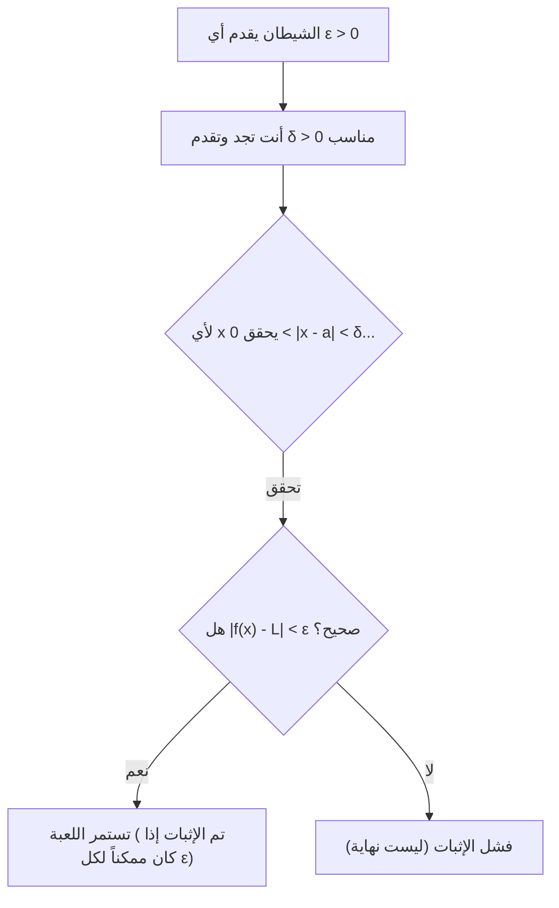
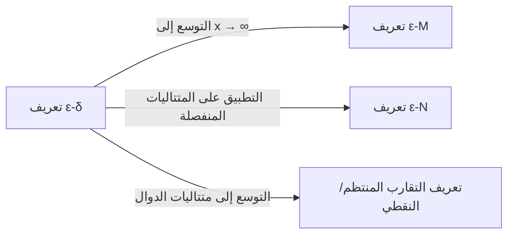

## 1. مقدمة: "غموض" النهايات في المرحلة الثانوية

عند دراسة التفاضل والتكامل في المرحلة الثانوية، يصادف معظمنا التعريف التالي للنهاية:

> "للدالة $f(x)$، إذا كانت $f(x)$ **تقترب من** قيمة معينة $L$ كلما **اقتربت** $x$ من $a$، فإننا نكتب $\lim_{x \to a} f(x) = L$."

هذا التعبير " **يقترب من** " يتوافق تماماً مع حدسنا ويعمل دون أي مشاكل عند التعامل مع الدوال المتصلة مثل كثيرات الحدود أو الدوال المثلثية. إذا قمت برسم رسم بياني، فمن الواضح بصرياً أين تنتهي قيمة $y$ بينما تتحرك $x$ نحو نقطة محددة.

ومع ذلك، بمجرد دخولك في الرياضيات على المستوى الجامعي، وخاصة في مجال التحليل الحقيقي (Real Analysis)، فإن هذا التعريف البديهي يسبب بسرعة مشاكل خطيرة. ماذا يعني " **الاقتراب** " بالضبط؟ هل يعني أن المسافة تصبح أقل من $0.0001$؟ أو أقل من $0.0000001$؟ هل هناك قواعد تتعلق بالسرعة أو طريقة الاقتراب؟

في الرياضيات، وهي تخصص يقدر الدقة الصارمة فوق كل شيء، فإن التعريفات التي تعتمد على الفروق اللغوية الدقيقة تعتبر نقطة ضعف قاتلة. للقضاء تماماً على هذا الغموض وتوفير أساس من الفولاذ لمفهوم النهايات، صاغ علماء الرياضيات في القرن التاسع عشر **تعريف $\varepsilon-\delta$ (إبسيلون-دلتا)**.

في هذا المقال، سوف نستكشف سبب عدم كفاية التعريف البديهي بدءاً من خلفيته التاريخية، ونفك شفرة المعنى الدقيق لتعريف $\varepsilon-\delta$ بعمق، ونوضح كيفية استخدامه في البراهين، بل ونثبت حالات لا توجد فيها نهايات.

## 2. تاريخ التفاضل والتكامل وأزمة الدقة

عندما أسس [إسحاق نيوتن](https://kenji.blog/p/newton/) وغوتفريد لايبنيز التفاضل والتكامل في القرن السابع عشر، اعتمدوا بشكل كبير على مفهوم "الكميات المتناهية الصغر" (وهي كميات صغيرة بشكل لا نهائي ولكنها ليست صفراً). في حين أن حساباتهم أسفرت عن نتائج رائعة في الفيزياء والهندسة، إلا أن الأساس الرياضي كان هشاً للغاية.

انتقد الفيلسوف جورج بيركلي بشدة هذا المفهوم للكميات المتناهية الصغر في ذلك الوقت، واصفاً إياها بـ " **أشباح الكميات المختفية** ". وأشار إلى التناقض المنطقي المتمثل في معاملتها ككميات غير صفرية أثناء القسمة في منتصف الحساب، ليتم استبعادها كصفر في النهاية بشكل انتهازي.

استمر التفاضل والتكامل في التطور طوال القرن الثامن عشر، ولكن مع دخول القرن التاسع عشر، تم اكتشاف "دوال مرضية" (pathological functions) واحدة تلو الأخرى لا يمكن التعامل معها بالحدس وحده، مما زاد من شعور علماء الرياضيات بالأزمة. للتغلب على ذلك، قام أوغستين-لوي كوشي وكارل فايرشتراس بنفي المفهوم المشكوك فيه للكميات المتناهية الصغر وأعادوا بناء التفاضل والتكامل باستخدام خصائص الأعداد الحقيقية والمتباينات فقط. وكان هذا بمثابة ولادة تعريف $\varepsilon-\delta$.

## 3. التعريف الرسمي ε-δ

الآن، دعونا نلقي نظرة على التعريف الدقيق لنهاية دالة باستخدام منطق $\varepsilon-\delta$.

> **التعريف: نهاية دالة**
> تتقارب دالة $f(x)$ إلى $L$ عندما $x \to a$ (تُكتب كـ $\lim_{x \to a} f(x) = L$) إذا وفقط إذا كانت العبارة المنطقية التالية صحيحة:
> $\forall \varepsilon > 0, \exists \delta > 0 \text{ s.t. } 0 < |x - a| < \delta \implies |f(x) - L| < \varepsilon$

إذا لم تكن معتاداً على الرموز الرياضية، فقد يبدو هذا كرمز سري. دعونا نفككه بعناية ونترجمه قطعة قطعة.

*   $\forall \varepsilon > 0$ : "لأي عدد حقيقي موجب $\varepsilon$ (هامش الخطأ) يتم إعطاؤه"
*   $\exists \delta > 0$ : "يوجد عدد حقيقي موجب $\delta$ (مسافة الاقتراب)"
*   $\text{s.t.}$ : "بحيث (such that)"
*   $0 < |x - a| < \delta$ : "إذا كانت المسافة بين $x$ و $a$ أكبر قطعاً من $0$ وأقل من $\delta$ (بمعنى أن $x$ يقع في جوار $\delta$ لـ $a$، و $x \neq a$)"
*   $\implies$ : "فإن"
*   $|f(x) - L| < \varepsilon$ : "المسافة بين $f(x)$ و $L$ تكون أقل قطعاً من $\varepsilon$"

### 3.1. التفسير كلعبة ضد شيطان

هذا التعريف سهل الفهم جداً إذا فكرت فيه كلعبة بينك وبين "شيطان متشكك".

1.  **تحدي الشيطان** : يشك الشيطان في أن النهاية هي $L$ ويفرض هامش خطأ صارم جداً $\varepsilon$ (على سبيل المثال $\varepsilon = 0.001$). "دعنا نرى ما إذا كان بإمكانك إبقاء $f(x)$ ضمن نطاق $0.001$ من $L$!"
2.  **ردك** : تقوم بحساب وتقديم مدى القرب الذي يجب أن تكون عليه $x$ من $a$، وهو قيمة $\delta$. "حسناً، إذا قيدت $x$ لتكون ضمن مسافة $\delta = 0.0005$ من $a$، فإن $f(x)$ ستبقى بالتأكيد ضمن النطاق المحدد!"
3.  **شرط الفوز** : إذا استطعت دائماً، مهما كان $\varepsilon$ الذي يقدمه الشيطان صغيراً، أن تجد (يوجد) $\delta$ المقابل الذي يفي بالغرض، فإنك تفوز، ويثبت أن النهاية هي $L$.

## 4. براهين مع أمثلة عملية

من الصعب فهم التعريفات المجردة بمفردها، لذا دعونا ننجز بعض البراهين باستخدام تعريف $\varepsilon-\delta$ مع دوال ملموسة.

### 4.1. برهان لدالة خطية

كأبسط مثال، سنثبت أن $\lim_{x \to 2} (3x - 1) = 5$.

**[عملية التفكير (مسودة)]**
الهدف من البرهان هو إيجاد $\delta > 0$ بحيث $|(3x - 1) - 5| < \varepsilon$ لأي $\varepsilon > 0$ معطى.
بتبسيط التعبير، نحصل على:
$|(3x - 1) - 5| = |3x - 6| = 3|x - 2|$
ما يمكننا التحكم فيه هو الشرط $|x - 2| < \delta$.
لذلك، $3|x - 2| < 3\delta$.
بما أننا نريد أن يكون هذا مساوياً لـ $\varepsilon$، يجب أن نضع $3\delta = \varepsilon$، مما يعني أن $\delta = \frac{\varepsilon}{3}$.

**[البرهان الرسمي]**
لتكن $\varepsilon > 0$ اختيارية.
اختر $\delta = \frac{\varepsilon}{3}$. بما أن $\varepsilon > 0$، فمن الطبيعي أن تكون $\delta > 0$.
إذن، لأي $x$ يحقق $0 < |x - 2| < \delta$، تتحقق المتباينة التالية:
$$|(3x - 1) - 5| = |3x - 6| = 3|x - 2| < 3\delta = 3\left(\frac{\varepsilon}{3}\right) = \varepsilon$$
وبالتالي، أظهرنا أن $0 < |x - 2| < \delta \implies |(3x - 1) - 5| < \varepsilon$.
لذلك، بحسب التعريف، $\lim_{x \to 2} (3x - 1) = 5$. $\blacksquare$

### 4.2. برهان لدالة تربيعية (تقنية تقييد δ)

بعد ذلك، دعونا نثبت نهاية أكثر تعقيداً قليلاً: $\lim_{x \to 3} x^2 = 9$. نظراً لبقاء حد يحتوي على $x$، يتطلب الأمر حيلة صغيرة.

**[عملية التفكير (مسودة)]**
الهدف هو إيجاد $\delta$ بحيث $|x^2 - 9| < \varepsilon$.
$|x^2 - 9| = |x - 3||x + 3|$
هنا، يمكننا تكوين $|x - 3| < \delta$، لكن $|x + 3|$ يقف في طريقنا. لا يمكن أن تعتمد $\delta$ على $x$ (يجب تقديمها كثابت).
لذلك، نفترض أولاً أن $x$ قريبة بما فيه الكفاية من $3$ ونقدر القيمة القصوى لـ $|x + 3|$.
على سبيل المثال، دعونا **نقيد** $\delta \le 1$.
عندئذ، $|x - 3| < 1$، مما يعني $-1 < x - 3 < 1$، أو $2 < x < 4$.
في هذه الحالة، نطاق $x + 3$ هو $5 < x + 3 < 7$، مما يضمن أن $|x + 3| < 7$.
لذلك، يمكننا تأسيس المتباينة $|x - 3||x + 3| < 7|x - 3|$.
لجعل هذا أقل قطعاً من $\varepsilon$، نحتاج إلى $7|x - 3| < \varepsilon$، مما يعني $|x - 3| < \frac{\varepsilon}{7}$.
بما أنه يجب علينا أيضاً الامتثال لقيدنا الأولي $\delta \le 1$، يمكننا اختيار $\delta$ لتكون **الأصغر** بين $1$ و $\frac{\varepsilon}{7}$.

**[البرهان الرسمي]**
لتكن $\varepsilon > 0$ اختيارية.
اختر $\delta = \min\left(1, \frac{\varepsilon}{7}\right)$.
ثم، اعتبر أي $x$ يحقق $0 < |x - 3| < \delta$.
أولاً، بما أن $\delta \le 1$، لدينا $|x - 3| < 1$، مما يقتضي $2 < x < 4$، وبالتالي $|x + 3| < 7$.
ثانياً، بما أن $\delta \le \frac{\varepsilon}{7}$، لدينا أيضاً $|x - 3| < \frac{\varepsilon}{7}$.
باستخدام هذه الحقائق، نحصل على:
$$|x^2 - 9| = |x - 3||x + 3| < |x - 3| \cdot 7 < \frac{\varepsilon}{7} \cdot 7 = \varepsilon$$
وبالتالي، أظهرنا أن $0 < |x - 3| < \delta \implies |x^2 - 9| < \varepsilon$.
لذلك، $\lim_{x \to 3} x^2 = 9$. $\blacksquare$

## 5. لماذا "يقترب من" لا تكفي: دخول الدوال المرضية

بعد قراءتك حتى هنا، قد تفكر: "ألم تصبح الحسابات مجرد عمل أكثر مللاً؟". ومع ذلك، تظهر القوة الحقيقية لتعريف $\varepsilon-\delta$ عند التعامل مع "الدوال المرضية" حيث يكون رسم الرسم البياني مستحيلاً.

كمثال شهير، دعونا نتناول **دالة ديريخليه** (Dirichlet function).

$$ f(x) = \begin{cases} 1 & (\text{عندما تكون } x \text{ عدداً نسبياً}) \\ 0 & (\text{عندما تكون } x \text{ عدداً غير نسبي}) \end{cases} $$

تأخذ هذه الدالة القيمة $1$ عند كل عدد نسبي والقيمة $0$ عند كل عدد غير نسبي. نظراً لأن الأعداد النسبية وغير النسبية مختلطة بكثافة لا نهائية على خط الأعداد الحقيقية، فإن رسم هذا الرسم البياني مستحيل بصرياً لعيون البشر.

الآن، دعونا نتناول النهاية $\lim_{x \to 0} f(x)$ عندما $x \to 0$. باستخدام التعبير البديهي "كلما اقتربت $x$ بشكل لا نهائي من $0$"، من المستحيل تحديد ما إذا كانت $f(x)$ تقترب من $1$ أم $0$. إذا تتبعت مساراً يقترب فقط من خلال الأعداد النسبية، فإنه يكون $1$؛ وإذا تتبعت الأعداد غير النسبية فقط، فإنه يكون $0$.

باستخدام تعريف $\varepsilon-\delta$، يمكننا أن نثبت بدقة أن هذه النهاية **غير موجودة**. نفي افتراض أن النهاية هي $L$ يكون كالتالي:

> **نفي التعريف (النهاية ليست L)**
> $\exists \varepsilon > 0 \text{ s.t. } \forall \delta > 0, \exists x \text{ s.t. } (0 < |x - a| < \delta \land |f(x) - L| \ge \varepsilon)$

بكلمات أخرى، "عندما يقدم الشيطان قيمة $\varepsilon$ محددة، فمهما كانت $\delta$ التي تقدمها، سيوجد دائماً $x$ خبيثة ضمن هذا النطاق $\delta$ تنحرف عن القيمة المستهدفة $L$ بمقدار $\varepsilon$ أو أكثر".

**[البرهان على عدم وجود نهاية لدالة ديريخليه]**
لنفترض أن النهاية هي قيمة ما $L$ لاستنتاج تناقض.
نضع $\varepsilon = \frac{1}{2}$.
مهما كان $\delta > 0$ الذي تختاره، يوجد دائماً عدد نسبي $x_1$ وعدد غير نسبي $x_2$ ضمن الفترة $(-\delta, \delta)$.
لدينا $f(x_1) = 1$ و $f(x_2) = 0$.
لو كانت النهاية هي $L$، بحسب التعريف، يجب أن يتحقق كل من $|1 - L| < \frac{1}{2}$ و $|0 - L| < \frac{1}{2}$.
ومع ذلك، من خلال متباينة المثلث،
$1 = |1 - 0| = |(1 - L) + (L - 0)| \le |1 - L| + |L - 0| < \frac{1}{2} + \frac{1}{2} = 1$
يؤدي هذا إلى التناقض $1 < 1$.
لذلك، النهاية $L$ غير موجودة. $\blacksquare$

بهذه الطريقة، فإن أكبر ميزة لمنطق $\varepsilon-\delta$ هي قدرته على تقديم إجابات قاطعة واضحة للمسائل التي لا يمكن التعامل معها بالحدس.

## 6. المزيد من التوسعات: النهايات إلى المالانهاية

لا يُطبَّق مفهوم النهايات فقط عند الاقتراب من قيم محدودة ولكن أيضاً على النهايات نحو المالانهاية، مثل $x \to \infty$. في هذه الحالات، يتم استخدام اختلافات من تعريف $\varepsilon-\delta$، ألا وهي **تعريف $\varepsilon-M$** أو **تعريف $\varepsilon-N$** للمتتاليات.

على سبيل المثال، التعريف الدقيق لـ $\lim_{x \to \infty} f(x) = L$ هو كالتالي:

> $\forall \varepsilon > 0, \exists M > 0 \text{ s.t. } x > M \implies |f(x) - L| < \varepsilon$

هذا يعني "لأي خطأ صغير بشكل تعسفي $\varepsilon$، إذا حددت قيمة حدودية $M$ كبيرة بما فيه الكفاية، فإنه بعد $M$، ستبقى $f(x)$ دائماً ضمن هامش الخطأ $\varepsilon$ من $L$". يمكنك أن ترى أن الإطار المنطقي هو نفسه تماماً كتعريف $\varepsilon-\delta$.

## 7. الخاتمة

يُعد التفسير البديهي بأن "$x$ تقترب بشكل لا نهائي من $a$" فعالاً جداً للمبتدئين لفهم مفهوم النهاية. ومع ذلك، كان ذلك غير كافٍ لتوفير "اليقين المطلق" الذي تتطلبه الرياضيات كأساس لهيكلها.

للوهلة الأولى، يبدو تعريف $\varepsilon-\delta$ كسلسلة شاقة من المتباينات، ولكن جوهره يكمن في **التحقق الساكن من شرط: "هل يمكن التحكم في الخطأ ليكون صغيراً بشكل تعسفي؟"**. إن استبدال المفهوم الغامض الذي يتضمن عنصراً زمنياً لـ "الاقتراب الديناميكي" بحالة منطقية وساكنة وهي "يوجد نطاق يحقق متباينة" كان تحولاً نموذجياً رائعاً من قبل علماء الرياضيات في القرن التاسع عشر.

بفضل هذا الأساس الدقيق، فإن التفاضل والتكامل الحديث، والفيزياء والهندسة التي تطبقه، وحتى نظريات التحسين (optimization theories) الأساسية للذكاء الاصطناعي تعمل بيقين لا يتزعزع. كلما علقت في تعلم النهايات، تذكر لعبة $\varepsilon-\delta$ مع الشيطان وحاول الاستمتاع بها كأحجية منطقية.
