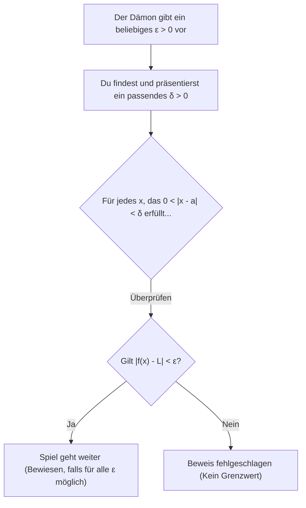
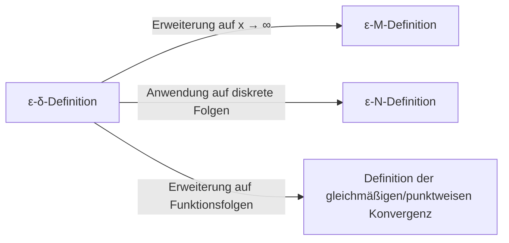

## 1. Einleitung: Die "Mehrdeutigkeit" der Grenzwerte in der Schule

Wenn wir in der Schule die Differential- und Integralrechnung lernen, stoßen die meisten von uns auf die folgende Definition eines Grenzwerts:

> "Für eine Funktion $f(x)$: Wenn sich $f(x)$ einem bestimmten Wert $L$ **annähert**, während sich $x$ $a$ **annähert**, schreiben wir $\lim_{x \to a} f(x) = L$."

Dieser Ausdruck " **annähert** " stimmt perfekt mit unserer Intuition überein und funktioniert problemlos beim Umgang mit stetigen Funktionen wie Polynomen oder trigonometrischen Funktionen. Wenn man einen Graphen zeichnet, ist visuell offensichtlich, wo der Wert von $y$ landet, wenn sich $x$ auf einen bestimmten Punkt zubewegt.

Sobald man jedoch die Universitätsmathematik betritt, insbesondere den Bereich der reellen Analysis, verursacht diese intuitive Definition schnell ernsthafte Probleme. Was genau bedeutet " **annähern** "? Bedeutet es, dass der Abstand kleiner als $0.0001$ wird? Oder kleiner als $0.0000001$? Gibt es Regeln hinsichtlich der Geschwindigkeit oder der Art und Weise der Annäherung?

In der Mathematik, einer Disziplin, die strenge Genauigkeit über alles schätzt, sind Definitionen, die auf sprachlichen Nuancen beruhen, eine fatale Schwäche. Um diese Mehrdeutigkeit vollständig zu beseitigen und dem Konzept der Grenzwerte ein stählernes Fundament zu geben, formulierten Mathematiker des 19. Jahrhunderts die **$\varepsilon-\delta$ (Epsilon-Delta)-Definition**.

In diesem Artikel werden wir untersuchen, warum die intuitive Definition unzureichend ist, beginnend mit ihrem historischen Hintergrund, die genaue Bedeutung der $\varepsilon-\delta$-Definition tiefgreifend entschlüsseln, zeigen, wie man sie in Beweisen anwendet, und sogar Fälle beweisen, in denen Grenzwerte nicht existieren.

## 2. Die Geschichte der Analysis und die Krise der Strenge

Als [Isaac Newton](https://kenji.blog/de/p/newton/) und [Gottfried Leibniz](https://kenji.blog/de/p/leibniz/) im 17. Jahrhundert die Infinitesimalrechnung begründeten, stützten sie sich stark auf das Konzept der "Infinitesimalen" (Größen, die unendlich klein, aber nicht null sind). Während ihre Berechnungen in der Physik und Geometrie bemerkenswerte Ergebnisse lieferten, war das mathematische Fundament äußerst fragil.

Der damalige Philosoph George Berkeley kritisierte dieses Konzept der Infinitesimalen scharf und nannte sie die " **Geister verschwundener Größen** ". Er wies auf die logische Inkonsistenz hin, sie während einer Division mitten in einer Berechnung als nicht-null-Größen zu behandeln, nur um sie am Ende bequemerweise als null abzutun.

Die Analysis entwickelte sich im Laufe des 18. Jahrhunderts weiter, aber zu Beginn des 19. Jahrhunderts wurden nacheinander "pathologische Funktionen" entdeckt, die nicht allein mit Intuition gehandhabt werden konnten, was das Krisenbewusstsein der Mathematiker schärfte. Um dies zu überwinden, verbannten [Augustin-Louis Cauchy](https://kenji.blog/de/p/cauchy/) und [Karl Weierstrass](https://kenji.blog/de/p/weierstrass/) das zweifelhafte Konzept der Infinitesimalen und rekonstruierten die Analysis nur unter Verwendung der Eigenschaften reeller Zahlen und Ungleichungen. Dies markierte die Geburtsstunde der $\varepsilon-\delta$-Definition.

## 3. Die Formale ε-δ-Definition

Schauen wir uns nun die strenge Definition des Grenzwerts einer Funktion mithilfe der $\varepsilon-\delta$-Logik an.

> **Definition: Grenzwert einer Funktion**
> Eine Funktion $f(x)$ konvergiert gegen $L$ für $x \to a$ (geschrieben als $\lim_{x \to a} f(x) = L$), wenn und nur wenn die folgende logische Aussage wahr ist:
> $\forall \varepsilon > 0, \exists \delta > 0 \text{ s.t. } 0 < |x - a| < \delta \implies |f(x) - L| < \varepsilon$

Wenn man nicht an mathematische Symbole gewöhnt ist, könnte das wie ein Geheimcode aussehen. Lassen Sie uns das sorgfältig aufschlüsseln und Stück für Stück übersetzen.

*   $\forall \varepsilon > 0$ : "Für jede gegebene positive reelle Zahl $\varepsilon$ (Fehlertoleranz)"
*   $\exists \delta > 0$ : "existiert eine positive reelle Zahl $\delta$ (Annäherungsdistanz)"
*   $\text{s.t.}$ : "sodass (such that)"
*   $0 < |x - a| < \delta$ : "wenn der Abstand zwischen $x$ und $a$ strikt größer als $0$ und kleiner als $\delta$ ist (d.h. $x$ liegt in der $\delta$-Umgebung von $a$, und $x \neq a$)"
*   $\implies$ : "dann gilt"
*   $|f(x) - L| < \varepsilon$ : "der Abstand zwischen $f(x)$ und $L$ ist strikt kleiner als $\varepsilon$"

### 3.1. Interpretation als ein Spiel gegen einen Dämon

Diese Definition ist sehr leicht zu verstehen, wenn man sie als ein Spiel zwischen sich selbst und einem "skeptischen Dämon" betrachtet.

1.  **Die Herausforderung des Dämons** : Der Dämon bezweifelt, dass der Grenzwert $L$ ist, und erlegt eine sehr strenge Fehlertoleranz $\varepsilon$ auf (zum Beispiel $\varepsilon = 0.001$). "Mal sehen, ob du $f(x)$ innerhalb von $0.001$ von $L$ halten kannst!"
2.  **Ihre Antwort** : Sie berechnen und präsentieren, wie nah $x$ an $a$ sein muss, was der Wert von $\delta$ ist. "In Ordnung, wenn ich $x$ darauf beschränke, innerhalb einer Distanz von $\delta = 0.0005$ von $a$ zu sein, wird $f(x)$ definitiv innerhalb des angegebenen Bereichs bleiben!"
3.  **Siegbedingung** : Wenn Sie, egal wie klein ein $\varepsilon$ der Dämon präsentiert, immer ein entsprechendes $\delta$ finden können (das existiert), das funktioniert, dann gewinnen Sie, und es ist bewiesen, dass der Grenzwert $L$ ist.

## 4. Beweise mit Konkreten Beispielen

Abstrakte Definitionen sind für sich genommen schwer zu begreifen, also führen wir einige Beweise unter Verwendung der $\varepsilon-\delta$-Definition mit konkreten Funktionen durch.

### 4.1. Beweis für eine Lineare Funktion

Als einfachstes Beispiel beweisen wir $\lim_{x \to 2} (3x - 1) = 5$.

**[Gedankenprozess (Notizblock)]**
Das Ziel des Beweises ist es, ein $\delta > 0$ zu finden, sodass $|(3x - 1) - 5| < \varepsilon$ für jedes gegebene $\varepsilon > 0$ gilt.
Vereinfacht man den Ausdruck, erhält man:
$|(3x - 1) - 5| = |3x - 6| = 3|x - 2|$
Was wir kontrollieren können, ist die Bedingung $|x - 2| < \delta$.
Daher gilt $3|x - 2| < 3\delta$.
Da wir wollen, dass dies gleich $\varepsilon$ ist, sollten wir $3\delta = \varepsilon$ setzen, was bedeutet, dass $\delta = \frac{\varepsilon}{3}$.

**[Formaler Beweis]**
Sei $\varepsilon > 0$ beliebig.
Wähle $\delta = \frac{\varepsilon}{3}$. Da $\varepsilon > 0$, folgt natürlich, dass $\delta > 0$.
Dann gilt für jedes $x$, das $0 < |x - 2| < \delta$ erfüllt, die folgende Ungleichung:
$$|(3x - 1) - 5| = |3x - 6| = 3|x - 2| < 3\delta = 3\left(\frac{\varepsilon}{3}\right) = \varepsilon$$
Somit haben wir gezeigt, dass $0 < |x - 2| < \delta \implies |(3x - 1) - 5| < \varepsilon$.
Daher gilt nach Definition $\lim_{x \to 2} (3x - 1) = 5$. $\blacksquare$

### 4.2. Beweis für eine Quadratische Funktion (Die δ-Einschränkungs-Technik)

Als Nächstes beweisen wir einen etwas komplexeren Grenzwert: $\lim_{x \to 3} x^2 = 9$. Da ein Term mit $x$ übrig bleibt, ist ein kleiner Trick erforderlich.

**[Gedankenprozess (Notizblock)]**
Das Ziel ist es, ein $\delta$ zu finden, sodass $|x^2 - 9| < \varepsilon$.
$|x^2 - 9| = |x - 3||x + 3|$
Hier können wir $|x - 3| < \delta$ erzeugen, aber $|x + 3|$ ist im Weg. $\delta$ darf nicht von $x$ abhängen (es muss als Konstante präsentiert werden).
Daher nehmen wir zunächst an, dass $x$ ausreichend nah an $3$ ist, und schätzen den Maximalwert von $|x + 3|$ ab.
Zum Beispiel **beschränken** wir $\delta \le 1$.
Dann gilt $|x - 3| < 1$, was $-1 < x - 3 < 1$, also $2 < x < 4$ bedeutet.
In diesem Fall ist der Bereich von $x + 3$ $5 < x + 3 < 7$, was garantiert, dass $|x + 3| < 7$.
Daher können wir die Ungleichung $|x - 3||x + 3| < 7|x - 3|$ aufstellen.
Um dies strikt kleiner als $\varepsilon$ zu machen, benötigen wir $7|x - 3| < \varepsilon$, was bedeutet $|x - 3| < \frac{\varepsilon}{7}$.
Da wir auch unsere anfängliche Einschränkung $\delta \le 1$ einhalten müssen, können wir $\delta$ als das **kleinere** von $1$ und $\frac{\varepsilon}{7}$ wählen.

**[Formaler Beweis]**
Sei $\varepsilon > 0$ beliebig.
Wähle $\delta = \min\left(1, \frac{\varepsilon}{7}\right)$.
Betrachte dann jedes $x$, das $0 < |x - 3| < \delta$ erfüllt.
Erstens haben wir, da $\delta \le 1$, $|x - 3| < 1$, was $2 < x < 4$ impliziert und somit $|x + 3| < 7$.
Zweitens haben wir, da $\delta \le \frac{\varepsilon}{7}$, auch $|x - 3| < \frac{\varepsilon}{7}$.
Mit diesen Tatsachen erhalten wir:
$$|x^2 - 9| = |x - 3||x + 3| < |x - 3| \cdot 7 < \frac{\varepsilon}{7} \cdot 7 = \varepsilon$$
Somit haben wir gezeigt, dass $0 < |x - 3| < \delta \implies |x^2 - 9| < \varepsilon$.
Daher gilt $\lim_{x \to 3} x^2 = 9$. $\blacksquare$

## 5. Warum "Annähern" Nicht Ausreicht: Pathologische Funktionen

Wenn Sie bis hierhin gelesen haben, denken Sie vielleicht: "Sind die Berechnungen nicht einfach nur mühsamer geworden?". Die wahre Kraft der $\varepsilon-\delta$-Definition offenbart sich jedoch beim Umgang mit "pathologischen Funktionen", bei denen das Zeichnen eines Graphen unmöglich ist.

Betrachten wir als berühmtes Beispiel die **Dirichlet-Funktion**.

$$ f(x) = \begin{cases} 1 & (\text{wenn } x \text{ rational ist}) \\ 0 & (\text{wenn } x \text{ irrational ist}) \end{cases} $$

Diese Funktion nimmt bei jeder rationalen Zahl den Wert $1$ an und bei jeder irrationalen Zahl den Wert $0$. Da rationale und irrationale Zahlen auf der reellen Zahlengeraden unendlich dicht gemischt sind, ist das Zeichnen dieses Graphen für menschliche Augen visuell unmöglich.

Betrachten wir nun den Grenzwert $\lim_{x \to 0} f(x)$ für $x \to 0$. Mit dem intuitiven Ausdruck "wenn sich $x$ unendlich nah an $0$ annähert" ist es unmöglich festzustellen, ob sich $f(x)$ $1$ oder $0$ annähert. Wenn Sie einen Pfad verfolgen, der sich nur durch rationale Zahlen nähert, ist es $1$; wenn Sie nur irrationale Zahlen verfolgen, ist es $0$.

Mit der $\varepsilon-\delta$-Definition können wir streng beweisen, dass dieser Grenzwert **nicht existiert**. Die Negation der Aussage, dass der Grenzwert $L$ ist, lautet wie folgt:

> **Negation der Definition (Der Grenzwert ist nicht L)**
> $\exists \varepsilon > 0 \text{ s.t. } \forall \delta > 0, \exists x \text{ s.t. } (0 < |x - a| < \delta \land |f(x) - L| \ge \varepsilon)$

In anderen Worten: "Wenn der Dämon ein bestimmtes $\varepsilon$ präsentiert, wird es, egal welches $\delta$ Sie präsentieren, immer ein bösartiges $x$ innerhalb dieses $\delta$-Bereichs geben, das vom Zielwert $L$ um $\varepsilon$ oder mehr abweicht."

**[Beweis, dass der Grenzwert der Dirichlet-Funktion nicht existiert]**
Nehmen wir an, der Grenzwert sei ein bestimmter Wert $L$, um einen Widerspruch herzuleiten.
Setzen wir $\varepsilon = \frac{1}{2}$.
Egal welches $\delta > 0$ Sie wählen, es existieren immer eine rationale Zahl $x_1$ und eine irrationale Zahl $x_2$ innerhalb des Intervalls $(-\delta, \delta)$.
Wir haben $f(x_1) = 1$ und $f(x_2) = 0$.
Wäre der Grenzwert $L$, müssten nach Definition sowohl $|1 - L| < \frac{1}{2}$ als auch $|0 - L| < \frac{1}{2}$ gelten.
Nach der Dreiecksungleichung gilt jedoch:
$1 = |1 - 0| = |(1 - L) + (L - 0)| \le |1 - L| + |L - 0| < \frac{1}{2} + \frac{1}{2} = 1$
Dies führt zu dem Widerspruch $1 < 1$.
Daher existiert der Grenzwert $L$ nicht. $\blacksquare$

Auf diese Weise ist der größte Vorteil der $\varepsilon-\delta$-Logik ihre Fähigkeit, definitive Schwarz-Weiß-Antworten auf Probleme zu liefern, die nicht mit Intuition behandelt werden können.

## 6. Weitere Erweiterungen: Grenzwerte im Unendlichen

Das Konzept der Grenzwerte wird nicht nur bei der Annäherung an endliche Werte angewendet, sondern auch bei Grenzwerten im Unendlichen, wie z.B. $x \to \infty$. In diesen Fällen werden Variationen der $\varepsilon-\delta$-Definition verwendet, nämlich die **$\varepsilon-M$-Definition** oder die **$\varepsilon-N$-Definition** für Folgen.

Zum Beispiel lautet die strenge Definition von $\lim_{x \to \infty} f(x) = L$ wie folgt:

> $\forall \varepsilon > 0, \exists M > 0 \text{ s.t. } x > M \implies |f(x) - L| < \varepsilon$

Das bedeutet: "Für jeden beliebig kleinen Fehler $\varepsilon$: Wenn Sie einen ausreichend großen Grenzwert $M$ festlegen, dann wird $f(x)$ jenseits von $M$ immer innerhalb der $\varepsilon$-Fehlermarge von $L$ bleiben." Sie können sehen, dass der logische Rahmen genau derselbe ist wie bei der $\varepsilon-\delta$-Definition.

## 7. Fazit

Die intuitive Erklärung, dass "$x$ sich $a$ unendlich nah annähert", ist für Anfänger sehr effektiv, um das Konzept eines Grenzwerts zu erfassen. Sie reichte jedoch nicht aus, um die "absolute Gewissheit" zu bieten, die die Mathematik als Fundament für ihre Struktur erfordert.

Auf den ersten Blick sieht die $\varepsilon-\delta$-Definition wie eine entmutigende Kette von Ungleichungen aus, aber ihre Essenz liegt in der **statischen Überprüfung einer Bedingung: "Kann der Fehler so kontrolliert werden, dass er beliebig klein ist?"**. Das Ersetzen des mehrdeutigen Konzepts, das ein zeitliches Element der "dynamischen Annäherung" beinhaltet, durch einen logischen, statischen [Zustand](https://kenji.blog/de/p/state-management-history-redux-context-recoil-zustand/) von "es existiert ein Bereich, der eine Ungleichung erfüllt", war ein großartiger Paradigmenwechsel der Mathematiker des 19. Jahrhunderts.

Dank dieses strengen Fundaments funktionieren die moderne Analysis, die Physik und Ingenieurwissenschaften, die sie anwenden, und sogar die Optimierungstheorien, die für die künstliche Intelligenz grundlegend sind, mit unerschütterlicher Gewissheit. Wann immer Sie beim Lernen von Grenzwerten nicht weiterkommen, erinnern Sie sich an das $\varepsilon-\delta$-Spiel mit dem Dämon und versuchen Sie, es als logisches Rätsel zu genießen.
