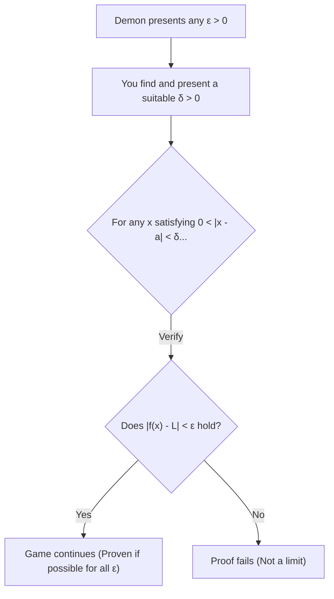
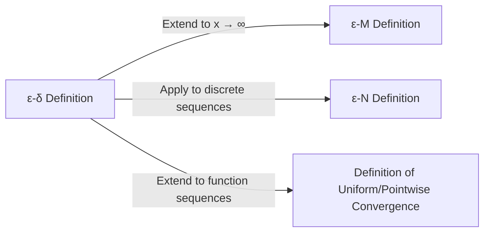

## 1. Introduction: The "Ambiguity" of High School Limits

When learning calculus in high school, most of us encounter the following definition of a limit:

> "For a function $f(x)$, if $f(x)$ **approaches** a certain value $L$ as $x$ **approaches** $a$, we write $\lim_{x \to a} f(x) = L$."

This expression " **approaches** " aligns perfectly with our intuition and works without any issues when dealing with continuous functions like polynomials or trigonometric functions. If you draw a graph, it is visually obvious where the value of $y$ ends up as $x$ moves toward a specific point.

However, once you step into university-level mathematics, particularly the realm of Real Analysis, this intuitive definition quickly causes serious problems. What exactly does it mean to " **approach** "? Does it mean the distance becomes less than $0.0001$? Or less than $0.0000001$? Are there rules regarding the speed or the manner of approaching?

In mathematics, a discipline that values strict rigor above all else, definitions relying on linguistic nuances are a fatal weakness. To completely eliminate this ambiguity and provide a foundation of steel for the concept of limits, 19th-century mathematicians formulated the **$\varepsilon-\delta$ (epsilon-delta) definition**.

In this article, we will explore why the intuitive definition is insufficient starting from its historical background, deeply decode the exact meaning of the $\varepsilon-\delta$ definition, demonstrate how to use it in proofs, and even prove cases where limits do not exist.

## 2. History of Calculus and the Crisis of Rigor

When [Isaac Newton](https://kenji.blog/en/p/newton/) and [Gottfried Leibniz](https://kenji.blog/en/p/leibniz/) founded calculus in the 17th century, they relied heavily on the concept of "infinitesimals" (quantities that are infinitely small but not zero). While their calculations yielded remarkable results in physics and geometry, the mathematical foundation was extremely fragile.

The philosopher George Berkeley at the time severely criticized this concept of infinitesimals, calling them the " **ghosts of departed quantities** ". He pointed out the logical inconsistency of treating them as non-zero quantities during division in the middle of a calculation, only to conveniently dismiss them as zero at the end.

Calculus continued to develop throughout the 18th century, but entering the 19th century, "pathological functions" that could not be handled by intuition alone were discovered one after another, heightening mathematicians' sense of crisis. To overcome this, [Augustin-Louis Cauchy](https://kenji.blog/en/p/cauchy/) and [Karl Weierstrass](https://kenji.blog/en/p/weierstrass/) banished the dubious concept of infinitesimals and reconstructed calculus using only the properties of real numbers and inequalities. This marked the birth of the $\varepsilon-\delta$ definition.

## 3. The Formal ε-δ Definition

Now, let's look at the rigorous definition of the limit of a function using the $\varepsilon-\delta$ logic.

> **Definition: Limit of a Function**
> A function $f(x)$ converges to $L$ as $x \to a$ (written as $\lim_{x \to a} f(x) = L$) if and only if the following logical statement holds true:
> $\forall \varepsilon > 0, \exists \delta > 0 \text{ s.t. } 0 < |x - a| < \delta \implies |f(x) - L| < \varepsilon$

If you are not accustomed to mathematical symbols, this might look like a secret code. Let's carefully break it down and translate it piece by piece.

*   $\forall \varepsilon > 0$ : "For any positive real number $\varepsilon$ (error tolerance) given"
*   $\exists \delta > 0$ : "there exists a positive real number $\delta$ (approach distance)"
*   $\text{s.t.}$ : "such that"
*   $0 < |x - a| < \delta$ : "if the distance between $x$ and $a$ is strictly greater than $0$ and less than $\delta$ (meaning $x$ is in the $\delta$-neighborhood of $a$, and $x \neq a$)"
*   $\implies$ : "then"
*   $|f(x) - L| < \varepsilon$ : "the distance between $f(x)$ and $L$ is strictly less than $\varepsilon$"

### 3.1. Interpretation as a Game Against a Demon

This definition is very easy to understand if you think of it as a game between you and a "skeptical demon".

1.  **The Demon's Challenge** : The demon doubts that the limit is $L$ and imposes a very strict error tolerance $\varepsilon$ (for example, $\varepsilon = 0.001$). "Let's see you keep $f(x)$ within $0.001$ of $L$!"
2.  **Your Response** : You calculate and present how close $x$ needs to be to $a$, which is the value of $\delta$. "Alright, if I restrict $x$ to be within $\delta = 0.0005$ from $a$, $f(x)$ will definitely stay within the specified range!"
3.  **Winning Condition** : If, no matter how small an $\varepsilon$ the demon presents, you can always find (there exists) a corresponding $\delta$ that works, then you win, and it is proven that the limit is $L$.

## 4. Proofs with Concrete Examples

Abstract definitions are hard to grasp on their own, so let's perform some proofs using the $\varepsilon-\delta$ definition with concrete functions.

### 4.1. Proof for a Linear Function

As the simplest example, we will prove $\lim_{x \to 2} (3x - 1) = 5$.

**[Thought Process (Scratchpad)]**
The goal of the proof is to find a $\delta > 0$ such that $|(3x - 1) - 5| < \varepsilon$ for any given $\varepsilon > 0$.
Simplifying the expression, we get:
$|(3x - 1) - 5| = |3x - 6| = 3|x - 2|$
What we can control is the condition $|x - 2| < \delta$.
Therefore, $3|x - 2| < 3\delta$.
Since we want this to be equal to $\varepsilon$, we should set $3\delta = \varepsilon$, which means $\delta = \frac{\varepsilon}{3}$.

**[Formal Proof]**
Let $\varepsilon > 0$ be arbitrary.
Choose $\delta = \frac{\varepsilon}{3}$. Since $\varepsilon > 0$, it naturally follows that $\delta > 0$.
Then, for any $x$ satisfying $0 < |x - 2| < \delta$, the following inequality holds:
$$|(3x - 1) - 5| = |3x - 6| = 3|x - 2| < 3\delta = 3\left(\frac{\varepsilon}{3}\right) = \varepsilon$$
Thus, we have shown that $0 < |x - 2| < \delta \implies |(3x - 1) - 5| < \varepsilon$.
Therefore, by definition, $\lim_{x \to 2} (3x - 1) = 5$. $\blacksquare$

### 4.2. Proof for a Quadratic Function (The δ-Restriction Technique)

Next, let's prove a slightly more complex limit: $\lim_{x \to 3} x^2 = 9$. Because a term containing $x$ remains, a little trick is required.

**[Thought Process (Scratchpad)]**
The goal is to find a $\delta$ such that $|x^2 - 9| < \varepsilon$.
$|x^2 - 9| = |x - 3||x + 3|$
Here, we can create $|x - 3| < \delta$, but $|x + 3|$ is in the way. $\delta$ cannot depend on $x$ (it must be presented as a constant).
Therefore, we first assume that $x$ is sufficiently close to $3$ and estimate the maximum value of $|x + 3|$.
For example, let's **restrict** $\delta \le 1$.
Then, $|x - 3| < 1$, which means $-1 < x - 3 < 1$, or $2 < x < 4$.
In this case, the range of $x + 3$ is $5 < x + 3 < 7$, which guarantees that $|x + 3| < 7$.
Therefore, we can establish the inequality $|x - 3||x + 3| < 7|x - 3|$.
To make this strictly less than $\varepsilon$, we need $7|x - 3| < \varepsilon$, meaning $|x - 3| < \frac{\varepsilon}{7}$.
Since we must also obey our initial restriction $\delta \le 1$, we can choose $\delta$ to be the **smaller** of $1$ and $\frac{\varepsilon}{7}$.

**[Formal Proof]**
Let $\varepsilon > 0$ be arbitrary.
Choose $\delta = \min\left(1, \frac{\varepsilon}{7}\right)$.
Then, consider any $x$ satisfying $0 < |x - 3| < \delta$.
First, since $\delta \le 1$, we have $|x - 3| < 1$, which implies $2 < x < 4$, and thus $|x + 3| < 7$.
Next, since $\delta \le \frac{\varepsilon}{7}$, we also have $|x - 3| < \frac{\varepsilon}{7}$.
Using these facts, we get:
$$|x^2 - 9| = |x - 3||x + 3| < |x - 3| \cdot 7 < \frac{\varepsilon}{7} \cdot 7 = \varepsilon$$
Thus, we have shown that $0 < |x - 3| < \delta \implies |x^2 - 9| < \varepsilon$.
Therefore, $\lim_{x \to 3} x^2 = 9$. $\blacksquare$

## 5. Why "Approaches" is Not Enough: Enter Pathological Functions

Having read this far, you might be thinking, "Didn't the calculations just get more tedious?" However, the true power of the $\varepsilon-\delta$ definition reveals itself when dealing with "pathological functions" where drawing a graph is impossible.

As a famous example, let's consider the **Dirichlet function**.

$$ f(x) = \begin{cases} 1 & (\text{when } x \text{ is rational}) \\ 0 & (\text{when } x \text{ is irrational}) \end{cases} $$

This function takes the value $1$ at every rational number and $0$ at every irrational number. Because rational and irrational numbers are infinitely densely mixed on the real number line, drawing this graph is visually impossible for human eyes.

Now, consider the limit $\lim_{x \to 0} f(x)$ as $x \to 0$. Using the intuitive expression "as $x$ approaches infinitely close to $0$", it is impossible to determine whether $f(x)$ approaches $1$ or $0$. If you trace a path approaching only through rational numbers, it is $1$; if you trace only irrational numbers, it is $0$.

By using the $\varepsilon-\delta$ definition, we can rigorously prove that this limit **does not exist**. The negation of the proposition that the limit is $L$ is as follows:

> **Negation of the Definition (The limit is not L)**
> $\exists \varepsilon > 0 \text{ s.t. } \forall \delta > 0, \exists x \text{ s.t. } (0 < |x - a| < \delta \land |f(x) - L| \ge \varepsilon)$

In other words, "When the demon presents a specific $\varepsilon$, no matter what $\delta$ you present, there will always exist a malicious $x$ within that $\delta$ range that deviates from the target value $L$ by $\varepsilon$ or more."

**[Proof that the limit of the Dirichlet function does not exist]**
Assume the limit is some value $L$ to derive a contradiction.
Set $\varepsilon = \frac{1}{2}$.
No matter what $\delta > 0$ you choose, there always exists a rational number $x_1$ and an irrational number $x_2$ within the interval $(-\delta, \delta)$.
We have $f(x_1) = 1$ and $f(x_2) = 0$.
If the limit were $L$, by definition, both $|1 - L| < \frac{1}{2}$ and $|0 - L| < \frac{1}{2}$ must hold.
However, by the triangle inequality,
$1 = |1 - 0| = |(1 - L) + (L - 0)| \le |1 - L| + |L - 0| < \frac{1}{2} + \frac{1}{2} = 1$
This results in the contradiction $1 < 1$.
Therefore, the limit $L$ does not exist. $\blacksquare$

In this way, the greatest advantage of the $\varepsilon-\delta$ logic is its ability to provide definitive black-and-white answers to problems that cannot be handled by intuition.

## 6. Further Extensions: Limits to Infinity

The concept of limits is applied not only when approaching finite values but also to limits towards infinity, such as $x \to \infty$. In these cases, variations of the $\varepsilon-\delta$ definition, namely the **$\varepsilon-M$ definition** or the **$\varepsilon-N$ definition** for sequences, are used.

For instance, the rigorous definition of $\lim_{x \to \infty} f(x) = L$ is as follows:

> $\forall \varepsilon > 0, \exists M > 0 \text{ s.t. } x > M \implies |f(x) - L| < \varepsilon$

This means "For any arbitrarily small error $\varepsilon$, if you set a sufficiently large boundary value $M$, then beyond $M$, $f(x)$ will always stay within the $\varepsilon$ error margin of $L$." You can see that the logical framework is exactly the same as the $\varepsilon-\delta$ definition.

## 7. Conclusion

The intuitive explanation that "$x$ approaches infinitely close to $a$" is highly effective for beginners to grasp the concept of a limit. However, it was insufficient to provide the "absolute certainty" that mathematics requires as a foundation for its structure.

At first glance, the $\varepsilon-\delta$ definition looks like a daunting string of inequalities, but its essence lies in the **static check of a condition: "Can the error be controlled to be arbitrarily small?"** Replacing the ambiguous concept involving a temporal element of "dynamically approaching" with a logical, static state of "there exists a range satisfying an inequality" was a magnificent paradigm shift by 19th-century mathematicians.

Thanks to this rigorous foundation, modern calculus, the physics and engineering that apply it, and even the optimization theories fundamental to artificial intelligence function with unwavering certainty. Whenever you get stuck while learning limits, remember the $\varepsilon-\delta$ game with the demon and try to enjoy it as a logical puzzle.
