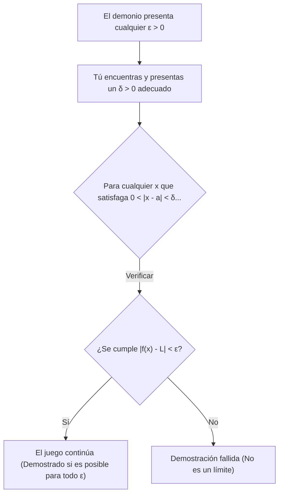
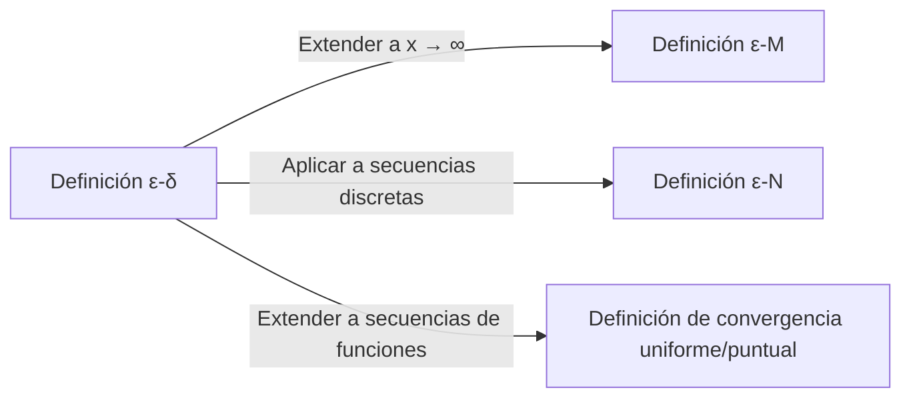

## 1. Introducción: La "Ambigüedad" de los Límites en la Escuela Secundaria

Al aprender cálculo en la escuela secundaria, la mayoría de nosotros encontramos la siguiente definición de un límite:

> "Para una función $f(x)$, si $f(x)$ **se aproxima** a un cierto valor $L$ a medida que $x$ **se aproxima** a $a$, escribimos $\lim_{x \to a} f(x) = L$."

Esta expresión " **se aproxima** " se alinea perfectamente con nuestra intuición y funciona sin ningún problema al tratar con funciones continuas como polinomios o funciones trigonométricas. Si dibujas un gráfico, es visualmente obvio dónde termina el valor de $y$ a medida que $x$ avanza hacia un punto específico.

Sin embargo, una vez que ingresas a las matemáticas de nivel universitario, particularmente en el ámbito del Análisis Real, esta definición intuitiva causa rápidamente problemas graves. ¿Qué significa exactamente " **aproximarse** "? ¿Significa que la distancia se vuelve menor a $0.0001$? ¿O menor a $0.0000001$? ¿Existen reglas con respecto a la velocidad o la forma de aproximarse?

En matemáticas, una disciplina que valora el rigor estricto por encima de todo, las definiciones que dependen de los matices lingüísticos son una debilidad fatal. Para eliminar por completo esta ambigüedad y proporcionar una base de acero para el concepto de límites, los matemáticos del siglo XIX formularon la **definición $\varepsilon-\delta$ (épsilon-delta)**.

En este artículo, exploraremos por qué la definición intuitiva es insuficiente a partir de su contexto histórico, decodificaremos profundamente el significado exacto de la definición $\varepsilon-\delta$, demostraremos cómo usarla en pruebas e incluso probaremos casos en los que los límites no existen.

## 2. Historia del Cálculo y la Crisis del Rigor

Cuando [Isaac Newton](https://kenji.blog/p/newton/) y [Gottfried Leibniz](https://kenji.blog/p/leibniz/) fundaron el cálculo en el siglo XVII, dependían en gran medida del concepto de "infinitesimales" (cantidades que son infinitamente pequeñas pero no cero). Si bien sus cálculos produjeron resultados notables en física y geometría, la base matemática era extremadamente frágil.

El filósofo George Berkeley criticó severamente este concepto de infinitesimales en ese momento, llamándolos los " **fantasmas de cantidades que se han desvanecido** ". Señaló la inconsistencia lógica de tratarlos como cantidades distintas de cero durante la división en medio de un cálculo, solo para descartarlos convenientemente como cero al final.

El cálculo continuó desarrollándose a lo largo del siglo XVIII, pero al entrar en el siglo XIX, se descubrieron una tras otra "funciones patológicas" que no podían manejarse solo por intuición, lo que aumentó la sensación de crisis de los matemáticos. Para superar esto, [Augustin-Louis Cauchy](https://kenji.blog/p/cauchy/) y [Karl Weierstrass](https://kenji.blog/p/weierstrass/) desterraron el dudoso concepto de infinitesimales y reconstruyeron el cálculo utilizando únicamente las propiedades de los números reales y las desigualdades. Esto marcó el nacimiento de la definición $\varepsilon-\delta$.

## 3. La Definición Formal ε-δ

Ahora, veamos la definición rigurosa del límite de una función usando la lógica $\varepsilon-\delta$.

> **Definición: Límite de una Función**
> Una función $f(x)$ converge a $L$ a medida que $x \to a$ (escrito como $\lim_{x \to a} f(x) = L$) si y solo si la siguiente declaración lógica es verdadera:
> $\forall \varepsilon > 0, \exists \delta > 0 \text{ s.t. } 0 < |x - a| < \delta \implies |f(x) - L| < \varepsilon$

Si no estás acostumbrado a los símbolos matemáticos, esto podría parecer un código secreto. Vamos a desglosarlo cuidadosamente y traducirlo pieza por pieza.

*   $\forall \varepsilon > 0$ : "Para cualquier número real positivo $\varepsilon$ (tolerancia de error) dado"
*   $\exists \delta > 0$ : "existe un número real positivo $\delta$ (distancia de aproximación)"
*   $\text{s.t.}$ : "tal que (such that)"
*   $0 < |x - a| < \delta$ : "si la distancia entre $x$ y $a$ es estrictamente mayor que $0$ y menor que $\delta$ (es decir, $x$ está en la vecindad-$\delta$ de $a$, y $x \neq a$)"
*   $\implies$ : "entonces"
*   $|f(x) - L| < \varepsilon$ : "la distancia entre $f(x)$ y $L$ es estrictamente menor que $\varepsilon$"

### 3.1. Interpretación como un Juego contra un Demonio

Esta definición es muy fácil de entender si la piensas como un juego entre tú y un "demonio escéptico".

1.  **El Desafío del Demonio** : El demonio duda de que el límite sea $L$ e impone una tolerancia de error $\varepsilon$ muy estricta (por ejemplo, $\varepsilon = 0.001$). "¡A ver si mantienes a $f(x)$ a no más de $0.001$ de distancia de $L$!"
2.  **Tu Respuesta** : Calculas y presentas cuán cerca debe estar $x$ de $a$, que es el valor de $\delta$. "¡Muy bien, si restrinjo $x$ para que esté dentro de una distancia $\delta = 0.0005$ de $a$, $f(x)$ definitivamente permanecerá dentro del rango especificado!"
3.  **Condición de Victoria** : Si, sin importar cuán pequeño sea el $\varepsilon$ que presente el demonio, siempre puedes encontrar (existe) un $\delta$ correspondiente que funcione, entonces ganas y se demuestra que el límite es $L$.

## 4. Pruebas con Ejemplos Concretos

Las definiciones abstractas son difíciles de comprender por sí solas, así que realicemos algunas demostraciones usando la definición $\varepsilon-\delta$ con funciones concretas.

### 4.1. Demostración para una Función Lineal

Como el ejemplo más simple, demostraremos $\lim_{x \to 2} (3x - 1) = 5$.

**[Proceso de Pensamiento (Borrador)]**
El objetivo de la demostración es encontrar un $\delta > 0$ tal que $|(3x - 1) - 5| < \varepsilon$ para cualquier $\varepsilon > 0$ dado.
Simplificando la expresión, obtenemos:
$|(3x - 1) - 5| = |3x - 6| = 3|x - 2|$
Lo que podemos controlar es la condición $|x - 2| < \delta$.
Por lo tanto, $3|x - 2| < 3\delta$.
Como queremos que esto sea igual a $\varepsilon$, debemos establecer $3\delta = \varepsilon$, lo que significa que $\delta = \frac{\varepsilon}{3}$.

**[Demostración Formal]**
Sea $\varepsilon > 0$ arbitrario.
Elijamos $\delta = \frac{\varepsilon}{3}$. Dado que $\varepsilon > 0$, se sigue naturalmente que $\delta > 0$.
Entonces, para cualquier $x$ que satisfaga $0 < |x - 2| < \delta$, se cumple la siguiente desigualdad:
$$|(3x - 1) - 5| = |3x - 6| = 3|x - 2| < 3\delta = 3\left(\frac{\varepsilon}{3}\right) = \varepsilon$$
Así, hemos demostrado que $0 < |x - 2| < \delta \implies |(3x - 1) - 5| < \varepsilon$.
Por lo tanto, por definición, $\lim_{x \to 2} (3x - 1) = 5$. $\blacksquare$

### 4.2. Demostración para una Función Cuadrática (La Técnica de Restricción de δ)

A continuación, demostremos un límite un poco más complejo: $\lim_{x \to 3} x^2 = 9$. Debido a que queda un término que contiene $x$, se requiere un pequeño truco.

**[Proceso de Pensamiento (Borrador)]**
El objetivo es encontrar un $\delta$ tal que $|x^2 - 9| < \varepsilon$.
$|x^2 - 9| = |x - 3||x + 3|$
Aquí, podemos crear $|x - 3| < \delta$, pero $|x + 3|$ estorba. $\delta$ no puede depender de $x$ (debe presentarse como una constante).
Por lo tanto, primero asumimos que $x$ está lo suficientemente cerca de $3$ y estimamos el valor máximo de $|x + 3|$.
Por ejemplo, vamos a **restringir** $\delta \le 1$.
Entonces, $|x - 3| < 1$, lo que significa $-1 < x - 3 < 1$, o $2 < x < 4$.
En este caso, el rango de $x + 3$ es $5 < x + 3 < 7$, lo que garantiza que $|x + 3| < 7$.
Por lo tanto, podemos establecer la desigualdad $|x - 3||x + 3| < 7|x - 3|$.
Para hacer esto estrictamente menor que $\varepsilon$, necesitamos $7|x - 3| < \varepsilon$, lo que significa $|x - 3| < \frac{\varepsilon}{7}$.
Como también debemos obedecer nuestra restricción inicial $\delta \le 1$, podemos elegir que $\delta$ sea el **menor** entre $1$ y $\frac{\varepsilon}{7}$.

**[Demostración Formal]**
Sea $\varepsilon > 0$ arbitrario.
Elijamos $\delta = \min\left(1, \frac{\varepsilon}{7}\right)$.
Entonces, consideremos cualquier $x$ que satisfaga $0 < |x - 3| < \delta$.
Primero, dado que $\delta \le 1$, tenemos $|x - 3| < 1$, lo que implica $2 < x < 4$, y por lo tanto $|x + 3| < 7$.
A continuación, dado que $\delta \le \frac{\varepsilon}{7}$, también tenemos $|x - 3| < \frac{\varepsilon}{7}$.
Usando estos hechos, obtenemos:
$$|x^2 - 9| = |x - 3||x + 3| < |x - 3| \cdot 7 < \frac{\varepsilon}{7} \cdot 7 = \varepsilon$$
Así, hemos demostrado que $0 < |x - 3| < \delta \implies |x^2 - 9| < \varepsilon$.
Por lo tanto, $\lim_{x \to 3} x^2 = 9$. $\blacksquare$

## 5. Por qué "Aproximarse" No es Suficiente: Entran las Funciones Patológicas

Habiendo leído hasta aquí, podrías estar pensando: "¿No se volvieron los cálculos simplemente más tediosos?". Sin embargo, el verdadero poder de la definición $\varepsilon-\delta$ se revela al tratar con "funciones patológicas" donde es imposible dibujar un gráfico.

Como ejemplo famoso, consideremos la **función de Dirichlet**.

$$ f(x) = \begin{cases} 1 & (\text{cuando } x \text{ es racional}) \\ 0 & (\text{cuando } x \text{ es irracional}) \end{cases} $$

Esta función toma el valor $1$ en cada número racional y $0$ en cada número irracional. Debido a que los números racionales e irracionales están infinitamente densamente mezclados en la recta numérica real, dibujar este gráfico es visualmente imposible para los ojos humanos.

Ahora, consideremos el límite $\lim_{x \to 0} f(x)$ cuando $x \to 0$. Usando la expresión intuitiva "a medida que $x$ se aproxima infinitamente a $0$", es imposible determinar si $f(x)$ se aproxima a $1$ o a $0$. Si trazas un camino aproximándote solo a través de números racionales, es $1$; si trazas solo números irracionales, es $0$.

Al usar la definición $\varepsilon-\delta$, podemos demostrar rigurosamente que este límite **no existe**. La negación de la proposición de que el límite es $L$ es la siguiente:

> **Negación de la Definición (El límite no es L)**
> $\exists \varepsilon > 0 \text{ s.t. } \forall \delta > 0, \exists x \text{ s.t. } (0 < |x - a| < \delta \land |f(x) - L| \ge \varepsilon)$

En otras palabras, "Cuando el demonio presenta un $\varepsilon$ específico, sin importar qué $\delta$ presentes, siempre existirá un $x$ malicioso dentro de ese rango $\delta$ que se desvíe del valor objetivo $L$ en $\varepsilon$ o más".

**[Demostración de que el límite de la función de Dirichlet no existe]**
Supongamos que el límite es algún valor $L$ para derivar una contradicción.
Establezcamos $\varepsilon = \frac{1}{2}$.
Sin importar qué $\delta > 0$ elijas, siempre existe un número racional $x_1$ y un número irracional $x_2$ dentro del intervalo $(-\delta, \delta)$.
Tenemos $f(x_1) = 1$ y $f(x_2) = 0$.
Si el límite fuera $L$, por definición, tanto $|1 - L| < \frac{1}{2}$ como $|0 - L| < \frac{1}{2}$ deben cumplirse.
Sin embargo, por la desigualdad del triángulo,
$1 = |1 - 0| = |(1 - L) + (L - 0)| \le |1 - L| + |L - 0| < \frac{1}{2} + \frac{1}{2} = 1$
Esto da como resultado la contradicción $1 < 1$.
Por lo tanto, el límite $L$ no existe. $\blacksquare$

De esta manera, la mayor ventaja de la lógica $\varepsilon-\delta$ es su capacidad para proporcionar respuestas definitivas en blanco y negro a problemas que no pueden manejarse por intuición.

## 6. Extensiones Adicionales: Límites al Infinito

El concepto de límites se aplica no solo al aproximarse a valores finitos, sino también a límites hacia el infinito, como $x \to \infty$. En estos casos, se utilizan variaciones de la definición $\varepsilon-\delta$, a saber, la **definición $\varepsilon-M$** o la **definición $\varepsilon-N$** para secuencias.

Por ejemplo, la definición rigurosa de $\lim_{x \to \infty} f(x) = L$ es la siguiente:

> $\forall \varepsilon > 0, \exists M > 0 \text{ s.t. } x > M \implies |f(x) - L| < \varepsilon$

Esto significa "Para cualquier error $\varepsilon$ arbitrariamente pequeño, si estableces un valor límite $M$ suficientemente grande, entonces más allá de $M$, $f(x)$ siempre permanecerá dentro del margen de error $\varepsilon$ de $L$". Puedes ver que el marco lógico es exactamente el mismo que la definición $\varepsilon-\delta$.

## 7. Conclusión

La explicación intuitiva de que "$x$ se aproxima infinitamente a $a$" es muy efectiva para que los principiantes capten el concepto de un límite. Sin embargo, fue insuficiente para proporcionar la "certeza absoluta" que las matemáticas requieren como base para su estructura.

A primera vista, la definición $\varepsilon-\delta$ parece una abrumadora cadena de desigualdades, pero su esencia radica en la **comprobación estática de una condición: "¿Se puede controlar el error para que sea arbitrariamente pequeño?"**. Reemplazar el concepto ambiguo que involucra un elemento temporal de "aproximación dinámica" con un estado lógico y estático de "existe un rango que satisface una desigualdad" fue un cambio de paradigma magnífico por parte de los matemáticos del siglo XIX.

Gracias a esta base rigurosa, el cálculo moderno, la física y la ingeniería que lo aplican, e incluso las teorías de optimización fundamentales para la inteligencia artificial funcionan con una certeza inquebrantable. Cada vez que te atasques aprendiendo límites, recuerda el juego $\varepsilon-\delta$ con el demonio y trata de disfrutarlo como un rompecabezas lógico.
