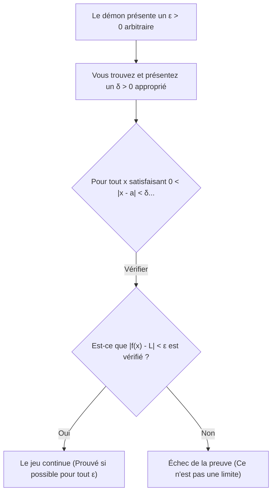
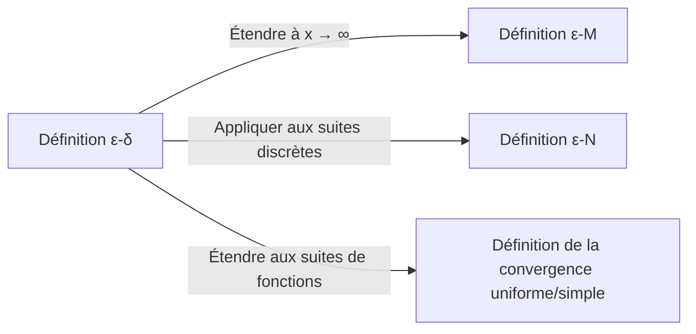

## 1. Introduction : L'"Ambiguïté" des Limites au Lycée

Lors de l'apprentissage de l'analyse au lycée, la plupart d'entre nous rencontrent la définition suivante d'une limite :

> "Pour une fonction $f(x)$, si $f(x)$ **s'approche** d'une certaine valeur $L$ lorsque $x$ **s'approche** de $a$, nous écrivons $\lim_{x \to a} f(x) = L$."

Cette expression " **s'approche** " correspond parfaitement à notre intuition et fonctionne sans aucun problème lorsqu'il s'agit de fonctions continues comme les polynômes ou les fonctions trigonométriques. Si vous tracez un graphique, il est visuellement évident de voir où aboutit la valeur de $y$ lorsque $x$ se déplace vers un point spécifique.

Cependant, une fois que vous entrez dans les mathématiques de niveau universitaire, en particulier dans le domaine de l'Analyse Réelle, cette définition intuitive pose rapidement de graves problèmes. Que signifie exactement " **s'approcher** " ? Cela signifie-t-il que la distance devient inférieure à $0.0001$ ? Ou inférieure à $0.0000001$ ? Y a-t-il des règles concernant la vitesse ou la manière de s'approcher ?

En mathématiques, une discipline qui valorise la rigueur stricte par-dessus tout, les définitions reposant sur des nuances linguistiques constituent une faiblesse fatale. Pour éliminer complètement cette ambiguïté et fournir une base solide au concept de limites, les mathématiciens du 19ème siècle ont formulé la **définition $\varepsilon-\delta$ (epsilon-delta)**.

Dans cet article, nous explorerons pourquoi la définition intuitive est insuffisante à partir de son contexte historique, nous décoderons en profondeur la signification exacte de la définition $\varepsilon-\delta$, nous démontrerons comment l'utiliser dans des preuves, et nous prouverons même des cas où les limites n'existent pas.

## 2. Histoire du Calcul et la Crise de la Rigueur

Lorsque Isaac Newton et Gottfried Leibniz ont fondé le calcul au 17ème siècle, ils se sont fortement appuyés sur le concept d'"infinitésimaux" (des quantités infiniment petites mais non nulles). Bien que leurs calculs aient donné des résultats remarquables en physique et en géométrie, la base mathématique était extrêmement fragile.

Le philosophe George Berkeley de l'époque a sévèrement critiqué ce concept d'infinitésimaux, les qualifiant de " **fantômes de quantités disparues** ". Il a souligné l'incohérence logique de les traiter comme des quantités non nulles lors d'une division au milieu d'un calcul, pour ensuite les rejeter de manière opportuniste comme étant nuls à la fin.

Le calcul a continué à se développer tout au long du 18ème siècle, mais à l'aube du 19ème siècle, des "fonctions pathologiques" qui ne pouvaient être traitées par la seule intuition ont été découvertes les unes après les autres, exacerbant le sentiment de crise chez les mathématiciens. Pour surmonter cela, Augustin-Louis Cauchy et Karl Weierstrass ont banni le concept douteux d'infinitésimaux et ont reconstruit le calcul en utilisant uniquement les propriétés des nombres réels et les inégalités. Cela a marqué la naissance de la définition $\varepsilon-\delta$.

## 3. La Définition Formelle ε-δ

Maintenant, examinons la définition rigoureuse de la limite d'une fonction en utilisant la logique $\varepsilon-\delta$.

> **Définition : Limite d'une Fonction**
> Une fonction $f(x)$ converge vers $L$ lorsque $x \to a$ (écrit $\lim_{x \to a} f(x) = L$) si et seulement si l'énoncé logique suivant est vrai :
> $\forall \varepsilon > 0, \exists \delta > 0 \text{ s.t. } 0 < |x - a| < \delta \implies |f(x) - L| < \varepsilon$

Si vous n'êtes pas habitué aux symboles mathématiques, cela peut ressembler à un code secret. Décomposons-le soigneusement et traduisons-le morceau par morceau.

*   $\forall \varepsilon > 0$ : "Pour tout nombre réel positif $\varepsilon$ (tolérance d'erreur) donné"
*   $\exists \delta > 0$ : "il existe un nombre réel positif $\delta$ (distance d'approche)"
*   $\text{s.t.}$ : "tel que (such that)"
*   $0 < |x - a| < \delta$ : "si la distance entre $x$ et $a$ est strictement supérieure à $0$ et inférieure à $\delta$ (c'est-à-dire que $x$ est dans le voisinage-$\delta$ de $a$, et $x \neq a$)"
*   $\implies$ : "alors"
*   $|f(x) - L| < \varepsilon$ : "la distance entre $f(x)$ et $L$ est strictement inférieure à $\varepsilon$"

### 3.1. Interprétation comme un Jeu contre un Démon

Cette définition est très facile à comprendre si vous la considérez comme un jeu entre vous et un "démon sceptique".

1.  **Le Défi du Démon** : Le démon doute que la limite soit $L$ et impose une tolérance d'erreur $\varepsilon$ très stricte (par exemple, $\varepsilon = 0.001$). "Voyons si tu peux maintenir $f(x)$ à moins de $0.001$ de $L$ !"
2.  **Votre Réponse** : Vous calculez et présentez à quelle distance $x$ doit être de $a$, ce qui est la valeur de $\delta$. "Très bien, si je restreins $x$ à être à une distance $\delta = 0.0005$ de $a$, $f(x)$ restera certainement dans la plage spécifiée !"
3.  **Condition de Victoire** : Si, peu importe la petitesse du $\varepsilon$ que le démon présente, vous pouvez toujours trouver (il existe) un $\delta$ correspondant qui fonctionne, alors vous gagnez, et il est prouvé que la limite est $L$.

## 4. Preuves avec des Exemples Concrets

Les définitions abstraites sont difficiles à saisir par elles-mêmes, alors effectuons quelques démonstrations en utilisant la définition $\varepsilon-\delta$ avec des fonctions concrètes.

### 4.1. Preuve pour une Fonction Linéaire

Comme exemple le plus simple, nous allons prouver $\lim_{x \to 2} (3x - 1) = 5$.

**[Processus de Pensée (Brouillon)]**
Le but de la preuve est de trouver un $\delta > 0$ tel que $|(3x - 1) - 5| < \varepsilon$ pour tout $\varepsilon > 0$ donné.
En simplifiant l'expression, nous obtenons :
$|(3x - 1) - 5| = |3x - 6| = 3|x - 2|$
Ce que nous pouvons contrôler est la condition $|x - 2| < \delta$.
Par conséquent, $3|x - 2| < 3\delta$.
Puisque nous voulons que cela soit égal à $\varepsilon$, nous devons définir $3\delta = \varepsilon$, ce qui signifie $\delta = \frac{\varepsilon}{3}$.

**[Preuve Formelle]**
Soit $\varepsilon > 0$ arbitraire.
Choisissons $\delta = \frac{\varepsilon}{3}$. Puisque $\varepsilon > 0$, il s'ensuit naturellement que $\delta > 0$.
Alors, pour tout $x$ satisfaisant $0 < |x - 2| < \delta$, l'inégalité suivante est vérifiée :
$$|(3x - 1) - 5| = |3x - 6| = 3|x - 2| < 3\delta = 3\left(\frac{\varepsilon}{3}\right) = \varepsilon$$
Ainsi, nous avons montré que $0 < |x - 2| < \delta \implies |(3x - 1) - 5| < \varepsilon$.
Par conséquent, par définition, $\lim_{x \to 2} (3x - 1) = 5$. $\blacksquare$

### 4.2. Preuve pour une Fonction Quadratique (La Technique de Restriction de δ)

Ensuite, prouvons une limite un peu plus complexe : $\lim_{x \to 3} x^2 = 9$. Parce qu'un terme contenant $x$ reste, une petite astuce est nécessaire.

**[Processus de Pensée (Brouillon)]**
L'objectif est de trouver un $\delta$ tel que $|x^2 - 9| < \varepsilon$.
$|x^2 - 9| = |x - 3||x + 3|$
Ici, nous pouvons créer $|x - 3| < \delta$, mais $|x + 3|$ nous gêne. $\delta$ ne peut pas dépendre de $x$ (il doit être présenté comme une constante).
Par conséquent, nous supposons d'abord que $x$ est suffisamment proche de $3$ et estimons la valeur maximale de $|x + 3|$.
Par exemple, **restreignons** $\delta \le 1$.
Alors, $|x - 3| < 1$, ce qui signifie $-1 < x - 3 < 1$, ou $2 < x < 4$.
Dans ce cas, la plage de $x + 3$ est $5 < x + 3 < 7$, ce qui garantit que $|x + 3| < 7$.
Par conséquent, nous pouvons établir l'inégalité $|x - 3||x + 3| < 7|x - 3|$.
Pour rendre cela strictement inférieur à $\varepsilon$, nous avons besoin de $7|x - 3| < \varepsilon$, c'est-à-dire $|x - 3| < \frac{\varepsilon}{7}$.
Puisque nous devons également obéir à notre restriction initiale $\delta \le 1$, nous pouvons choisir $\delta$ comme étant le **plus petit** de $1$ et $\frac{\varepsilon}{7}$.

**[Preuve Formelle]**
Soit $\varepsilon > 0$ arbitraire.
Choisissons $\delta = \min\left(1, \frac{\varepsilon}{7}\right)$.
Alors, considérons tout $x$ satisfaisant $0 < |x - 3| < \delta$.
Premièrement, puisque $\delta \le 1$, nous avons $|x - 3| < 1$, ce qui implique $2 < x < 4$, et donc $|x + 3| < 7$.
Ensuite, puisque $\delta \le \frac{\varepsilon}{7}$, nous avons également $|x - 3| < \frac{\varepsilon}{7}$.
En utilisant ces faits, nous obtenons :
$$|x^2 - 9| = |x - 3||x + 3| < |x - 3| \cdot 7 < \frac{\varepsilon}{7} \cdot 7 = \varepsilon$$
Ainsi, nous avons montré que $0 < |x - 3| < \delta \implies |x^2 - 9| < \varepsilon$.
Par conséquent, $\lim_{x \to 3} x^2 = 9$. $\blacksquare$

## 5. Pourquoi "S'approcher" Ne Suffit Pas : Entrent les Fonctions Pathologiques

Ayant lu jusqu'ici, vous pourriez vous dire : "Les calculs ne sont-ils pas simplement devenus plus fastidieux ?". Cependant, la véritable puissance de la définition $\varepsilon-\delta$ se révèle lorsqu'on a affaire à des "fonctions pathologiques" où il est impossible de tracer un graphique.

Comme exemple célèbre, considérons la **fonction de Dirichlet**.

$$ f(x) = \begin{cases} 1 & (\text{lorsque } x \text{ est rationnel}) \\ 0 & (\text{lorsque } x \text{ est irrationnel}) \end{cases} $$

Cette fonction prend la valeur $1$ à chaque nombre rationnel et $0$ à chaque nombre irrationnel. Parce que les nombres rationnels et irrationnels sont infiniment densément mélangés sur la droite des nombres réels, dessiner ce graphique est visuellement impossible pour les yeux humains.

Maintenant, considérons la limite $\lim_{x \to 0} f(x)$ lorsque $x \to 0$. En utilisant l'expression intuitive "lorsque $x$ s'approche infiniment près de $0$", il est impossible de déterminer si $f(x)$ s'approche de $1$ ou de $0$. Si vous tracez un chemin en vous approchant uniquement à travers des nombres rationnels, c'est $1$ ; si vous ne tracez que des nombres irrationnels, c'est $0$.

En utilisant la définition $\varepsilon-\delta$, nous pouvons prouver rigoureusement que cette limite **n'existe pas**. La négation de la proposition selon laquelle la limite est $L$ est la suivante :

> **Négation de la Définition (La limite n'est pas L)**
> $\exists \varepsilon > 0 \text{ s.t. } \forall \delta > 0, \exists x \text{ s.t. } (0 < |x - a| < \delta \land |f(x) - L| \ge \varepsilon)$

En d'autres termes, "Lorsque le démon présente un $\varepsilon$ spécifique, peu importe le $\delta$ que vous présentez, il existera toujours un $x$ malicieux dans cette plage $\delta$ qui s'écartera de la valeur cible $L$ de $\varepsilon$ ou plus".

**[Preuve que la limite de la fonction de Dirichlet n'existe pas]**
Supposons que la limite soit une certaine valeur $L$ pour dériver une contradiction.
Fixons $\varepsilon = \frac{1}{2}$.
Peu importe le $\delta > 0$ que vous choisissez, il existe toujours un nombre rationnel $x_1$ et un nombre irrationnel $x_2$ dans l'intervalle $(-\delta, \delta)$.
Nous avons $f(x_1) = 1$ et $f(x_2) = 0$.
Si la limite était $L$, par définition, à la fois $|1 - L| < \frac{1}{2}$ et $|0 - L| < \frac{1}{2}$ doivent être vérifiés.
Cependant, par l'inégalité triangulaire,
$1 = |1 - 0| = |(1 - L) + (L - 0)| \le |1 - L| + |L - 0| < \frac{1}{2} + \frac{1}{2} = 1$
Cela entraîne la contradiction $1 < 1$.
Par conséquent, la limite $L$ n'existe pas. $\blacksquare$

De cette manière, le plus grand avantage de la logique $\varepsilon-\delta$ est sa capacité à fournir des réponses claires et nettes à des problèmes qui ne peuvent être traités par l'intuition.

## 6. Extensions Supplémentaires : Limites à l'Infini

Le concept de limites s'applique non seulement à l'approche de valeurs finies, mais aussi aux limites vers l'infini, telles que $x \to \infty$. Dans ces cas, des variations de la définition $\varepsilon-\delta$, à savoir la **définition $\varepsilon-M$** ou la **définition $\varepsilon-N$** pour les suites, sont utilisées.

Par exemple, la définition rigoureuse de $\lim_{x \to \infty} f(x) = L$ est la suivante :

> $\forall \varepsilon > 0, \exists M > 0 \text{ s.t. } x > M \implies |f(x) - L| < \varepsilon$

Cela signifie "Pour toute erreur $\varepsilon$ arbitrairement petite, si vous définissez une valeur limite $M$ suffisamment grande, alors au-delà de $M$, $f(x)$ restera toujours dans la marge d'erreur $\varepsilon$ de $L$". Vous pouvez voir que le cadre logique est exactement le même que la définition $\varepsilon-\delta$.

## 7. Conclusion

L'explication intuitive selon laquelle "$x$ s'approche infiniment près de $a$" est très efficace pour que les débutants saisissent le concept d'une limite. Cependant, elle était insuffisante pour fournir la "certitude absolue" dont les mathématiques ont besoin comme fondation de leur structure.

À première vue, la définition $\varepsilon-\delta$ ressemble à une chaîne d'inégalités intimidante, mais son essence réside dans la **vérification statique d'une condition : "L'erreur peut-elle être contrôlée pour être arbitrairement petite ?"**. Remplacer le concept ambigu impliquant un élément temporel d'"approche dynamique" par un état logique et statique de "il existe une plage satisfaisant une inégalité" fut un magnifique changement de paradigme de la part des mathématiciens du 19ème siècle.

Grâce à cette base rigoureuse, le calcul moderne, la physique et l'ingénierie qui l'appliquent, et même les théories de l'optimisation fondamentales pour l'intelligence artificielle fonctionnent avec une certitude inébranlable. Chaque fois que vous bloquez en apprenant les limites, souvenez-vous du jeu $\varepsilon-\delta$ avec le démon et essayez de l'apprécier comme un casse-tête logique.
