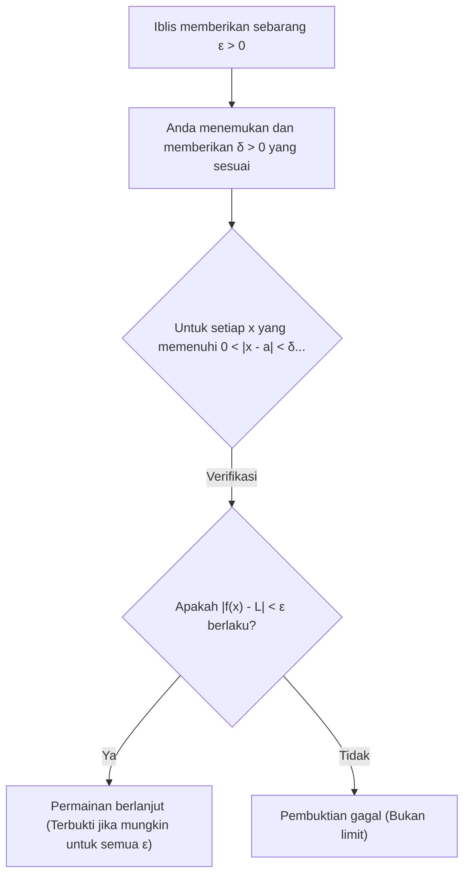
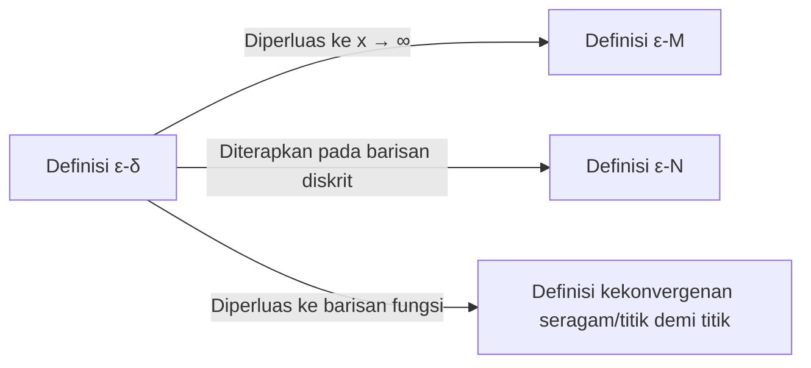

## 1. Pengantar: "Ambiguitas" Limit di Sekolah Menengah

Saat belajar kalkulus di sekolah menengah, sebagian besar dari kita menemui definisi limit sebagai berikut:

> "Untuk suatu fungsi $f(x)$, jika $f(x)$ **mendekati** nilai tertentu $L$ ketika $x$ **mendekati** $a$, kita menulisnya sebagai $\lim_{x \to a} f(x) = L$."

Ungkapan " **mendekati** " ini sangat sesuai dengan intuisi kita dan berfungsi tanpa masalah saat berhadapan dengan fungsi kontinu seperti polinomial atau fungsi trigonometri. Jika Anda menggambar grafik, secara visual sangat jelas di mana nilai $y$ berakhir saat $x$ bergerak menuju titik tertentu.

Namun, begitu Anda memasuki matematika tingkat universitas, khususnya di bidang Analisis Real, definisi intuitif ini dengan cepat menimbulkan masalah serius. Apa sebenarnya arti " **mendekati** "? Apakah itu berarti jaraknya menjadi kurang dari $0.0001$? Atau kurang dari $0.0000001$? Apakah ada aturan mengenai kecepatan atau cara mendekatinya?

Dalam matematika, disiplin ilmu yang sangat menjunjung tinggi ketelitian yang ketat, definisi yang bergantung pada nuansa bahasa adalah kelemahan yang fatal. Untuk sepenuhnya menghilangkan ambiguitas ini dan memberikan fondasi sekuat baja untuk konsep limit, matematikawan abad ke-19 merumuskan **definisi $\varepsilon-\delta$ (epsilon-delta)**.

Dalam artikel ini, kita akan mengeksplorasi mengapa definisi intuitif tidak memadai dimulai dari latar belakang sejarahnya, membedah secara mendalam makna sebenarnya dari definisi $\varepsilon-\delta$, menunjukkan cara menggunakannya dalam pembuktian, dan bahkan membuktikan kasus-kasus di mana limit tidak ada.

## 2. Sejarah Kalkulus dan Krisis Ketelitian

Ketika [Isaac Newton](https://kenji.blog/p/newton/) dan [Gottfried Leibniz](https://kenji.blog/p/leibniz/) mendirikan kalkulus pada abad ke-17, mereka sangat bergantung pada konsep "infinitesimal" (kuantitas yang sangat kecil tetapi tidak nol). Meskipun perhitungan mereka membuahkan hasil luar biasa dalam fisika dan geometri, fondasi matematikanya sangat rapuh.

Filsuf George Berkeley pada saat itu mengkritik keras konsep infinitesimal ini, menyebutnya sebagai " **hantu dari kuantitas yang telah menghilang** ". Ia menunjukkan inkonsistensi logis dalam memperlakukannya sebagai kuantitas bukan nol selama pembagian di tengah perhitungan, hanya untuk dengan mudah mengabaikannya sebagai nol pada akhirnya.

Kalkulus terus berkembang sepanjang abad ke-18, tetapi memasuki abad ke-19, "fungsi patologis" yang tidak dapat ditangani hanya dengan intuisi ditemukan satu demi satu, meningkatkan rasa krisis di kalangan matematikawan. Untuk mengatasinya, [Augustin-Louis Cauchy](https://kenji.blog/p/cauchy/) dan [Karl Weierstrass](https://kenji.blog/p/weierstrass/) membuang konsep infinitesimal yang meragukan tersebut dan merekonstruksi kalkulus hanya dengan menggunakan sifat-sifat bilangan real dan pertidaksamaan. Ini menandai lahirnya definisi $\varepsilon-\delta$.

## 3. Definisi Formal ε-δ

Sekarang, mari kita lihat definisi ketat limit fungsi menggunakan logika $\varepsilon-\delta$.

> **Definisi: Limit Fungsi**
> Suatu fungsi $f(x)$ konvergen ke $L$ saat $x \to a$ (ditulis sebagai $\lim_{x \to a} f(x) = L$) jika dan hanya jika pernyataan logis berikut bernilai benar:
> $\forall \varepsilon > 0, \exists \delta > 0 \text{ s.t. } 0 < |x - a| < \delta \implies |f(x) - L| < \varepsilon$

Jika Anda tidak terbiasa dengan simbol matematika, ini mungkin terlihat seperti kode rahasia. Mari kita urai dengan hati-hati dan terjemahkan bagian demi bagian.

*   $\forall \varepsilon > 0$ : "Untuk setiap bilangan real positif $\varepsilon$ (toleransi kesalahan) yang diberikan"
*   $\exists \delta > 0$ : "terdapat suatu bilangan real positif $\delta$ (jarak pendekatan)"
*   $\text{s.t.}$ : "sedemikian rupa sehingga (such that)"
*   $0 < |x - a| < \delta$ : "jika jarak antara $x$ dan $a$ secara tegas lebih besar dari $0$ dan kurang dari $\delta$ (artinya $x$ berada dalam persekitaran-$\delta$ dari $a$, dan $x \neq a$)"
*   $\implies$ : "maka"
*   $|f(x) - L| < \varepsilon$ : "jarak antara $f(x)$ dan $L$ secara tegas kurang dari $\varepsilon$"

### 3.1. Interpretasi sebagai Permainan Melawan Iblis

Definisi ini sangat mudah dipahami jika Anda menganggapnya sebagai permainan antara Anda dan "iblis yang skeptis".

1.  **Tantangan Iblis** : Iblis meragukan bahwa limitnya adalah $L$ dan memaksakan toleransi kesalahan $\varepsilon$ yang sangat ketat (misalnya, $\varepsilon = 0.001$). "Coba kita lihat apakah kamu bisa menjaga $f(x)$ tetap dalam jarak tidak lebih dari $0.001$ dari $L$!"
2.  **Respons Anda** : Anda menghitung dan menunjukkan seberapa dekat $x$ harus berada dari $a$, yaitu nilai $\delta$. "Baiklah, jika saya membatasi $x$ agar berada dalam jarak $\delta = 0.0005$ dari $a$, $f(x)$ pasti akan tetap berada dalam rentang yang ditentukan!"
3.  **Kondisi Kemenangan** : Jika, tidak peduli seberapa kecil $\varepsilon$ yang diberikan iblis, Anda selalu dapat menemukan (ada) $\delta$ yang sesuai yang berfungsi, maka Anda menang, dan terbukti bahwa limitnya adalah $L$.

## 4. Pembuktian dengan Contoh Konkret

Definisi abstrak sulit untuk dipahami dengan sendirinya, jadi mari kita lakukan beberapa pembuktian menggunakan definisi $\varepsilon-\delta$ dengan fungsi konkret.

### 4.1. Pembuktian untuk Fungsi Linear

Sebagai contoh paling sederhana, kita akan membuktikan $\lim_{x \to 2} (3x - 1) = 5$.

**[Proses Berpikir (Coretan)]**
Tujuan pembuktian adalah menemukan $\delta > 0$ sedemikian rupa sehingga $|(3x - 1) - 5| < \varepsilon$ untuk setiap $\varepsilon > 0$ yang diberikan.
Menyederhanakan ekspresi tersebut, kita peroleh:
$|(3x - 1) - 5| = |3x - 6| = 3|x - 2|$
Yang bisa kita kendalikan adalah kondisi $|x - 2| < \delta$.
Oleh karena itu, $3|x - 2| < 3\delta$.
Karena kita ingin ini sama dengan $\varepsilon$, kita harus menetapkan $3\delta = \varepsilon$, yang berarti $\delta = \frac{\varepsilon}{3}$.

**[Pembuktian Formal]**
Misalkan $\varepsilon > 0$ sebarang.
Pilih $\delta = \frac{\varepsilon}{3}$. Karena $\varepsilon > 0$, secara alami berlaku bahwa $\delta > 0$.
Kemudian, untuk setiap $x$ yang memenuhi $0 < |x - 2| < \delta$, pertidaksamaan berikut berlaku:
$$|(3x - 1) - 5| = |3x - 6| = 3|x - 2| < 3\delta = 3\left(\frac{\varepsilon}{3}\right) = \varepsilon$$
Dengan demikian, kita telah menunjukkan bahwa $0 < |x - 2| < \delta \implies |(3x - 1) - 5| < \varepsilon$.
Oleh karena itu, menurut definisi, $\lim_{x \to 2} (3x - 1) = 5$. $\blacksquare$

### 4.2. Pembuktian untuk Fungsi Kuadrat (Teknik Pembatasan δ)

Selanjutnya, mari buktikan limit yang sedikit lebih kompleks: $\lim_{x \to 3} x^2 = 9$. Karena tersisa suku yang mengandung $x$, diperlukan sedikit trik.

**[Proses Berpikir (Coretan)]**
Tujuannya adalah menemukan $\delta$ sedemikian rupa sehingga $|x^2 - 9| < \varepsilon$.
$|x^2 - 9| = |x - 3||x + 3|$
Di sini, kita dapat membuat $|x - 3| < \delta$, tetapi $|x + 3|$ menghalangi. $\delta$ tidak boleh bergantung pada $x$ (harus disajikan sebagai konstanta).
Oleh karena itu, pertama-tama kita asumsikan bahwa $x$ cukup dekat dengan $3$ dan memperkirakan nilai maksimum $|x + 3|$.
Misalnya, mari kita **batasi** $\delta \le 1$.
Maka, $|x - 3| < 1$, yang berarti $-1 < x - 3 < 1$, atau $2 < x < 4$.
Dalam kasus ini, rentang $x + 3$ adalah $5 < x + 3 < 7$, yang menjamin bahwa $|x + 3| < 7$.
Oleh karena itu, kita dapat menyusun pertidaksamaan $|x - 3||x + 3| < 7|x - 3|$.
Untuk membuat ini secara tegas kurang dari $\varepsilon$, kita membutuhkan $7|x - 3| < \varepsilon$, yang berarti $|x - 3| < \frac{\varepsilon}{7}$.
Karena kita juga harus mematuhi batasan awal kita $\delta \le 1$, kita dapat memilih $\delta$ sebagai nilai yang **lebih kecil** antara $1$ dan $\frac{\varepsilon}{7}$.

**[Pembuktian Formal]**
Misalkan $\varepsilon > 0$ sebarang.
Pilih $\delta = \min\left(1, \frac{\varepsilon}{7}\right)$.
Kemudian, tinjau sebarang $x$ yang memenuhi $0 < |x - 3| < \delta$.
Pertama, karena $\delta \le 1$, kita memiliki $|x - 3| < 1$, yang mengimplikasikan $2 < x < 4$, dan dengan demikian $|x + 3| < 7$.
Selanjutnya, karena $\delta \le \frac{\varepsilon}{7}$, kita juga memiliki $|x - 3| < \frac{\varepsilon}{7}$.
Menggunakan fakta-fakta ini, kita peroleh:
$$|x^2 - 9| = |x - 3||x + 3| < |x - 3| \cdot 7 < \frac{\varepsilon}{7} \cdot 7 = \varepsilon$$
Dengan demikian, kita telah menunjukkan bahwa $0 < |x - 3| < \delta \implies |x^2 - 9| < \varepsilon$.
Oleh karena itu, $\lim_{x \to 3} x^2 = 9$. $\blacksquare$

## 5. Mengapa "Mendekati" Saja Tidak Cukup: Memasuki Fungsi Patologis

Setelah membaca sejauh ini, Anda mungkin berpikir, "Bukankah perhitungannya hanya menjadi lebih membosankan?". Namun, kekuatan sejati dari definisi $\varepsilon-\delta$ terungkap ketika berhadapan dengan "fungsi patologis" di mana menggambar grafiknya tidak mungkin dilakukan.

Sebagai contoh terkenal, mari kita tinjau **fungsi Dirichlet**.

$$ f(x) = \begin{cases} 1 & (\text{ketika } x \text{ adalah bilangan rasional}) \\ 0 & (\text{ketika } x \text{ adalah bilangan irasional}) \end{cases} $$

Fungsi ini bernilai $1$ di setiap bilangan rasional dan $0$ di setiap bilangan irasional. Karena bilangan rasional dan irasional bercampur sangat padat hingga tak terhingga pada garis bilangan real, menggambar grafik ini secara visual mustahil bagi mata manusia.

Sekarang, mari kita tinjau limit $\lim_{x \to 0} f(x)$ ketika $x \to 0$. Menggunakan ungkapan intuitif "ketika $x$ mendekati $0$ sedekat mungkin", mustahil untuk menentukan apakah $f(x)$ mendekati $1$ atau $0$. Jika Anda menelusuri jalur yang mendekati hanya melalui bilangan rasional, nilainya adalah $1$; jika Anda hanya menelusuri bilangan irasional, nilainya adalah $0$.

Dengan menggunakan definisi $\varepsilon-\delta$, kita dapat membuktikan secara ketat bahwa limit ini **tidak ada**. Negasi dari proposisi bahwa limitnya adalah $L$ adalah sebagai berikut:

> **Negasi Definisi (Limitnya bukan L)**
> $\exists \varepsilon > 0 \text{ s.t. } \forall \delta > 0, \exists x \text{ s.t. } (0 < |x - a| < \delta \land |f(x) - L| \ge \varepsilon)$

Dengan kata lain, "Ketika iblis memberikan $\varepsilon$ tertentu, tidak peduli apa $\delta$ yang Anda berikan, akan selalu ada $x$ yang licik dalam rentang $\delta$ tersebut yang menyimpang dari nilai target $L$ sebesar $\varepsilon$ atau lebih."

**[Pembuktian bahwa limit fungsi Dirichlet tidak ada]**
Asumsikan limitnya adalah suatu nilai $L$ untuk menurunkan kontradiksi.
Tetapkan $\varepsilon = \frac{1}{2}$.
Tidak peduli $\delta > 0$ apa yang Anda pilih, selalu ada bilangan rasional $x_1$ dan bilangan irasional $x_2$ di dalam interval $(-\delta, \delta)$.
Kita memiliki $f(x_1) = 1$ dan $f(x_2) = 0$.
Jika limitnya adalah $L$, menurut definisi, $|1 - L| < \frac{1}{2}$ dan $|0 - L| < \frac{1}{2}$ keduanya harus berlaku.
Namun, menurut ketidaksamaan segitiga,
$1 = |1 - 0| = |(1 - L) + (L - 0)| \le |1 - L| + |L - 0| < \frac{1}{2} + \frac{1}{2} = 1$
Ini menghasilkan kontradiksi $1 < 1$.
Oleh karena itu, limit $L$ tidak ada. $\blacksquare$

Dengan cara ini, keuntungan terbesar dari logika $\varepsilon-\delta$ adalah kemampuannya untuk memberikan jawaban hitam-putih yang pasti terhadap masalah yang tidak dapat ditangani dengan intuisi.

## 6. Perluasan Lebih Lanjut: Limit ke Tak Terhingga

Konsep limit diterapkan tidak hanya saat mendekati nilai yang berhingga, tetapi juga pada limit menuju tak terhingga, seperti $x \to \infty$. Dalam kasus ini, variasi dari definisi $\varepsilon-\delta$, yaitu **definisi $\varepsilon-M$** atau **definisi $\varepsilon-N$** untuk barisan, digunakan.

Misalnya, definisi ketat dari $\lim_{x \to \infty} f(x) = L$ adalah sebagai berikut:

> $\forall \varepsilon > 0, \exists M > 0 \text{ s.t. } x > M \implies |f(x) - L| < \varepsilon$

Ini berarti "Untuk setiap kesalahan $\varepsilon$ sekecil apa pun, jika Anda menetapkan nilai batas $M$ yang cukup besar, maka setelah $M$, $f(x)$ akan selalu berada dalam batas kesalahan $\varepsilon$ dari $L$." Anda dapat melihat bahwa kerangka logisnya sama persis dengan definisi $\varepsilon-\delta$.

## 7. Kesimpulan

Penjelasan intuitif bahwa "$x$ mendekati $a$ sedekat mungkin" sangat efektif bagi pemula untuk memahami konsep limit. Namun, penjelasan tersebut tidak cukup untuk memberikan "kepastian mutlak" yang dibutuhkan matematika sebagai fondasi strukturnya.

Sekilas, definisi $\varepsilon-\delta$ terlihat seperti serangkaian pertidaksamaan yang menakutkan, tetapi esensinya terletak pada **pemeriksaan statis terhadap suatu kondisi: "Bisakah kesalahan dikendalikan menjadi sekecil apa pun?"**. Menggantikan konsep ambigu yang melibatkan elemen waktu "pendekatan dinamis" dengan keadaan logis dan statis bahwa "ada rentang yang memenuhi suatu pertidaksamaan" adalah pergeseran paradigma yang luar biasa oleh matematikawan abad ke-19.

Berkat fondasi yang kuat ini, kalkulus modern, fisika dan teknik yang menerapkannya, dan bahkan teori optimisasi yang mendasari kecerdasan buatan berfungsi dengan kepastian yang tak tergoyahkan. Kapan pun Anda mandek saat mempelajari limit, ingatlah permainan $\varepsilon-\delta$ dengan iblis dan cobalah untuk menikmatinya sebagai teka-teki logika.
