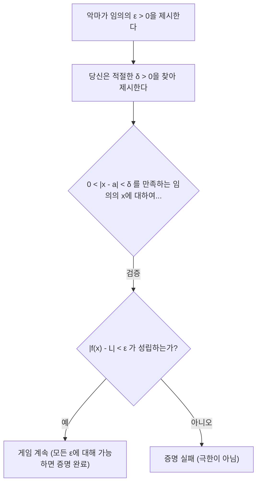
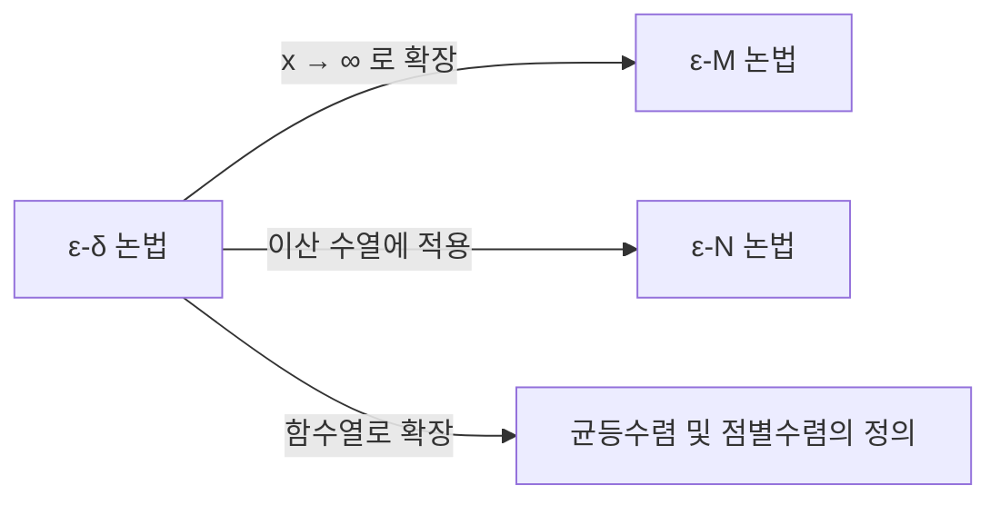

## 1. 서론: 고등학교 수학 극한이 안고 있는 '모호함'

고등학교 수학의 미적분에서 우리는 극한을 다음과 같이 배웁니다.

> "함수 $f(x)$ 에서 $x$ 가 $a$ 에 **한없이 가까워질** 때, $f(x)$ 가 어떤 일정한 값 $L$ 에 **한없이 가까워지면** , $\lim_{x \to a} f(x) = L$ 로 표기한다."

이 ' **한없이 가까워진다** '는 표현은 우리의 직관과 매우 잘 맞으며, 다항함수나 삼각함수 등 많은 연속 함수를 다루는 데 있어서 전혀 문제없이 작동합니다. 그래프를 그리면 $x$ 가 특정 점을 향해 나아갈 때 $y$ 의 값이 어디에 도달하는지 한눈에 알 수 있기 때문입니다.

하지만 대학 수준의 수학, 특히 실해석학(Real Analysis)의 영역에 발을 들여놓으면 이 직관적인 정의는 금세 심각한 문제를 일으킵니다. ' **한없이 가까워진다** '는 것은 구체적으로 어떤 상태를 가리키는 것일까요? 거리가 $0.0001$ 이하가 되는 것일까요? 아니면 $0.0000001$ 이하일까요? 속도나 다가가는 방식에 규칙이 있는 것일까요?

엄밀성을 최우선으로 하는 수학이라는 학문에서 말의 뉘앙스에 의존하는 정의는 치명적인 약점이 됩니다. 이러한 모호함을 완전히 배제하고 극한이라는 개념에 강철 같은 기초를 부여한 것이 바로 19세기 수학자들이 만들어낸 **$\varepsilon-\delta$ (입실론-델타) 논법** 입니다.

본 기사에서는 왜 직관적인 정의로는 불충분한지 역사적 배경에서 출발하여, $\varepsilon-\delta$ 논법의 정확한 의미, 구체적인 사용법, 그리고 극한이 존재하지 않는 경우의 증명까지 깊이 파고들어 해설하겠습니다.

## 2. 미적분학의 역사와 엄밀성의 위기

[아이작 뉴턴](https://kenji.blog/ko/p/newton/)과 [고트프리트 라이프니츠](https://kenji.blog/ko/p/leibniz/)가 17세기에 미적분학을 창시했을 때, 그들은 '무한소(무한히 작지만 0은 아닌 양)'라는 개념에 크게 의존했습니다. 그들의 계산은 물리학과 기하학에서 놀라운 성과를 가져왔지만, 수학적 기초는 매우 취약했습니다.

당시의 철학자 조지 버클리는 이 무한소의 개념을 ' **사라진 양들의 유령** '이라고 부르며 통렬하게 비판했습니다. 계산 도중에는 0이 아닌 양으로서 나눗셈에 사용하고, 마지막에는 0으로 취급하여 무시하는 편의주의적인 조작이 논리적으로 이상하다고 지적한 것입니다.

18세기를 거치며 미적분은 계속 발전했지만, 19세기에 들어서면서 직관만으로는 처리할 수 없는 '병적 함수(pathological functions)'들이 차례로 발견되면서 수학자들은 위기감을 느꼈습니다. [오귀스탱 루이 코시](https://kenji.blog/ko/p/cauchy/)와 [카를 바이어슈트라스](https://kenji.blog/ko/p/weierstrass/)는 이 위기를 극복하기 위해 무한소라는 의심스러운 개념을 추방하고, 실수의 성질과 부등식만을 사용하여 미적분을 재구축했습니다. 이것이 바로 $\varepsilon-\delta$ 논법의 탄생입니다.

## 3. ε-δ 논법의 공식적인 정의

그러면 $\varepsilon-\delta$ 논법을 사용한 함수의 극한의 엄밀한 정의를 살펴보겠습니다.

> **정의: 함수의 극한**
> 함수 $f(x)$ 가 $x \to a$ 일 때 $L$ 로 수렴한다($\lim_{x \to a} f(x) = L$ 이다)는 것은 다음의 논리식이 성립한다는 것이다:
> $\forall \varepsilon > 0, \exists \delta > 0 \text{ s.t. } 0 < |x - a| < \delta \implies |f(x) - L| < \varepsilon$

수학 기호에 익숙하지 않다면 암호처럼 보일 수 있습니다. 하나씩 정성껏 분해하여 번역해 보겠습니다.

*   $\forall \varepsilon > 0$ : "임의의(어떤) 양의 실수 $\varepsilon$ (오차의 허용 범위)이 주어지더라도"
*   $\exists \delta > 0$ : "어떤 양의 실수 $\delta$ ($x$ 의 접근 범위)가 존재하여"
*   $\text{s.t.}$ : "다음의 조건을 만족한다(such that)"
*   $0 < |x - a| < \delta$ : "$x$ 와 $a$ 의 거리가 $0$ 보다 크고 $\delta$ 미만이라면 (즉, $x$ 가 $a$ 의 $\delta$-근방에 있고, 또한 $x \neq a$ 라면)"
*   $\implies$ : "이면"
*   $|f(x) - L| < \varepsilon$ : "$f(x)$ 와 $L$ 의 거리는 반드시 $\varepsilon$ 미만이 된다"

### 3.1. 악마와의 게임으로서의 해석

이 정의는 당신과 '의심 많은 악마' 사이의 게임이라고 생각하면 매우 이해하기 쉽습니다.

1.  **악마의 도전** : 악마는 극한이 $L$ 이라는 것을 의심하고 있으며, 매우 엄격한 오차 허용 범위 $\varepsilon$ (예를 들어 $\varepsilon = 0.001$)을 들이댑니다. "$f(x)$ 를 $L$ 에서 $0.001$ 의 범위 내로 유지해 봐라!"
2.  **당신의 응답** : 당신은 $x$ 를 $a$ 에 얼마나 가깝게 하면 될지, 즉 $\delta$ 의 값을 계산하여 제시합니다. "좋아, $x$ 를 $a$ 에서 $\delta = 0.0005$ 의 범위 내로 제한하면, $f(x)$ 는 확실히 지정된 범위 내에 들어가!"
3.  **승리 조건** : 악마가 아무리 작은 $\varepsilon$ 을 들이대더라도, 당신이 항상 그에 대응하는 $\delta$ 를 찾아낼 수 있다(존재한다)면 당신의 승리이며, 극한은 $L$ 임이 증명됩니다.

## 4. 구체적인 예시를 통한 증명

추상적인 정의만으로는 이해하기 어려우므로, 구체적인 함수를 사용하여 $\varepsilon-\delta$ 논법에 의한 증명을 해보겠습니다.

### 4.1. 일차 함수의 증명

가장 간단한 예로, $\lim_{x \to 2} (3x - 1) = 5$ 를 증명해 보겠습니다.

**【사고 과정 (메모)】**
증명의 목표는 임의의 $\varepsilon > 0$ 에 대하여 $|(3x - 1) - 5| < \varepsilon$ 이 되는 $\delta > 0$ 을 찾는 것입니다.
식을 정리하면,
$|(3x - 1) - 5| = |3x - 6| = 3|x - 2|$
가 됩니다.
우리가 통제할 수 있는 것은 $|x - 2| < \delta$ 라는 조건입니다.
따라서 $3|x - 2| < 3\delta$ 가 됩니다.
이것이 $\varepsilon$ 과 같아지도록 하고 싶으므로, $3\delta = \varepsilon$ , 즉 $\delta = \frac{\varepsilon}{3}$ 으로 설정하면 됩니다.

**【공식적인 증명】**
임의의 $\varepsilon > 0$ 이 주어졌다고 가정한다.
여기서 $\delta = \frac{\varepsilon}{3}$ 으로 선택한다. $\varepsilon > 0$ 이므로 당연히 $\delta > 0$ 이다.
이때 $0 < |x - 2| < \delta$ 를 만족하는 임의의 $x$ 에 대하여, 다음의 부등식이 성립한다.
$$|(3x - 1) - 5| = |3x - 6| = 3|x - 2| < 3\delta = 3\left(\frac{\varepsilon}{3}\right) = \varepsilon$$
따라서, $0 < |x - 2| < \delta \implies |(3x - 1) - 5| < \varepsilon$ 이 증명되었다.
그러므로 정의에 의해 $\lim_{x \to 2} (3x - 1) = 5$ 이다. $\blacksquare$

### 4.2. 이차 함수의 증명 (δ의 제한 기법)

다음은 조금 복잡한 $\lim_{x \to 3} x^2 = 9$ 를 증명합니다. $x$ 가 포함된 항이 남기 때문에 약간의 궁리가 필요합니다.

**【사고 과정 (메모)】**
목표는 $|x^2 - 9| < \varepsilon$ 이 되는 $\delta$ 를 찾는 것입니다.
$|x^2 - 9| = |x - 3||x + 3|$
여기서 $|x - 3| < \delta$ 는 만들 수 있지만, $|x + 3|$ 이 방해가 됩니다. $\delta$ 는 $x$ 에 의존해서는 안 됩니다(상수로 제시해야 하기 때문).
그래서 먼저 $x$ 가 $3$ 에 충분히 가깝다고 가정하고, $|x + 3|$ 의 최댓값을 추정합니다.
예를 들어 $\delta \le 1$ 이라고 **제한** 해 봅니다.
그러면 $|x - 3| < 1$ 이 되고, $-1 < x - 3 < 1$ , 즉 $2 < x < 4$ 가 됩니다.
이때 $x + 3$ 의 범위는 $5 < x + 3 < 7$ 이 되므로, $|x + 3| < 7$ 임이 보장됩니다.
따라서 $|x - 3||x + 3| < 7|x - 3|$ 이라는 부등식을 만들 수 있습니다.
이것이 $\varepsilon$ 미만이 되게 하려면 $7|x - 3| < \varepsilon$ , 즉 $|x - 3| < \frac{\varepsilon}{7}$ 로 하면 됩니다.
처음의 제한 $\delta \le 1$ 도 지켜야 하므로, $\delta$ 는 $1$ 과 $\frac{\varepsilon}{7}$ 중 **작은 쪽** 을 선택하면 완벽합니다.

**【공식적인 증명】**
임의의 $\varepsilon > 0$ 이 주어졌다고 가정한다.
여기서 $\delta = \min\left(1, \frac{\varepsilon}{7}\right)$ 로 선택한다.
이때 $0 < |x - 3| < \delta$ 를 만족하는 임의의 $x$ 에 대하여 생각한다.
먼저, $\delta \le 1$ 이므로 $|x - 3| < 1$ 이며, $2 < x < 4$ 가 되어 $|x + 3| < 7$ 이 성립한다.
다음으로, $\delta \le \frac{\varepsilon}{7}$ 이므로 $|x - 3| < \frac{\varepsilon}{7}$ 도 성립한다.
이것들을 사용하면,
$$|x^2 - 9| = |x - 3||x + 3| < |x - 3| \cdot 7 < \frac{\varepsilon}{7} \cdot 7 = \varepsilon$$
따라서, $0 < |x - 3| < \delta \implies |x^2 - 9| < \varepsilon$ 이 증명되었다.
그러므로 $\lim_{x \to 3} x^2 = 9$ 이다. $\blacksquare$

## 5. 왜 '한없이 가까워진다'로는 안 되는가? 병적 함수의 등장

여기까지 읽고 "계산이 귀찮아진 것뿐 아닌가?"라고 생각할지도 모릅니다. 하지만 $\varepsilon-\delta$ 논법이 진정한 힘을 발휘하는 것은 그래프를 그리는 것이 불가능한 '병적 함수'를 다룰 때입니다.

유명한 예로 **디리클레 함수(Dirichlet function)** 를 생각해 봅시다.

$$ f(x) = \begin{cases} 1 & (x \text{ 가 유리수일 때}) \\ 0 & (x \text{ 가 무리수일 때}) \end{cases} $$

이 함수는 모든 유리수의 점에서 $1$ , 무리수의 점에서 $0$ 을 취합니다. 유리수와 무리수는 실수 직선 상에 무한히 조밀하게 섞여 있기 때문에, 이 함수의 그래프를 그리는 것은 인간의 눈으로는 불가능합니다.

여기서 $x \to 0$ 일 때의 극한 $\lim_{x \to 0} f(x)$ 를 생각해 봅니다. '$x$ 가 $0$ 에 한없이 가까워질 때'라는 직관적인 표현으로는, $f(x)$ 가 $1$ 에 가까워지는지, $0$ 에 가까워지는지 전혀 판단할 수 없습니다. 다가가는 경로로서 유리수만을 따라가면 $1$ 이 되고, 무리수만을 따라가면 $0$ 이 되기 때문입니다.

$\varepsilon-\delta$ 논법을 사용하면 이 극한이 **존재하지 않는다** 는 것을 엄밀하게 증명할 수 있습니다. 극한이 $L$ 이 된다는 명제의 부정은 다음과 같습니다.

> **정의의 부정 (극한이 L이 아니다)**
> $\exists \varepsilon > 0 \text{ s.t. } \forall \delta > 0, \exists x \text{ s.t. } (0 < |x - a| < \delta \land |f(x) - L| \ge \varepsilon)$

즉, "악마가 어떤 특정한 $\varepsilon$ 을 제시했을 때, 당신이 어떤 $\delta$ 를 제시하더라도, 그 $\delta$ 의 범위 내에 목표값 $L$ 에서 $\varepsilon$ 이상 벗어나 버리는 심술궂은 $x$ 가 반드시 존재한다"는 뜻입니다.

**【디리클레 함수의 극한이 존재하지 않는다는 증명】**
극한이 어떤 값 $L$ 이라고 가정하여 모순을 이끌어냅니다.
$\varepsilon = \frac{1}{2}$ 로 설정합니다.
어떤 $\delta > 0$ 을 선택하더라도, 구간 $(-\delta, \delta)$ 안에는 유리수 $x_1$ 과 무리수 $x_2$ 가 반드시 존재합니다.
$f(x_1) = 1$ 이며, $f(x_2) = 0$ 입니다.
만약 극한이 $L$ 이라면, 정의에 의해 $|1 - L| < \frac{1}{2}$ 이고 $|0 - L| < \frac{1}{2}$ 이어야 합니다.
하지만 삼각부등식에 의해,
$1 = |1 - 0| = |(1 - L) + (L - 0)| \le |1 - L| + |L - 0| < \frac{1}{2} + \frac{1}{2} = 1$
이 되어 $1 < 1$ 이라는 모순이 발생합니다.
따라서 극한 $L$ 은 존재하지 않습니다. $\blacksquare$

이처럼 직관으로는 처리할 수 없는 문제에 대해 명확하게 흑백을 가릴 수 있는 것이 $\varepsilon-\delta$ 논법의 가장 큰 장점입니다.

## 6. 심화: 무한대로의 극한

극한의 개념은 유한한 값에 가까워지는 경우뿐만 아니라, $x \to \infty$ 와 같은 무한대로의 극한에도 응용됩니다. 이 경우 $\varepsilon-\delta$ 논법의 변형으로서 **$\varepsilon-M$ 논법** 이나 수열에 대한 **$\varepsilon-N$ 논법** 이 사용됩니다.

예를 들어, $\lim_{x \to \infty} f(x) = L$ 의 엄밀한 정의는 다음과 같습니다.

> $\forall \varepsilon > 0, \exists M > 0 \text{ s.t. } x > M \implies |f(x) - L| < \varepsilon$

"아무리 작은 오차 $\varepsilon$ 에 대해서도 충분히 큰 경계값 $M$ 을 설정하면, $x$ 가 $M$ 을 넘은 곳에서는 $f(x)$ 가 항상 $L$ 의 $\varepsilon$ 오차 내에 들어간다"는 의미입니다. 논리의 뼈대는 $\varepsilon-\delta$ 논법과 완전히 같다는 것을 알 수 있습니다.

## 7. 결론

"$x$ 가 $a$ 에 한없이 가까워진다"는 직관적인 설명은 초학자가 극한의 이미지를 파악하는 데 매우 효과적입니다. 하지만 수학이 건물의 기초로서 요구하는 '절대적인 확실성'을 제공하기에는 불충분했습니다.

$\varepsilon-\delta$ 논법은 언뜻 보기에 난해한 부등식의 나열로 보이지만, 그 본질은 **"오차를 임의로 작게 제어할 수 있는가?"라는 정적인 조건의 체크** 에 있습니다. '동적으로 다가간다'는 시간적인 요소를 포함한 모호한 개념을, '부등식을 만족하는 범위가 존재한다'는 논리적이고 정적인 상태로 치환한 것이야말로 19세기 수학자들의 위대한 패러다임 전환이었습니다.

이러한 엄밀한 기초가 있기 때문에 현대의 미적분학, 그리고 그것을 응용하는 물리학이나 공학, 나아가 인공지능의 기초가 되는 최적화 이론 등이 흔들림 없는 확실성을 가지고 기능하고 있는 것입니다. 극한 학습에서 막혔을 때는 악마와의 $\varepsilon-\delta$ 게임을 떠올리며 논리 퍼즐로 즐겨 보시기 바랍니다.
