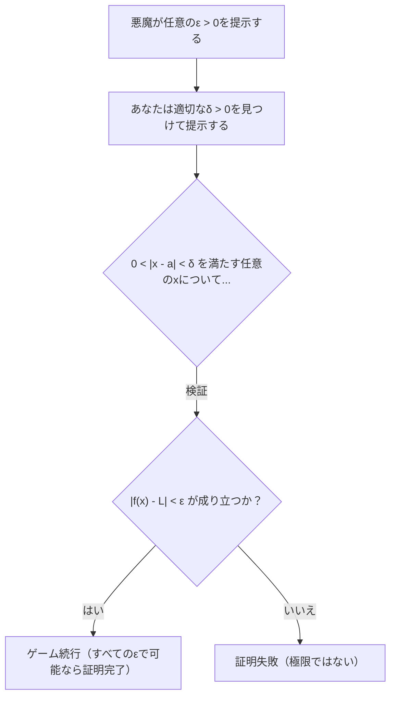
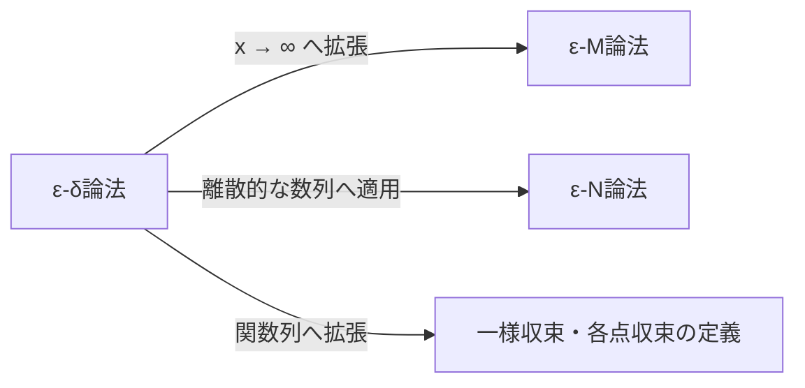

## 1. はじめに：高校数学の極限が抱える「曖昧さ」

高校数学の微分積分において、私たちは極限を次のように教わります。

> 「関数 $f(x)$ において、 $x$ が $a$ に **限りなく近づく** とき、 $f(x)$ がある一定の値 $L$ に **限りなく近づく** ならば、 $\lim_{x \to a} f(x) = L$ と表記する。」

この「 **限りなく近づく** 」という表現は、私たちの直感に非常にマッチしており、多項式関数や三角関数など、多くの連続関数を扱う上では全く問題なく機能します。グラフを描けば、 $x$ が特定の点に向かって進むとき、 $y$ の値がどこにたどり着くかは一目瞭然だからです。

しかし、大学レベルの数学、特に実解析（Real Analysis）の領域に足を踏み入れると、この直感的な定義はたちまち深刻な問題を引き起こします。「 **限りなく近づく** 」とは、具体的にどのような状態を指すのでしょうか？ 距離が $0.0001$ 以下になることでしょうか？ それとも $0.0000001$ 以下でしょうか？ 速度や近づき方にルールはあるのでしょうか？

数学という厳密性を最重視する学問において、言葉のニュアンスに依存した定義は致命的な弱点となります。この曖昧さを完全に排除し、極限という概念に鋼鉄の基礎を与えたのが、19世紀の数学者たちが作り上げた **$\varepsilon-\delta$ （イプシロン-デルタ）論法** です。

本記事では、なぜ直感的な定義では不十分なのかという歴史的背景から出発し、 $\varepsilon-\delta$ 論法の正確な意味、具体的な使い方、そして極限が存在しないケースの証明までを、深く掘り下げて解説していきます。

## 2. 微積分学の歴史と厳密性の危機

アイザック・[ニュートン](https://kenji.blog/p/newton/)とゴットフリート・[ライプニッツ](https://kenji.blog/p/leibniz/)が17世紀に微積分学を創始したとき、彼らは「無限小（無限に小さいがゼロではない量）」という概念に大きく依存していました。彼らの計算は物理学や幾何学の驚くべき成果をもたらしましたが、数学的な基礎は非常に脆弱でした。

当時の哲学者ジョージ・バークリーは、この無限小の概念を「 **消え去った量の幽霊** 」と呼び、痛烈に批判しました。計算の途中ではゼロではない量として割り算に使い、最後にはゼロとして無視するというご都合主義的な操作が、論理的におかしいと指摘したのです。

18世紀を通じて微積分は発展を続けましたが、19世紀に入ると、直感だけでは処理できない「病的な関数（pathological functions）」が次々と発見され、数学者たちは危機感を募らせました。オーギュスタン＝ルイ・コーシーとカール・ワイエルシュトラスは、この危機を乗り越えるため、無限小という怪しい概念を追放し、実数の性質と不等式のみを用いて微積分を再構築しました。これが $\varepsilon-\delta$ 論法の誕生です。

## 3. ε-δ論法の正式な定義

それでは、 $\varepsilon-\delta$ 論法による関数の極限の厳密な定義を見てみましょう。

> **定義：関数の極限**
> 関数 $f(x)$ が $x \to a$ のときに $L$ に収束する（ $\lim_{x \to a} f(x) = L$ である）とは、次の論理式が成り立つことである：
> $\forall \varepsilon > 0, \exists \delta > 0 \text{ s.t. } 0 < |x - a| < \delta \implies |f(x) - L| < \varepsilon$

数学記号に慣れていないと暗号のように見えるかもしれません。一つずつ丁寧に分解して翻訳してみましょう。

*   $\forall \varepsilon > 0$ : 「任意の（どんな）正の実数 $\varepsilon$ （誤差の許容範囲）が与えられたとしても」
*   $\exists \delta > 0$ : 「ある正の実数 $\delta$ （ $x$ の接近範囲）が存在して」
*   $\text{s.t.}$ : 「以下の条件を満たす（such that）」
*   $0 < |x - a| < \delta$ : 「 $x$ と $a$ の距離が $0$ より大きく $\delta$ 未満であるならば（つまり、 $x$ が $a$ の $\delta$ 近傍にあり、かつ $x \neq a$ であるならば）」
*   $\implies$ : 「ならば」
*   $|f(x) - L| < \varepsilon$ : 「 $f(x)$ と $L$ の距離は必ず $\varepsilon$ 未満になる」

### 3.1. 悪魔とのゲームとしての解釈

この定義は、あなたと「疑い深い悪魔」との間のゲームと考えると非常にわかりやすくなります。

1.  **悪魔の挑戦** : 悪魔は、極限が $L$ であることを疑っており、非常に厳しい誤差の許容範囲 $\varepsilon$ （例えば $\varepsilon = 0.001$ ）を突きつけてきます。「 $f(x)$ を $L$ から $0.001$ の範囲内に収めてみろ！」
2.  **あなたの応答** : あなたは、 $x$ を $a$ にどれだけ近づければよいか、つまり $\delta$ の値を計算して提示します。「よし、 $x$ を $a$ から $\delta = 0.0005$ の範囲内に制限すれば、 $f(x)$ は確実に指定された範囲内に収まるぞ！」
3.  **勝利条件** : 悪魔がどんなに小さな $\varepsilon$ を突きつけてきても、あなたが常にそれに対応する $\delta$ を見つけ出すことができる（存在する）ならば、あなたの勝ちであり、極限は $L$ であると証明されます。

## 4. 具体例での証明

抽象的な定義だけでは理解しにくいため、具体的な関数を用いて $\varepsilon-\delta$ 論法による証明を行ってみましょう。

### 4.1. 一次関数の証明

最も単純な例として、 $\lim_{x \to 2} (3x - 1) = 5$ を証明します。

**【思考プロセス（下書き）】**
証明の目標は、任意の $\varepsilon > 0$ に対して、 $|(3x - 1) - 5| < \varepsilon$ となるような $\delta > 0$ を見つけることです。
式を整理すると、
$|(3x - 1) - 5| = |3x - 6| = 3|x - 2|$
となります。
私たちがコントロールできるのは $|x - 2| < \delta$ という条件です。
したがって、 $3|x - 2| < 3\delta$ となります。
これが $\varepsilon$ に等しくなるようにしたいので、 $3\delta = \varepsilon$ 、つまり $\delta = \frac{\varepsilon}{3}$ に設定すればよさそうです。

**【正式な証明】**
任意の $\varepsilon > 0$ が与えられたとする。
ここで、 $\delta = \frac{\varepsilon}{3}$ と選ぶ。 $\varepsilon > 0$ であるから、当然 $\delta > 0$ である。
このとき、 $0 < |x - 2| < \delta$ を満たす任意の $x$ について、以下の不等式が成り立つ。
$$|(3x - 1) - 5| = |3x - 6| = 3|x - 2| < 3\delta = 3\left(\frac{\varepsilon}{3}\right) = \varepsilon$$
ゆえに、 $0 < |x - 2| < \delta \implies |(3x - 1) - 5| < \varepsilon$ が示された。
したがって、定義より $\lim_{x \to 2} (3x - 1) = 5$ である。 $\blacksquare$

### 4.2. 二次関数の証明（δの制限テクニック）

次は少し複雑な $\lim_{x \to 3} x^2 = 9$ を証明します。 $x$ が含まれる項が残るため、少し工夫が必要です。

**【思考プロセス（下書き）】**
目標は $|x^2 - 9| < \varepsilon$ となる $\delta$ を見つけることです。
$|x^2 - 9| = |x - 3||x + 3|$
ここで、 $|x - 3| < \delta$ は作れますが、 $|x + 3|$ が邪魔です。 $\delta$ は $x$ に依存してはいけません（定数として提示する必要があるため）。
そこで、まず $x$ が $3$ に十分近いと仮定して、 $|x + 3|$ の最大値を見積もります。
例えば、 $\delta \le 1$ と **制限** してみます。
すると、 $|x - 3| < 1$ となり、 $-1 < x - 3 < 1$ 、つまり $2 < x < 4$ となります。
このとき、 $x + 3$ の範囲は $5 < x + 3 < 7$ となるため、 $|x + 3| < 7$ であることが保証されます。
したがって、 $|x - 3||x + 3| < 7|x - 3|$ と不等式を作れます。
これが $\varepsilon$ 未満になるようにするには、 $7|x - 3| < \varepsilon$ 、つまり $|x - 3| < \frac{\varepsilon}{7}$ とすればよいです。
最初の制限 $\delta \le 1$ も守る必要があるため、 $\delta$ は $1$ と $\frac{\varepsilon}{7}$ のうち **小さい方** を選べば完璧です。

**【正式な証明】**
任意の $\varepsilon > 0$ が与えられたとする。
ここで、 $\delta = \min\left(1, \frac{\varepsilon}{7}\right)$ と選ぶ。
このとき、 $0 < |x - 3| < \delta$ を満たす任意の $x$ について考える。
まず、 $\delta \le 1$ より $|x - 3| < 1$ であるから、 $2 < x < 4$ となり、 $|x + 3| < 7$ が成り立つ。
次に、 $\delta \le \frac{\varepsilon}{7}$ より $|x - 3| < \frac{\varepsilon}{7}$ も成り立つ。
これらを用いると、
$$|x^2 - 9| = |x - 3||x + 3| < |x - 3| \cdot 7 < \frac{\varepsilon}{7} \cdot 7 = \varepsilon$$
ゆえに、 $0 < |x - 3| < \delta \implies |x^2 - 9| < \varepsilon$ が示された。
したがって、 $\lim_{x \to 3} x^2 = 9$ である。 $\blacksquare$

## 5. なぜ「限りなく近づく」ではダメなのか？ 病的な関数の登場

ここまで読んで、「計算が面倒になっただけではないか？」と思うかもしれません。しかし、 $\varepsilon-\delta$ 論法が真の力を発揮するのは、グラフを描くことが不可能な「病的な関数」を扱うときです。

有名な例として、 **ディリクレ関数（Dirichlet function）** を考えてみましょう。

$$ f(x) = \begin{cases} 1 & (x \text{ が有理数のとき}) \\ 0 & (x \text{ が無理数のとき}) \end{cases} $$

この関数は、あらゆる有理数の点で $1$ 、無理数の点で $0$ をとります。有理数と無理数は実数直線上に無限に稠密に混ざり合っているため、この関数のグラフを描くことは人間の目には不可能です。

ここで、 $x \to 0$ のときの極限 $\lim_{x \to 0} f(x)$ を考えてみます。「 $x$ が $0$ に限りなく近づくとき」という直感的な表現では、 $f(x)$ は $1$ に近づくのか、 $0$ に近づくのか、全く判断できません。近づく経路として有理数だけを辿れば $1$ になりますし、無理数だけを辿れば $0$ になるからです。

$\varepsilon-\delta$ 論法を使えば、この極限が **存在しない** ことを厳密に証明できます。極限が $L$ になるという命題の否定は以下のようになります。

> **定義の否定（極限が $L$ ではない）**
> $\exists \varepsilon > 0 \text{ s.t. } \forall \delta > 0, \exists x \text{ s.t. } (0 < |x - a| < \delta \land |f(x) - L| \ge \varepsilon)$

つまり、「悪魔がある特定の $\varepsilon$ を提示したとき、あなたがどんな $\delta$ を提示しても、その $\delta$ の範囲内に、目標値 $L$ から $\varepsilon$ 以上外れてしまう意地悪な $x$ が必ず存在する」ということです。

**【ディリクレ関数の極限が存在しないことの証明】**
極限が何らかの値 $L$ であると仮定して矛盾を導きます。
$\varepsilon = \frac{1}{2}$ と設定します。
どんな $\delta > 0$ を選んだとしても、区間 $(-\delta, \delta)$ の中には有理数 $x_1$ と無理数 $x_2$ が必ず存在します。
$f(x_1) = 1$ であり、 $f(x_2) = 0$ です。
もし極限が $L$ ならば、定義から $|1 - L| < \frac{1}{2}$ かつ $|0 - L| < \frac{1}{2}$ とならなければなりません。
しかし、三角不等式により、
$1 = |1 - 0| = |(1 - L) + (L - 0)| \le |1 - L| + |L - 0| < \frac{1}{2} + \frac{1}{2} = 1$
となり、 $1 < 1$ という矛盾が生じます。
したがって、極限 $L$ は存在しません。 $\blacksquare$

このように、直感では処理できない問題に対して、明確な白黒をつけることができるのが $\varepsilon-\delta$ 論法の最大のメリットです。

## 6. さらなる発展：無限大への極限

極限の概念は、有限の値に近づく場合だけでなく、 $x \to \infty$ のような無限大への極限にも応用されます。この場合、 $\varepsilon-\delta$ 論法のバリエーションとして **$\varepsilon-M$ 論法** や、数列に対する **$\varepsilon-N$ 論法** が用いられます。

例えば、 $\lim_{x \to \infty} f(x) = L$ の厳密な定義は次のようになります。

> $\forall \varepsilon > 0, \exists M > 0 \text{ s.t. } x > M \implies |f(x) - L| < \varepsilon$

「いくらでも小さな誤差 $\varepsilon$ に対して、十分大きな境界値 $M$ を設定すれば、 $x$ が $M$ を超えた先では $f(x)$ は常に $L$ の $\varepsilon$ 誤差内に収まる」という意味です。論理の骨組みは $\varepsilon-\delta$ 論法と全く同じであることがわかります。

## 7. まとめ

「 $x$ が $a$ に限りなく近づく」という直感的な説明は、初学者が極限のイメージを掴むためには非常に有効です。しかし、数学が建物の基礎として求める「絶対的な確実性」を提供するには不十分でした。

$\varepsilon-\delta$ 論法は、一見すると難解な不等式の羅列に見えますが、その本質は **「誤差を任意に小さくコントロールできるか？」という静的な条件のチェック** にあります。「動的に近づく」という時間的な要素を含む曖昧な概念を、「不等式を満たす範囲が存在する」という論理的で静的な状態に置き換えたことこそが、19世紀の数学者たちの偉大なパラダイムシフトでした。

この厳密な基礎があるからこそ、現代の微積分学、そしてそれを応用する物理学や工学、さらには人工知能の基礎となる最適化理論などが、揺るぎない確実性をもって機能しているのです。極限の学習で行き詰まったときは、悪魔との $\varepsilon-\delta$ ゲームを思い出し、論理パズルとして楽しんでみてください。
