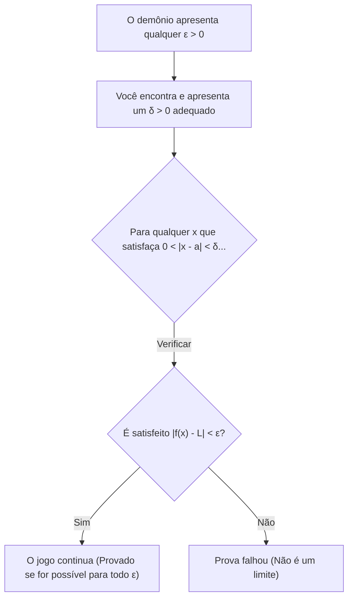
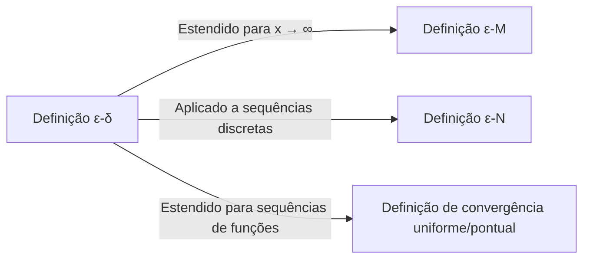

## 1. Introdução: A "Ambiguidade" dos Limites no Ensino Médio

Ao aprender cálculo no ensino médio, a maioria de nós encontra a seguinte definição de limite:

> "Para uma função $f(x)$, se $f(x)$ **se aproxima** de um certo valor $L$ conforme $x$ **se aproxima** de $a$, escrevemos $\lim_{x \to a} f(x) = L$."

Essa expressão " **se aproxima** " alinha-se perfeitamente com nossa intuição e funciona sem problemas ao lidar com funções contínuas como polinômios ou funções trigonométricas. Se você desenhar um gráfico, é visualmente óbvio onde o valor de $y$ termina à medida que $x$ se move em direção a um ponto específico.

No entanto, uma vez que você entra na matemática de nível universitário, particularmente no reino da Análise Real, essa definição intuitiva causa rapidamente problemas sérios. O que exatamente significa " **aproximar-se** "? Significa que a distância se torna menor que $0.0001$? Ou menor que $0.0000001$? Existem regras quanto à velocidade ou à forma de se aproximar?

Na matemática, uma disciplina que valoriza o rigor estrito acima de tudo, definições que dependem de nuances linguísticas são uma fraqueza fatal. Para eliminar completamente essa ambiguidade e fornecer um fundamento de aço para o conceito de limites, os matemáticos do século 19 formularam a **definição $\varepsilon-\delta$ (épsilon-delta)**.

Neste artigo, exploraremos por que a definição intuitiva é insuficiente a partir de seu contexto histórico, decodificaremos profundamente o significado exato da definição $\varepsilon-\delta$, demonstraremos como usá-la em provas e até mesmo provaremos casos em que os limites não existem.

## 2. História do Cálculo e a Crise do Rigor

Quando [Isaac Newton](https://kenji.blog/p/newton/) e [Gottfried Leibniz](https://kenji.blog/p/leibniz/) fundaram o cálculo no século 17, eles dependiam fortemente do conceito de "infinitesimais" (quantidades que são infinitamente pequenas, mas não nulas). Embora seus cálculos tenham produzido resultados notáveis na física e na geometria, a base matemática era extremamente frágil.

O filósofo George Berkeley na época criticou severamente esse conceito de infinitesimais, chamando-os de " **fantasmas de quantidades que se foram** ". Ele apontou a inconsistência lógica de tratá-los como quantidades não nulas durante uma divisão no meio de um cálculo, apenas para descartá-los convenientemente como zero no final.

O cálculo continuou a se desenvolver ao longo do século 18, mas, ao entrar no século 19, "funções patológicas" que não podiam ser tratadas apenas pela intuição foram descobertas uma após a outra, aumentando o senso de crise dos matemáticos. Para superar isso, [Augustin-Louis Cauchy](https://kenji.blog/p/cauchy/) e [Karl Weierstrass](https://kenji.blog/p/weierstrass/) baniram o duvidoso conceito de infinitesimais e reconstruíram o cálculo usando apenas as propriedades dos números reais e desigualdades. Isso marcou o nascimento da definição $\varepsilon-\delta$.

## 3. A Definição Formal ε-δ

Agora, vamos observar a definição rigorosa do limite de uma função usando a lógica $\varepsilon-\delta$.

> **Definição: Limite de uma Função**
> Uma função $f(x)$ converge para $L$ à medida que $x \to a$ (escrito como $\lim_{x \to a} f(x) = L$) se e somente se a seguinte afirmação lógica for verdadeira:
> $\forall \varepsilon > 0, \exists \delta > 0 \text{ s.t. } 0 < |x - a| < \delta \implies |f(x) - L| < \varepsilon$

Se você não está acostumado a símbolos matemáticos, isso pode parecer um código secreto. Vamos analisar cuidadosamente e traduzi-lo parte por parte.

*   $\forall \varepsilon > 0$ : "Para qualquer número real positivo $\varepsilon$ (tolerância de erro) dado"
*   $\exists \delta > 0$ : "existe um número real positivo $\delta$ (distância de aproximação)"
*   $\text{s.t.}$ : "tal que (such that)"
*   $0 < |x - a| < \delta$ : "se a distância entre $x$ e $a$ é estritamente maior que $0$ e menor que $\delta$ (ou seja, $x$ está na vizinhança-$\delta$ de $a$, e $x \neq a$)"
*   $\implies$ : "então"
*   $|f(x) - L| < \varepsilon$ : "a distância entre $f(x)$ e $L$ é estritamente menor que $\varepsilon$"

### 3.1. Interpretação como um Jogo contra um Demônio

Esta definição é muito fácil de entender se você pensar nela como um jogo entre você e um "demônio cético".

1.  **O Desafio do Demônio** : O demônio duvida que o limite seja $L$ e impõe uma tolerância de erro $\varepsilon$ muito rigorosa (por exemplo, $\varepsilon = 0.001$). "Vamos ver se você consegue manter $f(x)$ dentro de $0.001$ de $L$!"
2.  **Sua Resposta** : Você calcula e apresenta a que distância $x$ precisa estar de $a$, que é o valor de $\delta$. "Tudo bem, se eu restringir $x$ a estar dentro de uma distância $\delta = 0.0005$ de $a$, $f(x)$ definitivamente permanecerá dentro do intervalo especificado!"
3.  **Condição de Vitória** : Se, por menor que seja o $\varepsilon$ apresentado pelo demônio, você sempre conseguir encontrar (existir) um $\delta$ correspondente que funcione, então você ganha, e fica provado que o limite é $L$.

## 4. Provas com Exemplos Concretos

Definições abstratas são difíceis de compreender sozinhas, então vamos realizar algumas provas usando a definição $\varepsilon-\delta$ com funções concretas.

### 4.1. Prova para uma Função Linear

Como o exemplo mais simples, provaremos $\lim_{x \to 2} (3x - 1) = 5$.

**[Processo de Pensamento (Rascunho)]**
O objetivo da prova é encontrar um $\delta > 0$ tal que $|(3x - 1) - 5| < \varepsilon$ para qualquer $\varepsilon > 0$ dado.
Simplificando a expressão, obtemos:
$|(3x - 1) - 5| = |3x - 6| = 3|x - 2|$
O que podemos controlar é a condição $|x - 2| < \delta$.
Portanto, $3|x - 2| < 3\delta$.
Como queremos que isso seja igual a $\varepsilon$, devemos definir $3\delta = \varepsilon$, o que significa que $\delta = \frac{\varepsilon}{3}$.

**[Prova Formal]**
Seja $\varepsilon > 0$ arbitrário.
Escolha $\delta = \frac{\varepsilon}{3}$. Uma vez que $\varepsilon > 0$, segue-se naturalmente que $\delta > 0$.
Então, para qualquer $x$ satisfazendo $0 < |x - 2| < \delta$, a seguinte desigualdade é válida:
$$|(3x - 1) - 5| = |3x - 6| = 3|x - 2| < 3\delta = 3\left(\frac{\varepsilon}{3}\right) = \varepsilon$$
Assim, mostramos que $0 < |x - 2| < \delta \implies |(3x - 1) - 5| < \varepsilon$.
Portanto, por definição, $\lim_{x \to 2} (3x - 1) = 5$. $\blacksquare$

### 4.2. Prova para uma Função Quadrática (A Técnica de Restrição de δ)

Em seguida, vamos provar um limite um pouco mais complexo: $\lim_{x \to 3} x^2 = 9$. Porque um termo contendo $x$ permanece, um pequeno truque é necessário.

**[Processo de Pensamento (Rascunho)]**
O objetivo é encontrar um $\delta$ tal que $|x^2 - 9| < \varepsilon$.
$|x^2 - 9| = |x - 3||x + 3|$
Aqui, podemos criar $|x - 3| < \delta$, mas $|x + 3|$ está no caminho. $\delta$ não pode depender de $x$ (deve ser apresentado como uma constante).
Portanto, primeiro assumimos que $x$ está suficientemente perto de $3$ e estimamos o valor máximo de $|x + 3|$.
Por exemplo, vamos **restringir** $\delta \le 1$.
Então, $|x - 3| < 1$, o que significa $-1 < x - 3 < 1$, ou $2 < x < 4$.
Neste caso, o intervalo de $x + 3$ é $5 < x + 3 < 7$, o que garante que $|x + 3| < 7$.
Portanto, podemos estabelecer a desigualdade $|x - 3||x + 3| < 7|x - 3|$.
Para tornar isso estritamente menor que $\varepsilon$, precisamos de $7|x - 3| < \varepsilon$, o que significa $|x - 3| < \frac{\varepsilon}{7}$.
Como também devemos obedecer à nossa restrição inicial $\delta \le 1$, podemos escolher $\delta$ para ser o **menor** de $1$ e $\frac{\varepsilon}{7}$.

**[Prova Formal]**
Seja $\varepsilon > 0$ arbitrário.
Escolha $\delta = \min\left(1, \frac{\varepsilon}{7}\right)$.
Então, considere qualquer $x$ que satisfaça $0 < |x - 3| < \delta$.
Primeiro, uma vez que $\delta \le 1$, temos $|x - 3| < 1$, o que implica $2 < x < 4$ e, portanto, $|x + 3| < 7$.
Em seguida, uma vez que $\delta \le \frac{\varepsilon}{7}$, também temos $|x - 3| < \frac{\varepsilon}{7}$.
Usando esses fatos, obtemos:
$$|x^2 - 9| = |x - 3||x + 3| < |x - 3| \cdot 7 < \frac{\varepsilon}{7} \cdot 7 = \varepsilon$$
Assim, mostramos que $0 < |x - 3| < \delta \implies |x^2 - 9| < \varepsilon$.
Portanto, $\lim_{x \to 3} x^2 = 9$. $\blacksquare$

## 5. Por Que "Aproximar" Não É Suficiente: Entram as Funções Patológicas

Tendo lido até aqui, você pode estar pensando: "Os cálculos não se tornaram apenas mais tediosos?". No entanto, o verdadeiro poder da definição $\varepsilon-\delta$ revela-se ao lidar com "funções patológicas" onde desenhar um gráfico é impossível.

Como um exemplo famoso, vamos considerar a **função de Dirichlet**.

$$ f(x) = \begin{cases} 1 & (\text{quando } x \text{ é racional}) \\ 0 & (\text{quando } x \text{ é irracional}) \end{cases} $$

Esta função assume o valor $1$ em todo número racional e $0$ em todo número irracional. Porque números racionais e irracionais estão infinitamente e densamente misturados na reta numérica real, desenhar este gráfico é visualmente impossível para os olhos humanos.

Agora, vamos considerar o limite $\lim_{x \to 0} f(x)$ quando $x \to 0$. Usando a expressão intuitiva "à medida que $x$ se aproxima infinitamente de $0$", é impossível determinar se $f(x)$ se aproxima de $1$ ou de $0$. Se você traçar um caminho se aproximando apenas através de números racionais, é $1$; se você traçar apenas números irracionais, é $0$.

Usando a definição $\varepsilon-\delta$, podemos provar rigorosamente que este limite **não existe**. A negação da proposição de que o limite é $L$ é a seguinte:

> **Negação da Definição (O limite não é L)**
> $\exists \varepsilon > 0 \text{ s.t. } \forall \delta > 0, \exists x \text{ s.t. } (0 < |x - a| < \delta \land |f(x) - L| \ge \varepsilon)$

Em outras palavras, "Quando o demônio apresenta um $\varepsilon$ específico, não importa que $\delta$ você apresente, sempre existirá um $x$ malicioso dentro dessa faixa de $\delta$ que se desviará do valor alvo $L$ por $\varepsilon$ ou mais".

**[Prova de que o limite da função de Dirichlet não existe]**
Suponha que o limite seja um valor $L$ para derivar uma contradição.
Defina $\varepsilon = \frac{1}{2}$.
Não importa que $\delta > 0$ você escolha, sempre existe um número racional $x_1$ e um número irracional $x_2$ dentro do intervalo $(-\delta, \delta)$.
Temos $f(x_1) = 1$ e $f(x_2) = 0$.
Se o limite fosse $L$, por definição, tanto $|1 - L| < \frac{1}{2}$ quanto $|0 - L| < \frac{1}{2}$ devem ser mantidos.
No entanto, pela desigualdade triangular,
$1 = |1 - 0| = |(1 - L) + (L - 0)| \le |1 - L| + |L - 0| < \frac{1}{2} + \frac{1}{2} = 1$
Isso resulta na contradição $1 < 1$.
Portanto, o limite $L$ não existe. $\blacksquare$

Dessa forma, a maior vantagem da lógica $\varepsilon-\delta$ é sua capacidade de fornecer respostas definitivas em preto e branco para problemas que não podem ser tratados por intuição.

## 6. Outras Extensões: Limites no Infinito

O conceito de limites é aplicado não apenas ao se aproximar de valores finitos, mas também a limites em direção ao infinito, como $x \to \infty$. Nesses casos, são utilizadas variações da definição $\varepsilon-\delta$, nomeadamente a **definição $\varepsilon-M$** ou a **definição $\varepsilon-N$** para sequências.

Por exemplo, a definição rigorosa de $\lim_{x \to \infty} f(x) = L$ é a seguinte:

> $\forall \varepsilon > 0, \exists M > 0 \text{ s.t. } x > M \implies |f(x) - L| < \varepsilon$

Isso significa "Para qualquer erro $\varepsilon$ arbitrariamente pequeno, se você definir um valor limite $M$ suficientemente grande, então além de $M$, $f(x)$ permanecerá sempre dentro da margem de erro $\varepsilon$ de $L$". Você pode ver que a estrutura lógica é exatamente a mesma da definição $\varepsilon-\delta$.

## 7. Conclusão

A explicação intuitiva de que "$x$ se aproxima infinitamente de $a$" é altamente eficaz para iniciantes entenderem o conceito de um limite. No entanto, foi insuficiente para fornecer a "certeza absoluta" que a matemática exige como fundamento para sua estrutura.

À primeira vista, a definição $\varepsilon-\delta$ parece uma formidável sequência de desigualdades, mas sua essência reside na **verificação estática de uma condição: "O erro pode ser controlado para ser arbitrariamente pequeno?"**. Substituir o conceito ambíguo envolvendo um elemento temporal de "aproximação dinâmica" por um estado lógico e estático de "existe uma faixa satisfazendo uma desigualdade" foi uma magnífica mudança de paradigma pelos matemáticos do século 19.

Graças a esse fundamento rigoroso, o cálculo moderno, a física e a engenharia que o aplicam e até as teorias de otimização fundamentais para a inteligência artificial funcionam com certeza inabalável. Sempre que ficar preso ao aprender limites, lembre-se do jogo $\varepsilon-\delta$ com o demônio e tente aproveitá-lo como um quebra-cabeça lógico.
