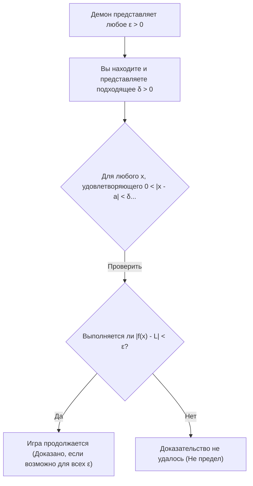
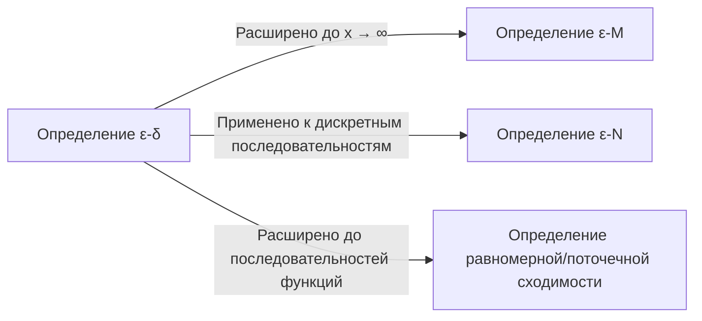

## 1. Введение: «Двусмысленность» школьных пределов

Изучая начала анализа в старших классах школы, большинство из нас сталкивается со следующим определением предела:

> "Для функции $f(x)$, если $f(x)$ **стремится** к определенному значению $L$ по мере того, как $x$ **стремится** к $a$, мы пишем $\lim_{x \to a} f(x) = L$."

Это выражение " **стремится** " идеально совпадает с нашей интуицией и работает без каких-либо проблем при работе с непрерывными функциями, такими как многочлены или тригонометрические функции. Если вы нарисуете график, будет визуально очевидно, где в итоге окажется значение $y$, когда $x$ будет двигаться к определенной точке.

Однако, как только вы переходите к математике университетского уровня, особенно в сферу действительного анализа, это интуитивное определение быстро вызывает серьезные проблемы. Что именно означает " **стремиться** "? Означает ли это, что расстояние становится меньше $0.0001$? Или меньше $0.0000001$? Существуют ли правила относительно скорости или способа приближения?

В математике, дисциплине, которая ценит строгую точность превыше всего, определения, опирающиеся на языковые нюансы, являются фатальной слабостью. Чтобы полностью устранить эту двусмысленность и обеспечить железное основание для концепции пределов, математики 19-го века сформулировали **определение $\varepsilon-\delta$ (эпсилон-дельта)**.

В этой статье мы исследуем, почему интуитивного определения недостаточно, начиная с его исторического контекста, глубоко расшифруем точный смысл определения $\varepsilon-\delta$, продемонстрируем, как использовать его в доказательствах, и даже докажем случаи, когда пределов не существует.

## 2. История анализа и кризис строгости

Когда [Исаак Ньютон](https://kenji.blog/ru/p/newton/) и [Готфрид Лейбниц](https://kenji.blog/ru/p/leibniz/) основали математический анализ в 17 веке, они в значительной степени опирались на концепцию "бесконечно малых" (величин, которые бесконечно малы, но не равны нулю). Хотя их вычисления дали замечательные результаты в физике и геометрии, математический фундамент был чрезвычайно хрупким.

Философ Джордж Беркли в то время подверг резкой критике эту концепцию бесконечно малых, назвав их " **призраками исчезнувших величин** ". Он указал на логическую непоследовательность отношения к ним как к ненулевым величинам во время деления в середине вычисления, только для того, чтобы в конце концов отбросить их как нуль в конце.

Математический анализ продолжал развиваться на протяжении всего 18-го века, но с наступлением 19-го века одна за другой стали открываться "патологические функции", с которыми нельзя было справиться одной лишь интуицией, что усилило чувство кризиса у математиков. Чтобы преодолеть это, [Огюстен Луи Коши](https://kenji.blog/ru/p/cauchy/) и [Карл Вейерштрасс](https://kenji.blog/ru/p/weierstrass/) изгнали сомнительную концепцию бесконечно малых и реконструировали анализ, используя только свойства действительных чисел и неравенства. Это ознаменовало рождение определения $\varepsilon-\delta$.

## 3. Формальное определение ε-δ

Теперь давайте посмотрим на строгое определение предела функции с использованием логики $\varepsilon-\delta$.

> **Определение: Предел функции**
> Функция $f(x)$ сходится к $L$ при $x \to a$ (записывается как $\lim_{x \to a} f(x) = L$) тогда и только тогда, когда истинно следующее логическое утверждение:
> $\forall \varepsilon > 0, \exists \delta > 0 \text{ s.t. } 0 < |x - a| < \delta \implies |f(x) - L| < \varepsilon$

Если вы не привыкли к математическим символам, это может выглядеть как секретный код. Давайте внимательно разберем его и переведем по частям.

*   $\forall \varepsilon > 0$ : "Для любого заданного положительного действительного числа $\varepsilon$ (допуска на ошибку)"
*   $\exists \delta > 0$ : "существует положительное действительное число $\delta$ (расстояние приближения)"
*   $\text{s.t.}$ : "такое, что (such that)"
*   $0 < |x - a| < \delta$ : "если расстояние между $x$ и $a$ строго больше $0$ и меньше $\delta$ (то есть $x$ находится в $\delta$-окрестности $a$, и $x \neq a$)"
*   $\implies$ : "то"
*   $|f(x) - L| < \varepsilon$ : "расстояние между $f(x)$ и $L$ строго меньше $\varepsilon$"

### 3.1. Интерпретация как игра против демона

Это определение очень легко понять, если рассматривать его как игру между вами и "скептичным демоном".

1.  **Вызов демона** : Демон сомневается, что предел равен $L$, и устанавливает очень строгий допуск на ошибку $\varepsilon$ (например, $\varepsilon = 0.001$). "А ну-ка, попробуй удержать $f(x)$ в пределах $0.001$ от $L$!"
2.  **Ваш ответ** : Вы вычисляете и представляете, насколько близко $x$ должно быть к $a$, что и является значением $\delta$. "Хорошо, если я ограничу $x$ так, чтобы оно находилось в пределах расстояния $\delta = 0.0005$ от $a$, $f(x)$ определенно останется в указанном диапазоне!"
3.  **Условие победы** : Если, независимо от того, насколько маленькое $\varepsilon$ представляет демон, вы всегда можете найти (существует) соответствующее $\delta$, которое работает, то вы выигрываете, и доказано, что предел равен $L$.

## 4. Доказательства на конкретных примерах

Абстрактные определения трудно понять сами по себе, поэтому давайте выполним несколько доказательств, используя определение $\varepsilon-\delta$, с конкретными функциями.

### 4.1. Доказательство для линейной функции

В качестве самого простого примера мы докажем, что $\lim_{x \to 2} (3x - 1) = 5$.

**[Ход мыслей (Черновик)]**
Цель доказательства состоит в том, чтобы найти такое $\delta > 0$, чтобы $|(3x - 1) - 5| < \varepsilon$ для любого заданного $\varepsilon > 0$.
Упрощая выражение, получаем:
$|(3x - 1) - 5| = |3x - 6| = 3|x - 2|$
Что мы можем контролировать, так это условие $|x - 2| < \delta$.
Следовательно, $3|x - 2| < 3\delta$.
Поскольку мы хотим, чтобы это было равно $\varepsilon$, мы должны установить $3\delta = \varepsilon$, что означает, что $\delta = \frac{\varepsilon}{3}$.

**[Формальное доказательство]**
Пусть $\varepsilon > 0$ произвольно.
Выберем $\delta = \frac{\varepsilon}{3}$. Поскольку $\varepsilon > 0$, естественно следует, что $\delta > 0$.
Тогда для любого $x$, удовлетворяющего условию $0 < |x - 2| < \delta$, выполняется следующее неравенство:
$$|(3x - 1) - 5| = |3x - 6| = 3|x - 2| < 3\delta = 3\left(\frac{\varepsilon}{3}\right) = \varepsilon$$
Таким образом, мы показали, что $0 < |x - 2| < \delta \implies |(3x - 1) - 5| < \varepsilon$.
Следовательно, по определению, $\lim_{x \to 2} (3x - 1) = 5$. $\blacksquare$

### 4.2. Доказательство для квадратичной функции (Метод ограничения δ)

Далее давайте докажем немного более сложный предел: $\lim_{x \to 3} x^2 = 9$. Поскольку член, содержащий $x$, остается, требуется небольшая хитрость.

**[Ход мыслей (Черновик)]**
Цель состоит в том, чтобы найти такое $\delta$, чтобы $|x^2 - 9| < \varepsilon$.
$|x^2 - 9| = |x - 3||x + 3|$
Здесь мы можем создать $|x - 3| < \delta$, но $|x + 3|$ мешает. $\delta$ не может зависеть от $x$ (должно быть представлено как константа).
Поэтому сначала мы предполагаем, что $x$ достаточно близко к $3$, и оцениваем максимальное значение $|x + 3|$.
Например, давайте **ограничим** $\delta \le 1$.
Тогда $|x - 3| < 1$, что означает $-1 < x - 3 < 1$, или $2 < x < 4$.
В этом случае диапазон $x + 3$ составляет $5 < x + 3 < 7$, что гарантирует, что $|x + 3| < 7$.
Следовательно, мы можем установить неравенство $|x - 3||x + 3| < 7|x - 3|$.
Чтобы сделать это строго меньше $\varepsilon$, нам нужно $7|x - 3| < \varepsilon$, что означает $|x - 3| < \frac{\varepsilon}{7}$.
Поскольку мы также должны соблюдать наше начальное ограничение $\delta \le 1$, мы можем выбрать $\delta$ как **наименьшее** из $1$ и $\frac{\varepsilon}{7}$.

**[Формальное доказательство]**
Пусть $\varepsilon > 0$ произвольно.
Выберем $\delta = \min\left(1, \frac{\varepsilon}{7}\right)$.
Тогда рассмотрим любое $x$, удовлетворяющее условию $0 < |x - 3| < \delta$.
Во-первых, поскольку $\delta \le 1$, мы имеем $|x - 3| < 1$, что влечет за собой $2 < x < 4$, и, следовательно, $|x + 3| < 7$.
Во-вторых, поскольку $\delta \le \frac{\varepsilon}{7}$, мы также имеем $|x - 3| < \frac{\varepsilon}{7}$.
Используя эти факты, получаем:
$$|x^2 - 9| = |x - 3||x + 3| < |x - 3| \cdot 7 < \frac{\varepsilon}{7} \cdot 7 = \varepsilon$$
Таким образом, мы показали, что $0 < |x - 3| < \delta \implies |x^2 - 9| < \varepsilon$.
Следовательно, $\lim_{x \to 3} x^2 = 9$. $\blacksquare$

## 5. Почему "стремится" недостаточно: Появление патологических функций

Прочитав до этого места, вы можете подумать: "Разве вычисления не стали просто более утомительными?". Однако истинная сила определения $\varepsilon-\delta$ раскрывается при работе с "патологическими функциями", где нарисовать график невозможно.

В качестве известного примера давайте рассмотрим **функцию Дирихле**.

$$ f(x) = \begin{cases} 1 & (\text{когда } x \text{ рационально}) \\ 0 & (\text{когда } x \text{ иррационально}) \end{cases} $$

Эта функция принимает значение $1$ в каждом рациональном числе и $0$ в каждом иррациональном числе. Поскольку рациональные и иррациональные числа бесконечно плотно перемешаны на числовой прямой, нарисовать этот график визуально невозможно для человеческих глаз.

Теперь давайте рассмотрим предел $\lim_{x \to 0} f(x)$ при $x \to 0$. Используя интуитивное выражение "когда $x$ бесконечно близко стремится к $0$", невозможно определить, стремится ли $f(x)$ к $1$ или к $0$. Если вы проследите путь, приближаясь только через рациональные числа, это будет $1$; если вы проследите только иррациональные числа, это будет $0$.

Используя определение $\varepsilon-\delta$, мы можем строго доказать, что этот предел **не существует**. Отрицание утверждения о том, что предел равен $L$, выглядит следующим образом:

> **Отрицание определения (Предел не равен L)**
> $\exists \varepsilon > 0 \text{ s.t. } \forall \delta > 0, \exists x \text{ s.t. } (0 < |x - a| < \delta \land |f(x) - L| \ge \varepsilon)$

Другими словами, "Когда демон представляет конкретное $\varepsilon$, какое бы $\delta$ вы ни представили, в этом диапазоне $\delta$ всегда будет существовать злонамеренное $x$, которое отклоняется от целевого значения $L$ на $\varepsilon$ или более".

**[Доказательство того, что предел функции Дирихле не существует]**
Предположим, что предел равен некоторому значению $L$, чтобы получить противоречие.
Установим $\varepsilon = \frac{1}{2}$.
Какое бы $\delta > 0$ вы ни выбрали, внутри интервала $(-\delta, \delta)$ всегда существуют рациональное число $x_1$ и иррациональное число $x_2$.
Мы имеем $f(x_1) = 1$ и $f(x_2) = 0$.
Если бы предел был равен $L$, по определению должны были бы выполняться оба условия: $|1 - L| < \frac{1}{2}$ и $|0 - L| < \frac{1}{2}$.
Однако, согласно неравенству треугольника,
$1 = |1 - 0| = |(1 - L) + (L - 0)| \le |1 - L| + |L - 0| < \frac{1}{2} + \frac{1}{2} = 1$
Это приводит к противоречию $1 < 1$.
Следовательно, предел $L$ не существует. $\blacksquare$

Таким образом, величайшим преимуществом логики $\varepsilon-\delta$ является ее способность давать окончательные черно-белые ответы на проблемы, с которыми нельзя справиться с помощью интуиции.

## 6. Дальнейшие расширения: Пределы на бесконечности

Концепция пределов применяется не только при приближении к конечным значениям, но и к пределам, стремящимся к бесконечности, таким как $x \to \infty$. В этих случаях используются вариации определения $\varepsilon-\delta$, а именно **определение $\varepsilon-M$** или **определение $\varepsilon-N$** для последовательностей.

Например, строгое определение $\lim_{x \to \infty} f(x) = L$ выглядит следующим образом:

> $\forall \varepsilon > 0, \exists M > 0 \text{ s.t. } x > M \implies |f(x) - L| < \varepsilon$

Это означает: "Для любой сколь угодно малой ошибки $\varepsilon$, если вы установите достаточно большое граничное значение $M$, то за пределами $M$ значение $f(x)$ всегда будет оставаться в пределах запаса ошибки $\varepsilon$ от $L$". Вы можете видеть, что логическая структура точно такая же, как и у определения $\varepsilon-\delta$.

## 7. Заключение

Интуитивное объяснение того, что "$x$ бесконечно близко стремится к $a$", весьма эффективно для того, чтобы новички уловили концепцию предела. Однако этого было недостаточно, чтобы обеспечить "абсолютную уверенность", которая требуется математике в качестве фундамента для ее структуры.

На первый взгляд, определение $\varepsilon-\delta$ выглядит как пугающая цепочка неравенств, но его суть заключается в **статической проверке условия: "Можно ли контролировать ошибку так, чтобы она была сколь угодно малой?"**. Замена двусмысленной концепции, включающей временной элемент "динамического приближения", логическим статическим состоянием "существует диапазон, удовлетворяющий неравенству", стала великолепным изменением парадигмы математиками 19-го века.

Благодаря этому строгому фундаменту современный математический анализ, физика и инженерия, которые его применяют, и даже теории оптимизации, фундаментальные для искусственного интеллекта, функционируют с непоколебимой уверенностью. Всякий раз, когда вы застреваете при изучении пределов, вспомните игру $\varepsilon-\delta$ с демоном и попытайтесь насладиться ею как логической головоломкой.
