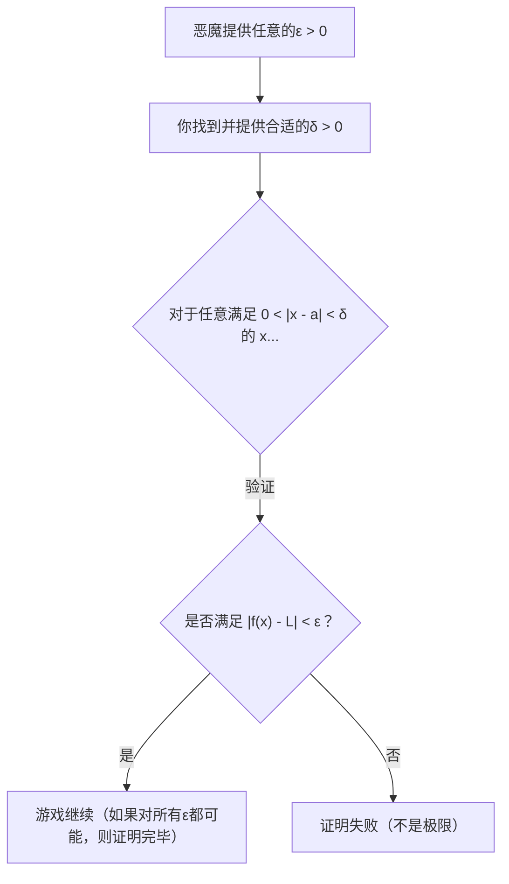
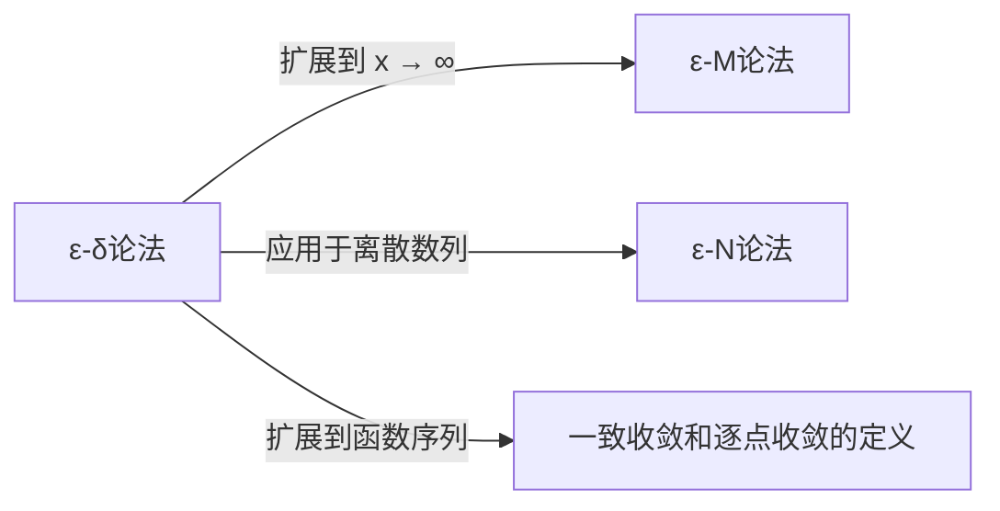

## 1. 引言：高中数学极限的“模糊性”

在高中学习微积分时，我们通常会遇到这样的极限定义：

> “对于函数 $f(x)$ ，当 $x$  **无限趋近** 于 $a$ 时，如果 $f(x)$  **无限趋近** 于一个定值 $L$ ，则记为 $\lim_{x \to a} f(x) = L$ 。”

这种“ **无限趋近** ”的表述非常符合我们的直觉，并且在处理多项式函数或三角函数等许多连续函数时，完全没有问题。画出图像的话，当 $x$ 向特定点移动时， $y$ 的值最终落在哪里是一目了然的。

然而，当我们踏入大学水平的数学，特别是实分析（Real Analysis）领域时，这种直观的定义立刻就会引发严重的问题。所谓“ **无限趋近** ”，具体是指什么状态呢？是指距离小于 $0.0001$ 吗？还是小于 $0.0000001$ ？趋近的速度或方式有规则吗？

在把严谨性置于首位的数学这门学科中，依赖语言细微差别的定义是一个致命的弱点。为了彻底消除这种模糊性，并为极限这一概念赋予钢铁般的基石，19世纪的数学家们建立起了 **$\varepsilon-\delta$ （Epsilon-Delta）论法** 。

本文将从为何直观定义不够用的历史背景出发，深入解析 $\varepsilon-\delta$ 论法的准确含义、具体用法，甚至包括如何证明极限不存在的情况。

## 2. 微积分的历史与严谨性危机

当[艾萨克·牛顿](https://kenji.blog/zh-cn/p/newton/)和[戈特弗里德·莱布尼茨](https://kenji.blog/zh-cn/p/leibniz/)在17世纪创立微积分时，他们在很大程度上依赖于“无穷小”（无限小但不为零的量）这一概念。虽然他们的计算在物理学和几何学上取得了惊人的成果，但其数学基础却非常脆弱。

当时的哲学家乔治·贝克莱（George Berkeley）对这种无穷小的概念提出了严厉批评，称之为“ **消失了的量的幽灵** ”。他指出，在计算过程中将其作为非零量进行除法，而在最后又将其视为零而忽略，这种机会主义的操作在逻辑上是荒谬的。

在整个18世纪，微积分不断发展，但进入19世纪后，仅靠直觉无法处理的“病态函数（pathological functions）”接连被发现，让数学家们产生了强烈的危机感。为了克服这场危机，[奥古斯丁-路易·柯西](https://kenji.blog/zh-cn/p/cauchy/)和[卡尔·魏尔斯特拉斯](https://kenji.blog/zh-cn/p/weierstrass/)驱逐了可疑的无穷小概念，仅利用实数的性质和不等式重建了微积分。这便是 $\varepsilon-\delta$ 论法的诞生。

## 3. ε-δ论法的正式定义

现在，让我们来看看使用 $\varepsilon-\delta$ 逻辑对函数极限进行的严格定义。

> **定义：函数的极限**
> 函数 $f(x)$ 在 $x \to a$ 时收敛于 $L$ （即 $\lim_{x \to a} f(x) = L$ ），当且仅当以下逻辑表达式成立：
> $\forall \varepsilon > 0, \exists \delta > 0 \text{ s.t. } 0 < |x - a| < \delta \implies |f(x) - L| < \varepsilon$

如果你不习惯数学符号，这可能看起来像密码一样。让我们一步步仔细拆解并翻译它。

*   $\forall \varepsilon > 0$ ：“对于任意给定的正实数 $\varepsilon$ （误差的容许范围）”
*   $\exists \delta > 0$ ：“存在一个正实数 $\delta$ （ $x$ 的接近范围）”
*   $\text{s.t.}$ ：“使得以下条件满足（such that）”
*   $0 < |x - a| < \delta$ ：“如果 $x$ 和 $a$ 之间的距离大于 $0$ 且小于 $\delta$ （即 $x$ 在 $a$ 的 $\delta$ 邻域内，且 $x \neq a$ ）”
*   $\implies$ ：“那么”
*   $|f(x) - L| < \varepsilon$ ：“ $f(x)$ 和 $L$ 之间的距离必定小于 $\varepsilon$ ”

### 3.1. 作为与恶魔的博弈的解释

如果我们把这个定义看作是你与一个“多疑的恶魔”之间的游戏，就会非常容易理解。

1.  **恶魔的挑战** ：恶魔怀疑极限是 $L$ ，于是抛出一个非常严格的误差容许范围 $\varepsilon$ （例如 $\varepsilon = 0.001$ ）。“有本事你把 $f(x)$ 限制在距离 $L$ 不超过 $0.001$ 的范围内啊！”
2.  **你的回应** ：你计算并提出 $x$ 需要离 $a$ 多近，也就是 $\delta$ 的值。“好，只要我把 $x$ 限制在距离 $a$ 不超过 $\delta = 0.0005$ 的范围内， $f(x)$ 就绝对能落在你指定的范围内！”
3.  **胜利条件** ：如果无论恶魔抛出多么小的 $\varepsilon$ ，你总是能找到（存在）一个对应的 $\delta$ 来应对，那么你就赢了，同时也证明了极限就是 $L$ 。

## 4. 实例证明

纯粹抽象的定义很难理解，因此让我们使用具体函数，通过 $\varepsilon-\delta$ 论法来进行一些证明。

### 4.1. 一次函数的证明

作为最简单的例子，我们来证明 $\lim_{x \to 2} (3x - 1) = 5$ 。

**【思考过程（草稿）】**
证明的目标是，对于任意给定的 $\varepsilon > 0$ ，找到一个 $\delta > 0$ ，使得 $|(3x - 1) - 5| < \varepsilon$ 成立。
整理式子，得到：
$|(3x - 1) - 5| = |3x - 6| = 3|x - 2|$
我们能够控制的是 $|x - 2| < \delta$ 这个条件。
因此， $3|x - 2| < 3\delta$ 。
由于我们希望这等于 $\varepsilon$ ，所以应令 $3\delta = \varepsilon$ ，也就是说只要设定 $\delta = \frac{\varepsilon}{3}$ 就可以了。

**【正式证明】**
假设给定任意的 $\varepsilon > 0$ 。
此时，选择 $\delta = \frac{\varepsilon}{3}$ 。因为 $\varepsilon > 0$ ，所以显然有 $\delta > 0$ 。
那么，对于任意满足 $0 < |x - 2| < \delta$ 的 $x$ ，以下不等式成立：
$$|(3x - 1) - 5| = |3x - 6| = 3|x - 2| < 3\delta = 3\left(\frac{\varepsilon}{3}\right) = \varepsilon$$
因此，我们证明了 $0 < |x - 2| < \delta \implies |(3x - 1) - 5| < \varepsilon$ 。
所以，根据定义， $\lim_{x \to 2} (3x - 1) = 5$ 。 $\blacksquare$

### 4.2. 二次函数的证明（δ的限制技巧）

接下来，证明一个稍微复杂的极限： $\lim_{x \to 3} x^2 = 9$ 。因为包含 $x$ 的项被保留了下来，所以需要一点技巧。

**【思考过程（草稿）】**
目标是找到一个 $\delta$ 使得 $|x^2 - 9| < \varepsilon$ 。
$|x^2 - 9| = |x - 3||x + 3|$
在这里，我们可以构造 $|x - 3| < \delta$ ，但是 $|x + 3|$ 成了阻碍。 $\delta$ 不能依赖于 $x$ （必须作为一个常数提出）。
因此，首先假设 $x$ 足够接近 $3$ ，并估计 $|x + 3|$ 的最大值。
例如，我们 **限制** $\delta \le 1$ 。
那么， $|x - 3| < 1$ ，这意味着 $-1 < x - 3 < 1$ ，即 $2 < x < 4$ 。
在这种情况下， $x + 3$ 的范围是 $5 < x + 3 < 7$ ，这保证了 $|x + 3| < 7$ 。
因此，我们可以建立不等式 $|x - 3||x + 3| < 7|x - 3|$ 。
为了使其小于 $\varepsilon$ ，我们需要 $7|x - 3| < \varepsilon$ ，即 $|x - 3| < \frac{\varepsilon}{7}$ 。
由于我们还必须遵守最初的限制 $\delta \le 1$ ，因此只需选择 $1$ 和 $\frac{\varepsilon}{7}$ 之中 **较小的一个** 作为 $\delta$ 就完美了。

**【正式证明】**
假设给定任意的 $\varepsilon > 0$ 。
此时，选择 $\delta = \min\left(1, \frac{\varepsilon}{7}\right)$ 。
那么，考虑任意满足 $0 < |x - 3| < \delta$ 的 $x$ 。
首先，由于 $\delta \le 1$ ，得 $|x - 3| < 1$ ，推导出 $2 < x < 4$ ，从而 $|x + 3| < 7$ 成立。
其次，由于 $\delta \le \frac{\varepsilon}{7}$ ，同样有 $|x - 3| < \frac{\varepsilon}{7}$ 成立。
利用这些条件，得到：
$$|x^2 - 9| = |x - 3||x + 3| < |x - 3| \cdot 7 < \frac{\varepsilon}{7} \cdot 7 = \varepsilon$$
因此，我们证明了 $0 < |x - 3| < \delta \implies |x^2 - 9| < \varepsilon$ 。
所以， $\lim_{x \to 3} x^2 = 9$ 。 $\blacksquare$

## 5. 为什么“无限趋近”不够？病态函数的登场

读到这里，你可能会想，“这不是仅仅让计算变得更繁琐了吗？”。然而，当处理无法绘制图像的“病态函数”时， $\varepsilon-\delta$ 论法才能展现出其真正的力量。

作为一个著名的例子，让我们考虑一下 **狄利克雷函数（Dirichlet function）** 。

$$ f(x) = \begin{cases} 1 & (\text{当 } x \text{ 是有理数时}) \\ 0 & (\text{当 } x \text{ 是无理数时}) \end{cases} $$

这个函数在所有有理数点上的值为 $1$ ，在无理数点上的值为 $0$ 。由于有理数和无理数在实数轴上无限密集地混合在一起，人类的眼睛根本无法画出这个函数的图像。

现在，考虑当 $x \to 0$ 时的极限 $\lim_{x \to 0} f(x)$ 。使用“当 $x$ 无限趋近于 $0$ 时”这种直观表述，我们完全无法判断 $f(x)$ 是趋近于 $1$ 还是 $0$ 。如果你只沿着有理数趋近，它就是 $1$ ；如果只沿着无理数趋近，它就是 $0$ 。

利用 $\varepsilon-\delta$ 论法，我们可以严格证明这个极限 **不存在** 。关于极限为 $L$ 这个命题的否定如下所示：

> **定义的否定（极限不是 L）**
> $\exists \varepsilon > 0 \text{ s.t. } \forall \delta > 0, \exists x \text{ s.t. } (0 < |x - a| < \delta \land |f(x) - L| \ge \varepsilon)$

换句话说，“当恶魔提出一个特定的 $\varepsilon$ 时，无论你提出什么样的 $\delta$ ，在那个 $\delta$ 范围内，必定存在一个令人讨厌的 $x$ ，它偏离目标值 $L$ 的距离大于或等于 $\varepsilon$ 。”

**【狄利克雷函数极限不存在的证明】**
假设极限是某个值 $L$ ，以此来导出矛盾。
设定 $\varepsilon = \frac{1}{2}$ 。
无论你选择什么样的 $\delta > 0$ ，在区间 $(-\delta, \delta)$ 内必定存在有理数 $x_1$ 和无理数 $x_2$ 。
我们有 $f(x_1) = 1$ 和 $f(x_2) = 0$ 。
如果极限是 $L$ ，根据定义，必须同时满足 $|1 - L| < \frac{1}{2}$ 和 $|0 - L| < \frac{1}{2}$ 。
但是，根据三角不等式，
$1 = |1 - 0| = |(1 - L) + (L - 0)| \le |1 - L| + |L - 0| < \frac{1}{2} + \frac{1}{2} = 1$
这导致了 $1 < 1$ 的矛盾。
因此，极限 $L$ 不存在。 $\blacksquare$

就像这样，对于直觉无法处理的问题，能够给出明确的黑白分明的答案，正是 $\varepsilon-\delta$ 论法的最大优势。

## 6. 进一步扩展：趋于无穷大的极限

极限的概念不仅适用于趋近有限值的情况，也适用于趋于无穷大的极限，例如 $x \to \infty$ 。在这种情况下，会使用 $\varepsilon-\delta$ 论法的变体： **$\varepsilon-M$ 论法** ，或针对数列的 **$\varepsilon-N$ 论法** 。

例如， $\lim_{x \to \infty} f(x) = L$ 的严格定义如下：

> $\forall \varepsilon > 0, \exists M > 0 \text{ s.t. } x > M \implies |f(x) - L| < \varepsilon$

意思是“对于任何任意小的误差 $\varepsilon$ ，只要你设定一个足够大的边界值 $M$ ，当 $x$ 超过 $M$ 之后， $f(x)$ 就会永远保持在距离 $L$ 的 $\varepsilon$ 误差范围内。”你可以看出，其逻辑框架与 $\varepsilon-\delta$ 论法完全相同。

## 7. 总结

“ $x$ 无限趋近于 $a$ ”这一直观解释，对于初学者把握极限的意象非常有效。然而，作为构建数学大厦基础所需的“绝对确定性”，它是不够的。

乍一看， $\varepsilon-\delta$ 论法像是一堆令人畏惧的不等式罗列，但其本质在于 **“能否将误差控制得任意小？”这一静态条件的检查** 。将包含“动态趋近”这一时间要素的模糊概念，替换为“存在满足不等式的范围”这一逻辑上的、静态的状态，正是19世纪数学家们伟大的一次范式转变。

正因为有了这个严格的基础，现代微积分、应用它的物理学和工程学，乃至作为人工智能基础的优化理论，才得以带着坚定不移的确定性在运转。当你在学习极限遇到困难时，请回想一下与恶魔的 $\varepsilon-\delta$ 游戏，把它当成一个逻辑谜题来享受吧。
