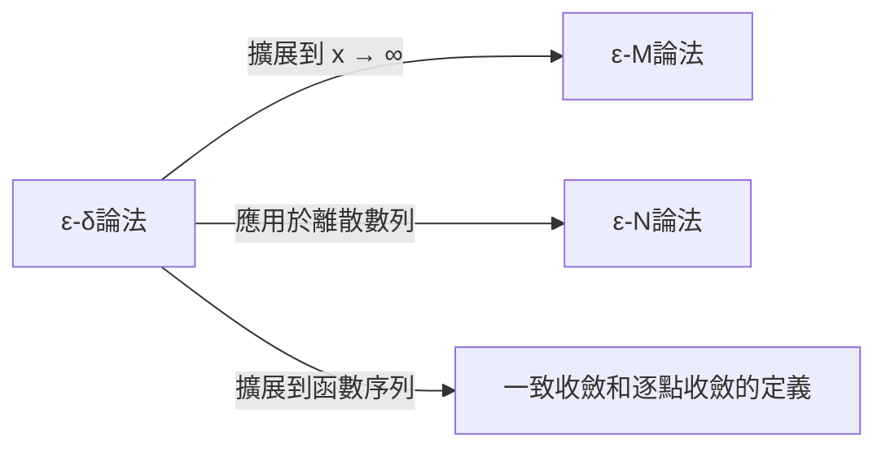

## 1. 引言：高中數學極限的「模糊性」

在高中學習微積分時，我們通常會遇到這樣的極限定義：

> 「對於函數 $f(x)$ ，當 $x$  **無限趨近** 於 $a$ 時，如果 $f(x)$  **無限趨近** 於一個定值 $L$ ，則記為 $\lim_{x \to a} f(x) = L$ 。」

這種「 **無限趨近** 」的表述非常符合我們的直覺，並且在處理多項式函數或三角函數等許多連續函數時，完全沒有問題。畫出圖像的話，當 $x$ 向特定點移動時， $y$ 的值最終落在哪裡是一目了然的。

然而，當我們踏入大學水平的數學，特別是實分析（Real Analysis）領域時，這種直觀的定義立刻就會引發嚴重的問題。所謂「 **無限趨近** 」，具體是指什麼狀態呢？是指距離小於 $0.0001$ 嗎？還是小於 $0.0000001$ ？趨近的速度或方式有規則嗎？

在把嚴謹性置於首位的數學這門學科中，依賴語言細微差別的定義是一個致命的弱點。為了徹底消除這種模糊性，並為極限這一概念賦予鋼鐵般的基石，19世紀的數學家們建立起了 **$\varepsilon-\delta$ （Epsilon-Delta）論法** 。

本文將從為何直觀定義不夠用的歷史背景出發，深入解析 $\varepsilon-\delta$ 論法的準確含義、具體用法，甚至包括如何證明極限不存在的情況。

## 2. 微積分的歷史與嚴謹性危機

當[艾薩克·牛頓](https://kenji.blog/zh-tw/p/newton/)和[戈特弗里德·萊布尼茨](https://kenji.blog/zh-tw/p/leibniz/)在17世紀創立微積分時，他們在很大程度上依賴於「無窮小」（無限小但不為零的量）這一概念。雖然他們的計算在物理學和幾何學上取得了驚人的成果，但其數學基礎卻非常脆弱。

當時的哲學家喬治·貝克萊（George Berkeley）對這種無窮小的概念提出了嚴厲批評，稱之為「 **消失了的量的幽靈** 」。他指出，在計算過程中將其作為非零量進行除法，而在最後又將其視為零而忽略，這種機會主義的操作在邏輯上是荒謬的。

在整個18世紀，微積分不斷發展，但進入19世紀後，僅靠直覺無法處理的「病態函數（pathological functions）」接連被發現，讓數學家們產生了強烈的危機感。為了克服這場危機，[奧古斯丁-路易·柯西](https://kenji.blog/zh-tw/p/cauchy/)和[卡爾·魏爾斯特拉斯](https://kenji.blog/zh-tw/p/weierstrass/)驅逐了可疑的無窮小概念，僅利用實數的性質和不等式重建了微積分。這便是 $\varepsilon-\delta$ 論法的誕生。

## 3. ε-δ論法的正式定義

現在，讓我們來看看使用 $\varepsilon-\delta$ 邏輯對函數極限進行的嚴格定義。

> **定義：函數的極限**
> 函數 $f(x)$ 在 $x \to a$ 時收斂於 $L$ （即 $\lim_{x \to a} f(x) = L$ ），當且僅當以下邏輯表達式成立：
> $\forall \varepsilon > 0, \exists \delta > 0 \text{ s.t. } 0 < |x - a| < \delta \implies |f(x) - L| < \varepsilon$

如果你不習慣數學符號，這可能看起來像密碼一樣。讓我們一步步仔細拆解並翻譯它。

*   $\forall \varepsilon > 0$ ：「對於任意給定的正實數 $\varepsilon$ （誤差的容許範圍）」
*   $\exists \delta > 0$ ：「存在一個正實數 $\delta$ （ $x$ 的接近範圍）」
*   $\text{s.t.}$ ：「使得以下條件滿足（such that）」
*   $0 < |x - a| < \delta$ ：「如果 $x$ 和 $a$ 之間的距離大於 $0$ 且小於 $\delta$ （即 $x$ 在 $a$ 的 $\delta$ 鄰域內，且 $x \neq a$ ）」
*   $\implies$ ：「那麼」
*   $|f(x) - L| < \varepsilon$ ：「 $f(x)$ 和 $L$ 之間的距離必定小於 $\varepsilon$ 」

### 3.1. 作為與惡魔的博弈的解釋

如果我們把這個定義看作是你與一個「多疑的惡魔」之間的遊戲，就會非常容易理解。

1.  **惡魔的挑戰** ：惡魔懷疑極限是 $L$ ，於是拋出一個非常嚴格的誤差容許範圍 $\varepsilon$ （例如 $\varepsilon = 0.001$ ）。「有本事你把 $f(x)$ 限制在距離 $L$ 不超過 $0.001$ 的範圍內啊！」
2.  **你的回應** ：你計算並提出 $x$ 需要離 $a$ 多近，也就是 $\delta$ 的值。「好，只要我把 $x$ 限制在距離 $a$ 不超過 $\delta = 0.0005$ 的範圍內， $f(x)$ 就絕對能落在你指定的範圍內！」
3.  **勝利條件** ：如果無論惡魔拋出多麼小的 $\varepsilon$ ，你總是能找到（存在）一個對應的 $\delta$ 來應對，那麼你就贏了，同時也證明了極限就是 $L$ 。

```mermaid
flowchart TD
    A["惡魔提供任意的ε > 0"] --> B["你找到並提供合適的δ > 0"]
    B --> C{"對於任意滿足 0 < |x - a| < δ 的 x..."}
    C -- "驗證" --> D{"是否滿足 |f("x") - L| < ε？"}
    D -- "是" --> E["遊戲繼續（如果對所有ε都可能，則證明完畢）"]
    D -- "否" --> F["證明失敗（不是極限）"]
```

## 4. 實例證明

純粹抽象的定義很難理解，因此讓我們使用具體函數，透過 $\varepsilon-\delta$ 論法來進行一些證明。

### 4.1. 一次函數的證明

作為最簡單的例子，我們來證明 $\lim_{x \to 2} (3x - 1) = 5$ 。

**【思考過程（草稿）】**
證明的目標是，對於任意給定的 $\varepsilon > 0$ ，找到一個 $\delta > 0$ ，使得 $|(3x - 1) - 5| < \varepsilon$ 成立。
整理式子，得到：
$|(3x - 1) - 5| = |3x - 6| = 3|x - 2|$
我們能夠控制的是 $|x - 2| < \delta$ 這個條件。
因此， $3|x - 2| < 3\delta$ 。
由於我們希望這等於 $\varepsilon$ ，所以應令 $3\delta = \varepsilon$ ，也就是說只要設定 $\delta = \frac{\varepsilon}{3}$ 就可以了。

**【正式證明】**
假設給定任意的 $\varepsilon > 0$ 。
此時，選擇 $\delta = \frac{\varepsilon}{3}$ 。因為 $\varepsilon > 0$ ，所以顯然有 $\delta > 0$ 。
那麼，對於任意滿足 $0 < |x - 2| < \delta$ 的 $x$ ，以下不等式成立：
$$|(3x - 1) - 5| = |3x - 6| = 3|x - 2| < 3\delta = 3\left(\frac{\varepsilon}{3}\right) = \varepsilon$$
因此，我們證明了 $0 < |x - 2| < \delta \implies |(3x - 1) - 5| < \varepsilon$ 。
所以，根據定義， $\lim_{x \to 2} (3x - 1) = 5$ 。 $\blacksquare$

### 4.2. 二次函數的證明（δ的限制技巧）

接下來，證明一個稍微複雜的極限： $\lim_{x \to 3} x^2 = 9$ 。因為包含 $x$ 的項被保留了下來，所以需要一點技巧。

**【思考過程（草稿）】**
目標是找到一個 $\delta$ 使得 $|x^2 - 9| < \varepsilon$ 。
$|x^2 - 9| = |x - 3||x + 3|$
在這裡，我們可以構造 $|x - 3| < \delta$ ，但是 $|x + 3|$ 成了阻礙。 $\delta$ 不能依賴於 $x$ （必須作為一個常數提出）。
因此，首先假設 $x$ 足夠接近 $3$ ，並估計 $|x + 3|$ 的最大值。
例如，我們 **限制** $\delta \le 1$ 。
那麼， $|x - 3| < 1$ ，這意味著 $-1 < x - 3 < 1$ ，即 $2 < x < 4$ 。
在這種情況下， $x + 3$ 的範圍是 $5 < x + 3 < 7$ ，這保證了 $|x + 3| < 7$ 。
因此，我們可以建立不等式 $|x - 3||x + 3| < 7|x - 3|$ 。
為了使其小於 $\varepsilon$ ，我們需要 $7|x - 3| < \varepsilon$ ，即 $|x - 3| < \frac{\varepsilon}{7}$ 。
由於我們還必須遵守最初的限制 $\delta \le 1$ ，因此只需選擇 $1$ 和 $\frac{\varepsilon}{7}$ 之中 **較小的一個** 作為 $\delta$ 就完美了。

**【正式證明】**
假設給定任意的 $\varepsilon > 0$ 。
此時，選擇 $\delta = \min\left(1, \frac{\varepsilon}{7}\right)$ 。
那麼，考慮任意滿足 $0 < |x - 3| < \delta$ 的 $x$ 。
首先，由於 $\delta \le 1$ ，得 $|x - 3| < 1$ ，推導出 $2 < x < 4$ ，從而 $|x + 3| < 7$ 成立。
其次，由於 $\delta \le \frac{\varepsilon}{7}$ ，同樣有 $|x - 3| < \frac{\varepsilon}{7}$ 成立。
利用這些條件，得到：
$$|x^2 - 9| = |x - 3||x + 3| < |x - 3| \cdot 7 < \frac{\varepsilon}{7} \cdot 7 = \varepsilon$$
因此，我們證明了 $0 < |x - 3| < \delta \implies |x^2 - 9| < \varepsilon$ 。
所以， $\lim_{x \to 3} x^2 = 9$ 。 $\blacksquare$

## 5. 為什麼「無限趨近」不夠？病態函數的登場

讀到這裡，你可能會想，「這不是僅僅讓計算變得更繁瑣了嗎？」。然而，當處理無法繪製圖像的「病態函數」時， $\varepsilon-\delta$ 論法才能展現出其真正的力量。

作為一個著名的例子，讓我們考慮一下 **狄利克雷函數（Dirichlet function）** 。

$$ f(x) = \begin{cases} 1 & (\text{當 } x \text{ 是有理數時}) \\ 0 & (\text{當 } x \text{ 是無理數時}) \end{cases} $$

這個函數在所有有理數點上的值為 $1$ ，在無理數點上的值為 $0$ 。由於有理數和無理數在實數軸上無限密集地混合在一起，人類的眼睛根本無法畫出這個函數的圖像。

現在，考慮當 $x \to 0$ 時的極限 $\lim_{x \to 0} f(x)$ 。使用「當 $x$ 無限趨近於 $0$ 時」這種直觀表述，我們完全無法判斷 $f(x)$ 是趨近於 $1$ 還是 $0$ 。如果你只沿著有理數趨近，它就是 $1$ ；如果只沿著無理數趨近，它就是 $0$ 。

利用 $\varepsilon-\delta$ 論法，我們可以嚴格證明這個極限 **不存在** 。關於極限為 $L$ 這個命題的否定如下所示：

> **定義的否定（極限不是 L）**
> $\exists \varepsilon > 0 \text{ s.t. } \forall \delta > 0, \exists x \text{ s.t. } (0 < |x - a| < \delta \land |f(x) - L| \ge \varepsilon)$

換句話說，「當惡魔提出一個特定的 $\varepsilon$ 時，無論你提出什麼樣的 $\delta$ ，在那個 $\delta$ 範圍內，必定存在一個令人討厭的 $x$ ，它偏離目標值 $L$ 的距離大於或等於 $\varepsilon$ 。」

**【狄利克雷函數極限不存在的證明】**
假設極限是某個值 $L$ ，以此來導出矛盾。
設定 $\varepsilon = \frac{1}{2}$ 。
無論你選擇什麼樣的 $\delta > 0$ ，在區間 $(-\delta, \delta)$ 內必定存在有理數 $x_1$ 和無理數 $x_2$ 。
我們有 $f(x_1) = 1$ 和 $f(x_2) = 0$ 。
如果極限是 $L$ ，根據定義，必須同時滿足 $|1 - L| < \frac{1}{2}$ 和 $|0 - L| < \frac{1}{2}$ 。
但是，根據三角不等式，
$1 = |1 - 0| = |(1 - L) + (L - 0)| \le |1 - L| + |L - 0| < \frac{1}{2} + \frac{1}{2} = 1$
這導致了 $1 < 1$ 的矛盾。
因此，極限 $L$ 不存在。 $\blacksquare$

就像這樣，對於直覺無法處理的問題，能夠給出明確的黑白分明的答案，正是 $\varepsilon-\delta$ 論法的最大優勢。

## 6. 進一步擴展：趨於無窮大的極限

極限的概念不僅適用於趨近有限值的情況，也適用於趨於無窮大的極限，例如 $x \to \infty$ 。在這種情況下，會使用 $\varepsilon-\delta$ 論法的變體： **$\varepsilon-M$ 論法** ，或針對數列的 **$\varepsilon-N$ 論法** 。

例如， $\lim_{x \to \infty} f(x) = L$ 的嚴格定義如下：

> $\forall \varepsilon > 0, \exists M > 0 \text{ s.t. } x > M \implies |f(x) - L| < \varepsilon$

意思是「對於任何任意小的誤差 $\varepsilon$ ，只要你設定一個足夠大的邊界值 $M$ ，當 $x$ 超過 $M$ 之後， $f(x)$ 就會永遠保持在距離 $L$ 的 $\varepsilon$ 誤差範圍內。」你可以看出，其邏輯框架與 $\varepsilon-\delta$ 論法完全相同。



## 7. 總結

「 $x$ 無限趨近於 $a$ 」這一直觀解釋，對於初學者把握極限的意象非常有效。然而，作為構建數學大廈基礎所需的「絕對確定性」，它是不夠的。

乍看之下， $\varepsilon-\delta$ 論法像是一堆令人畏懼的不等式羅列，但其本質在於 **「能否將誤差控制得任意小？」這一靜態條件的檢查** 。將包含「動態趨近」這一時間要素的模糊概念，替換為「存在滿足不等式的範圍」這一邏輯上的、靜態的狀態，正是19世紀數學家們偉大的一次範式轉變。

正因為有了這個嚴格的基礎，現代微積分、應用它的物理學和工程學，乃至作為人工智慧基礎的優化理論，才得以帶著堅定不移的確定性在運轉。當你在學習極限遇到困難時，請回想一下與惡魔的 $\varepsilon-\delta$ 遊戲，把它當成一個邏輯謎題來享受吧。
