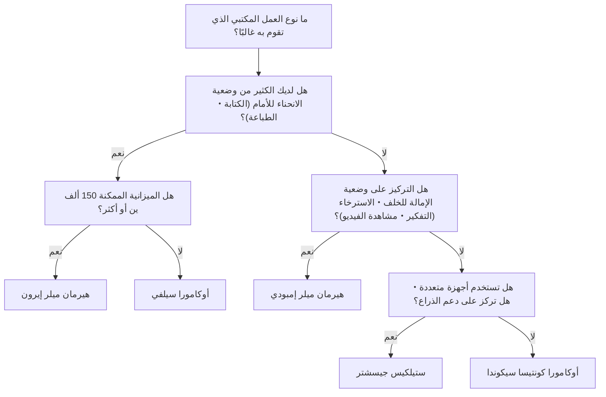
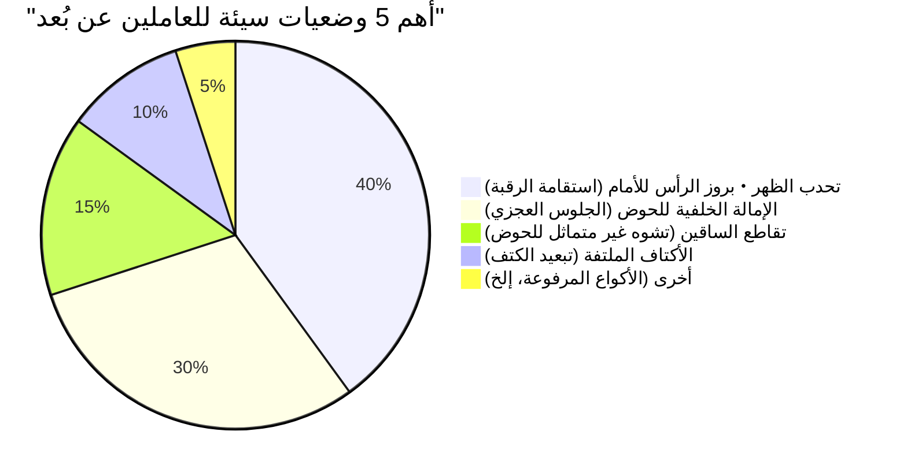

أصبح العمل عن بُعد أمرًا شائعًا، حيث يقضي العديد من مهندسي البرمجيات والعاملين في مجال المعرفة أكثر من 8 ساعات يوميًا أمام المكاتب. هذه الوضعية الطويلة للجلوس تفرض حملًا قاسيًا للغاية على جسم الإنسان، وخاصة على العمود الفقري القطني (Lumbar spine).

في هذا المقال، لن نكتفي بتقديم "توصيات للكراسي"، بل سنستخدم **علم التشريح (Anatomy)** و**الميكانيكا الحيوية (Biomechanics)**، والنهج الفيزيائي لشرح سبب حاجتنا إلى كراسي مريحة (إرغونومية)، وكيف يجب أن تختار الكرسي الأمثل لك بالتفصيل.

---

## 1. الميكانيكا الحيوية لوضعية الجلوس والاعتبارات التشريحية

لم يُصمم جسم الإنسان في الأساس "للاستمرار في الجلوس". فالعمود الفقري المتكيف مع المشي المستقيم على قدمين يرسم منحنى لطيفًا على شكل حرف S (القعس العنقي، الحدب الصدري، القعس القطني) عند النظر إليه من الجانب. هذا المنحنى على شكل حرف S هو الذي يعمل كجهاز تعليق يوزع الجاذبية ويمتص الصدمات عند المشي أو الوقوف.

### فيزياء الضغط داخل القرص الفقري

عند الانتقال من وضعية الوقوف إلى الجلوس، يميل الحوض إلى الانحناء للخلف، ومعه يُفقد القعس القطني (الانحناء للأمام) ويصبح أكثر عرضة للحدب (التقوس للخلف). دعونا نفكر في التغييرات الفيزيائية التي تحدث في "القرص الفقري (Intervertebral disc)"، وهو النسيج الغضروفي الموجود بين الفقرات القطنية في هذه الحالة.

يتم التعبير عن الضغط $P$ باستخدام القوة المطبقة $F$ والمساحة التي تُطبق عليها القوة $A$ بالمعادلة التالية:

$$ P = \frac{F}{A} $$

وفقًا للبحث الشهير الذي أجراه جراح العظام السويدي ألف ناتشيمسون (Alf Nachemson)، إذا اعتبرنا الضغط داخل القرص بين الفقرتين القطنيتين الثالثة والرابعة أثناء الوقوف هو 100%، فقد أظهر أن الجلوس بوضعية صحيحة يبلغ 140%، والجلوس بوضعية الانحناء للأمام (تحدب الظهر) يصل إلى ما بين 185% وأكثر من 200%.

في هذا الوقت، ليس فقط قوة الضغط $F$ الناتجة عن كتلة النصف العلوي من الجسم، بل إن عزم الانحناء الناتج عن وضعية الانحناء للأمام يركز الإجهاد في مناطق معينة من القرص الفقري (خاصة الرباط الحلقي الخلفي)، مما يزيد بشكل حاد من الضغط $P_{local}$ في مساحة موضعية $A_{local}$. عند التفكير بالوحدة باسكال (Pa, $N/m^2$)، يتركز ضغط هائل يصل إلى عدة ميجاباسكال (MPa) على حلقة ليفية معينة، وهذا هو السبب المباشر لانفتاق القرص أو آلام الظهر المزمنة.

### حساب عزم الدوران في الوضعية السيئة (تحدب الظهر والجلوس العجزي)

في "وضعية بروز الرأس للأمام (Forward Head Posture)" أو "الجلوس العجزي (Slouching)" التي غالبًا ما يقوم بها مهندسو البرمجيات عند النظر إلى الشاشة، يتولد عزم دوران (عزم دوران دوراني) هائل في قاعدة العمود الفقري (مفصل L5/S1).

يُعبر عن عزم الدوران $\tau$ بالمعادلة التالية:

$$ \tau = r \times F \sin(\theta) $$

حيث:
- $r$ : المسافة من مفصل L5/S1 إلى مركز ثقل النصف العلوي من الجسم (ذراع العزم)
- $F$ : قوة جاذبية النصف العلوي من الجسم (الكتلة $m \times$ تسارع الجاذبية $g$)
- $\theta$ : الزاوية المحصورة بين متجه الجاذبية ومحور جذع النصف العلوي من الجسم

كلما زاد الانحناء للأمام أو زاد تحدب الظهر وتحرك مركز الثقل للأمام، زاد طول ذراع العزم $r$ وزادت $\theta$، وبالتالي يجب على عضلات أسفل الظهر (مثل مجموعة العضلات الناصبة للعمود الفقري) أن تمارس باستمرار قوة شد معاكسة هائلة للتغلب على عزم الدوران الأمامي $\tau$. هذه هي الآلية الفيزيائية لـ "آلام أسفل الظهر والظهر الناتجة عن إرهاق العضلات".

---

## 2. آلية الكراسي المريحة: اختراق تقني

لتقليل الحمل الميكانيكي الحيوي المذكور أعلاه، يتم دمج آليات فيزيائية وهندسية متعددة في الكراسي المريحة الراقية.

### دعم أسفل الظهر والحفاظ على منحنى S للعمود الفقري

الهدف الأكبر لدعم أسفل الظهر هو تقويم الحوض ودعم القعس القطني (Lordosis) جسديًا.
دعم أسفل الظهر المثالي يدعم الفقرات القطنية إلى الجزء العلوي من الحوض بـ "سطح" وليس بنقطة. من خلال تعظيم مساحة التلامس $A$، فإنه يوفر قوة الدعم اللازمة $F$ مع تقليل الضغط $P$ في معادلة $P = F/A$ المذكورة أعلاه.
في السنوات الأخيرة، أصبحت الآلية التي تدعم كلاً من العجز (Sacrum) والقطني (Lumbar) بشكل مستقل وتشجع الإمالة الأمامية الطبيعية للحوض، مثل "PostureFit SL" في كرسي Herman Miller Aeron، هي السائدة.

### آلية الإمالة المتزامنة (Synchro-Tilt)

في كراسي المكاتب التقليدية الرخيصة، كانت "الإمالة المركزية" حيث يميل مسند الظهر والمقعد بنفس الزاوية شائعة. ومع ذلك، يؤدي هذا إلى رفع الفخذين عند الإمالة للخلف، مما يضغط على تدفق الدم خلف الركبتين.

"آلية الإمالة المتزامنة" هي آلية يميل فيها مسند الظهر والمقعد بنسب مختلفة (عادة من 2:1 إلى 3:1) بينما يكونان متصلين. بفضل هذا، حتى عند الإمالة للخلف، لا ترتفع الحافة الأمامية للمقعد كثيرًا، مما يتيح لك تحرير حمل الضغط على العمود الفقري مع إبقاء باطن قدميك ملامسًا للأرض بقوة.

### أهمية الإمالة الأمامية (Forward-Tilt)

العديد من أعمال الكمبيوتر مثل البرمجة والكتابة وعمليات الماوس الدقيقة تحفز بشكل أساسي "وضعية الانحناء للأمام".
وظيفة الإمالة الأمامية هي ميزة تميل المقعد بالكامل للأمام بضع درجات (مثال: -5 درجات). من خلال إمالة المقعد للأمام، تفتح زاوية مفصل الورك إلى 90 درجة أو أكثر (100 درجة إلى 110 درجات)، ويستقيم الحوض بشكل طبيعي. بفضل هذا، يتم الحفاظ على منحنى S للفقرات القطنية، ويمكن تقليل عزم الدوران $\tau$ المذكور أعلاه بشكل كبير.

---

## 3. مقارنة هيكلية للطرازات الفاخرة

هنا، نقارن النهج الهيكلي للكراسي المريحة الفاخرة التمثيلية المدعومة من المهندسين حول العالم.

### كرسي هيرمان ميلر إيرون (Herman Miller Aeron)
**المميزات: توزيع ضغط الجسم والإمالة الأمامية من خلال شبكة بيليكل (Pellicle)**

صدر عام 1994 وهو تحفة غيرت تاريخ كراسي المكتب. مادة الشبكة الفريدة المسماة "بيليكل" تغير توترها لتناسب شكل جسم الجالس، وتوزع الضغط بالتساوي على الفخذين والأرداف.
ما يميزه بشكل خاص هو **آلية الإمالة الأمامية** الممتازة. بالنسبة للمهندسين الذين لديهم الكثير من العمل الذي يركز على الشاشة مثل تطوير البرمجيات، فإن كرسي إيرون، الذي يميل للأمام مع المقعد ويقوم الحوض، هو أفضل أداة لتقليل الحمل على أسفل الظهر.

### كرسي هيرمان ميلر إمبودي (Herman Miller Embody)
**المميزات: هيكل البكسل ووضعية الإمالة للخلف الإيجابية للصحة**

يتميز كرسي إمبودي بعدد لا يحصى من "البكسلات (نقاط الدعم)" على مسند الظهر والمقعد، مما يوفر دعمًا ديناميكيًا يتبع الحركات الدقيقة لجسم الإنسان.
في حين أن كرسي إيرون مناسب لعمل الإمالة الأمامية، فإن كرسي إمبودي لديه فلسفة تصميم توصي بالعمل في **وضعية الإمالة للخلف (الاستلقاء)**. من خلال إسناد وزنك على مسند الظهر الواسع وتحرير قوة الضغط $F$ المطبقة على العمود الفقري إلى مسند الظهر، فإنه يقلل بشكل كبير من التعب أثناء التفكير أو البرمجة لفترات طويلة.

### كرسي ستيلكيس جيسشتر / ليب (Steelcase Gesture / Leap)
**المميزات: تقنية 3D LiveBack وتتبع VAD (البصر وحركة الذراع)**

تتميز كراسي Steelcase بتقنية "LiveBack" التي تتشوه لتقليد حركة العمود الفقري. حتى عندما يتحرك العمود الفقري بشكل غير متماثل، فإن مسند الظهر يتبع ذلك بشكل متناسب.
على وجه الخصوص، تم تطوير Gesture من خلال دراسة التغيرات في الموقف عند استخدام الأجهزة الحديثة المتنوعة مثل الهواتف الذكية والأجهزة اللوحية، ويتمتع مسند الذراع بنطاق حركة مذهل. من خلال دعم الذراعين بشكل صحيح في أي وضع، يقلل من الحمل على العضلة شبه المنحرفة، وهو سبب تصلب الكتفين وآلام الرقبة.

### كرسي أوكامورا سيلفي / كونتيسا (Okamura Sylphy / Contessa)
**المميزات: بيئة العمل اليابانية والتشغيل الذكي**

يتميز كرسي Okamura Contessa Seconda بتصميم جميل لجيورجيتو جيوجيارو و"تشغيل ذكي" ممتاز يسمح لك بضبط ارتفاع المقعد وإمالته من أطراف مساند الذراعين.
من ناحية أخرى، يحظى كرسي Sylphy بدعم هائل من العاملين عن بُعد في اليابان بسبب النطاق السعري السهل نسبيًا لشرائه، على الرغم من احتوائه على "آلية ضبط منحنى الظهر" التي يمكنها ضبط منحنى مسند الظهر ليناسب شكل جسم الجالس، وآلية إمالة أمامية ممتازة تضاهي كرسي إيرون.

---

## 4. كيفية اختيار الكرسي الأنسب لك (شجرة القرار)

يختلف الكرسي المثالي حسب حجم جسمك، أسلوب عملك، وميزانيتك. يرجى الرجوع إلى المخطط الانسيابي أدناه للعثور على النموذج الأنسب لك.

---

## 5. تحسين مساحة العمل: الكرسي وحده لا يحل المشكلة

مهما كان الكرسي المريح الذي تستخدمه ممتازًا، فلن يكون له معنى إذا لم يتطابق ارتفاع المكتب وارتفاع الشاشة.

### فيزياء ارتفاع المكتب والشاشة

1. **ارتفاع المكتب**: الارتفاع المثالي هو عندما تكون زاوية الكوع 90-100 درجة عند وضع يديك على لوحة المفاتيح. إذا كانت باطن قدميك لا تلمس الأرض بشكل مسطح، فيرجى إدخال مسند للقدمين (Footrest) لمنع الضغط على الجزء الخلفي من الفخذين.
2. **ارتفاع الشاشة**: اضبط الحافة العلوية للشاشة لتكون في نفس مستوى خط البصر أو أقل قليلاً. إذا انخفض خط البصر أكثر من اللازم، سيتولد توتر مفرط في عضلات الرقبة (مجموعة العضلات القفوية) لدعم الرأس (حوالي 5 كجم)، مما يسبب مشكلة استقامة الرقبة (Straight neck).

يُظهر المخطط الدائري أدناه نسبة الوضعيات السيئة الشائعة بين العاملين عن بُعد. من المهم تهيئة بيئتك لتجنب هذه الوضعيات.

---

## الخلاصة: الكرسي المريح كاستثمار في الصحة

الكرسي المريح ليس شراءً رخيصًا على الإطلاق. فليس من النادر العثور على طرازات تتجاوز أسعارها 100 ألف إلى 200 ألف ين. ومع ذلك، بالنظر إلى أنك ستقضي حوالي 2000 ساعة سنويًا، بواقع 8 ساعات يوميًا عليه، يمكن القول إنه "الاستثمار الأكثر فعالية من حيث التكلفة (جهاز ذو عائد استثمار مرتفع)" لمنع انخفاض الإنتاجية ومخاطر التكاليف الطبية الناجمة عن آلام الظهر.

يرجى إعادة النظر في أسلوب عملك من وجهة نظر الميكانيكا الحيوية، واختيار "الكرسي الصحيح فيزيائيًا" الذي سيدعم بدقة الهيكل العظمي والعضلات الخاصة بك. هذا هو أكبر سر للاستمرار في الهندسة بشكل مريح لفترة طويلة.
