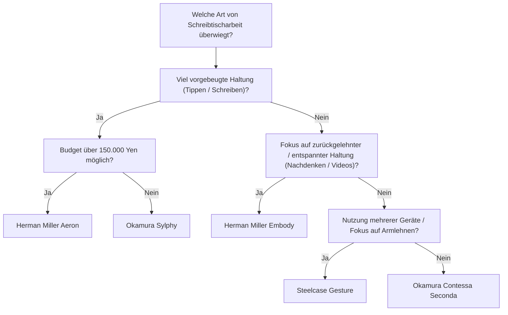
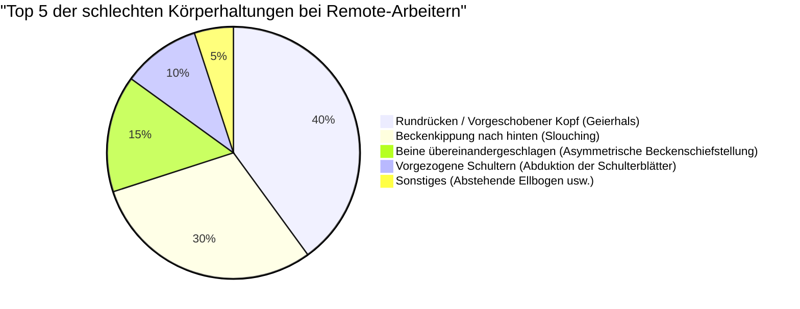

Remote-Arbeit ist zur Norm geworden, und viele Software-Ingenieure und Wissensarbeiter verbringen mehr als 8 Stunden am Tag vor dem Schreibtisch. Diese längere Sitzhaltung stellt eine extreme Belastung für den menschlichen Körper dar, insbesondere für die Lendenwirbelsäule (Lumbar spine).

In diesem Artikel geht es nicht nur um die Vorstellung „empfohlener Stühle“, sondern wir erklären ausführlich mittels **Anatomie (Anatomy)**, **Biomechanik (Biomechanics)** und physikalischen Ansätzen, warum ein ergonomischer Stuhl notwendig ist und wie Sie den für sich optimalen Stuhl auswählen sollten.

---

## 1. Biomechanik und anatomische Betrachtung der Sitzhaltung

Der menschliche Körper ist von Natur aus nicht dafür konzipiert, „ständig zu sitzen“. Die an den aufrechten, zweibeinigen Gang angepasste Wirbelsäule beschreibt von der Seite betrachtet eine sanfte S-Kurve (Halslordose, Brustkyphose, Lendenlordose). Genau diese S-Kurve fungiert als Federung, die die Schwerkraft verteilt und Stöße beim Gehen oder Stehen absorbiert.

### Die Physik des Bandscheibeninnendrucks

Beim Übergang vom Stehen zum Sitzen neigt das Becken dazu, nach hinten zu kippen, wodurch die Lendenlordose (Krümmung nach vorne) verloren geht und eine Kyphose (Krümmung nach hinten) begünstigt wird. Betrachten wir, welche physikalischen Veränderungen dabei in den „Bandscheiben (Intervertebral disc)“, dem Knorpelgewebe zwischen den Lendenwirbeln, auftreten.

Der Druck $P$ wird durch die einwirkende Kraft $F$ und die Fläche $A$, auf die die Kraft einwirkt, mit der folgenden Formel ausgedrückt:

$$ P = \frac{F}{A} $$

Laut der berühmten Studie des schwedischen Orthopäden Alf Nachemson steigt der Bandscheibeninnendruck zwischen dem 3. und 4. Lendenwirbel – ausgehend von 100% im Stehen – bei einer korrekten Sitzhaltung auf 140% an. Bei einer nach vorne gebeugten Haltung (Rundrücken) erreicht er sogar 185% bis über 200%.

Dabei konzentrieren nicht nur die Kompressionskraft $F$ durch die Masse des Oberkörpers, sondern auch das Biegemoment durch die vorgebeugte Haltung die Spannungen auf bestimmte Bereiche der Bandscheibe (insbesondere das hintere Ringband) und lassen den Druck $P_{local}$ auf einer lokalen Fläche $A_{local}$ drastisch ansteigen. Denkt man an die Einheit Pascal (Pa, $N/m^2$), konzentriert sich ein gewaltiger Druck von mehreren Megapascal (MPa) auf bestimmte Faserringe. Dies ist die direkte Ursache für Bandscheibenvorfälle und chronische Rückenschmerzen.

### Berechnung des Drehmoments bei schlechter Körperhaltung (Rundrücken / Beckenkippung nach hinten)

Bei der bei Software-Ingenieuren häufig anzutreffenden „vorgeschobenen Kopfhaltung (Forward Head Posture)“ oder dem „Lümmeln / nach hinten gekippten Becken (Slouching)“ beim Blick auf den Monitor entsteht ein starkes Drehmoment an der Basis der Wirbelsäule (L5/S1-Gelenk).

Das Drehmoment $\tau$ wird durch die folgende Formel ausgedrückt:

$$ \tau = r \times F \sin(\theta) $$

Hierbei ist:
- $r$ : Der Abstand vom L5/S1-Gelenk zum Schwerpunkt des Oberkörpers (Momentenarm)
- $F$ : Die Schwerkraft des Oberkörpers (Masse $m \times$ Erdbeschleunigung $g$)
- $\theta$ : Der Winkel zwischen dem Schwerkraftvektor und der Rumpfachse des Oberkörpers

Je mehr man sich nach vorne beugt oder je weiter der Schwerpunkt durch einen Rundrücken nach vorne verlagert wird, desto länger wird der Momentenarm $r$ und $\theta$ nimmt zu. Daher muss die Rückenmuskulatur (wie z. B. die Rückenstrecker) kontinuierlich eine starke, entgegengesetzte Zugkraft aufbringen, um diesem nach vorne kippenden Drehmoment $\tau$ entgegenzuwirken. Dies ist der physikalische Mechanismus von „Rücken- und Kreuzschmerzen durch Muskelermüdung“.

---

## 2. Der Mechanismus ergonomischer Stühle: Technische Durchbrüche

Um die oben genannten biomechanischen Belastungen zu reduzieren, sind in High-End-Ergonomiestühlen mehrere physikalische und maschinenbautechnische Mechanismen integriert.

### Lordosenstütze und Erhaltung der S-Kurve der Wirbelsäule

Der Hauptzweck der Lordosenstütze besteht darin, das Becken aufzurichten und die Lordose der Lendenwirbelsäule physisch zu unterstützen.
Eine ideale Lordosenstütze stützt die Lendenwirbelsäule bis zum oberen Beckenbereich nicht punktuell, sondern „flächig“. Durch die Maximierung der Kontaktfläche $A$ wird der Druck $P$ in der zuvor erwähnten Formel $P = F/A$ minimiert und gleichzeitig die erforderliche Stützkraft $F$ bereitgestellt.
In den letzten Jahren dominieren Mechanismen wie das „PostureFit SL“ des Herman Miller Aeron, die sowohl das Kreuzbein (Sacrum) als auch die Lendenwirbelsäule (Lumbar) unabhängig voneinander stützen und eine natürliche Vorwärtsneigung des Beckens fördern.

### Synchro-Tilt-Mechanismus (Synchro-Mechanik)

Bei herkömmlichen, preiswerten Bürostühlen war die „Zentral-Wippmechanik“ üblich, bei der sich Rückenlehne und Sitzfläche im gleichen Winkel neigen. Dabei heben sich jedoch beim Zurücklehnen die Oberschenkel an, wodurch der Blutfluss in den Kniekehlen abgedrückt wird.

Der „Synchro-Tilt-Mechanismus“ ist eine Mechanik, bei der Rückenlehne und Sitzfläche gekoppelt sind, sich aber in unterschiedlichen Verhältnissen (normalerweise 2:1 bis 3:1) neigen. Dadurch hebt sich die Vorderkante der Sitzfläche beim Zurücklehnen kaum an, die Fußsohlen bleiben fest auf dem Boden, und die Kompressionsbelastung der Wirbelsäule kann entlastet werden.

### Die Bedeutung der Sitzneigeverstellung (Forward-Tilt)

Ein Großteil der PC-Arbeit wie Programmieren, Tippen und präzise Mausbewegungen verleitet naturgemäß zu einer „vorgebeugten Haltung“.
Die Sitzneigeverstellung (Forward-Tilt) ist eine Funktion, die die gesamte Sitzfläche um einige Grad (z. B. -5 Grad) nach vorne neigt. Durch das Vorwärtsneigen der Sitzfläche öffnet sich der Hüftwinkel auf über 90 Grad (100 bis 110 Grad) und das Becken richtet sich natürlich auf. Dadurch bleibt die S-Kurve der Lendenwirbelsäule erhalten und das oben erwähnte Drehmoment $\tau$ kann drastisch reduziert werden.

---

## 3. Architekturvergleich von High-End-Modellen

Hier vergleichen wir die strukturellen Ansätze repräsentativer High-End-Ergonomiestühle, die von Ingenieuren weltweit geschätzt werden.

### Herman Miller Aeron (Aeron Chair)
**Eigenschaften: Druckverteilung durch Pellicle (Netzgewebe) und Sitzneigeverstellung nach vorne**

Dieses 1994 erschienene Meisterwerk hat die Geschichte der Bürostühle verändert. Das einzigartige Netzmaterial namens „Pellicle“ passt seine Spannung an die Körperform des Sitzenden an und verteilt den Druck gleichmäßig auf Oberschenkel und Gesäß.
Besonders hervorzuheben ist die extrem hervorragende **Sitzneigeverstellung nach vorne (Forward-Tilt)**. Für Ingenieure, die bei Arbeiten wie der Softwareentwicklung häufig konzentriert auf den Bildschirm schauen, ist der Aeron Chair, der durch die Neigung der Sitzfläche das Becken aufrichtet, das ultimative Werkzeug zur Minimierung der Rückenbelastung.

### Herman Miller Embody (Embody Chair)
**Eigenschaften: Pixelstruktur und gesundheitsfördernde zurückgelehnte Haltung**

Der Embody Chair verfügt über unzählige „Pixel (Stützpunkte)“ in der Rückenlehne und Sitzfläche und bietet so eine dynamische Unterstützung, die selbst den feinsten Bewegungen des menschlichen Körpers folgt.
Während der Aeron Chair eher für vorgebeugte Arbeiten geeignet ist, verfolgt der Embody Chair das Designkonzept, die Arbeit in einer **zurückgelehnten Haltung (Reclining-Position)** zu empfehlen. Indem man sein Gewicht der großen Rückenlehne anvertraut und die auf die Wirbelsäule einwirkende Kompressionskraft $F$ in die Lehne ableitet, wird die Ermüdung bei stundenlanger Denkarbeit oder beim Programmieren auf ein Minimum reduziert.

### Steelcase Gesture / Leap (Gesture / Leap)
**Eigenschaften: 3D LiveBack-Technologie und Anpassung an VAD (Visuelle und Arm-Bewegungen)**

Die Stühle von Steelcase zeichnen sich durch die „LiveBack“-Technologie aus, die sich verformt und die Bewegungen der Wirbelsäule nachahmt. Selbst bei asymmetrischen Bewegungen der Wirbelsäule passt sich die Rückenlehne entsprechend an.
Besonders der Gesture wurde durch die Erforschung von Haltungsänderungen bei der Nutzung moderner Geräte wie Smartphones und Tablets entwickelt und verfügt über einen erstaunlichen Bewegungsradius der Armlehnen. Durch die optimale Unterstützung der Arme in jeder Haltung wird die Belastung des Trapezmuskels, der Ursache für steife Schultern und Nackenschmerzen ist, reduziert.

### Okamura Sylphy / Contessa (Sylphy / Contessa)
**Eigenschaften: Japanische Ergonomie und Smart Operation**

Der Contessa Seconda von Okamura besticht durch sein wunderschönes, von Giorgetto Giugiaro entworfenes Design und seine „Smart Operation“, bei der Sitzhöhe und Neigung über Tasten an den Armlehnenenden eingestellt werden können.
Andererseits erfreut sich der Sylphy großer Beliebtheit bei japanischen Remote-Arbeitern, da er mit seinem „Back Curve Adjust“-Mechanismus, der die Wölbung der Rückenlehne an den Körper des Sitzenden anpasst, und einer hervorragenden, dem Aeron Chair ebenbürtigen Sitzneigeverstellung ausgestattet ist, und das bei einem relativ erschwinglichen Preis.

---

## 4. Wie man den für sich besten Stuhl auswählt (Entscheidungsbaum)

Der optimale Stuhl hängt von Körpergröße, Arbeitsstil und Budget ab. Nutzen Sie das folgende Flussdiagramm, um das für Sie beste Modell zu finden.

---

## 5. Optimierung des Arbeitsplatzes: Ein Stuhl allein löst das Problem nicht

Egal wie hervorragend ein ergonomischer Stuhl ist, es nützt nichts, wenn die Höhe des Schreibtisches und des Monitors nicht stimmen.

### Die Physik der Schreibtisch- und Monitorhöhe

1. **Schreibtischhöhe**: Ideal ist eine Höhe, bei der die Ellenbogen einen Winkel von 90 bis 100 Grad bilden, wenn die Hände auf der Tastatur liegen. Wenn Ihre Fußsohlen nicht flach auf dem Boden aufliegen, verwenden Sie eine Fußstütze (Footrest), um einen Druck auf die Rückseite der Oberschenkel zu vermeiden.
2. **Monitorhöhe**: Stellen Sie den Monitor so ein, dass sich der obere Rand auf Augenhöhe oder leicht darunter befindet. Wenn die Blickrichtung zu weit nach unten gerichtet ist, entsteht eine übermäßige Spannung in der Nackenmuskulatur (hintere Halsmuskulatur), um den Kopf (ca. 5 kg) zu stützen, was die Ursache für einen vorgeschobenen Kopf (Geierhals) ist.

Das folgende Kreisdiagramm zeigt den Anteil der bei Remote-Arbeitern häufig auftretenden Fehlhaltungen. Es ist wichtig, die Umgebung so zu gestalten, dass diese Haltungen vermieden werden.

---

## Fazit: Der ergonomische Stuhl als Investition in die Gesundheit

Ein ergonomischer Stuhl ist keinesfalls eine günstige Anschaffung. Modelle, die 100.000 bis über 200.000 Yen kosten, sind keine Seltenheit. Wenn man jedoch bedenkt, dass man 8 Stunden am Tag und etwa 2000 Stunden im Jahr darauf verbringt, kann man sagen, dass es das „Gerät mit dem höchsten Return on Investment (hoher ROI)“ ist, um Produktivitätsverluste durch Rückenschmerzen und das Risiko von Arztkosten im Vorfeld zu vermeiden.

Überprüfen Sie Ihren Arbeitsstil aus biomechanischer Sicht und wählen Sie sorgfältig „den physikalisch richtigen Stuhl“ aus, der Ihr Skelett und Ihre Muskeln präzise unterstützt. Das ist das größte Geheimnis, um das Engineering lange und komfortabel fortsetzen zu können.
