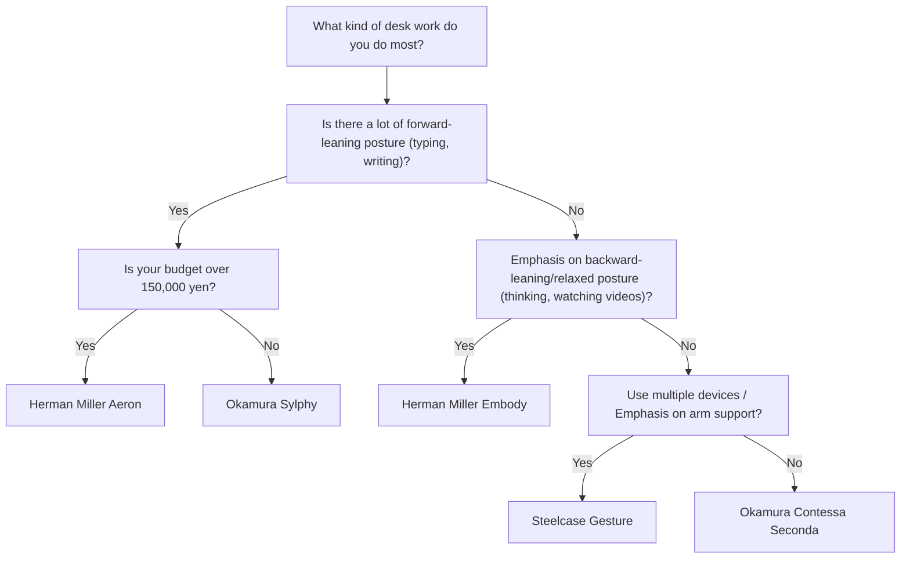
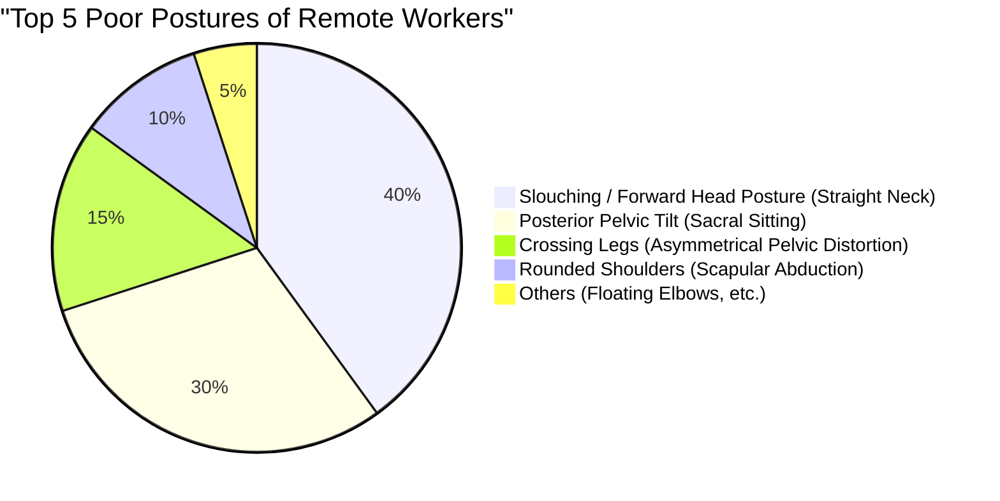

Remote work has become commonplace, and many software engineers and knowledge workers now spend more than 8 hours a day in front of a desk. Prolonged sitting postures like this impose an extremely harsh load on the human body, especially the lumbar spine.

In this article, we go beyond simply introducing "recommended chairs" and thoroughly explain why ergonomic chairs are necessary, and how you should choose the best one for yourself, using **anatomy**, **biomechanics**, and a physical approach.

---

## 1. Biomechanics and Anatomical Considerations of Sitting Posture

The human body is not originally designed to "keep sitting." The spine, adapted for upright bipedal walking, draws a gentle S-shaped curve (cervical lordosis, thoracic kyphosis, lumbar lordosis) when viewed from the side. This S-curve acts as a suspension that disperses gravity and absorbs impact during walking and standing.

### The Physics of Intradiscal Pressure

When transitioning from an upright posture to a sitting posture, the pelvis tends to tilt backward, and as a result, the forward curve (lordosis) of the lumbar spine is lost, making it more prone to curve backward (kyphosis). Let's consider what physical changes occur in the "intervertebral discs," the cartilaginous tissues that exist between the lumbar vertebrae, at this time.

Pressure $P$ is expressed by the following formula using the applied force $F$ and the area $A$ to which the force is applied:

$$ P = \frac{F}{A} $$

According to famous research by Swedish orthopedic surgeon Alf Nachemson, if the intradiscal pressure between the 3rd and 4th lumbar vertebrae during standing is 100%, it has been shown to reach 140% in a sitting posture with correct posture, and an astonishing 185% to over 200% when sitting in a forward-leaning (slouching) posture.

At this time, not only the compressive force $F$ due to the mass of the upper body, but also the bending moment caused by the forward-leaning posture concentrates stress on specific areas of the intervertebral disc (especially the posterior annulus fibrosus), sharply increasing the pressure $P_{local}$ in the localized area $A_{local}$. Thinking in units of pascals (Pa, $N/m^2$), a massive pressure of up to several megapascals (MPa) is concentrated on specific annulus fibrosus, which is a direct cause of herniated discs and chronic back pain.

### Torque Calculation in Poor Posture (Slouching / Sacral Sitting)

In the "Forward Head Posture" and "Slouching" (sacral sitting) that software engineers often do when peering into monitors, a massive torque (rotational moment) is generated at the base of the spine (L5/S1 joint).

Torque $\tau$ is expressed by the following formula:

$$ \tau = r \times F \sin(\theta) $$

Where:
- $r$: Distance from the L5/S1 joint to the center of gravity of the upper body (moment arm)
- $F$: Gravity of the upper body (mass $m \times$ gravitational acceleration $g$)
- $\theta$: The angle between the gravity vector and the trunk axis of the upper body

The more you lean forward, or the more you slouch and your center of gravity moves forward, the longer the moment arm $r$ becomes and the greater $\theta$ increases. Therefore, the muscles of the lower back (such as the erector spinae muscles) must continuously exert a powerful backward pulling force to overcome this forward-leaning torque $\tau$. This is the physical mechanism of "lower back and back pain due to muscle fatigue."

---

## 2. The Mechanism of Ergonomic Chairs: Technological Breakthroughs

To reduce the biomechanical loads described above, high-end ergonomic chairs incorporate several physical and mechanical engineering mechanisms.

### Lumbar Support and Maintaining the S-curve of the Spine

The primary purpose of lumbar support is to stand the pelvis upright and physically support the lordosis of the lumbar spine.
Ideal lumbar support supports the lumbar spine to the upper pelvis with a "surface" rather than a point. By maximizing the contact area $A$, it provides the necessary supporting force $F$ while minimizing the pressure $P$ in the $P = F/A$ formula mentioned earlier.
In recent years, mechanisms that independently support both the sacrum and the lumbar, encouraging the natural forward tilt of the pelvis, like Herman Miller Aeron's "PostureFit SL," have become mainstream.

### Synchro-Tilt Mechanism

In traditional, inexpensive office chairs, "center tilt," where the backrest and seat tilt at the same angle, was common. However, with this, when tilting backward, the thighs are lifted, and the blood flow behind the knees is compressed.

The "synchro-tilt mechanism" is a mechanism where the backrest and seat are linked but tilt at different ratios (usually 2:1 to 3:1). As a result, the front edge of the seat does not lift much even when leaning backward, allowing you to release the compressive load on the spine while keeping your soles firmly planted on the floor.

### The Importance of Forward-Tilt

Many PC tasks, such as programming, typing, and precise mouse operations, inherently induce a "forward-leaning posture."
The forward-tilt function tilts the entire seat forward by a few degrees (e.g., -5 degrees). Because the seat tilts forward, the angle of the hip joint opens to 90 degrees or more (100 to 110 degrees), and the pelvis naturally stands up. This maintains the S-curve of the lumbar spine and makes it possible to dramatically reduce the aforementioned torque $\tau$.

---

## 3. Architecture Comparison of High-End Models

Here, we compare the structural approaches of representative high-end ergonomic chairs supported by engineers worldwide.

### Herman Miller Aeron Chair
**Feature: Body pressure dispersion and forward tilt using Pellicle (mesh)**

A masterpiece introduced in 1994 that changed the history of office chairs. The unique mesh material called "Pellicle" changes its tension according to the body shape of the sitter, evenly dispersing the pressure on the thighs and buttocks.
What is particularly noteworthy is the extremely excellent **forward-tilt mechanism**. For engineers who often do work that concentrates on the screen, such as software development, the Aeron Chair, which tilts forward with the seat and stands the pelvis up, is arguably the strongest tool for minimizing the load on the lower back.

### Herman Miller Embody Chair
**Feature: Pixelated support structure and health-positive backward posture**

The Embody Chair features countless "pixels (support points)" on the backrest and seat, realizing dynamic support that follows the subtle movements of the human body.
While the Aeron Chair is suitable for forward-leaning work, the Embody Chair has a design philosophy that recommends working in a **backward-leaning posture (reclining state)**. By resting your weight on the vast backrest and releasing the compressive force $F$ applied to the spine to the backrest, it minimizes fatigue during prolonged thinking tasks and coding to the utmost limit.

### Steelcase Gesture / Leap
**Feature: 3D LiveBack technology and tracking of VAD (Vision and Arm movement)**

Steelcase chairs feature "LiveBack" technology, which deforms to imitate the movement of the spine. Even when the spine makes an asymmetrical movement, the backrest tracks it accordingly.
In particular, the Gesture was developed by studying posture changes when using a variety of modern devices such as smartphones and tablets, and the range of motion of its armrests is astonishing. By properly supporting the arms in any posture, it reduces the load on the trapezius muscles, which causes stiff shoulders and neck pain.

### Okamura Sylphy / Contessa
**Feature: Japanese ergonomics and smart operation**

Okamura's Contessa Seconda boasts beautiful design by Giorgetto Giugiaro and excellent "smart operation" that allows you to adjust the seat height and reclining at the tips of the armrests.
On the other hand, the Sylphy has gained tremendous support from remote workers in Japan at a relatively accessible price point, while featuring a "back curve adjustment mechanism" that adjusts the curve of the backrest to the sitter's body shape and an excellent forward-tilt mechanism comparable to the Aeron Chair.

---

## 4. How to Choose the Best Chair for You (Decision Tree)

The best chair for you differs depending on your body size, work style, and budget. Find the best model for you by referring to the flowchart below.

---

## 5. Workspace Optimization: A Chair Alone Is Not Enough

No matter how excellent an ergonomic chair you introduce, it is meaningless if the desk height or monitor height is not right.

### The Physics of Desk and Monitor Height

1. **Desk Height**: The ideal height is one where the angle of your elbows is 90 to 100 degrees when you place your hands on the keyboard. If the soles of your feet do not touch the floor firmly, please introduce a footrest to prevent compression on the back of your thighs.
2. **Monitor Height**: Set the top edge of the monitor to be at or slightly below your eye level. If your line of sight drops too low, excessive tension is generated in the neck muscles (posterior cervical muscles) to support the head (about 5 kg), causing straight neck.

The pie chart below shows the percentage of poor postures common among remote workers. It is important to arrange your environment to avoid these postures.

---

## Conclusion: Ergonomic Chairs as an Investment in Health

An ergonomic chair is by no means a cheap purchase. Models exceeding 100,000 to 200,000 yen are not uncommon. However, considering that you will spend about 2,000 hours a year, 8 hours a day, on it, it can be said to be the "most cost-effective investment (device with high ROI)" to prevent the risk of decreased productivity and medical expenses due to back pain.

Please reconsider your work style from a biomechanical perspective and carefully select a "physically correct chair" that accurately supports your skeleton and muscles. That is the greatest secret to continuing engineering comfortably for a long time.
