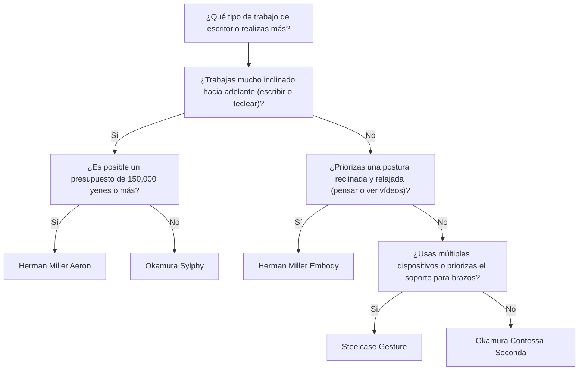
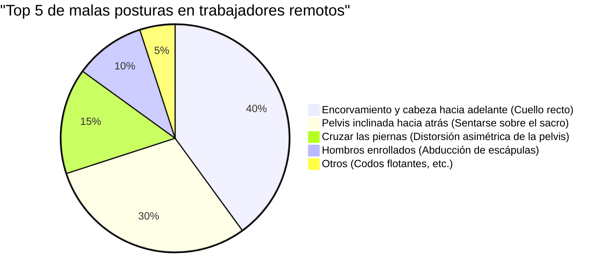

El trabajo remoto se ha generalizado, y muchos ingenieros de software y trabajadores del conocimiento ahora pasan 8 horas o más al día frente a un escritorio. Permanecer sentado por tiempos tan prolongados impone una carga extremadamente severa sobre el cuerpo humano, especialmente sobre la columna lumbar (Lumbar spine).

En este artículo, iremos más allá de la simple presentación de "sillas recomendadas" y explicaremos exhaustivamente por qué se necesita una silla ergonómica y cómo elegir la más adecuada para ti, utilizando un enfoque desde la **anatomía (Anatomy)**, la **biomecánica (Biomechanics)** y la física.

---

## 1. Biomecánica y consideraciones anatómicas de la postura sentada

El cuerpo humano no está diseñado originalmente para "permanecer sentado". La columna vertebral, adaptada a la marcha bípeda erguida, dibuja una suave curva en forma de S (lordosis cervical, cifosis torácica, lordosis lumbar) cuando se ve de lado. Esta misma curva en S es la que distribuye la gravedad y actúa como una suspensión que absorbe los impactos al caminar o estar de pie.

### Física de la presión intradiscal

Al pasar de una postura erguida a una sentada, la pelvis tiende a inclinarse hacia atrás y, con ello, se pierde la lordosis lumbar (curvatura hacia adelante) y es más fácil que se produzca una cifosis (redondeo hacia atrás). Consideremos qué cambios físicos ocurren en el "disco intervertebral (Intervertebral disc)", el tejido cartilaginoso que existe entre las vértebras lumbares en este momento.

La presión $P$ se expresa mediante la siguiente fórmula usando la fuerza aplicada $F$ y el área sobre la que se aplica la fuerza $A$:

$$ P = \frac{F}{A} $$

Según el famoso estudio del cirujano ortopédico sueco Alf Nachemson, si se toma la presión intradiscal entre la 3ª y 4ª vértebra lumbar de pie como el 100%, esta alcanza el 140% al sentarse con una postura correcta, y ¡de un 185% a más del 200%! al sentarse inclinado hacia adelante (encorvado).

En este momento, no solo la fuerza de compresión $F$ debido a la masa de la parte superior del cuerpo, sino también el momento de flexión causado por la postura inclinada hacia adelante, concentra la tensión en áreas específicas del disco intervertebral (especialmente en el ligamento anular posterior), aumentando drásticamente la presión $P_{local}$ en un área local $A_{local}$. Pensando en la unidad Pascal (Pa, $N/m^2$), una enorme presión que alcanza varios megapascales (MPa) se concentra en anillos fibrosos específicos, convirtiéndose en la causa directa de hernias de disco y dolor lumbar crónico.

### Cálculo del torque en malas posturas (encorvamiento / sentarse sobre el sacro)

En la "postura de la cabeza hacia adelante (Forward Head Posture)" o al "sentarse encorvado sobre el sacro (Slouching)" que los ingenieros de software suelen adoptar al mirar fijamente el monitor, se genera un enorme torque (momento de rotación) en la base de la columna (articulación L5/S1).

El torque $\tau$ se expresa con la siguiente fórmula:

$$ \tau = r \times F \sin(\theta) $$

Donde,
- $r$ : Distancia desde la articulación L5/S1 hasta el centro de gravedad de la parte superior del cuerpo (brazo de momento)
- $F$ : Gravedad de la parte superior del cuerpo (masa $m \times$ aceleración de la gravedad $g$)
- $\theta$ : Ángulo formado por el vector de gravedad y el eje del tronco de la parte superior del cuerpo

Cuanto más te inclinas hacia adelante, o cuanto más te encorvas y el centro de gravedad se desplaza hacia el frente, más largo se vuelve el brazo de momento $r$ y $\theta$ aumenta, por lo que los músculos de la parte inferior y media de la espalda (como los músculos erectores de la columna) deben ejercer continuamente una enorme fuerza de tracción en sentido opuesto para contrarrestar este torque $\tau$ de inclinación hacia adelante. Este es el mecanismo físico del "dolor lumbar y de espalda debido a la fatiga muscular".

---

## 2. Mecanismos de las sillas ergonómicas: Avances tecnológicos

Para reducir las cargas biomecánicas mencionadas anteriormente, las sillas ergonómicas de alta gama incorporan múltiples mecanismos físicos y de ingeniería mecánica.

### Soporte lumbar y mantenimiento de la curva en S de la columna

El mayor propósito del soporte lumbar es enderezar la pelvis y apoyar físicamente la lordosis lumbar (Lordosis).
El soporte lumbar ideal sostiene desde la columna lumbar hasta la parte superior de la pelvis con una "superficie" en lugar de un punto. Al maximizar el área de contacto $A$, se proporciona la fuerza de soporte necesaria $F$ mientras se minimiza la presión $P$ en la ecuación $P = F/A$ mencionada anteriormente.
En los últimos años, mecanismos que soportan tanto el sacro (Sacrum) como las vértebras lumbares (Lumbar) de forma independiente, promoviendo la inclinación anterior natural de la pelvis, como el "PostureFit SL" de la Herman Miller Aeron, se han convertido en la tendencia dominante.

### Mecanismo de inclinación sincronizada (Synchro-Tilt)

En las sillas de oficina baratas tradicionales, era común una "inclinación central" donde el respaldo y el asiento se inclinaban en el mismo ángulo. Sin embargo, con esto, al reclinarse, los muslos se levantan, comprimiendo el flujo sanguíneo detrás de las rodillas.

El "mecanismo de inclinación sincronizada" es un mecanismo en el que el respaldo y el asiento se inclinan juntos pero en diferentes proporciones (generalmente de 2:1 a 3:1). Con esto, incluso al reclinarse, el borde frontal del asiento no se eleva mucho, permitiendo liberar la carga de compresión en la columna mientras se mantienen las plantas de los pies firmemente en el suelo.

### La importancia de la inclinación hacia adelante (Forward-Tilt)

Gran parte del trabajo en PC, como programar, escribir o usar el ratón con precisión, induce inherentemente una "postura inclinada hacia adelante".
La función de inclinación hacia adelante inclina todo el asiento hacia adelante unos pocos grados (ej. -5 grados). Al inclinar el asiento hacia adelante, el ángulo de la cadera se abre a más de 90 grados (100 a 110 grados) y la pelvis se endereza naturalmente. De esta manera, se mantiene la curva en S de la columna lumbar y es posible reducir drásticamente el torque $\tau$ mencionado anteriormente.

---

## 3. Comparación de la arquitectura de los modelos de alta gama

Aquí, comparamos el enfoque estructural de sillas ergonómicas representativas de alta gama que son respaldadas por ingenieros de todo el mundo.

### Herman Miller Aeron
**Características: Distribución de la presión corporal mediante Pellicle (malla) e inclinación hacia adelante**

Es una obra maestra que apareció en 1994 y cambió la historia de las sillas de oficina. Su material de malla patentado, llamado "Pellicle", cambia su tensión según la forma del cuerpo del usuario y distribuye uniformemente la presión aplicada a los muslos y glúteos.
Es especialmente destacable su excelente **mecanismo de inclinación hacia adelante**. Para los ingenieros que realizan trabajos que requieren concentración en la pantalla, como el desarrollo de software, la silla Aeron, que inclina todo el asiento hacia adelante y endereza la pelvis, es la herramienta más poderosa para minimizar la tensión en la zona lumbar.

### Herman Miller Embody
**Características: Estructura de píxeles y una postura reclinada saludable y positiva**

La silla Embody cuenta con innumerables "píxeles (puntos de apoyo)" en el respaldo y el asiento, proporcionando un soporte dinámico que se adapta a los micromovimientos del cuerpo humano.
Mientras que la Aeron está pensada para el trabajo inclinado hacia adelante, la Embody tiene una filosofía de diseño que fomenta el trabajo en una **postura reclinada (estado echado hacia atrás)**. Al confiar tu peso a un respaldo amplio y liberar la fuerza de compresión $F$ sobre la columna vertebral hacia el respaldo, reduce al máximo la fatiga durante largas horas de pensamiento o programación.

### Steelcase Gesture / Leap
**Características: Tecnología 3D LiveBack y seguimiento del VAD (visión y movimiento de los brazos)**

Las sillas de Steelcase se caracterizan por la tecnología "LiveBack", que cambia de forma imitando el movimiento de la columna vertebral. Incluso cuando la columna realiza un movimiento asimétrico, el respaldo la sigue y se adapta.
Gesture, en particular, fue desarrollada mediante el estudio de los cambios posturales al utilizar diversos dispositivos modernos como teléfonos inteligentes y tabletas, y el rango de movimiento de sus reposabrazos es sorprendente. Al apoyar adecuadamente los brazos en cualquier postura, se reduce la tensión en los músculos trapecios, los cuales son causa de rigidez en los hombros y dolor de cuello.

### Okamura Sylphy / Contessa
**Características: Ergonomía japonesa y operaciones inteligentes**

La Contessa Seconda de Okamura es excepcional por su hermoso diseño creado por Giorgetto Giugiaro, y por su "operación inteligente", que permite ajustar la altura del asiento y la reclinación en la punta del reposabrazos.
Por otro lado, la Sylphy cuenta con el "Mecanismo de Ajuste de la Curva del Respaldo", que permite ajustar la curva del respaldo para adaptarse a la forma del cuerpo del usuario, y un excelente mecanismo de inclinación hacia adelante comparable al de la silla Aeron. Además, tiene un precio relativamente accesible, ganando un apoyo tremendo entre los trabajadores remotos en Japón.

---

## 4. Cómo elegir la silla ideal para ti (Árbol de decisiones)

La silla óptima varía según el tamaño de tu cuerpo, estilo de trabajo y presupuesto. Consulta el diagrama de flujo a continuación para encontrar el modelo perfecto para ti.

---

## 5. Optimización del espacio de trabajo: Una silla por sí sola no lo resuelve todo

Por muy buena que sea la silla ergonómica que adquieras, no tendrá sentido si la altura del escritorio y del monitor no son las adecuadas.

### La física de la altura del escritorio y el monitor

1. **Altura del escritorio**: La altura ideal es aquella en la que el ángulo de los codos es de 90 a 100 grados cuando las manos están en el teclado. Si las plantas de tus pies no tocan el suelo por completo, usa un reposapiés para evitar la presión en la parte posterior de los muslos.
2. **Altura del monitor**: Ajusta el monitor de modo que el borde superior esté al nivel de los ojos o ligeramente por debajo. Si tu mirada baja demasiado, se generará una tensión excesiva en los músculos del cuello (músculos cervicales posteriores) para soportar la cabeza (unos 5 kg), lo que puede causar pérdida de la lordosis cervical (cuello recto o *straight neck*).

El siguiente gráfico circular muestra el porcentaje de malas posturas comunes entre los trabajadores remotos. Es importante acondicionar el entorno para evitar estas posturas.

---

## Conclusión: La silla ergonómica como inversión en salud

Una silla ergonómica no es en absoluto una compra barata. No es raro encontrar modelos que superen los 100,000 a 200,000 yenes. Sin embargo, si consideras que pasarás en ella 8 horas al día y unas 2000 horas al año, se puede decir que es la "inversión más rentable (dispositivo con alto ROI)" para prevenir disminuciones en la productividad debido al dolor de espalda y riesgos de gastos médicos.

Reevalúa tu estilo de trabajo desde una perspectiva biomecánica y elige "una silla físicamente correcta" que soporte de manera precisa tu esqueleto y músculos. Ese es el mayor secreto para seguir en la ingeniería de manera cómoda y durante mucho tiempo.
