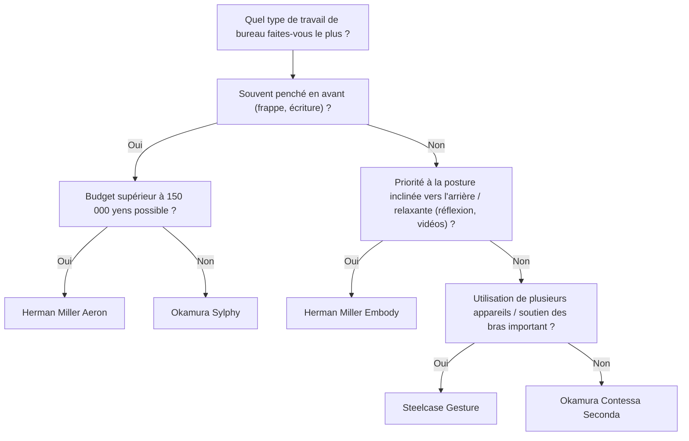
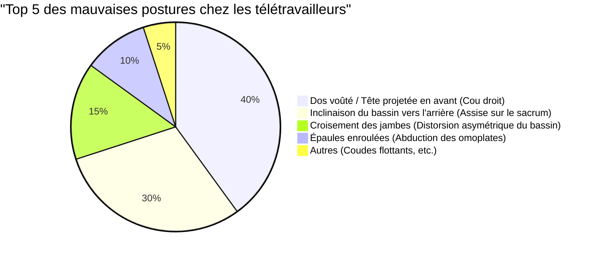

Le télétravail s'est généralisé, et de nombreux ingénieurs logiciels et travailleurs du savoir passent désormais plus de 8 heures par jour à leur bureau. Une position assise aussi prolongée impose une contrainte extrêmement sévère au corps humain, en particulier à la colonne lombaire (Lumbar spine).

Cet article ne se limite pas à présenter des « chaises recommandées ». Il explique en détail pourquoi les chaises ergonomiques sont nécessaires et comment choisir celle qui vous convient le mieux, en utilisant une approche basée sur l'**anatomie (Anatomy)**, la **biomécanique (Biomechanics)** et la physique.

---

## 1. Biomécanique de la posture assise et considérations anatomiques

Le corps humain n'est pas conçu pour "rester assis" de manière prolongée. La colonne vertébrale, adaptée à la bipédie, forme une douce courbe en S (lordose cervicale, cyphose thoracique, lordose lombaire) lorsqu'elle est vue de profil. C'est cette courbe en S qui joue le rôle de suspension en répartissant la gravité et en absorbant les chocs lors de la marche ou de la station debout.

### La physique de la pression intradiscale

Lors du passage de la position debout à la position assise, le bassin a tendance à s'incliner vers l'arrière, ce qui entraîne une perte de la lordose lombaire (cambrure vers l'avant) et favorise la cyphose (arrondissement vers l'arrière). Considérons quels changements physiques se produisent alors dans le « disque intervertébral (Intervertebral disc) », le tissu cartilagineux situé entre les vertèbres lombaires.

La pression $P$ est exprimée par la formule suivante, en utilisant la force appliquée $F$ et la surface sur laquelle la force est appliquée $A$.

$$ P = \frac{F}{A} $$

Selon une célèbre étude du chirurgien orthopédiste suédois Alf Nachemson, si la pression intradiscale entre les 3ème et 4ème vertèbres lombaires en position debout est de 100 %, elle atteint 140 % en position assise avec une posture correcte, et jusqu'à 185 % à plus de 200 % en position assise penchée en avant (dos voûté).

À ce moment, non seulement la force de compression $F$ due à la masse du haut du corps, mais aussi le moment de flexion dû à la posture inclinée vers l'avant concentrent la contrainte sur des zones spécifiques du disque intervertébral (en particulier le ligament annulaire postérieur), augmentant de manière exponentielle la pression $P_{local}$ sur une surface locale $A_{local}$. Si l'on pense en termes de pascals (Pa, $N/m^2$), une pression massive de plusieurs mégapascals (MPa) se concentre sur un anneau fibreux spécifique, ce qui est la cause directe des hernies discales et des douleurs lombaires chroniques.

### Calcul du couple dans les mauvaises postures (dos voûté, assise sur le sacrum)

Dans la "posture de la tête projetée en avant (Forward Head Posture)" ou "l'assise affaissée (Slouching)", que les ingénieurs logiciels adoptent souvent lorsqu'ils regardent leur écran, un couple (moment de rotation) énorme est généré à la base de la colonne vertébrale (articulation L5/S1).

Le couple $\tau$ est exprimé par la formule suivante :

$$ \tau = r \times F \sin(\theta) $$

Où,
- $r$ : distance de l'articulation L5/S1 au centre de gravité du haut du corps (bras de levier)
- $F$ : force de gravité du haut du corps (masse $m \times$ accélération gravitationnelle $g$)
- $\theta$ : angle entre le vecteur de gravité et l'axe du tronc du haut du corps

Plus la posture est penchée en avant ou plus le dos est voûté, déplaçant le centre de gravité vers l'avant, plus le bras de levier $r$ s'allonge et $\theta$ augmente. Ainsi, les muscles du bas du dos et du dos (comme le groupe des muscles érecteurs du rachis) doivent exercer en continu une force de traction massive vers l'arrière pour vaincre ce couple vers l'avant $\tau$. C'est le mécanisme physique de "la douleur lombaire et dorsale causée par la fatigue musculaire".

---

## 2. Mécanismes des chaises ergonomiques : percées technologiques

Pour réduire la charge biomécanique décrite ci-dessus, les chaises ergonomiques haut de gamme intègrent plusieurs mécanismes physiques et de génie mécanique.

### Soutien lombaire et maintien de la courbe en S de la colonne vertébrale

Le but principal du soutien lombaire est de redresser le bassin et de soutenir physiquement la lordose lombaire (Lordosis).
Le soutien lombaire idéal soutient de la colonne lombaire au haut du bassin par une "surface" plutôt que par un point. En maximisant la surface de contact $A$, il minimise la pression $P$ dans la formule $P = F/A$ mentionnée précédemment tout en fournissant la force de soutien $F$ nécessaire.
Ces dernières années, les mécanismes comme le "PostureFit SL" de Herman Miller Aeron, qui soutiennent indépendamment le sacrum (Sacrum) et les lombaires (Lumbar) pour encourager une inclinaison naturelle du bassin vers l'avant, sont devenus la norme.

### Mécanisme de basculement synchrone (Synchro-Tilt)

Dans les chaises de bureau bon marché traditionnelles, le "basculement central", où le dossier et l'assise s'inclinent au même angle, était courant. Cependant, avec cela, lors de l'inclinaison vers l'arrière, les cuisses se soulèvent et la circulation sanguine derrière les genoux est comprimée.

Le "mécanisme de basculement synchrone" est un mécanisme dans lequel le dossier et l'assise s'inclinent à des ratios différents (généralement 2:1 à 3:1) tout en étant liés. Grâce à cela, même en s'inclinant vers l'arrière, le bord avant de l'assise ne se soulève pas beaucoup, permettant de garder les pieds fermement plantés sur le sol tout en relâchant la charge de compression sur la colonne vertébrale.

### L'importance de l'inclinaison vers l'avant (Forward-Tilt)

La plupart des travaux sur PC, tels que la programmation, la frappe ou les manipulations précises de la souris, induisent intrinsèquement une "posture penchée en avant".
La fonction d'inclinaison vers l'avant permet d'incliner l'ensemble de l'assise de quelques degrés vers l'avant (ex : -5 degrés). En inclinant l'assise vers l'avant, l'angle de l'articulation de la hanche s'ouvre à plus de 90 degrés (100 à 110 degrés), permettant au bassin de se redresser naturellement. Cela maintient la courbe en S de la colonne lombaire et réduit considérablement le couple $\tau$ mentionné ci-dessus.

---

## 3. Comparaison de l'architecture des modèles haut de gamme

Nous comparerons ici les approches structurelles des chaises ergonomiques haut de gamme représentatives, soutenues par des ingénieurs du monde entier.

### Herman Miller Aeron (Chaise Aeron)
**Caractéristiques : répartition de la pression corporelle par pellicule (maille) et inclinaison vers l'avant**

Apparue en 1994, c'est un chef-d'œuvre qui a changé l'histoire des chaises de bureau. Le matériau en maille unique appelé "pellicule" modifie sa tension en fonction de la morphologie de la personne assise, répartissant uniformément la pression sur les cuisses et les fesses.
Il convient de mentionner son **mécanisme d'inclinaison vers l'avant** exceptionnel. Pour les ingénieurs qui effectuent souvent des tâches nécessitant de se concentrer sur l'écran, comme le développement de logiciels, la chaise Aeron, qui incline l'assise vers l'avant et redresse le bassin, est le meilleur outil pour minimiser la charge sur le bas du dos.

### Herman Miller Embody (Chaise Embody)
**Caractéristiques : structure en pixels et posture inclinée vers l'arrière favorable à la santé**

La chaise Embody place d'innombrables "pixels (points de soutien)" sur le dossier et l'assise pour fournir un soutien dynamique qui suit les moindres mouvements du corps humain.
Alors que la chaise Aeron est adaptée au travail penché en avant, la chaise Embody a une philosophie de conception qui recommande de travailler dans une **posture inclinée vers l'arrière (état incliné)**. En reposant votre poids sur le large dossier et en transférant la force de compression $F$ exercée sur la colonne vertébrale vers le dossier, elle réduit à l'extrême la fatigue lors des tâches de réflexion prolongées et du codage.

### Steelcase Gesture / Leap
**Caractéristiques : technologie 3D LiveBack et suivi du VAD (mouvement de la vue et des bras)**

Les chaises Steelcase sont dotées de la technologie "LiveBack", qui se déforme pour imiter les mouvements de la colonne vertébrale. Même lorsque la colonne vertébrale effectue un mouvement asymétrique, le dossier suit le mouvement.
En particulier, Gesture a été développé en étudiant les changements de posture lors de l'utilisation de divers appareils modernes, tels que les smartphones et les tablettes, et l'amplitude de mouvement de ses accoudoirs est stupéfiante. En soutenant correctement les bras dans n'importe quelle posture, elle réduit la charge sur les muscles trapèzes, qui provoquent des raideurs aux épaules et des douleurs au cou.

### Okamura Sylphy / Contessa
**Caractéristiques : ergonomie japonaise et opération intelligente**

La Contessa Seconda d'Okamura excelle par son magnifique design signé Giorgetto Giugiaro et son "opération intelligente", qui permet d'ajuster la hauteur de l'assise et l'inclinaison du bout des accoudoirs.
D'autre part, la Sylphy est dotée d'un "mécanisme d'ajustement de la courbe du dos" qui permet d'ajuster la courbure du dossier en fonction de la morphologie de la personne assise, ainsi que d'un excellent mécanisme d'inclinaison vers l'avant comparable à la chaise Aeron, tout en étant dans une gamme de prix relativement accessible, ce qui lui vaut un immense soutien de la part des télétravailleurs japonais.

---

## 4. Comment choisir la chaise qui vous convient le mieux (Arbre de décision)

La chaise optimale varie en fonction de votre taille, de votre style de travail et de votre budget. Utilisez l'organigramme suivant comme référence pour trouver le modèle qui vous convient le mieux.

---

## 5. Optimisation de l'espace de travail : la chaise ne résout pas tout

Peu importe l'excellence de la chaise ergonomique que vous achetez, elle ne servira à rien si la hauteur de votre bureau ou de votre moniteur n'est pas adaptée.

### La physique de la hauteur du bureau et du moniteur

1. **Hauteur du bureau** : La hauteur idéale est celle où l'angle de vos coudes est de 90 à 100 degrés lorsque vous posez vos mains sur le clavier. Si la plante de vos pieds ne touche pas fermement le sol, utilisez un repose-pieds pour éviter la compression de l'arrière de vos cuisses.
2. **Hauteur du moniteur** : Réglez le bord supérieur du moniteur de manière à ce qu'il soit au niveau des yeux ou légèrement en dessous. Si votre regard s'abaisse trop, une tension excessive sera générée dans les muscles du cou (groupe des muscles cervicaux postérieurs) pour soutenir votre tête (environ 5 kg), provoquant le syndrome du cou droit (perte de la courbure cervicale).

Le diagramme circulaire ci-dessous montre la proportion de mauvaises postures courantes chez les télétravailleurs. Il est important d'aménager votre environnement pour éviter ces postures.

---

## Conclusion : La chaise ergonomique comme investissement dans la santé

Les chaises ergonomiques ne sont en aucun cas un achat bon marché. Les modèles coûtant entre 100 000 et 200 000 yens ne sont pas rares. Cependant, si l'on considère que l'on y passe 8 heures par jour, soit environ 2000 heures par an, on peut dire que c'est "l'investissement le plus rentable (l'appareil avec le meilleur retour sur investissement)" pour prévenir de manière proactive la baisse de productivité et les risques de frais médicaux dus au mal de dos.

Veuillez revoir votre style de travail du point de vue de la biomécanique et sélectionner la "chaise physiquement correcte" qui soutiendra avec précision votre squelette et vos muscles. C'est le plus grand secret pour continuer l'ingénierie confortablement pendant longtemps.
