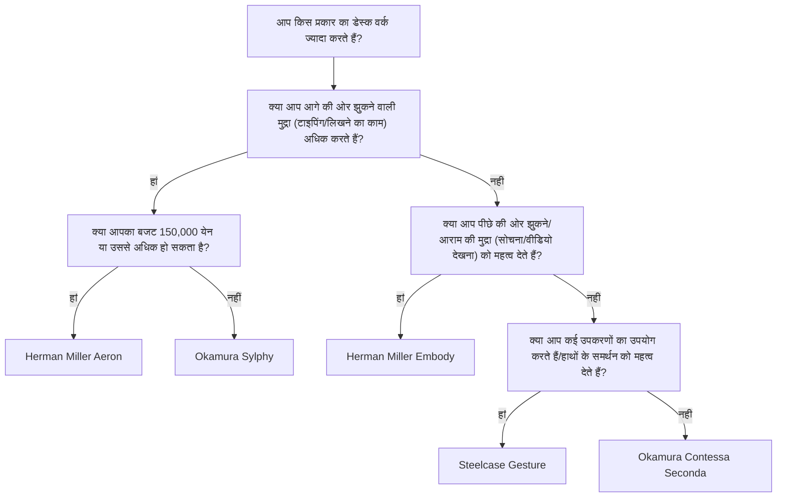
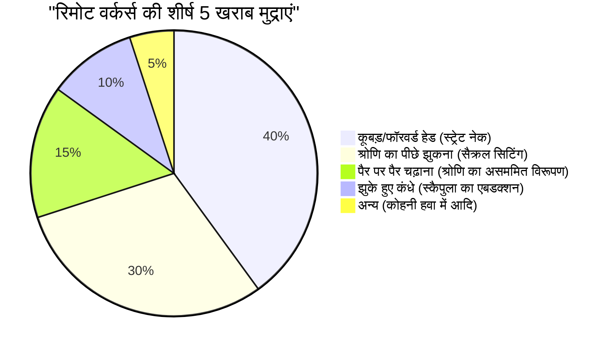

रिमोट वर्क अब आम हो गया है, और कई सॉफ्टवेयर इंजीनियर और नॉलेज वर्कर्स दिन में 8 घंटे से अधिक समय अपनी डेस्क के सामने बिताते हैं। इतने लंबे समय तक बैठे रहने से मानव शरीर, विशेष रूप से काठ की रीढ़ (Lumbar spine) पर अत्यधिक दबाव पड़ता है।

इस लेख में, हम केवल "सुझाई गई कुर्सियों" को पेश करने तक सीमित नहीं रहेंगे, बल्कि **एनाटॉमी (Anatomy)** और **बायोमैकेनिक्स (Biomechanics)**, और भौतिक दृष्टिकोण का उपयोग करते हुए यह विस्तार से बताएंगे कि एर्गोनोमिक कुर्सियों की आवश्यकता क्यों है और आपको अपने लिए सबसे उपयुक्त कुर्सी कैसे चुननी चाहिए।

---

## 1. बैठने की मुद्रा के बायोमैकेनिक्स और एनाटोमिकल विचार

मानव शरीर मूल रूप से लगातार "बैठे रहने" के लिए डिज़ाइन नहीं किया गया है। सीधे खड़े होकर दो पैरों पर चलने के लिए अनुकूलित रीढ़ की हड्डी, बगल से देखने पर एक हल्का S-आकार का वक्र (सरवाइकल लॉर्डोसिस, थोरैसिक काइफोसिस, और लम्बर लॉर्डोसिस) बनाती है। यह S-वक्र एक सस्पेंशन के रूप में कार्य करता है जो गुरुत्वाकर्षण को वितरित करता है और चलने या सीधे खड़े होने पर झटके को अवशोषित करता है।

### इंटरवर्टेब्रल डिस्क दबाव की भौतिकी

जब आप खड़े होने की स्थिति से बैठने की स्थिति में आते हैं, तो श्रोणि (पेल्विस) पीछे की ओर झुकने लगती है, जिससे काठ की रीढ़ का आगे की ओर वक्र (लॉर्डोसिस) कम हो जाता है और यह पीछे की ओर झुकने (काइफोसिस) लगती है। आइए विचार करें कि इस समय काठ की रीढ़ (Lumbar spine) के बीच स्थित उपास्थि ऊतक, "इंटरवर्टेब्रल डिस्क (Intervertebral disc)" में किस तरह के भौतिक परिवर्तन होते हैं।

दबाव $P$ को लगाए गए बल $F$ और उस क्षेत्रफल $A$ का उपयोग करके निम्नलिखित सूत्र द्वारा व्यक्त किया जाता है जिस पर बल लगाया जाता है:

$$ P = \frac{F}{A} $$

स्वीडिश आर्थोपेडिक सर्जन अल्फ नाचेमसन (Alf Nachemson) के एक प्रसिद्ध अध्ययन के अनुसार, यदि खड़े होने पर तीसरे और चौथे काठ के कशेरुकाओं के बीच इंटरवर्टेब्रल डिस्क के दबाव को 100% माना जाए, तो सही मुद्रा में बैठने पर यह 140% हो जाता है, और आगे की ओर झुककर (कूबड़ निकालकर) बैठने पर यह आश्चर्यजनक रूप से 185% से 200% या उससे अधिक तक पहुंच जाता है।

इस समय, न केवल शरीर के ऊपरी हिस्से के द्रव्यमान के कारण संपीड़न बल $F$, बल्कि आगे की ओर झुकने की मुद्रा के कारण बेंडिंग मोमेंट इंटरवर्टेब्रल डिस्क (विशेष रूप से पोस्टीरियर एनुलर लिगामेंट) के विशिष्ट क्षेत्रों पर तनाव को केंद्रित करता है, जिससे स्थानीय क्षेत्रफल $A_{local}$ पर दबाव $P_{local}$ काफी बढ़ जाता है। पास्कल (Pa, $N/m^2$) की इकाइयों में विचार करें तो कई मेगापास्कल (MPa) का भारी दबाव विशिष्ट एनलस फाइब्रोसस पर केंद्रित होता है, जो हर्नियेटेड डिस्क और पुराने कमर दर्द का सीधा कारण है।

### खराब मुद्रा (कूबड़/सैक्रल सिटिंग) में टॉर्क की गणना

सॉफ्टवेयर इंजीनियर अक्सर मॉनिटर को करीब से देखने के लिए "फॉरवर्ड हेड पोस्चर (Forward Head Posture)" या "स्लाउचिंग (Slouching - सैक्रल सिटिंग)" का सहारा लेते हैं, जिससे रीढ़ के आधार (L5/S1 जोड़) पर भारी टॉर्क (रोटेशनल मोमेंट) उत्पन्न होता है।

टॉर्क $\tau$ को निम्नलिखित सूत्र द्वारा व्यक्त किया जाता है:

$$ \tau = r \times F \sin(\theta) $$

यहाँ,
- $r$ : L5/S1 जोड़ से शरीर के ऊपरी हिस्से के गुरुत्वाकर्षण के केंद्र तक की दूरी (मोमेंट आर्म)
- $F$ : ऊपरी शरीर का गुरुत्वाकर्षण (द्रव्यमान $m \times$ गुरुत्वाकर्षण त्वरण $g$)
- $\theta$ : गुरुत्वाकर्षण वेक्टर और शरीर के धड़ की धुरी द्वारा बनाया गया कोण

जितना अधिक आप आगे की ओर झुकते हैं, या जितना अधिक आप कूबड़ निकालते हैं और आपके गुरुत्वाकर्षण का केंद्र आगे बढ़ता है, मोमेंट आर्म $r$ उतना ही लंबा होता जाता है और $\theta$ बढ़ जाता है, इसलिए पीठ के निचले हिस्से की मांसपेशियों (जैसे इरेक्टर स्पाइने मांसपेशियां) को इस आगे की ओर झुकने वाले टॉर्क $\tau$ को दूर करने के लिए लगातार एक मजबूत पीछे की ओर खींचने वाले बल का प्रयोग करना पड़ता है। यही "मांसपेशियों की थकान के कारण कमर दर्द और पीठ दर्द" का भौतिक तंत्र है।

---

## 2. एर्गोनोमिक चेयर के तंत्र: तकनीकी सफलता

उपरोक्त बायोमैकेनिकल भार को कम करने के लिए, उच्च अंत (हाई-एंड) एर्गोनोमिक कुर्सियों में कई भौतिक और यांत्रिक इंजीनियरिंग तंत्र शामिल होते हैं।

### लम्बर सपोर्ट और रीढ़ के S-वक्र का रखरखाव

लम्बर सपोर्ट का मुख्य उद्देश्य श्रोणि को सीधा रखना और काठ की रीढ़ (Lordosis) को भौतिक रूप से सहारा देना है।
आदर्श लम्बर सपोर्ट एक बिंदु के बजाय "सतह" के रूप में काठ की रीढ़ से ऊपरी श्रोणि तक सहारा देता है। संपर्क क्षेत्र $A$ को अधिकतम करके, यह आवश्यक समर्थन बल $F$ प्रदान करते हुए पूर्वोक्त $P = F/A$ सूत्र में दबाव $P$ को न्यूनतम रखता है।
हाल के वर्षों में, Herman Miller Aeron के "PostureFit SL" जैसे तंत्र, जो त्रिकास्थि (Sacrum) और काठ (Lumbar) दोनों को स्वतंत्र रूप से सहारा देते हैं और श्रोणि के प्राकृतिक झुकाव को प्रोत्साहित करते हैं, मुख्यधारा बन गए हैं।

### सिंक्रो-टिल्ट (Synchro-Tilt) तंत्र

पारंपरिक सस्ती ऑफिस कुर्सियों में "सेंटर-टिल्ट" आम था, जहां बैकरेस्ट और सीट एक ही कोण पर झुकते हैं। हालांकि, जब आप इस स्थिति में पीछे झुकते हैं, तो आपकी जांघें ऊपर उठ जाती हैं, जिससे घुटनों के पीछे रक्त प्रवाह दब जाता है।

"सिंक्रो-टिल्ट तंत्र" एक ऐसा तंत्र है जिसमें बैकरेस्ट और सीट एक साथ लेकिन अलग-अलग अनुपात (आमतौर पर 2:1 से 3:1) में झुकते हैं। नतीजतन, पीछे की ओर झुकने पर भी सीट का अगला किनारा ज्यादा ऊपर नहीं उठता है, जिससे आप अपने पैरों को फर्श पर मजबूती से टिकाए रखते हुए रीढ़ पर संपीड़न भार को कम कर सकते हैं।

### फॉरवर्ड-टिल्ट (Forward-Tilt) का महत्व

प्रोग्रामिंग, टाइपिंग, और सटीक माउस संचालन जैसे अधिकांश पीसी कार्य स्वाभाविक रूप से "आगे की ओर झुकने वाली मुद्रा" को प्रेरित करते हैं।
फॉरवर्ड-टिल्ट फ़ंक्शन पूरी सीट को कुछ डिग्री (उदा: -5 डिग्री) आगे की ओर झुकाता है। सीट के आगे की ओर झुकने से, कूल्हे के जोड़ का कोण 90 डिग्री (100 से 110 डिग्री) से अधिक खुल जाता है, और श्रोणि स्वाभाविक रूप से सीधी हो जाती है। यह काठ की रीढ़ के S-वक्र को बनाए रखता है और पूर्वोक्त टॉर्क $\tau$ को नाटकीय रूप से कम करता है।

---

## 3. हाई-एंड मॉडल के आर्किटेक्चर की तुलना

यहां हम दुनिया भर के इंजीनियरों द्वारा समर्थित प्रमुख हाई-एंड एर्गोनोमिक कुर्सियों के संरचनात्मक दृष्टिकोण की तुलना करते हैं।

### Herman Miller Aeron (एरोन चेयर)
**विशेषताएं: पेलिकल (मेश) द्वारा दबाव वितरण और फॉरवर्ड-टिल्ट**

यह 1994 में पेश किया गया एक उत्कृष्ट उत्पाद है जिसने कार्यालय कुर्सियों का इतिहास बदल दिया। "पेलिकल" नामक अद्वितीय मेश सामग्री बैठने वाले के शरीर के आकार के अनुसार अपना तनाव बदलती है, जिससे जांघों और नितंबों पर दबाव समान रूप से वितरित होता है।
विशेष रूप से उल्लेखनीय इसकी उत्कृष्ट **फॉरवर्ड-टिल्ट तंत्र** है। सॉफ्टवेयर विकास जैसे स्क्रीन पर ध्यान केंद्रित करने वाले कार्यों वाले इंजीनियरों के लिए, एरोन चेयर जो सीट के साथ आगे झुककर श्रोणि को सीधा रखती है, कमर पर भार को कम करने का सबसे अच्छा उपकरण है।

### Herman Miller Embody (एम्बॉडी चेयर)
**विशेषताएं: पिक्सेल संरचना और स्वास्थ्य-सकारात्मक पीछे की ओर झुकने वाली मुद्रा**

एम्बॉडी चेयर के बैकरेस्ट और सीट पर अनगिनत "पिक्सेल (समर्थन बिंदु)" होते हैं, जो मानव शरीर की सूक्ष्म गतिविधियों का पालन करते हुए गतिशील समर्थन प्रदान करते हैं।
जहां एरोन चेयर आगे की ओर झुककर काम करने के लिए उपयुक्त है, वहीं एम्बॉडी चेयर **पीछे की ओर झुकने वाली मुद्रा (रिक्लाइनिंग स्थिति)** में काम करने को प्रोत्साहित करने के डिज़ाइन दर्शन के साथ बनाई गई है। अपने वजन को चौड़े बैकरेस्ट पर टिकाने से, रीढ़ पर पड़ने वाला संपीड़न बल $F$ बैकरेस्ट में स्थानांतरित हो जाता है, जिससे लंबी सोच-विचार वाले कार्यों या कोडिंग के दौरान थकान बेहद कम हो जाती है।

### Steelcase Gesture / Leap (जेस्चर / लीप)
**विशेषताएं: 3D LiveBack तकनीक और VAD (दृष्टि और बांह की गति) को ट्रैक करना**

Steelcase कुर्सियों की विशेषता "LiveBack" तकनीक है, जो रीढ़ की गति की नकल करते हुए आकार बदलती है। जब रीढ़ की हड्डी असममित हलचल करती है, तब भी बैकरेस्ट उसी के अनुसार समायोजित होता है।
विशेष रूप से जेस्चर को स्मार्टफोन और टैबलेट जैसे आधुनिक उपकरणों का उपयोग करते समय विभिन्न आसन परिवर्तनों पर शोध के आधार पर विकसित किया गया है, और इसके आर्मरेस्ट की गतिशीलता आश्चर्यजनक है। किसी भी मुद्रा में बाहों का उचित समर्थन करके, यह ट्रेपेज़ियस मांसपेशी पर भार कम करता है, जो कंधे की जकड़न और गर्दन के दर्द का कारण है।

### Okamura Sylphy / Contessa (सिल्फी / कॉन्टेसा)
**विशेषताएं: जापानी एर्गोनॉमिक्स और स्मार्ट ऑपरेशन**

Okamura की Contessa Seconda में जियोर्जेटो गिउगियारो (Giorgetto Giugiaro) द्वारा एक सुंदर डिजाइन और "स्मार्ट ऑपरेशन" की सुविधा है, जो आपको आर्मरेस्ट के सिरे पर सीट की ऊंचाई और रिक्लाइनिंग को समायोजित करने की अनुमति देती है।
दूसरी ओर, सिल्फी (Sylphy) में "बैक कर्व एडजस्ट तंत्र" है जो बैठने वाले के शरीर के आकार के अनुसार बैकरेस्ट के वक्र को समायोजित कर सकता है, और इसमें एरोन चेयर के बराबर एक उत्कृष्ट फॉरवर्ड-टिल्ट तंत्र है। इन सब के बावजूद, यह अपेक्षाकृत सस्ती कीमत पर जापानी रिमोट वर्कर्स का भारी समर्थन प्राप्त कर रही है।

---

## 4. आपके लिए सबसे अच्छी कुर्सी कैसे चुनें (डिसीजन ट्री)

आपके शरीर के आकार, कार्य शैली और बजट के आधार पर सबसे अच्छी कुर्सी अलग-अलग होती है। अपने लिए सही मॉडल खोजने के लिए कृपया नीचे दिए गए फ़्लोचार्ट को देखें।

---

## 5. कार्यक्षेत्र का अनुकूलन: कुर्सी ही सब कुछ हल नहीं करती

चाहे आप कितनी भी अच्छी एर्गोनोमिक कुर्सी खरीद लें, अगर आपके डेस्क या मॉनिटर की ऊंचाई सही नहीं है तो इसका कोई मतलब नहीं है।

### डेस्क और मॉनिटर की ऊंचाई की भौतिकी

1. **डेस्क की ऊंचाई**: वह ऊंचाई जहां कीबोर्ड पर हाथ रखने पर कोहनी का कोण 90-100 डिग्री हो, आदर्श है। यदि आपके पैर फर्श पर पूरी तरह से नहीं टिकते हैं, तो जांघों के पिछले हिस्से पर दबाव को रोकने के लिए फुटरेस्ट (पैर रखने की जगह) का उपयोग करें।
2. **मॉनिटर की ऊंचाई**: मॉनिटर का ऊपरी किनारा आपकी आंखों के स्तर पर या उससे थोड़ा नीचे होना चाहिए। यदि आपकी दृष्टि बहुत नीचे है, तो आपके सिर (लगभग 5 किग्रा) को सहारा देने के लिए आपकी गर्दन की मांसपेशियों (पोस्टीरियर नेक मसल्स) में अत्यधिक तनाव उत्पन्न होगा, जो स्ट्रेट नेक का कारण बनता है।

नीचे दिया गया पाई चार्ट रिमोट वर्कर्स में आम खराब मुद्राओं का प्रतिशत दिखाता है। इन मुद्राओं से बचने के लिए अपने वातावरण को व्यवस्थित करना महत्वपूर्ण है।

---

## निष्कर्ष: स्वास्थ्य में निवेश के रूप में एर्गोनोमिक कुर्सी

एर्गोनोमिक कुर्सी कभी भी सस्ती खरीदारी नहीं होती है। ऐसे मॉडल मिलना असामान्य नहीं है जिनकी कीमत 100,000 से 200,000 येन तक होती है। हालाँकि, यदि आप इस पर दिन में 8 घंटे, या वर्ष में लगभग 2000 घंटे बिताते हैं, तो इसे कमर दर्द के कारण उत्पादकता में कमी और चिकित्सा खर्चों के जोखिम को रोकने के लिए "सबसे अधिक लागत प्रभावी निवेश (उच्च ROI वाला उपकरण)" कहा जा सकता है।

बायोमैकेनिकल दृष्टिकोण से अपनी कार्यशैली का पुनर्मूल्यांकन करें, और "भौतिक रूप से सही कुर्सी" चुनें जो आपके कंकाल और मांसपेशियों को सही ढंग से सहारा दे। लंबे समय तक आराम से इंजीनियरिंग करते रहने का यही सबसे बड़ा रहस्य है।
