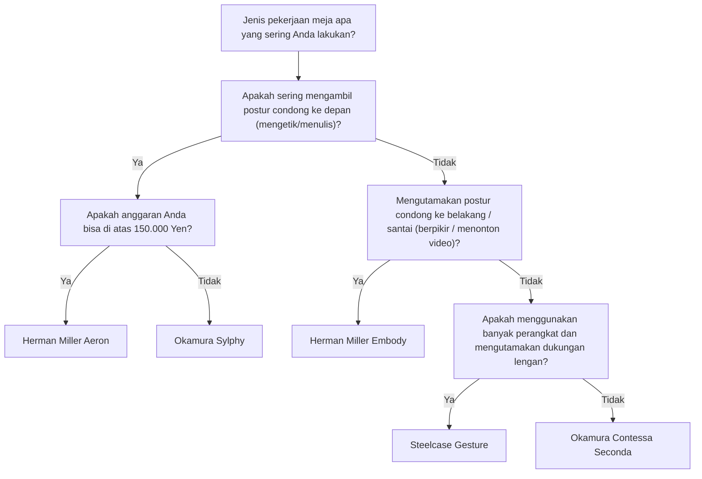
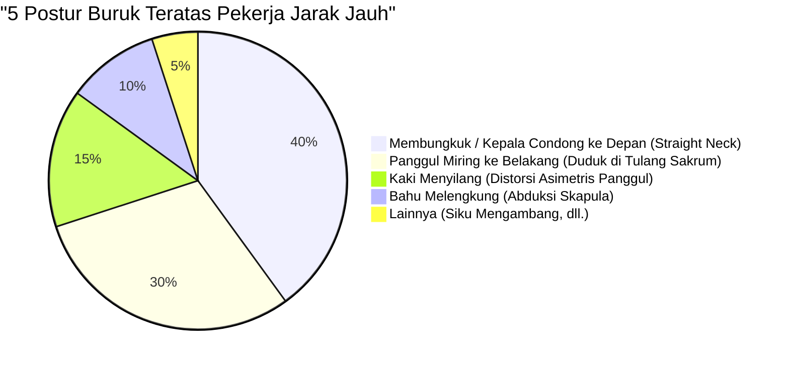

Kerja jarak jauh telah menjadi hal yang umum, dan banyak insinyur perangkat lunak serta pekerja pengetahuan kini menghabiskan waktu lebih dari 8 jam sehari di depan meja mereka. Postur duduk yang berkepanjangan seperti ini memaksakan beban yang sangat berat pada tubuh manusia, terutama pada tulang belakang lumbar (lumbar spine).

Dalam artikel ini, tidak sekadar memperkenalkan "kursi yang direkomendasikan", kami akan menggunakan pendekatan **anatomi (Anatomy)** dan **biomekanika (Biomechanics)**, serta pendekatan fisika, untuk menjelaskan secara menyeluruh mengapa kursi ergonomis diperlukan, dan bagaimana Anda harus memilih satu kursi yang paling tepat untuk diri Anda.

---

## 1. Biomekanika Postur Duduk dan Pertimbangan Anatomis

Tubuh manusia pada dasarnya tidak dirancang untuk "terus duduk". Tulang belakang yang beradaptasi untuk berjalan tegak dengan dua kaki membentuk lekukan S yang landai (lordosis servikal, kifosis torakal, lordosis lumbar) jika dilihat dari samping. Lekukan S inilah yang berfungsi sebagai suspensi untuk mendistribusikan gravitasi dan meredam benturan saat berjalan atau berdiri tegak.

### Fisika Tekanan Diskus Intervertebralis

Saat beralih dari postur berdiri tegak ke postur duduk, panggul cenderung miring ke belakang, dan bersamaan dengan itu, lordosis lumbar (lengkungan ke depan) akan menghilang, serta cenderung mengalami kifosis (melengkung ke belakang). Mari kita pertimbangkan perubahan fisika apa yang terjadi pada "diskus intervertebralis", yaitu jaringan tulang rawan yang berada di antara tulang belakang lumbar pada saat ini.

Tekanan $P$ diekspresikan dengan rumus berikut menggunakan gaya $F$ yang diberikan, dan luas penampang $A$ tempat gaya tersebut bekerja.

$$ P = \frac{F}{A} $$

Menurut penelitian terkenal dari ahli bedah ortopedi asal Swedia, Alf Nachemson, jika tekanan diskus intervertebralis antara tulang belakang lumbar ke-3 dan ke-4 saat berdiri tegak dianggap 100%, maka telah ditunjukkan bahwa duduk dengan postur yang benar mencapai 140%, dan duduk dalam keadaan condong ke depan (membungkuk) bisa mencapai angka fantastis 185% hingga lebih dari 200%.

Pada saat ini, tidak hanya gaya tekan $F$ akibat massa tubuh bagian atas, tetapi juga momen lentur akibat postur condong ke depan akan memusatkan tegangan pada area spesifik diskus intervertebralis (terutama anulus fibrosus posterior), dan meningkatkan tekanan $P_{local}$ secara drastis pada area lokal $A_{local}$. Jika kita menggunakan satuan pascal (Pa, $N/m^2$), tekanan masif hingga beberapa megapascal (MPa) akan terkonsentrasi pada anulus fibrosus tertentu, dan inilah yang menjadi penyebab langsung dari hernia nukleus pulposus dan nyeri punggung bawah kronis.

### Perhitungan Torsi pada Postur Buruk (Membungkuk / Duduk di Tulang Sakrum)

Pada postur "kepala condong ke depan (Forward Head Posture)" atau "duduk merosot di tulang sakrum (Slouching)" yang sering dilakukan insinyur perangkat lunak saat menatap layar monitor, torsi (momen rotasi) yang sangat besar tercipta di pangkal tulang belakang (sendi L5/S1).

Torsi $\tau$ diekspresikan dengan rumus berikut.

$$ \tau = r \times F \sin(\theta) $$

Di mana,
- $r$ : Jarak dari sendi L5/S1 ke pusat gravitasi tubuh bagian atas (lengan momen)
- $F$ : Gaya berat tubuh bagian atas (massa $m \times$ percepatan gravitasi $g$)
- $\theta$ : Sudut yang terbentuk antara vektor gravitasi dan sumbu batang tubuh bagian atas

Semakin Anda mengambil postur condong ke depan, atau semakin Anda membungkuk sehingga pusat gravitasi berpindah ke depan, lengan momen $r$ akan menjadi lebih panjang, dan $\theta$ akan meningkat. Oleh karena itu, otot-otot di bagian punggung bawah (seperti kelompok otot erektor spinae) harus terus-menerus mengerahkan daya tarik kuat ke arah yang berlawanan untuk mengatasi torsi $\tau$ yang condong ke depan ini. Inilah mekanisme fisika dari "nyeri punggung bawah dan punggung akibat kelelahan otot".

---

## 2. Mekanisme Kursi Ergonomis: Terobosan Teknologi

Untuk mengurangi beban biomekanika seperti yang dijelaskan di atas, kursi ergonomis kelas atas dilengkapi dengan beberapa mekanisme rekayasa fisika dan mekanika.

### Dukungan Lumbar dan Mempertahankan Lekukan S Tulang Belakang

Tujuan utama dari dukungan lumbar adalah untuk menegakkan panggul dan secara fisik mendukung lordosis lumbar.
Dukungan lumbar yang ideal menopang lumbar ke bagian atas panggul bukan sebagai titik, melainkan sebagai "bidang". Dengan memaksimalkan luas permukaan kontak $A$, ia menekan tekanan $P$ dalam rumus $P = F/A$ yang telah disebutkan menjadi seminimal mungkin, sambil memberikan gaya topang $F$ yang diperlukan.
Dalam beberapa tahun terakhir, mekanisme yang secara mandiri mendukung baik sakrum maupun lumbar, sehingga mendorong kemiringan alami panggul ke depan, seperti "PostureFit SL" pada Herman Miller Aeron, telah menjadi arus utama.

### Mekanisme Sinkronisasi Ayunan (Synchro-Tilt)

Pada kursi kantor murah konvensional, "center-locking" di mana sandaran punggung dan alas duduk miring pada sudut yang sama merupakan hal umum. Namun, hal ini menyebabkan paha akan terangkat saat kita bersandar ke belakang, sehingga aliran darah di belakang lutut akan tertekan.

"Mekanisme Synchro-Tilt" adalah mekanisme di mana sandaran punggung dan alas duduk miring secara bersamaan, tetapi dengan rasio yang berbeda (biasanya 2:1 hingga 3:1). Dengan ini, bagian ujung depan alas duduk tidak akan banyak terangkat saat Anda bersandar ke belakang, sehingga Anda dapat melepaskan beban kompresi pada tulang belakang sambil membiarkan telapak kaki tetap menapak dengan kuat di lantai.

### Pentingnya Kemiringan ke Depan (Forward-Tilt)

Sebagian besar pekerjaan PC, seperti pemrograman, mengetik, dan operasi mouse yang presisi, pada dasarnya akan memicu "postur condong ke depan".
Fungsi kemiringan ke depan adalah fungsi yang memiringkan seluruh alas duduk beberapa derajat ke depan (misalnya: -5 derajat). Dengan alas duduk yang miring ke depan, sudut sendi panggul terbuka hingga 90 derajat atau lebih (100 derajat hingga 110 derajat), dan panggul akan tegak dengan sendirinya. Hal ini memungkinkan lengkungan S dari tulang belakang lumbar tetap terjaga, dan secara dramatis mengurangi torsi $\tau$ yang telah disebutkan di atas.

---

## 3. Perbandingan Arsitektur Model Kelas Atas

Di sini, kami akan membandingkan pendekatan struktural dari perwakilan kursi ergonomis kelas atas yang didukung oleh para insinyur di seluruh dunia.

### Herman Miller Aeron (Kursi Aeron)
**Fitur: Distribusi tekanan tubuh melalui material Pellicle (mesh) dan Forward-Tilt**

Diperkenalkan pada tahun 1994, kursi ini merupakan mahakarya yang mengubah sejarah kursi kantor. Material mesh unik yang disebut "Pellicle" dapat mengubah tegangan menyesuaikan dengan bentuk tubuh orang yang duduk, serta mendistribusikan secara merata tekanan yang diterima paha dan bokong.
Hal yang patut disorot adalah **mekanisme forward-tilt**-nya yang sangat luar biasa. Bagi insinyur yang banyak melakukan pekerjaan berfokus pada layar seperti pengembangan perangkat lunak, Aeron Chair, yang ikut miring ke depan bersama dengan alas duduknya dan menegakkan panggul, dapat dikatakan sebagai alat terkuat untuk meminimalkan beban pada punggung bagian bawah.

### Herman Miller Embody (Kursi Embody)
**Fitur: Struktur piksel dan postur bersandar (reclining) yang mendukung kesehatan**

Kursi Embody memiliki titik tumpu pendukung yang disebut "piksel" dalam jumlah tak terhitung yang ditempatkan pada sandaran punggung dan alas duduk, mewujudkan dukungan dinamis yang mengikuti pergerakan halus dari tubuh manusia.
Sementara Aeron Chair lebih cocok untuk pekerjaan yang condong ke depan, Embody Chair memiliki filosofi desain yang merekomendasikan bekerja dalam **postur condong ke belakang (keadaan reclining)**. Dengan menyandarkan berat badan ke sandaran punggung yang luas, dan mengalihkan gaya tekan $F$ yang diterima tulang belakang ke sandaran, kursi ini meminimalkan kelelahan hingga batas terendah selama pekerjaan berpikir panjang atau pengodean.

### Steelcase Gesture / Leap
**Fitur: Teknologi 3D LiveBack dan pelacakan terhadap pergerakan pandangan mata/lengan**

Kursi dari Steelcase ditandai dengan teknologi "LiveBack" yang berubah bentuk untuk meniru pergerakan tulang belakang. Bahkan saat tulang belakang melakukan gerakan yang asimetris, sandaran akan tetap mengikutinya.
Secara khusus, Gesture dikembangkan dengan meneliti perubahan postur saat penggunaan berbagai perangkat modern seperti ponsel pintar dan tablet, serta memiliki rentang gerak sandaran tangan yang fenomenal. Dengan menopang lengan secara tepat pada postur apa pun, ini mengurangi beban pada otot trapezius, yang menjadi penyebab bahu kaku dan nyeri leher.

### Okamura Sylphy / Contessa
**Fitur: Ergonomis Jepang dan pengoperasian cerdas (Smart Operation)**

Kursi Contessa Seconda dari Okamura sangat luar biasa karena desainnya yang indah oleh Giorgetto Giugiaro, serta fitur "smart operation" yang memungkinkan Anda menyesuaikan tinggi kursi dan kemiringan (reclining) dari ujung sandaran tangan.
Di sisi lain, Sylphy memiliki "mekanisme penyesuaian kurva punggung" yang memungkinkan Anda menyesuaikan lekukan sandaran sesuai dengan bentuk tubuh orang yang duduk, serta dilengkapi mekanisme forward-tilt yang sangat baik yang setara dengan Aeron Chair, sekaligus mendapat dukungan luar biasa dari pekerja jarak jauh Jepang karena harganya yang relatif terjangkau.

---

## 4. Cara Memilih Kursi yang Paling Tepat untuk Anda (Pohon Keputusan)

Kursi yang optimal akan berbeda-beda tergantung pada ukuran tubuh, gaya kerja, dan anggaran. Silakan merujuk ke diagram alir di bawah ini untuk menemukan model yang paling cocok untuk Anda.

---

## 5. Optimalisasi Ruang Kerja: Kursi Saja Tidak Cukup untuk Menyelesaikan Masalah

Sebagus apa pun kursi ergonomis yang Anda gunakan, itu tidak akan ada artinya jika tinggi meja dan tinggi monitor tidak sesuai.

### Fisika Ketinggian Meja dan Monitor

1. **Ketinggian Meja**: Ketinggian ideal adalah saat Anda meletakkan tangan di keyboard, sudut siku Anda berada di 90 hingga 100 derajat. Jika telapak kaki Anda tidak sepenuhnya menyentuh lantai, gunakan pijakan kaki untuk mencegah tekanan di bagian belakang paha Anda.
2. **Ketinggian Monitor**: Atur layar sedemikian rupa sehingga bagian atas monitor sejajar atau sedikit lebih rendah dari pandangan mata Anda. Jika pandangan terlalu ke bawah, tekanan ekstrem akan terjadi pada otot leher (kelompok otot servikal posterior) untuk menopang kepala (sekitar 5 kg), dan ini menjadi penyebab leher lurus (straight neck).

Diagram lingkaran di bawah ini menunjukkan persentase postur buruk yang umum terjadi di antara pekerja jarak jauh. Penting untuk mengatur lingkungan sedemikian rupa demi menghindari postur-postur tersebut.

---

## Kesimpulan: Kursi Ergonomis sebagai Investasi untuk Kesehatan

Kursi ergonomis sama sekali bukanlah barang yang murah. Model dengan harga lebih dari 100.000 hingga 200.000 yen pun sudah menjadi hal yang lumrah. Namun, mengingat bahwa Anda menghabiskan 8 jam sehari dan sekitar 2000 jam setahun di atasnya, bisa dikatakan bahwa ini adalah "investasi yang paling hemat biaya (perangkat dengan ROI tinggi)" untuk mencegah penurunan produktivitas dan risiko biaya pengobatan akibat nyeri punggung bawah.

Tinjaulah gaya kerja Anda dari sudut pandang biomekanika, dan pilihlah "satu kursi yang secara fisik tepat" yang secara akurat menopang kerangka dan otot Anda. Itulah rahasia terbesar agar Anda dapat terus melakukan pekerjaan rekayasa (engineering) dengan nyaman untuk jangka waktu yang lama.
