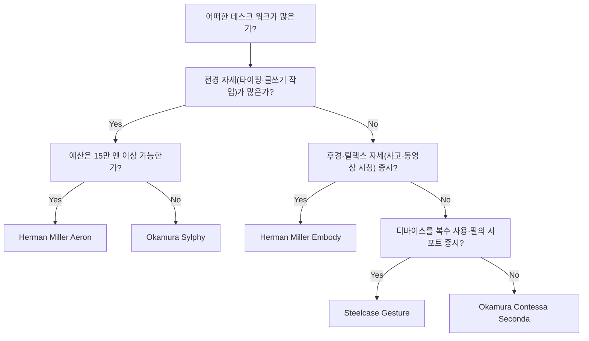
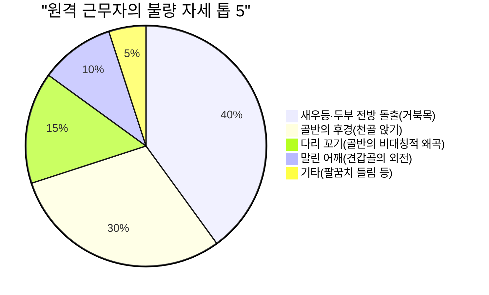

원격 근무가 일반화되면서 많은 소프트웨어 엔지니어나 지식 노동자가 하루 8시간 이상을 책상 앞에서 보내게 되었습니다. 이러한 장시간의 좌식 자세는 인체, 특히 요추(Lumbar spine)에 대해 극도로 가혹한 부하를 강요하게 됩니다.

본 기사에서는 단순한 '추천 의자'의 소개에 그치지 않고, **해부학(Anatomy)**과 **생체 역학(Biomechanics)**, 그리고 물리학적인 접근을 통해 왜 인체공학(에르고노믹스) 의자가 필요한지, 그리고 어떻게 자신에게 최적인 한 의자를 선택해야 하는지 철저하게 해설합니다.

---

## 1. 좌식 자세의 생체 역학과 해부학적 고찰

인간의 몸은 본래 '계속 앉아 있도록' 설계되지 않았습니다. 직립 이족 보행에 적응한 척주는 측면에서 보면 완만한 S자 커브(경추 전만, 흉추 후만, 요추 전만)를 그리고 있습니다. 이 S자 커브야말로 중력을 분산하고 보행 시나 직립 시의 충격을 흡수하는 서스펜션 역할을 합니다.

### 추간판 내압의 물리학

직립 자세에서 좌식 자세로 이행하면 골반이 뒤로 기울기 쉬워지고, 이에 따라 요추의 전만(앞으로 휘어짐)이 상실되어 후만(뒤로 둥글게 굽어짐)하기 쉬워집니다. 이때, 요추 사이에 존재하는 연골 조직인 '추간판(Intervertebral disc)'에 어떠한 물리적 변화가 일어나는지 생각해 봅시다.

압력 $P$ 는 가해지는 힘 $F$ 와 힘이 가해지는 면적 $A$ 를 이용하여 다음과 같은 식으로 표현됩니다.

$$ P = \frac{F}{A} $$

스웨덴의 정형외과 의사 알프 나쳄슨(Alf Nachemson)의 유명한 연구에 따르면, 기립 시 제3·제4 요추 간의 추간판 내압을 100%로 했을 때, 올바른 자세의 좌식에서는 140%, 앞으로 구부정하게(새우등) 앉은 상태에서는 무려 185%에서 200% 이상에 달하는 것으로 나타났습니다.

이때, 상반신의 질량에 의한 압축력 $F$ 뿐만 아니라, 전경 자세(앞으로 기울인 자세)에 의한 굽힘 모멘트가 추간판의 특정 영역(특히 후방 섬유륜)에 응력을 집중시켜, 국소적인 면적 $A_{local}$ 에 대한 압력 $P_{local}$ 을 급증시킵니다. 단위를 파스칼(Pa, $N/m^2$)로 생각해보면, 수 메가파스칼(MPa)에 이르는 막대한 압력이 특정 섬유륜에 집중되는 것이며, 이것이 추간판 탈출증(디스크)이나 만성 요통의 직접적인 원인이 됩니다.

### 불량 자세(새우등·천골 앉기)에서의 토크 계산

소프트웨어 엔지니어가 모니터를 들여다볼 때 자주 취하는 '두부 전방 돌출 자세(Forward Head Posture)'나 '천골 앉기(Slouching)'에서는 척주의 기부(L5/S1 관절)에 거대한 토크(회전 모멘트)가 발생합니다.

토크 $\tau$ 는 다음 식으로 나타낼 수 있습니다.

$$ \tau = r \times F \sin(\theta) $$

여기서,
- $r$ : L5/S1 관절에서 상반신 무게중심까지의 거리(모멘트 암)
- $F$ : 상반신의 중력(질량 $m \times$ 중력가속도 $g$)
- $\theta$ : 중력 벡터와 상반신의 체간축이 이루는 각도

앞으로 기울인 자세를 취할수록, 혹은 새우등이 되어 무게중심이 앞으로 이동할수록 모멘트 암 $r$ 이 길어지고 $\theta$ 가 증가하므로, 요배부의 근육(척추기립근군 등)은 이렇게 전경하는 토크 $\tau$ 에 맞서기 위해 거대한 역방향의 당기는 힘을 지속적으로 발휘해야만 합니다. 이것이 '근피로에 의한 요통 및 등 통증'의 물리적 메커니즘입니다.

---

## 2. 인체공학 의자의 메커니즘: 기술적 브레이크스루

위와 같은 생체 역학적인 부하를 경감하기 위해, 하이엔드 인체공학 의자에는 다수의 물리적·기계공학적 기구가 조립되어 있습니다.

### 요추 지지대(Lumbar Support)와 척추의 S자 커브 유지

요추 지지대의 가장 큰 목적은 골반을 세우고 요추의 전만(Lordosis)을 물리적으로 지원하는 것입니다.
이상적인 요추 지지대는 점이 아니라 '면'으로 요추에서 골반 상부를 지탱합니다. 접촉 면적 $A$ 를 극대화함으로써, 앞서 언급한 $P = F/A$ 의 식에서의 압력 $P$ 를 최소한으로 억제하면서 필요한 지지력 $F$ 를 제공합니다.
최근에는 Herman Miller Aeron의 'PostureFit SL'과 같이 천골(Sacrum)과 요추(Lumbar) 양쪽을 독립적으로 지지하여 골반의 자연스러운 전경을 촉진하는 기구가 주류를 이루고 있습니다.

### 싱크로 틸트(Synchro-Tilt) 메커니즘

기존의 저렴한 사무용 의자에서는 등받이와 좌판이 같은 각도로 기울어지는 '센터 틸트'가 일반적이었습니다. 하지만 이것으로는 뒤로 기울였을 때 대퇴부(허벅지)가 들려 무릎 뒤쪽의 혈류가 압박받게 됩니다.

'싱크로 틸트 기구'는 등받이와 좌판이 연동되면서도 다른 비율(일반적으로 2:1에서 3:1)로 경사지는 메커니즘입니다. 이로 인해 뒤로 기울여도 좌판의 전연(앞 가장자리)이 거의 들리지 않아, 발바닥을 단단히 바닥에 접지시킨 채 척추로 가는 압축 부하를 해방시킬 수 있습니다.

### 포워드 틸트(Forward-Tilt)의 중요성

프로그래밍이나 타이핑, 정밀한 마우스 조작 등 PC 작업의 상당수는 본질적으로 '전경 자세'를 유발합니다.
포워드 틸트 기능은 좌판 전체를 앞으로 몇 도(예: -5도) 기울이는 기능입니다. 좌판이 앞으로 기울어짐으로써 고관절의 각도가 90도 이상으로 열리고(100도~110도), 골반이 자연스럽게 일어납니다. 이에 의해 요추의 S자 커브가 유지되고, 앞서 언급한 토크 $\tau$ 를 극적으로 감소시키는 것이 가능합니다.

---

## 3. 하이엔드 모델의 아키텍처 비교

여기에서는 전 세계의 엔지니어들로부터 지지받는 대표적인 하이엔드 인체공학 의자의 구조적 접근을 비교합니다.

### Herman Miller Aeron (허먼밀러 에어론 체어)
**특징: 페리클(메쉬)에 의한 체압 분산과 포워드 틸트**

1994년에 등장하여 사무용 의자의 역사를 바꾼 명작입니다. '페리클'이라 불리는 독자적인 메쉬 소재는 앉는 사람의 체형에 맞추어 장력이 변화하며, 대퇴부나 둔부에 가해지는 압력을 균등하게 분산시킵니다.
특기할 만한 점은 매우 우수한 **포워드 틸트 기구**입니다. 소프트웨어 개발 등 화면에 집중하는 작업이 많은 엔지니어에게 있어, 좌판 채로 앞으로 기울어져 골반을 세워주는 에어론 체어는 허리로 가는 부하를 최소화하는 최강의 툴이라고 할 수 있습니다.

### Herman Miller Embody (허먼밀러 엠바디 체어)
**특징: 픽셀 구조와 헬스 포지티브한 후경 자세**

엠바디 체어는 등받이와 좌판에 무수한 '픽셀(지지점)'을 배치하여, 인체의 미세한 움직임에 추종하는 동적인 서포트를 실현하고 있습니다.
에어론 체어가 전경 작업에 적합한 반면, 엠바디 체어는 **후경 자세(리클라이닝한 상태)**에서의 작업을 권장하는 설계 사상을 가지고 있습니다. 광활한 등받이에 체중을 맡기고 척주에 가해지는 압축력 $F$ 를 등받이로 분산시킴으로써, 장시간의 사고 작업이나 코딩 시의 피로를 극한까지 저감합니다.

### Steelcase Gesture / Leap (스틸케이스 제스처 / 립)
**특징: 3D LiveBack 테크놀로지와 VAD(시선·팔의 움직임)로의 추종**

Steelcase의 의자는 척추의 움직임을 모방하여 변형하는 'LiveBack' 테크놀로지가 특징입니다. 척주가 비대칭적인 움직임을 하였을 때에도, 등받이가 그에 맞춰 추종합니다.
특히 Gesture는 스마트폰이나 태블릿 등 현대의 다양한 디바이스 사용 시의 자세 변화를 연구하여 개발되었으며, 암레스트(팔걸이)의 가동역이 경이적입니다. 어떠한 자세에서도 팔을 적절하게 지지함으로써, 어깨 결림이나 목 통증의 원인이 되는 승모근으로의 부하를 경감합니다.

### Okamura Sylphy / Contessa (오카무라 실피 / 콘테사)
**특징: 일본의 인체공학과 스마트 오퍼레이션**

Okamura의 콘테사 세콘다는 조르제토 주지아로에 의한 아름다운 디자인과, 암레스트의 첨단에서 좌판의 높이나 리클라이닝을 조정할 수 있는 '스마트 오퍼레이션'이 빼어납니다.
한편, 실피(Sylphy)는 등받이의 커브를 앉는 사람의 체형에 맞추어 조정할 수 있는 '백 커브 어저스트 기구'나, 에어론 체어에 필적하는 뛰어난 포워드 틸트 기구를 갖추고 있으면서도, 비교적 도입하기 쉬운 가격대로 일본의 원격 근무자들로부터 절대한 지지를 모으고 있습니다.

---

## 4. 자신에게 최적인 의자를 선택하는 방법 (의사결정 트리)

몸의 사이즈, 작업 스타일, 예산에 따라 최적의 의자는 다릅니다. 이하의 플로우차트를 참고하여, 당신에게 최적인 모델을 찾아보세요.

---

## 5. 워크스페이스의 최적화: 의자만으로는 해결되지 않는다

아무리 뛰어난 인체공학 의자를 도입해도, 책상의 높이나 모니터의 높이가 맞지 않으면 의미가 없습니다.

### 책상과 모니터 높이의 물리학

1. **책상의 높이**: 키보드에 손을 얹었을 때, 팔꿈치의 각도가 90~100도가 되는 높이가 이상적입니다. 발바닥이 바닥에 딱 맞게 닿지 않는 경우는 풋레스트(발받침)를 도입하여, 대퇴부 이면의 압박을 방지해주세요.
2. **모니터의 높이**: 모니터의 상단이 시선과 같거나, 혹은 약간 아래가 되도록 설정합니다. 시선이 너무 내려가면, 두부(약 5kg)를 지탱하기 위해 목의 근육(후경근군)에 과도한 장력이 발생하여, 스트레이트 넥(거북목)의 원인이 됩니다.

이하의 파이 차트는 원격 근무자에게 흔히 있는 불량 자세의 비율을 나타내고 있습니다. 이러한 자세를 회피하도록 환경을 조성하는 폭이 중요합니다.

---

## 요약: 건강으로의 투자로서의 인체공학 의자

인체공학 의자는 결코 싼 물건이 아닙니다. 10만 엔에서 20만 엔을 넘는 모델도 드물지 않습니다. 그러나, 1일 8시간, 연간 약 2000시간을 그 위에서 보내는 것을 생각하면, 요통에 의한 생산성의 저하나 의료비의 리스크를 미연에 방지하기 위한 '가장 비용 대비 효과가 높은 투자(ROI가 높은 디바이스)'라고 할 수 있습니다.

생체 역학적인 관점에서 자신의 작업 스타일을 재검토하고, 자신의 골격과 근육을 정확하게 서포트해주는 '물리학적으로 올바른 한 의자'를 선별해내 주십시오. 그것이, 길고 쾌적하게 엔지니어링을 계속하기 위한 최대의 비결입니다.
