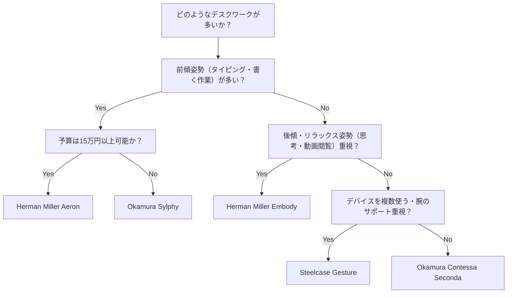
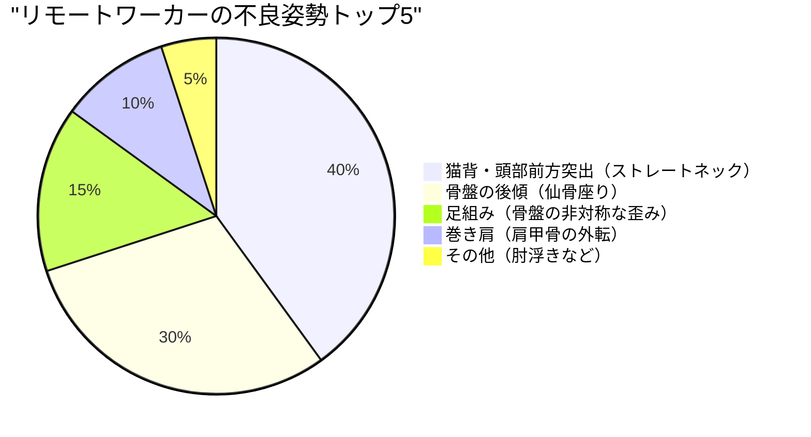

リモートワークが一般化し、多くのソフトウェアエンジニアやナレッジワーカーが1日8時間以上をデスクの前で過ごすようになりました。このような長時間の座位姿勢は、人体、特に腰椎（Lumbar spine）に対して極めて過酷な負荷を強いることになります。

本記事では、単なる「おすすめチェア」の紹介にとどまらず、**解剖学（Anatomy）**と**生体力学（Biomechanics）**、そして物理学的なアプローチを用いて、なぜエルゴノミクス（人間工学）チェアが必要なのか、そしてどのように自分に最適な一脚を選ぶべきかを徹底的に解説します。

---

## 1. 座位姿勢の生体力学と解剖学的考察

人間の体は、本来「座り続ける」ようには設計されていません。直立二足歩行に適応した脊柱は、側面から見ると緩やかなS字カーブ（頸椎前弯、胸椎後弯、腰椎前弯）を描いています。このS字カーブこそが、重力を分散し、歩行時や直立時の衝撃を吸収するサスペンションの役割を果たしています。

### 椎間板内圧の物理学

直立姿勢から座位姿勢に移行すると、骨盤が後傾しやすくなり、それに伴って腰椎の前弯（前への反り）が失われ、後弯（後ろへの丸まり）しやすくなります。このとき、腰椎の間に存在する軟骨組織である「椎間板（Intervertebral disc）」にどのような物理的変化が起きるのかを考えてみましょう。

圧力 $P$ は、加わる力 $F$ と、力が加わる面積 $A$ を用いて以下の式で表されます。

$$ P = \frac{F}{A} $$

スウェーデンの整形外科医アルフ・ナチェムソン（Alf Nachemson）の有名な研究によると、立位時の第3・第4腰椎間の椎間板内圧を100%とした場合、正しい姿勢での座位では140%、前かがみ（猫背）で座った状態ではなんと185%から200%以上にも達することが示されています。

このとき、上半身の質量による圧縮力 $F$ だけでなく、前傾姿勢による曲げモーメントが椎間板の特定の領域（特に後方輪状靱帯）に応力を集中させ、局所的な面積 $A_{local}$ における圧力 $P_{local}$ を激増させます。単位をパスカル (Pa, $N/m^2$) で考えると、数メガパスカル (MPa) にも及ぶ強大な圧力が特定の線維輪に集中することになり、これが椎間板ヘルニアや慢性的な腰痛の直接的な原因となります。

### 不良姿勢（猫背・仙骨座り）におけるトルクの計算

ソフトウェアエンジニアがモニタを覗き込む際によくやってしまう「頭部前方突出姿勢（Forward Head Posture）」や「仙骨座り（Slouching）」では、脊柱の基部（L5/S1関節）に強大なトルク（回転モーメント）が発生します。

トルク $\tau$ は以下の式で表されます。

$$ \tau = r \times F \sin(\theta) $$

ここで、
- $r$ : L5/S1関節から上半身の重心までの距離（モーメントアーム）
- $F$ : 上半身の重力（質量 $m \times$ 重力加速度 $g$）
- $\theta$ : 重力ベクトルと上半身の体幹軸がなす角度

前傾姿勢をとるほど、あるいは猫背になって重心が前方に移動するほど、モーメントアーム $r$ が長くなり、かつ $\theta$ が増加するため、腰背部の筋肉（脊柱起立筋群など）は、この前傾するトルク $\tau$ に打ち勝つための強大な逆向きの引っ張り力を継続的に発揮しなければなりません。これが「筋疲労による腰痛・背部痛」の物理的メカニズムです。

---

## 2. エルゴノミクスチェアのメカニズム：技術的ブレイクスルー

上記のような生体力学的な負荷を軽減するため、高級エルゴノミクスチェアには複数の物理的・機械工学的な機構が組み込まれています。

### ランバーサポートと背骨のS字カーブ維持

ランバーサポートの最大の目的は、骨盤を立て、腰椎の前弯（Lordosis）を物理的にサポートすることです。
理想的なランバーサポートは、点ではなく「面」で腰椎から骨盤上部を支えます。接触面積 $A$ を最大化することで、前述の $P = F/A$ の式における圧力 $P$ を最小限に抑えつつ、必要な支持力 $F$ を提供します。
近年では、Herman Miller Aeronの「PostureFit SL」のように、仙骨（Sacrum）と腰椎（Lumbar）の両方を独立してサポートし、骨盤の自然な前傾を促す機構が主流となっています。

### シンクロ・ロッキング（Synchro-Tilt）メカニズム

従来の安価なオフィスチェアでは、背もたれと座面が同じ角度で傾く「センター・ロッキング」が一般的でした。しかしこれでは、後傾した際に大腿部（太もも）が持ち上がり、膝裏の血流が圧迫されてしまいます。

「シンクロ・ロッキング機構」は、背もたれと座面が連動しつつも、異なる比率（通常は 2:1 から 3:1）で傾斜するメカニズムです。これにより、後傾しても座面の前縁があまり持ち上がらず、足裏をしっかりと床に接地させたまま、背骨への圧縮負荷を解放することができます。

### 前傾チルト（Forward-Tilt）の重要性

プログラミングやタイピング、緻密なマウス操作など、PC作業の多くは本質的に「前傾姿勢」を誘発します。
前傾チルト機能は、座面全体を前方に数度（例: -5度）傾ける機能です。座面が前傾することで、股関節の角度が90度以上に開き（100度〜110度）、骨盤が自然に立ち上がります。これにより、腰椎のS字カーブが保たれ、前述のトルク $\tau$ を劇的に減少させることが可能です。

---

## 3. ハイエンドモデルのアーキテクチャ比較

ここでは、世界中のエンジニアから支持される代表的なハイエンドエルゴノミクスチェアの構造的アプローチを比較します。

### Herman Miller Aeron（アーロンチェア）
**特徴: ペリクル（メッシュ）による体圧分散と前傾チルト**

1994年に登場し、オフィスチェアの歴史を変えた名作です。「ペリクル」と呼ばれる独自のメッシュ素材は、座る人の体型に合わせて張力が変化し、大腿部や臀部にかかる圧力を均等に分散します。
特筆すべきは、非常に優秀な**前傾チルト機構**です。ソフトウェア開発など、画面に集中する作業が多いエンジニアにとって、座面ごと前傾して骨盤を立たせてくれるアーロンチェアは、腰への負荷を最小限にする最強のツールと言えます。

### Herman Miller Embody（エンボディチェア）
**特徴: ピクセル構造とヘルス・ポジティブな後傾姿勢**

エンボディチェアは、背もたれと座面に無数の「ピクセル（支持点）」を配置し、人体の微細な動きに追従する動的なサポートを実現しています。
アーロンチェアが前傾作業向きであるのに対し、エンボディチェアは**後傾姿勢（リクライニングした状態）**での作業を推奨する設計思想を持っています。広大な背もたれに体重を預け、脊柱にかかる圧縮力 $F$ を背もたれに逃がすことで、長時間の思考作業やコーディング時の疲労を極限まで低減します。

### Steelcase Gesture / Leap（ジェスチャー / リープ）
**特徴: 3D LiveBackテクノロジーとVAD（視線・腕の動き）への追従**

Steelcaseのチェアは、背骨の動きを模倣して変形する「LiveBack」テクノロジーが特徴です。脊柱が非対称な動きをした際にも、背もたれがそれに合わせて追従します。
特にGestureは、スマートフォンやタブレットなど、現代の多様なデバイス使用時の姿勢変化を研究して開発されており、アームレストの可動域が驚異的です。どのような姿勢でも腕を適切に支持することで、肩こりや首の痛みの原因となる僧帽筋への負荷を軽減します。

### Okamura Sylphy / Contessa（シルフィー / コンテッサ）
**特徴: 日本のエルゴノミクスとスマートオペレーション**

Okamuraのコンテッサ セコンダは、ジョルジェット・ジウジアーロによる美しいデザインと、アームレストの先端で座面の高さやリクライニングを調整できる「スマートオペレーション」が秀逸です。
一方、シルフィー（Sylphy）は、背もたれのカーブを座る人の体型に合わせて調整できる「バックカーブアジャスト機構」や、アーロンチェアに匹敵する優れた前傾チルト機構を備えながらも、比較的導入しやすい価格帯で日本のリモートワーカーから絶大な支持を集めています。

---

## 4. 自分に最適なチェアの選び方（ディシジョンツリー）

体のサイズ、作業スタイル、予算によって最適なチェアは異なります。以下のフローチャートを参考に、あなたに最適なモデルを見つけてください。

---

## 5. ワークスペースの最適化：チェアだけでは解決しない

どれほど優れたエルゴノミクスチェアを導入しても、机の高さやモニターの高さが合っていなければ意味がありません。

### デスクとモニターの高さの物理学

1. **デスクの高さ**: キーボードに手を置いたとき、肘の角度が90〜100度になる高さが理想です。足の裏が床にぴったりと着かない場合は、フットレスト（足置き）を導入して、大腿部裏の圧迫を防いでください。
2. **モニターの高さ**: モニターの上端が視線と同じ、あるいはわずかに下になるように設定します。視線が下がりすぎると、頭部（約5kg）を支えるために首の筋肉（後頸筋群）に過度な張力が発生し、ストレートネックの原因となります。

以下の円グラフは、リモートワーカーにありがちな不良姿勢の割合を示しています。これらの姿勢を回避するように環境を整えることが重要です。

---

## まとめ：健康への投資としてのエルゴノミクスチェア

エルゴノミクスチェアは決して安い買い物ではありません。10万円から20万円を超えるモデルも珍しくありません。しかし、1日8時間、年間約2000時間をその上で過ごすことを考えれば、腰痛による生産性の低下や医療費のリスクを未然に防ぐための「最も費用対効果の高い投資（ROIが高いデバイス）」であると言えます。

生体力学的な観点から自分の作業スタイルを見直し、自分の骨格と筋肉を正確にサポートしてくれる「物理学的に正しい一脚」を選び抜いてください。それが、長く快適にエンジニアリングを続けるための最大の秘訣です。
