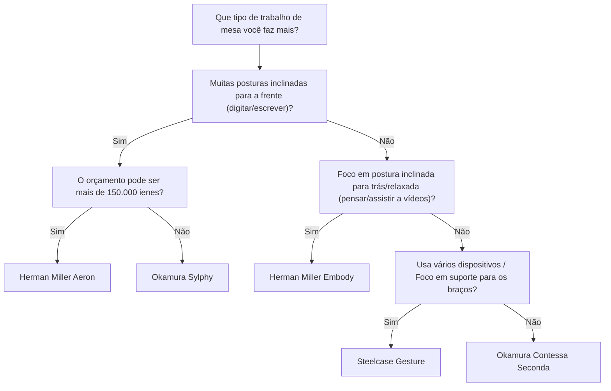
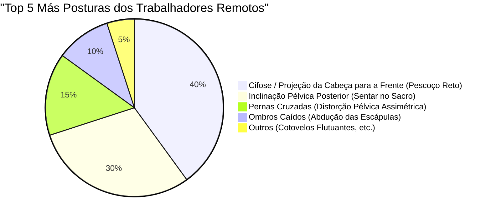

Com a popularização do trabalho remoto, muitos engenheiros de software e trabalhadores do conhecimento agora passam mais de 8 horas por dia em frente a uma mesa. Essa postura sentada prolongada impõe uma carga extremamente severa ao corpo humano, especialmente à coluna lombar (Lumbar spine).

Neste artigo, além de simplesmente apresentar "cadeiras recomendadas", usaremos a **anatomia (Anatomy)**, a **biomecânica (Biomechanics)** e abordagens físicas para explicar detalhadamente por que as cadeiras ergonômicas são necessárias e como você deve escolher a melhor para si.

---

## 1. Biomecânica da Postura Sentada e Considerações Anatômicas

O corpo humano não foi originalmente projetado para "continuar sentado". A coluna vertebral, adaptada para a marcha bípede ereta, apresenta uma leve curva em forma de S (lordose cervical, cifose torácica, lordose lombar) quando vista de lado. Esta curva em S atua como uma suspensão, distribuindo a gravidade e absorvendo impactos durante a caminhada e ao ficar em pé.

### A Física da Pressão Intradiscal

Ao fazer a transição de uma postura em pé para uma postura sentada, a pelve tende a se inclinar para trás, e a lordose lombar (curvatura para a frente) é perdida, facilitando a cifose (curvatura para trás). Vamos considerar que mudanças físicas ocorrem no "disco intervertebral (Intervertebral disc)", que é o tecido cartilaginoso existente entre as vértebras lombares nesse momento.

A pressão $P$ é expressa pela seguinte fórmula usando a força aplicada $F$ e a área onde a força é aplicada $A$.

$$ P = \frac{F}{A} $$

De acordo com uma pesquisa famosa do cirurgião ortopédico sueco Alf Nachemson, se a pressão intradiscal entre a 3ª e a 4ª vértebra lombar na posição de pé for definida como 100%, ela é de 140% ao sentar em uma postura correta, e atinge espantosos 185% a mais de 200% quando se senta inclinado para a frente (postura encurvada/cifose).

Nesse momento, não apenas a força de compressão $F$ devido à massa da parte superior do corpo, mas também o momento de flexão causado pela postura inclinada para a frente concentra o estresse em áreas específicas do disco intervertebral (especialmente no anel fibroso posterior), aumentando drasticamente a pressão $P_{local}$ em uma área local $A_{local}$. Pensando na unidade como pascal (Pa, $N/m^2$), uma enorme pressão de vários megapascals (MPa) concentra-se em anéis fibrosos específicos, o que é a causa direta de hérnia de disco e dor lombar crônica.

### Cálculo de Torque em Posturas Inadequadas (Cifose / Sentar no Sacro)

Na "Postura da Cabeça Projetada para a Frente (Forward Head Posture)" e no "Desleixo (Slouching)", que os engenheiros de software costumam adotar ao olhar para os monitores, um torque poderoso (momento de rotação) é gerado na base da coluna (articulação L5/S1).

O torque $\tau$ é expresso pela seguinte fórmula:

$$ \tau = r \times F \sin(\theta) $$

Aqui,
- $r$ : A distância da articulação L5/S1 até o centro de gravidade da parte superior do corpo (braço de momento)
- $F$ : A gravidade da parte superior do corpo (massa $m \times$ aceleração da gravidade $g$)
- $\theta$ : O ângulo formado pelo vetor da gravidade e o eixo do tronco da parte superior do corpo

Quanto mais inclinada for a postura ou quanto mais encurvadas forem as costas e o centro de gravidade se deslocar para a frente, mais longo se torna o braço de momento $r$ e $\theta$ aumenta, forçando os músculos das costas lombares (como os músculos eretores da espinha) a exercerem continuamente uma poderosa força de tração inversa para superar esse torque de inclinação para frente $\tau$. Este é o mecanismo físico da "dor lombar e nas costas causada por fadiga muscular".

---

## 2. O Mecanismo das Cadeiras Ergonômicas: Avanço Tecnológico

Para reduzir a carga biomecânica mencionada acima, as cadeiras ergonômicas de alta qualidade incorporam vários mecanismos físicos e de engenharia mecânica.

### Suporte Lombar e Manutenção da Curva em S da Coluna

O objetivo principal do suporte lombar é estabilizar a pelve e suportar fisicamente a lordose lombar (Lordosis).
O suporte lombar ideal apoia desde a vértebra lombar até a parte superior da pelve como uma "superfície", não como um ponto. Maximizando a área de contato $A$, minimiza a pressão $P$ na fórmula $P = F/A$ mencionada acima, ao mesmo tempo em que fornece a força de suporte necessária $F$.
Nos últimos anos, mecanismos que suportam de forma independente tanto o sacro (Sacrum) quanto a lombar (Lumbar) para encorajar a inclinação pélvica natural, como o "PostureFit SL" da Herman Miller Aeron, tornaram-se comuns.

### Mecanismo de Inclinação Sincronizada (Synchro-Tilt)

Em cadeiras de escritório baratas tradicionais, o "mecanismo de inclinação central", onde o encosto e o assento inclinam-se no mesmo ângulo, era comum. No entanto, com isso, as coxas são levantadas ao inclinar-se para trás, e o fluxo sanguíneo atrás dos joelhos é comprimido.

O "mecanismo de inclinação sincronizada" é um mecanismo onde o encosto e o assento são interligados, mas inclinam-se em diferentes proporções (geralmente de 2:1 a 3:1). Como resultado, a borda frontal do assento não sobe muito mesmo ao inclinar-se para trás, permitindo liberar a carga de compressão na coluna enquanto mantém as solas dos pés firmemente apoiadas no chão.

### A Importância da Inclinação Frontal (Forward-Tilt)

Grande parte do trabalho no PC, como programação, digitação e operações precisas com o mouse, induz inerentemente a uma "postura inclinada para a frente".
A função de inclinação frontal é uma função que inclina o assento inteiro alguns graus para a frente (por exemplo: -5 graus). Quando o assento se inclina para a frente, o ângulo da articulação do quadril se abre para mais de 90 graus (100 a 110 graus) e a pelve se levanta naturalmente. Como resultado, a curva em S da coluna lombar é mantida e o torque $\tau$ mencionado acima pode ser drasticamente reduzido.

---

## 3. Comparação da Arquitetura de Modelos Premium

Aqui, comparamos as abordagens estruturais de cadeiras ergonômicas de ponta representativas, endossadas por engenheiros em todo o mundo.

### Herman Miller Aeron (Cadeira Aeron)
**Características: Distribuição de Pressão Corporal e Inclinação Frontal com Película (Malha)**

Uma obra-prima introduzida em 1994 que mudou a história das cadeiras de escritório. O material de malha exclusivo chamado "Pellicle" muda sua tensão de acordo com o tipo de corpo da pessoa sentada, distribuindo uniformemente a pressão nas coxas e nádegas.
Vale destacar o excelente **mecanismo de inclinação frontal**. Para engenheiros que costumam realizar tarefas focadas na tela, como desenvolvimento de software, a cadeira Aeron, que inclina o assento e levanta a pelve, é a ferramenta ideal para minimizar o estresse na região lombar.

### Herman Miller Embody (Cadeira Embody)
**Características: Estrutura de Pixels e Postura Inclinada para Trás Pró-Saúde**

A cadeira Embody atinge suporte dinâmico que segue os micro-movimentos do corpo humano através de inúmeros "pixels (pontos de suporte)" localizados no encosto e assento.
Enquanto a cadeira Aeron é mais adequada para o trabalho inclinado para a frente, a cadeira Embody tem uma filosofia de design que recomenda o trabalho em uma **postura inclinada para trás (reclinada)**. Ao confiar o peso do seu corpo no vasto encosto e transferir a força de compressão $F$ da coluna para o mesmo, a fadiga é extremamente minimizada durante longas horas de pensamento e codificação.

### Steelcase Gesture / Leap (Gesture / Leap)
**Características: Tecnologia 3D LiveBack e Rastreamento da VAD (Movimento da Visão e Braço)**

As cadeiras da Steelcase apresentam a tecnologia "LiveBack" que se deforma para imitar o movimento da coluna. Mesmo quando a coluna faz movimentos assimétricos, o encosto a segue conforme o movimento.
A Gesture, em particular, foi desenvolvida pesquisando as mudanças de postura durante o uso dos diversos dispositivos de hoje, como smartphones e tablets, e a amplitude de movimento de seus apoios de braço é incrível. Apoiando adequadamente os braços em qualquer postura, reduz a carga sobre o músculo trapézio, que causa rigidez nos ombros e dores no pescoço.

### Okamura Sylphy / Contessa (Sylphy / Contessa)
**Características: Ergonomia Japonesa e Operação Inteligente**

A Okamura Contessa Seconda destaca-se pelo seu belo design de Giorgetto Giugiaro e pela "operação inteligente", que permite ajustar a altura e a reclinação do assento a partir das pontas dos apoios de braço.
Por outro lado, a Sylphy atrai forte apoio de trabalhadores remotos japoneses a um preço relativamente acessível, sendo equipada com um "mecanismo de ajuste da curva do encosto" que pode ser adaptado ao tipo de corpo do usuário, além de um excelente mecanismo de inclinação frontal que rivaliza com a Cadeira Aeron.

---

## 4. Como Escolher a Cadeira Certa para Você (Árvore de Decisão)

A cadeira ideal varia dependendo do tamanho do seu corpo, estilo de trabalho e orçamento. Por favor, use o fluxograma abaixo como referência para encontrar o melhor modelo para você.

---

## 5. Otimização do Espaço de Trabalho: Uma Cadeira Sozinha Não Resolve Tudo

Não importa o quão boa seja uma cadeira ergonômica, não faz sentido se a altura da mesa e do monitor não forem adequadas.

### A Física da Altura da Mesa e do Monitor

1. **Altura da mesa**: A altura ideal é onde os cotovelos formam um ângulo de 90 a 100 graus quando as mãos estão apoiadas no teclado. Se a sola de seus pés não tocar completamente no chão, introduza um apoio para os pés para evitar a compressão na parte de trás das coxas.
2. **Altura do monitor**: Coloque o monitor de forma que a borda superior esteja nivelada ou ligeiramente abaixo do nível dos olhos. Se a sua linha de visão cair muito, será gerada uma tensão excessiva nos músculos do pescoço (músculos cervicais posteriores) para suportar a cabeça (cerca de 5 kg), o que causa o "pescoço reto" (perda da curvatura cervical natural).

O gráfico de pizza abaixo mostra a proporção das más posturas comuns entre os trabalhadores remotos. É importante preparar o ambiente para evitar essas posturas.

---

## Conclusão: Cadeira Ergonômica Como um Investimento na Saúde

Uma cadeira ergonômica não é, de forma alguma, uma compra barata. Modelos que custam entre 100.000 e mais de 200.000 ienes não são incomuns. No entanto, considerando que você passa 8 horas por dia e cerca de 2000 horas por ano sentado nela, pode ser dito que é o "investimento mais rentável (dispositivo de alto ROI)" para evitar a perda de produtividade e as despesas médicas causadas pelas dores nas costas.

Revise seu estilo de trabalho sob uma perspectiva biomecânica e selecione cuidadosamente uma "cadeira fisicamente correta" que apoie sua estrutura óssea e músculos adequadamente. Esse é o maior segredo para continuar na engenharia confortavelmente por um longo tempo.
