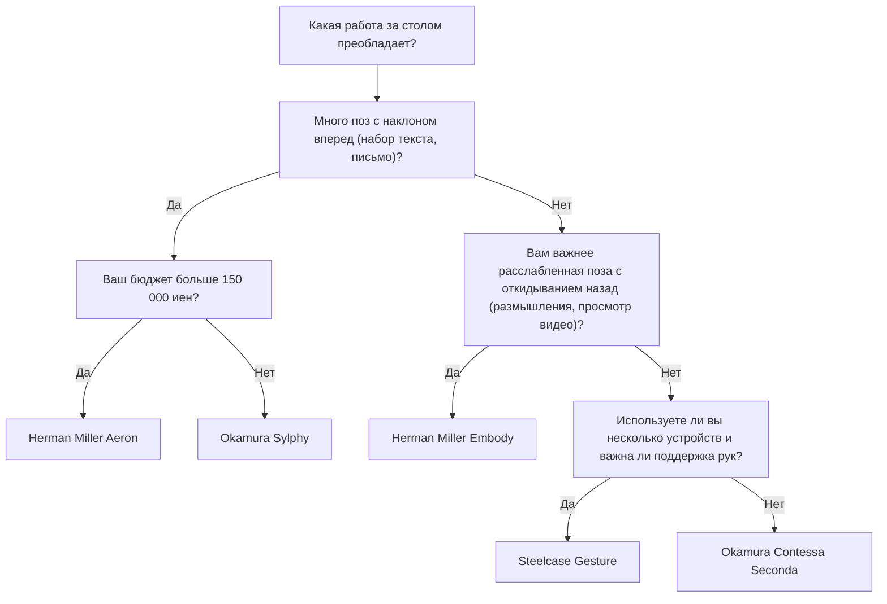

Удаленная работа стала нормой, и многие инженеры-программисты и работники умственного труда проводят перед столом более 8 часов в день. Такое длительное сидение создает чрезвычайно высокую нагрузку на человеческий организм, особенно на поясничный отдел позвоночника (Lumbar spine).

В этой статье мы не просто порекомендуем «лучшие кресла», но и с точки зрения **анатомии (Anatomy)**, **биомеханики (Biomechanics)** и физики подробно объясним, почему необходимо эргономичное кресло и как правильно выбрать идеальный вариант для себя.

---

## 1. Биомеханика и анатомия положения сидя

Человеческое тело изначально не предназначено для того, чтобы «постоянно сидеть». Позвоночник, приспособленный к прямохождению на двух ногах, при виде сбоку образует плавную S-образную кривую (шейный лордоз, грудной кифоз, поясничный лордоз). Именно эта S-образная кривая выполняет роль амортизатора, распределяя силу тяжести и поглощая удары при ходьбе и стоянии.

### Физика внутридискового давления

При переходе из положения стоя в положение сидя таз склонен наклоняться назад, что приводит к потере поясничного лордоза (прогиба вперед) и способствует кифозу (округлению назад). Давайте рассмотрим, какие физические изменения происходят при этом в «межпозвоночном диске (Intervertebral disc)» — хрящевой ткани между поясничными позвонками.

Давление $P$ выражается следующей формулой, где $F$ — приложенная сила, а $A$ — площадь, на которую эта сила действует:

$$ P = \frac{F}{A} $$

Согласно известному исследованию шведского хирурга-ортопеда Альфа Нахемсона (Alf Nachemson), если принять внутридисковое давление между 3-м и 4-м поясничными позвонками в положении стоя за 100%, то в положении сидя с правильной осанкой оно достигает 140%, а при сидении с наклоном вперед (сутулости) — поразительных 185–200% и более.

В этот момент не только сила сжатия $F$ от массы верхней части тела, но и изгибающий момент из-за наклона вперед концентрируют напряжение в определенных областях межпозвоночного диска (особенно в задней продольной связке), резко увеличивая давление $P_{local}$ на локальной площади $A_{local}$. Если измерять в паскалях (Pa, $N/m^2$), то огромное давление, достигающее нескольких мегапаскалей (МПа), концентрируется в определенных фиброзных кольцах, что становится непосредственной причиной грыжи межпозвоночного диска и хронической боли в пояснице.

### Расчет крутящего момента при неправильной осанке (сутулость и сидение на крестце)

При «выдвинутом вперед положении головы (Forward Head Posture)» или «сидении на крестце (Slouching)», что часто делают программисты, глядя в монитор, в основании позвоночника (сустав L5/S1) возникает мощный крутящий момент (вращательный момент).

Крутящий момент $\tau$ выражается следующей формулой:

$$ \tau = r \times F \sin(\theta) $$

Где:
- $r$ : Расстояние от сустава L5/S1 до центра тяжести верхней части тела (плечо момента)
- $F$ : Сила тяжести верхней части тела (масса $m \times$ ускорение свободного падения $g$)
- $\theta$ : Угол между вектором силы тяжести и осью туловища верхней части тела

Чем больше наклон вперед или чем сильнее сутулость и смещение центра тяжести вперед, тем длиннее становится плечо момента $r$ и увеличивается $\theta$. В результате мышцы поясницы и спины (например, группа мышц, выпрямляющих позвоночник) вынуждены постоянно создавать мощную противоположную силу натяжения, чтобы преодолеть этот наклоняющий крутящий момент $\tau$. Это и есть физический механизм «боли в пояснице и спине из-за мышечной усталости».

---

## 2. Механизмы эргономичных кресел: технологический прорыв

Для снижения описанных выше биомеханических нагрузок в премиальные эргономичные кресла встроено множество физических и механических устройств.

### Поясничная поддержка и сохранение S-образного изгиба позвоночника

Главная цель поясничной поддержки (Lumbar support) — физически поддерживать таз в вертикальном положении и сохранять поясничный лордоз (Lordosis).
Идеальная поясничная поддержка поддерживает нижнюю часть спины и верхнюю часть таза не точечно, а «плоскостью». Максимизируя площадь контакта $A$, можно минимизировать давление $P$ в формуле $P = F/A$, обеспечивая при этом необходимую поддерживающую силу $F$.
В последние годы преобладают механизмы, которые независимо поддерживают крестец (Sacrum) и поясницу (Lumbar), поощряя естественный наклон таза вперед, как, например, «PostureFit SL» в креслах Herman Miller Aeron.

### Механизм синхронного качания (Synchro-Tilt)

В обычных недорогих офисных креслах часто используется «центральное качание», при котором спинка и сиденье наклоняются под одинаковым углом. Однако при таком наклоне назад бедра поднимаются, что нарушает кровоток под коленями.

«Синхронный механизм качания» — это система, в которой спинка и сиденье связаны, но наклоняются в разных пропорциях (обычно от 2:1 до 3:1). Благодаря этому при откидывании назад передний край сиденья почти не поднимается, что позволяет ступням плотно стоять на полу, снимая нагрузку с позвоночника.

### Важность наклона вперед (Forward-Tilt)

Работа за компьютером, такая как программирование, набор текста и точные движения мышью, по своей природе провоцирует позу «наклона вперед».
Функция наклона вперед наклоняет все сиденье вперед на несколько градусов (например, -5 градусов). При наклоне сиденья вперед угол тазобедренного сустава увеличивается до 90 градусов и более (100–110 градусов), а таз естественным образом выпрямляется. Это сохраняет S-образный изгиб поясницы и может кардинально снизить крутящий момент $\tau$, упомянутый выше.

---

## 3. Сравнение архитектуры топовых моделей

Здесь мы сравним структурные подходы типичных высококлассных эргономичных кресел, которые популярны среди инженеров по всему миру.

### Herman Miller Aeron (Кресло Aeron)
**Особенности: Распределение давления с помощью материала Pellicle (сетки) и наклон вперед**

Шедевр, появившийся в 1994 году и изменивший историю офисных кресел. Уникальный сетчатый материал под названием «Pellicle» меняет свое натяжение в зависимости от формы тела сидящего, равномерно распределяя давление на бедра и ягодицы.
Особого внимания заслуживает превосходный **механизм наклона вперед**. Для инженеров, чья работа требует сосредоточения на экране (например, разработка ПО), кресло Aeron, которое наклоняется вперед вместе с сиденьем и выпрямляет таз, является лучшим инструментом для минимизации нагрузки на поясницу.

### Herman Miller Embody (Кресло Embody)
**Особенности: Пиксельная структура и поддержание здоровья при откидывании назад**

Кресло Embody оснащено множеством «пикселей (точек опоры)» на спинке и сиденье, обеспечивая динамическую поддержку, которая следует за малейшими движениями человеческого тела.
В то время как Aeron лучше подходит для работы с наклоном вперед, Embody спроектировано с учетом **работы в откинутом положении (реклайнинг)**. Перенося вес тела на широкую спинку, сила сжатия $F$, действующая на позвоночник, отводится на спинку, что максимально снижает усталость во время длительных размышлений и написания кода.

### Steelcase Gesture / Leap
**Особенности: Технология 3D LiveBack и адаптация к VAD (зрение и движения рук)**

Кресла Steelcase отличаются технологией LiveBack, которая деформируется, имитируя движения позвоночника. Даже при асимметричных движениях позвоночника спинка следует за ними.
Модель Gesture, в частности, была разработана путем изучения изменения позы при использовании различных современных устройств, таких как смартфоны и планшеты, и имеет потрясающий диапазон движения подлокотников. Правильно поддерживая руки в любом положении, она снижает нагрузку на трапециевидную мышцу, которая является причиной скованности плеч и боли в шее.

### Okamura Sylphy / Contessa
**Особенности: Японская эргономика и умное управление (Smart Operation)**

Модель Contessa Seconda от Okamura отличается красивым дизайном от Джорджетто Джуджаро и функцией «умного управления», позволяющей регулировать высоту сиденья и наклон с помощью кончиков подлокотников.
С другой стороны, модель Sylphy имеет функцию Back Curve Adjust, которая позволяет регулировать изгиб спинки под форму тела сидящего, а также превосходный механизм наклона вперед, сравнимый с Aeron. При этом она остается в доступном ценовом диапазоне и пользуется огромной популярностью среди японских удаленных работников.

---

## 4. Как выбрать идеальное кресло для себя (Дерево решений)

Идеальное кресло зависит от размера вашего тела, стиля работы и бюджета. Воспользуйтесь следующей блок-схемой, чтобы найти подходящую модель.

---

## 5. Оптимизация рабочего пространства: Одним креслом проблему не решить

Каким бы отличным ни было эргономичное кресло, оно будет бесполезным, если высота стола или монитора не отрегулирована правильно.

### Физика высоты стола и монитора

1. **Высота стола**: Идеальная высота — та, при которой угол наклона локтей составляет 90–100 градусов, когда руки лежат на клавиатуре. Если подошвы ног не касаются пола полностью, используйте подставку для ног (footrest), чтобы предотвратить давление на заднюю часть бедер.
2. **Высота монитора**: Установите монитор так, чтобы его верхний край находился на уровне глаз или чуть ниже. Если линия взгляда слишком опущена, в мышцах шеи (задней группе мышц шеи) возникает чрезмерное напряжение для поддержания головы (весом около 5 кг), что приводит к синдрому «компьютерной шеи» (straight neck).

На следующей круговой диаграмме показан процент наиболее распространенных неправильных поз среди удаленных работников. Важно организовать свое рабочее пространство так, чтобы избегать этих поз.

---

## Заключение: Эргономичное кресло как инвестиция в здоровье

Эргономичные кресла — удовольствие не из дешевых. Модели стоимостью от 100 000 до более чем 200 000 иен не редкость. Однако, если учесть, что вы проводите на нем по 8 часов в день, что составляет около 2000 часов в год, это можно назвать «устройством с самым высоким возвратом инвестиций (ROI)», которое предотвратит снижение производительности и медицинские расходы из-за болей в пояснице.

Пересмотрите свой стиль работы с точки зрения биомеханики и выберите «физически правильное кресло», которое будет точно поддерживать ваш скелет и мышцы. Это главный секрет долгой и комфортной работы в сфере инженерии.
