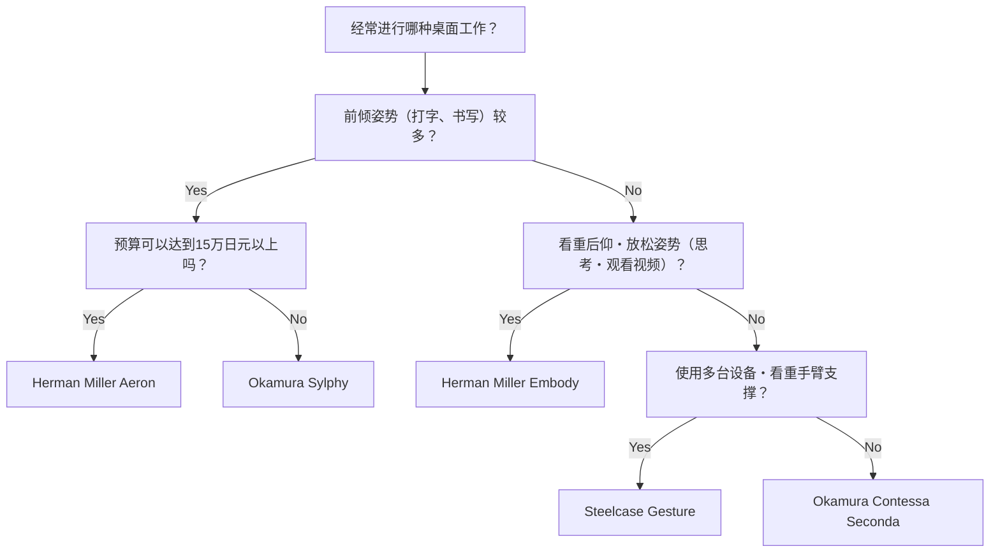
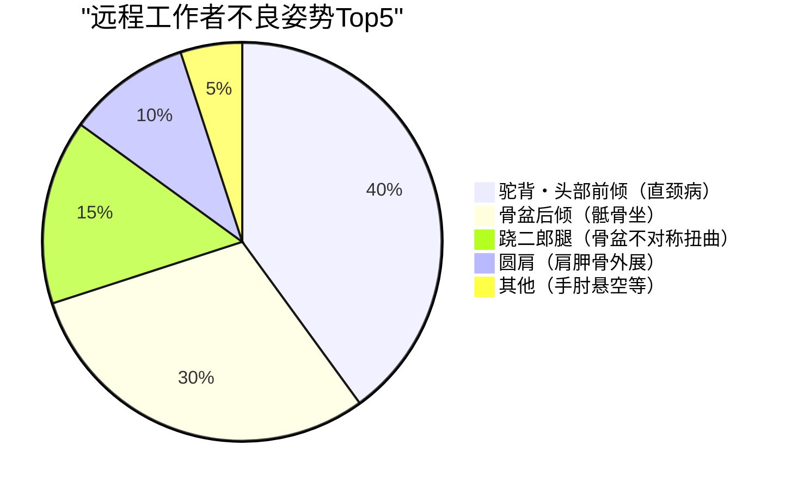

随着远程工作的普及，许多软件工程师和知识工作者每天要在办公桌前度过8个小时以上的时间。这种长时间的久坐姿势，对人体，特别是腰椎（Lumbar spine）施加了极其严苛的负荷。

本文不仅仅局限于推荐“好用的椅子”，而是运用**解剖学（Anatomy）**和**生物力学（Biomechanics）**以及物理学的方法，深入探讨为什么需要人体工学（Ergonomics）椅，以及应该如何挑选最适合自己的一把椅子。

---

## 1. 坐姿的生物力学与解剖学考察

人类的身体原本并不是为了“一直坐着”而设计的。适应了直立双足行走的脊柱，从侧面看呈平缓的S型曲线（颈椎前凸、胸椎后凸、腰椎前凸）。正是这种S型曲线发挥着悬挂系统的作用，能够分散重力，并在行走或直立时吸收冲击。

### 椎间盘内压的物理学

当从直立姿势转变为坐姿时，骨盆容易向后倾斜，随之腰椎的前凸（向前弯曲）消失，变得容易后凸（向后弯曲）。此时，位于腰椎之间的软骨组织“椎间盘（Intervertebral disc）”会发生怎样的物理变化呢？

压力 $P$ 可以用施加的力 $F$ 和受力面积 $A$ 通过以下公式表示：

$$ P = \frac{F}{A} $$

根据瑞典骨科医生阿尔夫·纳切姆森（Alf Nachemson）的著名研究，如果将站立时第3和第4腰椎间的椎间盘内压设为100%，那么在正确姿势的坐姿下压力为140%，而在前倾（驼背）坐姿下，压力竟然会高达185%到200%以上。

此时，不仅是上半身质量带来的压缩力 $F$，前倾姿势引起的弯曲力矩也会使应力集中在椎间盘的特定区域（尤其是后方纤维环韧带），导致局部面积 $A_{local}$ 上的压力 $P_{local}$ 剧增。以帕斯卡（Pa, $N/m^2$）为单位来考虑的话，高达几兆帕（MPa）的巨大压力会集中在特定的纤维环上，这就是导致椎间盘突出和慢性腰痛的直接原因。

### 不良姿势（驼背・骶骨坐）中的扭矩计算

软件工程师在盯着显示器时经常会出现的“头部前倾姿势（Forward Head Posture）”或“骶骨坐（Slouching）”中，脊柱基部（L5/S1关节）会产生巨大的扭矩（旋转力矩）。

扭矩 $\tau$ 由以下公式表示：

$$ \tau = r \times F \sin(\theta) $$

其中：
- $r$ : 从L5/S1关节到上半身重心的距离（力矩臂）
- $F$ : 上半身的重力（质量 $m \times$ 重力加速度 $g$）
- $\theta$ : 重力向量与上半身体干轴的夹角

越是采取前倾姿势，或者因为驼背导致重心前移，力矩臂 $r$ 就越长，且 $\theta$ 也会增加。因此，腰背部肌肉（如竖脊肌群等）必须持续发挥巨大的反向拉力，以克服这种前倾扭矩 $\tau$。这就是“因肌肉疲劳导致腰背痛”的物理机制。

---

## 2. 人体工学椅的机制：技术突破

为了减轻上述生物力学负荷，高端人体工学椅融入了多项物理和机械工程学机制。

### 腰部支撑与维持脊柱S型曲线

腰部支撑的最大目的是立起骨盆，并在物理上支撑腰椎的前凸（Lordosis）。
理想的腰部支撑并非用点，而是用“面”来支撑从腰椎到骨盆上部的区域。通过最大化接触面积 $A$，可以在抑制前面 $P = F/A$ 公式中压力 $P$ 的同时，提供所需的支撑力 $F$。
近年来，像Herman Miller Aeron的“PostureFit SL”那样，独立支撑骶骨（Sacrum）和腰椎（Lumbar），并促进骨盆自然前倾的机制已成为主流。

### 同步倾仰（Synchro-Tilt）机制

传统的廉价办公椅通常采用靠背和座垫以相同角度倾斜的“中心倾仰”。但这会导致在后仰时大腿被抬起，压迫膝盖后方的血液循环。

“同步倾仰机制”是一种靠背和座垫联动，但以不同比例（通常为 2:1 到 3:1）倾斜的机制。这样一来，即使后仰，座垫前缘也不会明显抬起，能够让脚底稳稳地接触地面，同时释放脊柱的压缩负荷。

### 前倾（Forward-Tilt）的重要性

编程、打字、精细的鼠标操作等许多PC工作本质上都会诱发“前倾姿势”。
前倾功能是指将整个座垫向前倾斜几度（例如：-5度）的功能。座垫前倾后，髋关节角度会张开至90度以上（100度〜110度），骨盆自然立起。这能保持腰椎的S型曲线，从而大幅减少前面提到的扭矩 $\tau$。

---

## 3. 高端型号的架构对比

在此对比世界各地工程师所推崇的代表性高端人体工学椅的结构设计。

### Herman Miller Aeron（Aeron 亚龙椅）
**特点：通过Pellicle（网面）分散体压与前倾功能**

1994年面世，改变了办公椅历史的杰作。被称为“Pellicle”的独特网状材质，能够根据乘坐者的体型改变张力，均匀分散大腿和臀部的压力。
特别值得一提的是它非常优秀的**前倾功能**。对于像软件开发这样需要大量专注屏幕工作的工程师来说，Aeron椅能够让座垫整体前倾并立起骨盆，可以说是将腰部负荷降至最低的最强工具。

### Herman Miller Embody（Embody 椅子）
**特点：像素结构与有益健康的后仰姿势**

Embody椅在靠背和座垫上配置了无数个“像素（支撑点）”，实现了对人体微小动作的动态支撑。
与Aeron椅适合前倾工作不同，Embody椅的设计理念是推荐在**后仰姿势（斜躺状态）**下进行工作。将体重托付给宽大的靠背，让施加在脊柱上的压缩力 $F$ 转移到靠背上，从而最大程度地降低长时间思考或写代码时的疲劳感。

### Steelcase Gesture / Leap（Gesture / Leap 椅子）
**特点：3D LiveBack技术与对VAD（视线・手臂移动）的追随**

Steelcase椅子的特点是能够模仿脊柱运动而变形的“LiveBack”技术。即使脊柱做出不对称的动作，靠背也能随之做出调整。
特别是Gesture，它是通过研究现代人使用智能手机、平板电脑等各种设备时的姿势变化而开发出来的，其扶手的活动范围令人惊叹。无论采取何种姿势，都能提供适当的手臂支撑，从而减轻导致肩颈酸痛的斜方肌负荷。

### Okamura Sylphy / Contessa（Sylphy / Contessa 椅子）
**特点：日本人体工学与智能操作**

Okamura（奥卡姆拉）的Contessa Seconda凭借由乔治亚罗（Giorgetto Giugiaro）设计的优美外观，以及可以在扶手前端调整座垫高度和倾仰的“智能操作”而表现出众。
另一方面，Sylphy配备了能够根据乘坐者体型调整靠背曲线的“背部曲线调节机制”，以及媲美Aeron椅的优秀前倾功能，同时以相对容易入手的价格带，获得了日本远程工作者的极大支持。

---

## 4. 最适合自己的椅子选购方法（决策树）

根据体型、工作方式和预算，最适合的椅子也会有所不同。请参考以下流程图，找到最适合您的型号。

---

## 5. 优化工作空间：仅靠椅子无法解决问题

无论引入多么优秀的人体工学椅，如果桌子和显示器的高度不合适，也毫无意义。

### 桌子和显示器高度的物理学

1. **桌子高度**：当手放在键盘上时，手肘角度为90至100度的高度是理想的。如果脚底无法平放在地板上，请引入脚踏板（脚垫），以防止大腿后侧受到压迫。
2. **显示器高度**：将显示器上边缘设置在与视线齐平或略低的位置。如果视线过低，为了支撑头部（约5kg），颈部肌肉（颈后肌群）会产生过度张力，成为颈椎变直（直颈病）的原因。

以下饼图显示了远程工作者常见的几种不良姿势的比例。调整环境以避免这些姿势非常重要。

---

## 总结：人体工学椅是一项对健康的投资

人体工学椅绝对不是便宜的商品。超过10万到20万日元的型号也不在少数。但是，考虑到每天要在上面度过8小时，每年大约2000小时，为了防患因腰痛导致的生产力下降和医疗费用风险，可以说它是“性价比最高的投资（高ROI设备）”。

请从生物力学角度重新审视自己的工作方式，挑选出一把“符合物理学”且能精准支撑自己骨骼和肌肉的椅子。这才是能够长期、舒适地持续工程师生涯的最大秘诀。
