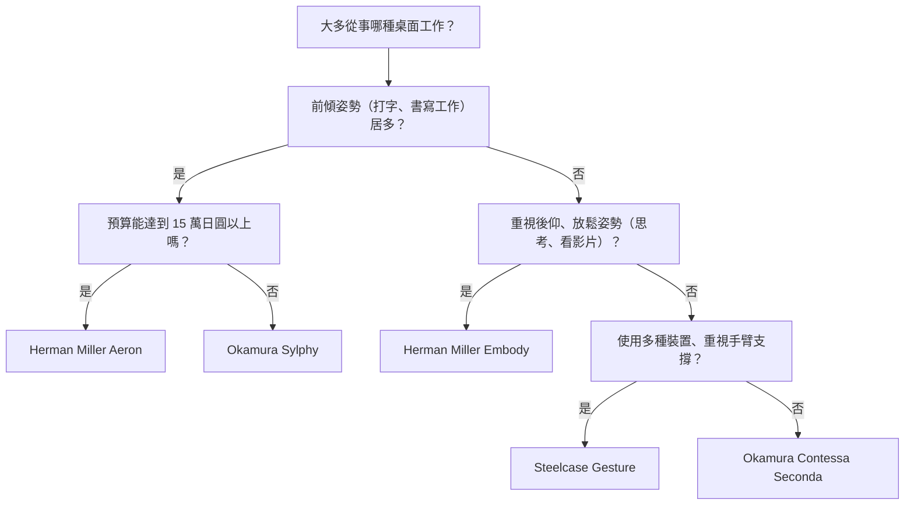
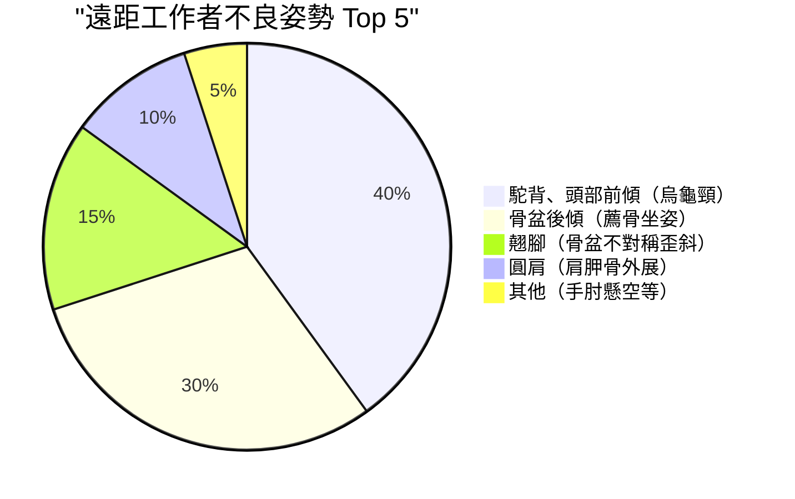

隨著遠距工作普及，許多軟體工程師和知識工作者現在每天要在辦公桌前度過 8 小時以上的時間。這種長時間的坐姿，對人體，特別是腰椎（Lumbar spine）會造成極為嚴苛的負擔。

本文不只介紹「推薦椅款」，更將透過**解剖學（Anatomy）**、**生物力學（Biomechanics）**以及物理學的角度，深入探討為何我們需要人體工學（Ergonomics）椅，以及如何挑選最適合自己的一把椅子。

---

## 1. 坐姿的生物力學與解剖學考察

人體的構造原本就不是設計用來「一直坐著」的。適應直立二足行走的脊柱，從側面看呈現平緩的 S 型曲線（頸椎前凸、胸椎後凸、腰椎前凸）。正是這條 S 型曲線，扮演著分散重力、吸收行走與直立時衝擊力的避震器角色。

### 椎間盤內壓的物理學

從直立姿勢轉為坐姿時，骨盆容易往後傾斜，伴隨而來的是腰椎前凸（向前彎曲）的消失，並容易變成後凸（向後捲曲）。這時，讓我們來思考一下存在於腰椎之間的軟骨組織「椎間盤（Intervertebral disc）」會發生什麼樣的物理變化。

壓力 $P$ 可以用施加的力 $F$ 與受力面積 $A$ 來表示：

$$ P = \frac{F}{A} $$

根據瑞典骨科醫師 Alf Nachemson 的著名研究，若將站立時第 3、第 4 腰椎間的椎間盤內壓設為 100%，以正確姿勢坐著時為 140%，而以前傾（駝背）姿勢坐著時，竟然會高達 185% 到 200% 以上。

此時，不僅有上半身質量造成的壓縮力 $F$，前傾姿勢造成的彎曲力矩更會將應力集中在椎間盤的特定區域（尤其是後方的纖維環），導致局部面積 $A_{local}$ 的壓力 $P_{local}$ 劇增。若以帕斯卡（Pa, $N/m^2$）為單位思考，會有高達數百萬帕斯卡（MPa）的強大壓力集中在特定的纖維環上，這正是導致椎間盤突出與慢性腰痛的直接原因。

### 不良姿勢（駝背、薦骨坐姿）下的力矩計算

當軟體工程師緊盯螢幕時，經常會出現「頭部前傾姿勢（Forward Head Posture）」或「薦骨坐姿（Slouching）」，這會在脊柱底部（L5/S1 關節）產生強大的力矩（旋轉力矩）。

力矩 $\tau$ 可以用以下公式表示：

$$ \tau = r \times F \sin(\theta) $$

其中：
- $r$ : 從 L5/S1 關節到上半身重心的距離（力臂）
- $F$ : 上半身重力（質量 $m \times$ 重力加速度 $g$）
- $\theta$ : 重力向量與上半身軀幹軸線的夾角

姿勢越是前傾，或是因駝背導致重心前移，力臂 $r$ 就會越長，且 $\theta$ 也會增加。因此，腰背部的肌肉（如豎脊肌群）必須持續發揮強大的反向拉力，才能克服這個前傾的力矩 $\tau$。這就是「肌肉疲勞導致腰背痛」的物理機制。

---

## 2. 人體工學椅的機制：技術性突破

為了減輕上述的生物力學負擔，高階人體工學椅結合了多種物理與機械工程的設計。

### 腰靠支撐與維持脊椎 S 型曲線

腰靠支撐的最大目的，在於使骨盆直立，並在物理上支撐腰椎的前凸（Lordosis）。
理想的腰靠支撐並非以點，而是以「面」來支撐腰椎到骨盆上部。透過最大化接觸面積 $A$，在提供必要支撐力 $F$ 的同時，將前述公式 $P = F/A$ 中的壓力 $P$ 降至最低。
近年來，如 Herman Miller Aeron 的「PostureFit SL」等設計，能獨立支撐薦骨（Sacrum）與腰椎（Lumbar），促進骨盆自然前傾的機制已成為主流。

### 同步傾仰（Synchro-Tilt）機制

傳統廉價辦公椅通常採用椅背與椅墊以相同角度傾斜的「中軸傾仰（Center-Tilt）」。然而，這種機制在後仰時會抬高大腿，壓迫膝蓋後方的血液循環。

「同步傾仰機制」則是在椅背與椅墊連動的同時，以不同比例（通常為 2:1 到 3:1）傾斜的設計。這樣一來，即使後仰，椅墊前緣也不會過度抬高，能讓腳底安穩地平放於地面，同時釋放脊椎承受的壓縮負擔。

### 前傾（Forward-Tilt）的重要性

程式開發、打字、精細的滑鼠操作等 PC 工作，本質上都很容易誘發「前傾姿勢」。
前傾功能可讓整個椅墊向前傾斜數度（例如：-5度）。藉由椅墊前傾，髖關節角度會展開至 90 度以上（100 度〜110 度），骨盆就會自然挺立。如此一來，便能維持腰椎的 S 型曲線，大幅減少前述的力矩 $\tau$。

---

## 3. 高階椅款的架構比較

以下將比較深受全球工程師喜愛的代表性高階人體工學椅的結構設計。

### Herman Miller Aeron（Aeron 椅）
**特色：Pellicle 懸浮材質（網布）的體壓分散與前傾功能**

於 1994 年問世，是改變辦公椅歷史的經典之作。被稱為「Pellicle」的獨家網布材質，能根據乘坐者的體型改變張力，將大腿與臀部承受的壓力平均分散。
特別值得一提的是其非常優異的**前傾機制**。對於需要頻繁專注於螢幕的軟體開發工程師而言，能連同椅墊一起前傾、讓骨盆挺立的 Aeron 椅，可以說是將腰部負擔降到最低的最強工具。

### Herman Miller Embody（Embody 椅）
**特色：Pixel 點陣支撐結構與促進健康的後仰姿勢**

Embody 椅在椅背與椅墊配置了無數的「Pixel（支撐點）」，實現能追隨人體微小動作的動態支撐。
相對於 Aeron 適合前傾工作，Embody 椅的設計理念則推薦在**後仰姿勢（向後傾斜的狀態）**下進行工作。將體重交給寬大的椅背，讓脊柱承受的壓縮力 $F$ 釋放到椅背上，能將長時間思考或寫程式時的疲勞降到最低。

### Steelcase Gesture / Leap（Gesture / Leap）
**特色：3D LiveBack 技術與追隨 VAD（視線與手臂移動）的設計**

Steelcase 座椅的特色在於能模仿脊椎動作而改變形狀的「LiveBack」技術。即使脊柱做出不對稱的動作，椅背也能隨之調整。
特別是 Gesture，是為研究現代人使用智慧型手機或平板等各種裝置時的姿勢變化而開發，其扶手的活動範圍非常驚人。無論何種姿勢都能提供手臂適當的支撐，減輕斜方肌的負擔，進而預防肩頸痠痛。

### Okamura Sylphy / Contessa（Sylphy / Contessa）
**特色：日系人體工學與智慧操作**

Okamura 的 Contessa Seconda 擁有由 Giorgetto Giugiaro 操刀的優美設計，以及只需在扶手前端即可調整椅墊高度與傾仰的「智慧操作」功能，表現十分出色。
另一方面，Sylphy 則具備能依乘坐者體型調整椅背曲線的「背部曲線調整機制」，以及媲美 Aeron 椅的優異前傾機制，卻有著相對容易入手的價格，在日本的遠距工作者中獲得了極大的支持。

---

## 4. 挑選最適合自己的椅子（決策樹）

最適合的椅子會因體型、工作習慣及預算而異。請參考以下的流程圖，找出最適合您的椅款。

---

## 5. 最佳化工作區：光靠椅子無法解決一切

就算買了再好的人體工學椅，如果桌子或螢幕的高度不對，也是徒勞無功。

### 桌子與螢幕高度的物理學

1. **桌子高度**：當手放在鍵盤上時，手肘角度呈現 90 到 100 度的高度最為理想。如果腳底無法平穩踏在地面，請使用腳踏墊，以避免大腿後側受到壓迫。
2. **螢幕高度**：請將螢幕上緣設定在與視線齊平或稍微偏下的位置。如果視線太低，為了支撐頭部（約 5 公斤），頸部肌肉（後頸肌群）會產生過度的張力，這就是導致頸椎過直（烏龜頸）的原因。

以下的圓餅圖顯示了遠距工作者常見的不良姿勢比例。調整環境以避免這些姿勢是非常重要的。

---

## 總結：把人體工學椅當作對健康的投資

人體工學椅絕對不是便宜的購物。超過 10 萬到 20 萬日圓的款式也屢見不鮮。然而，考慮到每天要在上面度過 8 小時，一年約 2000 小時的時間，為防範腰痛導致的生產力下降與醫療費用風險，可以說它是「投資報酬率最高（高 ROI）的設備」。

請從生物力學的角度重新審視自己的工作習慣，並挑選一把能精準支撐您骨骼與肌肉、「在物理學上正確的椅子」。這正是讓您能長久、舒適地持續工程開發的最大秘訣。
