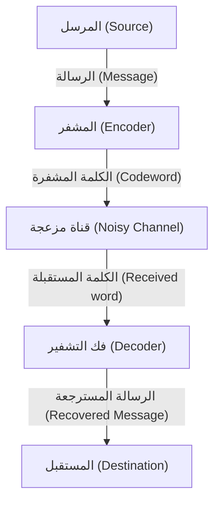

# ما هي رموز تصحيح الأخطاء؟

في المجتمع الرقمي، تتعرض البيانات باستمرار لتهديد الضوضاء. الخدوش على الأقراص المدمجة، البيانات المرسلة من المسابر الفضائية، أو رموز الاستجابة السريعة التي نمسحها يوميًا. السبب وراء عدم تلف هذه البيانات تمامًا بسبب فقدان بسيط أو ضوضاء هو وجود آلية رياضية قوية تسمى "رموز تصحيح الأخطاء" (Error-Correcting Codes, ECC).

في هذا المقال، سنكشف بالتفصيل عن آليتها، بدءًا من المفاهيم التي اقترحها أبو نظرية المعلومات كلود شانون، إلى أساسيات فحص التكافؤ، والتمثيل المصفوفي لرمز هامينغ، وصولاً إلى رمز ريد-سولومون الذي يستخدم حقول غالوا.

## 1. نظرية المعلومات لشانون ومبرهنة تشفير القناة

في عام 1948، نشر كلود شانون ورقة بحثية بعنوان "A Mathematical Theory of Communication" مؤسسًا بذلك مجالًا جديدًا تمامًا وهو نظرية المعلومات. إحدى أكثر النظريات المدهشة التي أثبتها شانون هي "مبرهنة تشفير القناة المزعجة" (Noisy-channel coding theorem).

أثبت شانون رياضيًا أنه في أي قناة اتصال بها ضوضاء، إذا كانت سرعة الاتصال أقل من "سعة القناة" (Channel Capacity) $C$ لتلك القناة، فمن الممكن إرسال المعلومات عمليًا بدون أخطاء. هذا يعني أنه لتقليل الأخطاء، ليس من الضروري ببساطة زيادة طاقة الإرسال أو إرسال نفس البيانات مرارًا وتكرارًا (التشفير المتكرر)، بل يكفي استخدام "تشفير ذكي".



## 2. أبسط طرق اكتشاف الأخطاء: فحص التكافؤ

أبسط طريقة لاكتشاف الأخطاء هي "فحص التكافؤ" (Parity check). يتم إضافة "بت تكافؤ" واحد في نهاية بتات البيانات، بحيث يكون العدد الإجمالي لـ "1" دائمًا زوجيًا (تكافؤ زوجي) أو فرديًا (تكافؤ فردي).

على سبيل المثال، عند إرسال البيانات `1011`، يكون عدد الـ 1 ثلاثة. إذا استخدمنا التكافؤ الزوجي، نضيف `1` كبت تكافؤ، وتصبح البيانات المرسلة `10111`. في جانب الاستقبال، إذا كان عدد الـ 1 فرديًا، نعلم أنه حدث خطأ أثناء الاتصال.

ومع ذلك، فإن فحص التكافؤ له نقطة ضعف قاتلة.
1. **يمكنه فقط اكتشاف الأخطاء، ولا يمكنه تصحيحها** (لا يُعرف أي بت تم عكسه).
2. **لا يمكن اكتشافه إذا حدث خطآن في بتين في نفس الوقت** (لأن الزوجية/الفردية تعود إلى أصلها).

الذي تغلب على هذا القصور هو "رمز هامينغ" الذي ابتكره ريتشارد هامينغ.

## 3. رمز هامينغ: تحديد مكان الخطأ

رمز هامينغ هو رمز ثوري يجمع بمهارة بين عدة بتات تكافؤ لاكتشاف خطأ في بت واحد وتصحيحه تلقائيًا. ومن الأمثلة البارزة "رمز هامينغ (7,4)"، الذي يضيف 3 بتات تكافؤ إلى 4 بتات من البيانات.

### التمثيل المصفوفي لرمز هامينغ (7,4)

يُعرّف رمز هامينغ باستخدام أدوات قوية من الجبر الخطي: "مصفوفة التوليد" (Generator Matrix) $G$ و"مصفوفة فحص التكافؤ" (Parity-Check Matrix) $H$.

لنفترض أن متجه البيانات هو $d = (d_1, d_2, d_3, d_4)$.
تُعرّف مصفوفة التوليد $G$ على النحو التالي (النموذج القياسي).

$$ G = \begin{pmatrix} 1 & 0 & 0 & 0 & 1 & 1 & 0 \\ 0 & 1 & 0 & 0 & 1 & 0 & 1 \\ 0 & 0 & 1 & 0 & 0 & 1 & 1 \\ 0 & 0 & 0 & 1 & 1 & 1 & 1 \end{pmatrix} $$

يتم حساب الكلمة المشفرة $c$ كالتالي: $c = d \cdot G \pmod 2$.

في جانب الاستقبال، بالنسبة للمتجه المستقبل $r$، يتم ضربه في مصفوفة فحص التكافؤ $H$ لحساب "المتلازمة" (Syndrome) $S$.

$$ S = r \cdot H^T \pmod 2 $$

إذا كانت $S = (0, 0, 0)$ فلا يوجد خطأ. خلاف ذلك، تشير قيمة المتلازمة إلى موضع البت الذي حدث فيه الخطأ!

### مثال على تنفيذ رمز هامينغ بلغة بايثون

فيما يلي محاكاة بسيطة لرمز هامينغ (7,4) باستخدام بايثون.

```python
import numpy as np

# مصفوفة التوليد G (4x7)
G = np.array([
    [1, 0, 0, 0, 1, 1, 0],
    [0, 1, 0, 0, 1, 0, 1],
    [0, 0, 1, 0, 0, 1, 1],
    [0, 0, 0, 1, 1, 1, 1]
])

# مصفوفة فحص التكافؤ H (3x7)
H = np.array([
    [1, 1, 0, 1, 1, 0, 0],
    [1, 0, 1, 1, 0, 1, 0],
    [0, 1, 1, 1, 0, 0, 1]
])

# البيانات الأصلية
d = np.array([1, 0, 1, 1])

# التشفير (باقي القسمة على 2)
c = np.dot(d, G) % 2
print(f"الكلمة المشفرة المرسلة: {c}")

# إضافة الضوضاء (عكس البت الثالث)
r = c.copy()
r[2] ^= 1
print(f"البيانات المستقبلة: {r}")

# حساب المتلازمة
S = np.dot(r, H.T) % 2
print(f"المتلازمة: {S}")
```

## 4. رمز ريد-سولومون: مواجهة الأخطاء المتتابعة

على الرغم من أن رمز هامينغ قوي ضد الأخطاء العشوائية في بت واحد، إلا أنه لا يستطيع التعامل مع الظاهرة التي "تتلف فيها البتات بشكل متتابع" (الأخطاء المتتابعة أو Burst errors) مثل الخدوش على الأقراص المدمجة. ما يحل هذا هو "رمز ريد-سولومون" (Reed-Solomon Codes, أو رمز RS).

تُستخدم رموز RS في كل تخزين بيانات واتصالات حديثة تقريبًا، بما في ذلك رموز الاستجابة السريعة، الأقراص المدمجة، أقراص DVD، أقراص البلو-راي، والاتصالات الفضائية.

### سحر حقول غالوا (الحقول المنتهية)

يكمن جوهر رمز RS في إجراء الحسابات في عالم رياضي خاص (حقل منتهٍ) يسمى "حقل غالوا" (Galois Field, GF). على عكس الأرقام العادية، في حقول غالوا، تظل نتائج العمليات الحسابية الأربع الأساسية دائمًا ضمن عناصر ذلك الحقل (لا يوجد فيضان معلومات أو أرقام عشرية).

عادةً، تتعامل أجهزة الكمبيوتر مع البيانات بوحدات 8 بت (1 بايت). لذلك، غالبًا ما يُستخدم حقل غالوا $GF(2^8)$، والذي يحتوي على 256 عنصرًا.

### آلية عمل رمز RS

تعتبر رموز RS البيانات كمعاملات لكثير حدود على $GF(2^8)$.
يتم إنشاء كثير حدود $P(x)$ من الدرجة $k-1$ حيث تكون رموز البيانات $k$ هي المعاملات.
من خلال تعويض قيم $x$ المختلفة (نقاط التقييم) في هذا الكثير حدود، يتم حساب $n$ نقطة. هذه هي البيانات المرسلة (الكلمة المشفرة).

في جانب الاستقبال، تصل بعض النقاط مزاحة (خاطئة) بسبب الضوضاء. ومع ذلك، إذا كان عدد النقاط الصحيحة المتبقية كافيًا، فمن الممكن استعادة كثير الحدود الأصلي $P(x)$ تمامًا باستخدام تقنيات رياضية مثل "استيفاء لاغرانج"!

> **شرح مجازي**
> إذا كان لديك نقطتان، يمكنك رسم خط مستقيم. وإذا كان لديك ثلاث نقاط، يمكنك رسم قطع مكافئ (منحنى تربيعي).
> بفرض أن البيانات الأصلية كانت "خطًا مستقيمًا"، وأرسلت 3 نقاط. في جانب الاستقبال، حتى لو انحرفت نقطة واحدة، طالما أن النقطتين الأخريين صحيحتان، يمكن إعادة رسم الخط المستقيم الأصلي بشكل صحيح، هذا هو المبدأ.

## الخلاصة: الرياضيات التي تدعم حياتنا الرقمية

السبب الذي يجعلنا نمسح رموز الاستجابة السريعة بهواتفنا الذكية أو نستمع إلى الموسيقى عبر البث المباشر بشكل عرضي هو وجود أساس رياضي متين يسمى "رموز تصحيح الأخطاء" بناه عباقرة مثل شانون، وهامينغ، وريد، وسولومون.

الحفاظ على البيانات الرقمية المثالية في عالم واقعي مليء بالضوضاء. يمكن القول حقًا أن هذا هو السحر الذي تلقيه الرياضيات على العالم الحقيقي.
