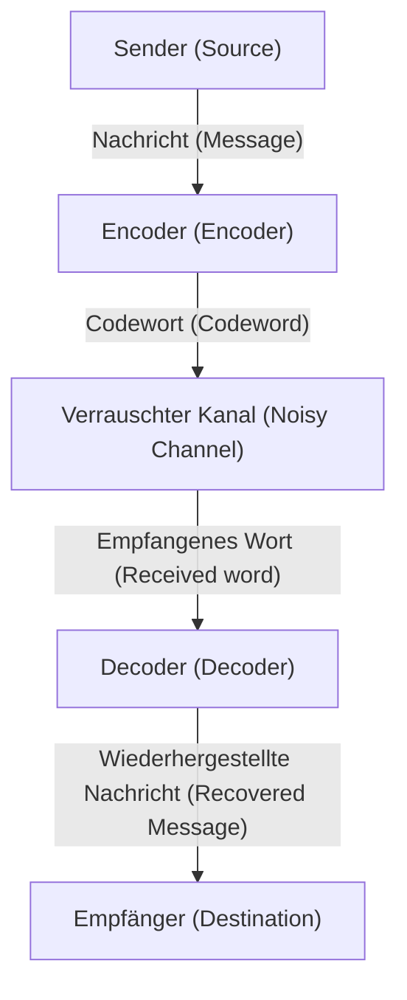

# Was sind Fehlerkorrekturcodes?

In der digitalen Gesellschaft sind Daten ständig der Bedrohung durch Rauschen ausgesetzt. Kratzer auf CDs, Daten von Raumsonden aus dem Weltraum oder die QR-Codes, die wir täglich scannen. Dass diese Daten nicht durch kleine Verluste oder Rauschen völlig zerstört werden, liegt an einem mächtigen mathematischen Mechanismus namens "Fehlerkorrekturcodes" (Error-Correcting Codes, ECC).

Dieser Artikel erklärt im Detail, wie dies funktioniert, beginnend mit den Konzepten von Claude Shannon, dem Vater der Informationstheorie, über die Grundlagen der Paritätsprüfung und die Matrixdarstellung von Hamming-Codes bis hin zu Reed-Solomon-Codes, die Galoiskörper nutzen.

## 1. Shannons Informationstheorie und das Kanalcodierungstheorem

1948 veröffentlichte Claude Shannon die Arbeit "A Mathematical Theory of Communication" und begründete damit das völlig neue Feld der Informationstheorie. Eines der erstaunlichsten Theoreme, die Shannon bewies, ist das "Kanalcodierungstheorem" (Noisy-channel coding theorem).

Shannon hat mathematisch bewiesen, dass es unabhängig von einem verrauschten Kanal möglich ist, Informationen praktisch fehlerfrei zu übertragen, solange die Übertragungsrate unter der "Kanalkapazität" (Channel Capacity) $C$ dieses Kanals liegt. Das bedeutet, dass man nicht einfach die Sendeleistung erhöhen oder dieselben Daten immer wieder senden muss (Wiederholungscode), um Fehler zu reduzieren, sondern dass eine "intelligente Codierung" ausreicht.



## 2. Die einfachste Fehlererkennung: Paritätsprüfung

Die einfachste Methode, Fehler zu finden, ist die "Paritätsprüfung". Am Ende der Datenbits wird ein einzelnes "Paritätsbit" hinzugefügt und angepasst, so dass die Gesamtzahl der "1"en immer gerade (gerade Parität) oder ungerade (ungerade Parität) ist.

Wenn Sie beispielsweise die Daten `1011` senden, gibt es drei Einsen. Bei Verwendung der geraden Parität wird `1` als Paritätsbit hinzugefügt und die gesendeten Daten sind `10111`. Wenn die Anzahl der Einsen auf der Empfängerseite ungerade ist, wissen Sie, dass während der Übertragung ein Fehler aufgetreten ist.

Allerdings hat die Paritätsprüfung eine fatale Schwäche:
1. **Sie kann Fehler nur erkennen, nicht korrigieren** (man weiß nicht, welches Bit umgekippt ist).
2. **Wenn zwei Bitfehler gleichzeitig auftreten, kann sie diese nicht erkennen** (da die Parität wiederhergestellt ist).

Dieser Grenzwert wurde durch den von Richard Hamming erfundenen "Hamming-Code" durchbrochen.

## 3. Hamming-Code: Den Fehlerort lokalisieren

Der Hamming-Code ist ein bahnbrechender Code, der einen 1-Bit-Fehler erkennen und automatisch korrigieren kann, indem er mehrere Paritätsbits geschickt kombiniert. Ein typisches Beispiel ist der "Hamming(7,4)-Code", der 4 Datenbits 3 Paritätsbits hinzufügt.

### Matrixdarstellung des Hamming(7,4)-Codes

Der Hamming-Code wird mithilfe der "Generatormatrix" (Generator Matrix) $G$ und der "Paritätsprüfmatrix" (Parity-Check Matrix) $H$, leistungsstarken Werkzeugen der linearen Algebra, definiert.

Sei der Datenvektor $d = (d_1, d_2, d_3, d_4)$.
Die Generatormatrix $G$ ist wie folgt definiert (Standardform).

$$ G = \begin{pmatrix} 1 & 0 & 0 & 0 & 1 & 1 & 0 \\ 0 & 1 & 0 & 0 & 1 & 0 & 1 \\ 0 & 0 & 1 & 0 & 0 & 1 & 1 \\ 0 & 0 & 0 & 1 & 1 & 1 & 1 \end{pmatrix} $$

Das Codewort $c$ wird als $c = d \cdot G \pmod 2$ berechnet.

Auf der Empfängerseite wird für den empfangenen Vektor $r$ das "Syndrom" (Syndrome) $S$ berechnet, indem er mit der Paritätsprüfmatrix $H$ multipliziert wird.

$$ S = r \cdot H^T \pmod 2 $$

Wenn $S = (0, 0, 0)$ ist, gibt es keinen Fehler. Andernfalls zeigt der Wert des Syndroms die Bitposition an, an der der Fehler aufgetreten ist!

### Beispiel für die Implementierung des Hamming-Codes in Python

Im Folgenden finden Sie eine einfache Simulation des Hamming(7,4)-Codes in Python.

```python
import numpy as np

# Generatormatrix G (4x7)
G = np.array([
    [1, 0, 0, 0, 1, 1, 0],
    [0, 1, 0, 0, 1, 0, 1],
    [0, 0, 1, 0, 0, 1, 1],
    [0, 0, 0, 1, 1, 1, 1]
])

# Paritätsprüfmatrix H (3x7)
H = np.array([
    [1, 1, 0, 1, 1, 0, 0],
    [1, 0, 1, 1, 0, 1, 0],
    [0, 1, 1, 1, 0, 0, 1]
])

# Ursprüngliche Daten
d = np.array([1, 0, 1, 1])

# Kodieren (Modulo 2)
c = np.dot(d, G) % 2
print(f"Gesendetes Codewort: {c}")

# Hinzufügen von Rauschen (das 3. Bit umkehren)
r = c.copy()
r[2] ^= 1
print(f"Empfangene Daten: {r}")

# Berechnung des Syndroms
S = np.dot(r, H.T) % 2
print(f"Syndrom: {S}")
```

## 4. Reed-Solomon-Codes: Kampf gegen Bündelfehler

Während Hamming-Codes gegenüber zufälligen 1-Bit-Fehlern robust sind, können sie das Phänomen "aufeinanderfolgender Bitfehler" (Bündelfehler), wie Kratzer auf einer CD, nicht bewältigen. Dies wird durch den "Reed-Solomon-Code" (Reed-Solomon Codes, RS-Code) gelöst.

RS-Codes werden in fast allen modernen Datenspeichern und Kommunikationssystemen verwendet, einschließlich QR-Codes, CDs, DVDs, Blu-rays und Weltraumkommunikation.

### Die Magie der Galoiskörper (Endliche Körper)

Der Kern des RS-Codes besteht darin, Berechnungen in einer speziellen mathematischen Welt durchzuführen, die "Galoiskörper" (Galois Field, GF) oder endlicher Körper genannt wird. Im Gegensatz zu normalen Zahlen bleiben die Ergebnisse der vier Grundrechenarten in einem Galoiskörper immer innerhalb der Elemente dieses Körpers (es gibt keine Überläufe oder Brüche).

Normalerweise verarbeiten Computer Daten in Einheiten von 8 Bits (1 Byte). Daher wird häufig ein Galoiskörper mit 256 Elementen verwendet, der $GF(2^8)$ genannt wird.

### Wie der RS-Code funktioniert

Der RS-Code betrachtet die Daten als Koeffizienten eines Polynoms über $GF(2^8)$.
Ein Polynom $P(x)$ vom Grad $k-1$ wird erstellt, wobei $k$ Datensymbole als Koeffizienten verwendet werden.
Durch Einsetzen verschiedener Werte für $x$ (Auswertungspunkte) in dieses Polynom werden $n$ Punkte berechnet. Dies sind die zu sendenden Daten (Codewort).

Auf der Empfängerseite kommen einige Punkte aufgrund von Rauschen verschoben (fehlerhaft) an. Wenn jedoch genügend korrekte Punkte übrig bleiben, kann das ursprüngliche Polynom $P(x)$ mithilfe mathematischer Methoden wie der "Lagrange-Interpolation" vollständig wiederhergestellt werden!

> **Bildliche Erklärung**
> Wenn Sie 2 Punkte haben, können Sie eine gerade Linie zeichnen. Mit 3 Punkten können Sie eine Parabel (quadratische Kurve) zeichnen.
> Wenn die ursprünglichen Daten eine "gerade Linie" sind und Sie 3 Punkte senden. Selbst wenn ein Punkt auf der Empfängerseite verschoben ist, können Sie die ursprüngliche Linie immer noch korrekt neu zeichnen, solange die restlichen 2 Punkte korrekt sind.

## Fazit: Die Mathematik, die unser digitales Leben stützt

Dass wir unbeschwert QR-Codes mit unseren Smartphones scannen oder Musik streamen können, verdanken wir einer soliden mathematischen Grundlage namens "Fehlerkorrekturcodes", die von Genies wie Shannon, Hamming, Reed und Solomon aufgebaut wurde.

In einer verrauschten realen Welt stets perfekte digitale Daten zu erhalten. Man kann mit Fug und Recht sagen, dass dies die Magie ist, die die Mathematik über die reale Welt gelegt hat.
