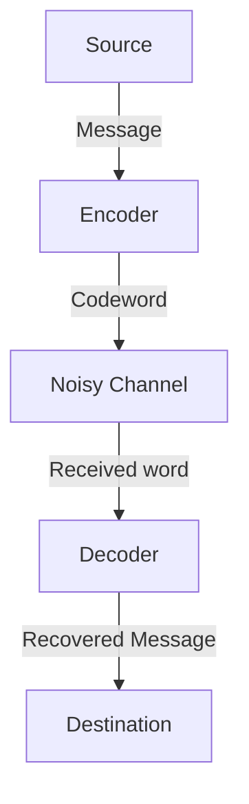

# What are Error-Correcting Codes?

In a digital society, data is constantly exposed to the threat of noise. Scratches on a CD, probe data transmitted from outer space, or QR codes we scan daily. The reason these data are not completely destroyed by a slight loss or noise is due to the existence of a powerful mathematical mechanism called "Error-Correcting Codes ([ECC](/en/p/elliptic-curve-cryptography-math-cpp/))".

In this article, we will detail how this mechanism works, starting with the concepts proposed by Claude Shannon, the father of information theory, through the basics of parity checks, the matrix representation of Hamming codes, and up to Reed-Solomon codes making full use of Galois fields.

## 1. Shannon's Information Theory and the Noisy-Channel Coding Theorem

In 1948, Claude Shannon published the paper "A Mathematical Theory of Communication", establishing the completely new field of information theory. One of the most surprising theorems Shannon proved is the "Noisy-channel coding theorem".

Shannon mathematically proved that, no matter how noisy the communication channel is, as long as the communication speed is below the "Channel Capacity" $C$ of that channel, information can be sent practically error-free. This means that to reduce errors, you do not simply need to increase transmission power or send the same data over and over (repetition code), but rather you just need to perform "smart coding".



## 2. The Simplest Error Detection: Parity Check

The simplest method to find errors is the "parity check". A single "parity bit" is added to the end of the data bits, adjusting the total number of "1"s to always be even (even parity) or odd (odd parity).

For example, when sending the data `1011`, the number of 1s is three. When using even parity, `1` is added as a parity bit, and the transmitted data becomes `10111`. If the number of 1s becomes odd on the receiving end, it indicates that an error occurred during communication.

However, the parity check has fatal weaknesses.
1. **It can only detect errors, not correct them** (it cannot tell which bit was flipped).
2. **It cannot detect when 2 bit errors occur simultaneously** (since the even/odd parity would revert to the original).

Breaking through these limitations is the "Hamming Code", devised by Richard Hamming.

## 3. Hamming Codes: Identifying the Error Location

A Hamming code is an epoch-making code that, by skillfully combining multiple parity bits, can detect a 1-bit error and automatically correct it. A representative example is the "Hamming(7,4) code", which adds 3 bits of parity to 4 bits of data.

### Matrix Representation of the Hamming(7,4) Code

Hamming codes are defined using powerful tools from linear algebra: the "Generator Matrix" $G$ and the "Parity-Check Matrix" $H$.

Let the data vector be $d = (d_1, d_2, d_3, d_4)$.
The generator matrix $G$ is defined as follows (standard form).

$$ G = \begin{pmatrix} 1 & 0 & 0 & 0 & 1 & 1 & 0 \\ 0 & 1 & 0 & 0 & 1 & 0 & 1 \\ 0 & 0 & 1 & 0 & 0 & 1 & 1 \\ 0 & 0 & 0 & 1 & 1 & 1 & 1 \end{pmatrix} $$

The codeword $c$ is calculated by $c = d \cdot G \pmod 2$.

On the receiving end, the "Syndrome" $S$ is calculated by multiplying the received vector $r$ by the parity-check matrix $H$.

$$ S = r \cdot H^T \pmod 2 $$

If $S = (0, 0, 0)$, there is no error. Otherwise, the value of the syndrome indicates the bit position where the error occurred!

### Implementation Example of a Hamming Code in Python

Below is a simple simulation of the Hamming(7,4) code using Python.

```python
import numpy as np

# Generator matrix G (4x7)
G = np.array([
    [1, 0, 0, 0, 1, 1, 0],
    [0, 1, 0, 0, 1, 0, 1],
    [0, 0, 1, 0, 0, 1, 1],
    [0, 0, 0, 1, 1, 1, 1]
])

# Parity-check matrix H (3x7)
H = np.array([
    [1, 1, 0, 1, 1, 0, 0],
    [1, 0, 1, 1, 0, 1, 0],
    [0, 1, 1, 1, 0, 0, 1]
])

# Original data
d = np.array([1, 0, 1, 1])

# Encode (Modulo 2)
c = np.dot(d, G) % 2
print(f"Transmitted codeword: {c}")

# Addition of noise (flipping the 3rd bit)
r = c.copy()
r[2] ^= 1
print(f"Received data: {r}")

# Calculation of the syndrome
S = np.dot(r, H.T) % 2
print(f"Syndrome: {S}")
```

## 4. Reed-Solomon Codes: Confronting Burst Errors

Hamming codes are strong against 1-bit random errors but cannot handle phenomena where "bits break consecutively" (burst errors), like a scratch on a CD. What solves this is the "Reed-Solomon Codes (RS codes)".

RS codes are used in almost all modern data storage and communication, including QR codes, CDs, DVDs, Blu-rays, and space communications.

### The Magic of Galois Fields (Finite Fields)

The core of RS codes is performing calculations in a special mathematical world called a "Galois Field (GF)" (finite field). Unlike regular numbers, the result of the four arithmetic operations in a Galois field always falls within the elements of that field (there are no overflows or decimals).

Usually, computers handle data in units of 8 bits (1 byte). Therefore, a Galois field with 256 elements, $GF(2^8)$, is often used.

### How RS Codes Work

RS codes treat data as coefficients of polynomials over $GF(2^8)$.
A polynomial $P(x)$ of degree $k-1$ is created with $k$ data symbols as coefficients.
By substituting various values of $x$ (evaluation points) into this polynomial, $n$ points are calculated. This is the data (codeword) that is transmitted.

On the receiving end, some points arrive shifted (as errors) due to noise. However, if there are enough correct points remaining, mathematical techniques like "Lagrange interpolation" can be used to completely restore the original polynomial $P(x)$!

> **Metaphorical Explanation**
> With 2 points, you can draw a straight line. With 3 points, you can draw a parabola (quadratic curve).
> If the original data was a "straight line" and 3 points were sent, even if 1 point is shifted on the receiving end, as long as the remaining 2 points are correct, the original straight line can be correctly redrawn. This is the principle.

## Conclusion: The Mathematics Supporting Our Digital Life

The reason we can casually scan QR codes with our smartphones or stream music is because of the solid mathematical foundation of "error-correcting codes" built by geniuses like Shannon, Hamming, Reed, and Solomon.

Continuing to maintain perfect digital data in a real world full of noise. This can truly be called magic cast upon the real world by mathematics.
