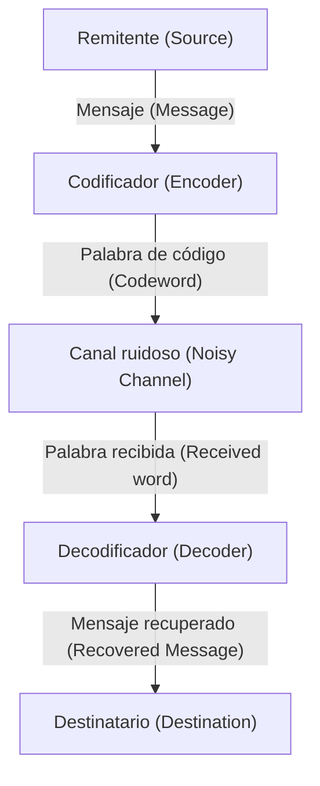

# ¿Qué son los códigos de corrección de errores?

En la sociedad digital, los datos están constantemente expuestos a la amenaza del ruido. Los arañazos en un CD, los datos de las sondas transmitidos desde el espacio o los códigos QR que escaneamos a diario. Estos datos no se destruyen por completo por un poco de pérdida o ruido porque existe un poderoso mecanismo matemático llamado "códigos de corrección de errores" (Error-Correcting Codes, [ECC](/es/p/elliptic-curve-cryptography-math-cpp/)).

En este artículo, desentrañaremos en detalle cómo funcionan, comenzando con los conceptos propuestos por [Claude Shannon, el padre de la teoría de la información](/es/p/biography-claude-shannon/), hasta los fundamentos de la comprobación de paridad, la representación matricial de los códigos de Hamming y los códigos de Reed-Solomon que hacen pleno uso de los campos de Galois.

## 1. La teoría de la información de Shannon y el teorema de codificación de canales

En 1948, Claude Shannon publicó el artículo "A Mathematical Theory of Communication" y estableció el campo completamente nuevo de la teoría de la información. Uno de los teoremas más sorprendentes que Shannon demostró es el "teorema de codificación de canales con ruido" (Noisy-channel coding theorem).

Shannon demostró matemáticamente que, sin importar cuán ruidoso sea un canal, siempre que la velocidad de transmisión sea inferior a la "capacidad del canal" (Channel Capacity) $C$, la información se puede enviar de manera efectiva sin errores. Esto significa que para reducir los errores no es necesario simplemente aumentar la potencia de transmisión o enviar los mismos datos repetidamente (códigos de repetición), sino que basta con realizar una "codificación inteligente".



## 2. La detección de errores más simple: la comprobación de paridad

La forma más sencilla de encontrar errores es la "comprobación de paridad". Se añade un "bit de paridad" de 1 bit al final de los bits de datos y se ajusta para que el número total de unos "1" sea siempre par (paridad par) o impar (paridad impar).

Por ejemplo, si enviamos los datos `1011`, el número de unos es 3. Si utilizamos paridad par, añadimos un `1` como bit de paridad y los datos transmitidos serán `10111`. Si el receptor encuentra que el número de unos es impar, sabrá que ha ocurrido un error durante la comunicación.

Sin embargo, la comprobación de paridad tiene una debilidad fatal.
1. **Solo puede detectar errores, pero no corregirlos** (no se sabe qué bit se ha invertido).
2. **No puede detectar si ocurren errores de 2 bits simultáneamente** (ya que la paridad volverá a ser la original).

El avance que superó este límite fue el "código de Hamming" inventado por Richard Hamming.

## 3. Código de Hamming: Localización del lugar del error

El código de Hamming es un código revolucionario que, mediante la hábil combinación de múltiples bits de paridad, puede detectar un error de 1 bit y corregirlo automáticamente. Un ejemplo representativo es el "código de Hamming(7,4)", que añade 3 bits de paridad a 4 bits de datos.

### Representación matricial del código de Hamming(7,4)

Los códigos de Hamming se definen utilizando herramientas poderosas del álgebra lineal: la "Matriz Generadora" (Generator Matrix) $G$ y la "Matriz de Comprobación de Paridad" (Parity-Check Matrix) $H$.

Sea el vector de datos $d = (d_1, d_2, d_3, d_4)$.
La matriz generadora $G$ se define de la siguiente manera (forma estándar).

$$ G = \begin{pmatrix} 1 & 0 & 0 & 0 & 1 & 1 & 0 \\ 0 & 1 & 0 & 0 & 1 & 0 & 1 \\ 0 & 0 & 1 & 0 & 0 & 1 & 1 \\ 0 & 0 & 0 & 1 & 1 & 1 & 1 \end{pmatrix} $$

La palabra de código $c$ se calcula como $c = d \cdot G \pmod 2$.

En el lado del receptor, se multiplica el vector recibido $r$ por la matriz de comprobación de paridad $H$ para calcular el "Síndrome" (Syndrome) $S$.

$$ S = r \cdot H^T \pmod 2 $$

Si $S = (0, 0, 0)$, entonces no hay error. En cualquier otro caso, el valor del síndrome indica la posición del bit donde ocurrió el error.

### Ejemplo de implementación del código de Hamming en Python

A continuación, se muestra una simulación simple del código de Hamming(7,4) usando Python.

```python
import numpy as np

# Matriz generadora G (4x7)
G = np.array([
    [1, 0, 0, 0, 1, 1, 0],
    [0, 1, 0, 0, 1, 0, 1],
    [0, 0, 1, 0, 0, 1, 1],
    [0, 0, 0, 1, 1, 1, 1]
])

# Matriz de comprobación de paridad H (3x7)
H = np.array([
    [1, 1, 0, 1, 1, 0, 0],
    [1, 0, 1, 1, 0, 1, 0],
    [0, 1, 1, 1, 0, 0, 1]
])

# Datos originales
d = np.array([1, 0, 1, 1])

# Codificación (módulo 2)
c = np.dot(d, G) % 2
print(f"Palabra de código transmitida: {c}")

# Adición de ruido (invertir el tercer bit)
r = c.copy()
r[2] ^= 1
print(f"Datos recibidos: {r}")

# Cálculo del síndrome
S = np.dot(r, H.T) % 2
print(f"Síndrome: {S}")
```

## 4. Códigos de Reed-Solomon: Haciendo frente a los errores de ráfaga

El código de Hamming es resistente a los errores aleatorios de 1 bit, pero no puede lidiar con el fenómeno donde los "bits se rompen consecutivamente" (errores de ráfaga), como los rayones en un CD. La solución a esto son los "Códigos de Reed-Solomon" (Reed-Solomon Codes, códigos RS).

Los códigos RS se utilizan en casi todo el almacenamiento de datos y comunicaciones modernas, incluidos los códigos QR, CD, DVD, Blu-ray y las comunicaciones espaciales.

### La magia de los campos de Galois (Campos finitos)

El núcleo de los códigos RS radica en realizar cálculos en un mundo matemático especial (campo finito) llamado "Campo de Galois" (Galois Field, GF). A diferencia de los números ordinarios, el resultado de las cuatro operaciones aritméticas en un campo de Galois siempre permanece dentro de los elementos de ese campo (no existe el desbordamiento ni los decimales).

Por lo general, las computadoras manejan los datos en unidades de 8 bits (1 byte). Por lo tanto, se utiliza a menudo un campo de Galois con 256 elementos llamado $GF(2^8)$.

### Cómo funcionan los códigos RS

Los códigos RS consideran los datos como coeficientes de un polinomio sobre $GF(2^8)$.
Se crea un polinomio $P(x)$ de grado $k-1$ cuyos coeficientes son $k$ símbolos de datos.
Sustituyendo varios valores de $x$ (puntos de evaluación) en este polinomio, se calculan $n$ puntos. Estos son los datos transmitidos (palabra de código).

En el lado del receptor, algunos puntos llegan desplazados (como errores) debido al ruido. Sin embargo, si quedan suficientes puntos correctos, el polinomio original $P(x)$ se puede restaurar completamente utilizando técnicas matemáticas como la "interpolación de Lagrange".

> **Explicación metafórica**
> Con 2 puntos se puede trazar una línea recta. Con 3 puntos se puede dibujar una parábola (curva cuadrática).
> Supongamos que los datos originales son una "línea recta" y hemos enviado 3 puntos. Incluso si 1 punto se ha desplazado en el lado del receptor, si los 2 puntos restantes son correctos, el principio es que podemos redibujar la línea recta original correctamente.

## Conclusión: Nuestra vida digital apoyada por las matemáticas

El hecho de que podamos escanear casualmente un código QR con nuestro teléfono inteligente o escuchar música en streaming se debe a la sólida base matemática llamada "códigos de corrección de errores" construida por genios como Shannon, Hamming, Reed y Solomon.

Mantener datos digitales perfectos en un mundo real lleno de ruido. Eso es verdaderamente la magia que las matemáticas han lanzado sobre el mundo real.
