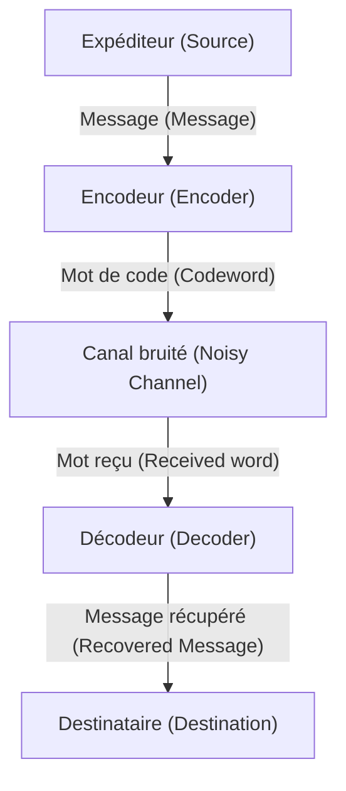

# Qu'est-ce qu'un code correcteur d'erreurs ?

Dans la société numérique, les données sont constamment menacées par le bruit. Les rayures sur un CD, les données d'une sonde spatiale transmises depuis l'espace, ou les codes QR que nous scannons au quotidien. Si ces données ne sont pas complètement détruites par quelques pertes ou bruits, c'est grâce à l'existence d'un puissant mécanisme mathématique appelé « codes correcteurs d'erreurs » (Error-Correcting Codes, ECC).

Cet article dévoile en détail leur fonctionnement, en commençant par les concepts proposés par Claude Shannon, le père de la théorie de l'information, en passant par les bases du contrôle de parité, la représentation matricielle des codes de Hamming, jusqu'aux codes de Reed-Solomon utilisant les corps de Galois.

## 1. La théorie de l'information de Shannon et le théorème de codage de canal

En 1948, Claude Shannon a publié l'article "A Mathematical Theory of Communication", fondant ainsi un domaine totalement nouveau : la théorie de l'information. L'un des théorèmes les plus étonnants prouvés par Shannon est le « théorème de codage de canal » (Noisy-channel coding theorem).

Shannon a prouvé mathématiquement que, quel que soit le canal de communication bruité, tant que la vitesse de transmission est inférieure à la « capacité du canal » (Channel Capacity) $C$, les informations peuvent être transmises pratiquement sans erreur. Cela signifie qu'il n'est pas nécessaire d'augmenter simplement la puissance d'émission ou d'envoyer les mêmes données plusieurs fois (code de répétition) pour réduire les erreurs, mais qu'il suffit d'appliquer un « codage intelligent ».



## 2. La détection d'erreurs la plus simple : le contrôle de parité

La méthode la plus simple pour détecter une erreur est le « contrôle de parité ». On ajoute un « bit de parité » à la fin des bits de données, en ajustant pour que le nombre total de « 1 » soit toujours pair (parité paire) ou impair (parité impaire).

Par exemple, si l'on envoie la donnée `1011`, le nombre de 1 est de trois. Si on utilise une parité paire, on ajoute `1` comme bit de parité, et la donnée transmise devient `10111`. Du côté du récepteur, si le nombre de 1 est impair, on sait qu'une erreur s'est produite pendant la communication.

Cependant, le contrôle de parité présente une faiblesse fatale.
1. **Il peut seulement détecter les erreurs, mais pas les corriger** (on ne sait pas quel bit a été inversé).
2. **Si deux bits d'erreur se produisent simultanément, ils ne peuvent pas être détectés** (car la parité redevient correcte).

Celui qui a surmonté cette limite est le « code de Hamming », inventé par Richard Hamming.

## 3. Le code de Hamming : identifier l'emplacement de l'erreur

Le code de Hamming est un code révolutionnaire qui, en combinant habilement plusieurs bits de parité, peut détecter une erreur d'un bit et la corriger automatiquement. Un exemple représentatif est le « code de Hamming (7,4) », qui ajoute 3 bits de parité à 4 bits de données.

### Représentation matricielle du code de Hamming (7,4)

Le code de Hamming est défini à l'aide d'outils puissants de l'algèbre linéaire : la « matrice génératrice » (Generator Matrix) $G$ et la « matrice de contrôle de parité » (Parity-Check Matrix) $H$.

Soit le vecteur de données $d = (d_1, d_2, d_3, d_4)$.
La matrice génératrice $G$ est définie comme suit (forme standard).

$$ G = \begin{pmatrix} 1 & 0 & 0 & 0 & 1 & 1 & 0 \\ 0 & 1 & 0 & 0 & 1 & 0 & 1 \\ 0 & 0 & 1 & 0 & 0 & 1 & 1 \\ 0 & 0 & 0 & 1 & 1 & 1 & 1 \end{pmatrix} $$

Le mot de code $c$ est calculé par $c = d \cdot G \pmod 2$.

Du côté de la réception, pour le vecteur reçu $r$, on multiplie par la matrice de contrôle de parité $H$ pour calculer le « syndrome » (Syndrome) $S$.

$$ S = r \cdot H^T \pmod 2 $$

Si $S = (0, 0, 0)$, il n'y a pas d'erreur. Sinon, la valeur du syndrome indique la position du bit où l'erreur s'est produite !

### Exemple d'implémentation du code de Hamming en Python

Voici une simulation simple du code de Hamming (7,4) en Python.

```python
import numpy as np

# Matrice génératrice G (4x7)
G = np.array([
    [1, 0, 0, 0, 1, 1, 0],
    [0, 1, 0, 0, 1, 0, 1],
    [0, 0, 1, 0, 0, 1, 1],
    [0, 0, 0, 1, 1, 1, 1]
])

# Matrice de contrôle de parité H (3x7)
H = np.array([
    [1, 1, 0, 1, 1, 0, 0],
    [1, 0, 1, 1, 0, 1, 0],
    [0, 1, 1, 1, 0, 0, 1]
])

# Données originales
d = np.array([1, 0, 1, 1])

# Encodage (modulo 2)
c = np.dot(d, G) % 2
print(f"Mot de code transmis: {c}")

# Ajout de bruit (inversion du 3ème bit)
r = c.copy()
r[2] ^= 1
print(f"Données reçues: {r}")

# Calcul du syndrome
S = np.dot(r, H.T) % 2
print(f"Syndrome: {S}")
```

## 4. Les codes de Reed-Solomon : faire face aux erreurs en rafale

Le code de Hamming est robuste contre les erreurs aléatoires d'un bit, mais il ne peut pas gérer les phénomènes où « les bits sont endommagés consécutivement » (erreurs en rafale), comme les rayures sur un CD. La solution à ce problème est le « code de Reed-Solomon » (Reed-Solomon Codes, codes RS).

Les codes RS sont utilisés dans presque tous les stockages et communications de données modernes, tels que les codes QR, CD, DVD, Blu-ray et les communications spatiales.

### La magie des corps de Galois (corps finis)

Le cœur des codes RS est d'effectuer des calculs dans un monde mathématique spécial (corps fini) appelé « corps de Galois » (Galois Field, GF). Contrairement aux nombres ordinaires, dans un corps de Galois, le résultat des quatre opérations arithmétiques reste toujours dans les éléments de ce corps (il n'y a ni débordement ni nombres décimaux).

Habituellement, les ordinateurs traitent les données par unités de 8 bits (1 octet). Par conséquent, un corps de Galois $GF(2^8)$ avec 256 éléments est souvent utilisé.

### Fonctionnement du code RS

Le code RS considère les données comme les coefficients d'un polynôme sur $GF(2^8)$.
On crée un polynôme $P(x)$ de degré $k-1$ dont les coefficients sont $k$ symboles de données.
En substituant différentes valeurs de $x$ (points d'évaluation) dans ce polynôme, on calcule $n$ points. Ce sont les données transmises (mot de code).

Du côté du récepteur, en raison du bruit, certains points arrivent décalés (avec des erreurs). Cependant, s'il reste suffisamment de points corrects, le polynôme d'origine $P(x)$ peut être complètement restauré à l'aide de méthodes mathématiques telles que l'« interpolation de Lagrange » !

> **Explication métaphorique**
> Avec 2 points, vous pouvez tracer une ligne droite. Avec 3 points, vous pouvez dessiner une parabole (courbe quadratique).
> Si les données d'origine sont une « ligne droite » et que vous avez envoyé 3 points, même si un point est décalé côté réception, tant que les 2 autres points sont corrects, vous pouvez redessiner correctement la ligne droite d'origine. C'est le principe.

## Conclusion : Les mathématiques qui soutiennent notre vie numérique

Si nous pouvons scanner un code QR avec notre smartphone ou écouter de la musique en streaming de manière fluide, c'est grâce aux fondations mathématiques solides des « codes correcteurs d'erreurs » établies par des génies tels que Shannon, Hamming, Reed et Solomon.

Maintenir des données numériques parfaites dans un monde réel rempli de bruit. On peut vraiment dire que c'est la magie que les mathématiques opèrent sur le monde réel.
