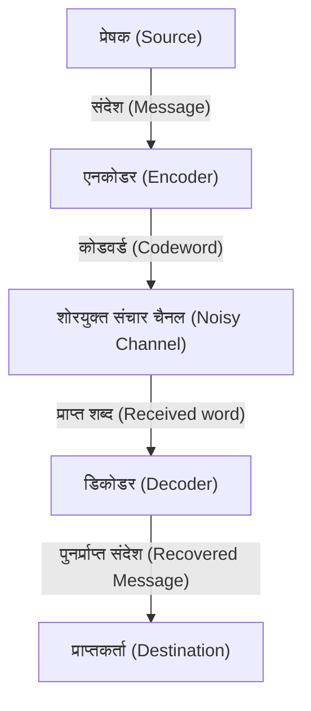

# त्रुटि सुधार कोड (Error-Correcting Codes) क्या हैं?

डिजिटल समाज में, डेटा हमेशा शोर (noise) के खतरे में रहता है। सीडी (CD) पर खरोंचें, अंतरिक्ष से भेजे गए प्रोब (probe) के डेटा, या हमारे द्वारा रोज़ाना स्कैन किए जाने वाले क्यूआर (QR) कोड। ये डेटा थोड़ी सी कमी या शोर के कारण पूरी तरह से नष्ट नहीं होते हैं, इसका कारण यह है कि "त्रुटि सुधार कोड (Error-Correcting Codes, [ECC](/hi/p/elliptic-curve-cryptography-math-cpp/))" नामक एक शक्तिशाली गणितीय तंत्र मौजूद है।

इस लेख में, हम सूचना सिद्धांत के जनक क्लाउड शैनन (Claude Shannon) द्वारा प्रस्तुत की गई अवधारणा से शुरू करते हुए, पैरिटी चेक (parity check) के मूल सिद्धांतों, हैमिंग कोड के मैट्रिक्स प्रतिनिधित्व और गैलवा फील्ड (Galois Field) का उपयोग करने वाले रीड-सोलोमन (Reed-Solomon) कोड तक, इसकी कार्यप्रणाली को विस्तार से समझेंगे।

## 1. शैनन का सूचना सिद्धांत और नॉइज़ी-चैनल कोडिंग प्रमेय (Noisy-channel coding theorem)

1948 में, क्लाउड शैनन ने "A Mathematical Theory of Communication" नामक एक शोध पत्र प्रकाशित किया और 'सूचना सिद्धांत' (Information Theory) के एक पूरी तरह से नए क्षेत्र की स्थापना की। शैनन द्वारा सिद्ध किए गए सबसे आश्चर्यजनक प्रमेयों में से एक "नॉइज़ी-चैनल कोडिंग प्रमेय (Noisy-channel coding theorem)" है।

शैनन ने गणितीय रूप से साबित किया कि चाहे किसी संचार चैनल (communication channel) में कितना भी शोर (noise) क्यों न हो, यदि संचार की गति उस चैनल की "चैनल क्षमता (Channel Capacity)" $C$ से कम है, तो सूचना को वस्तुतः बिना किसी त्रुटि (error) के भेजा जा सकता है। इसका मतलब यह है कि त्रुटियों को कम करने के लिए केवल ट्रांसमिशन पावर बढ़ाने या एक ही डेटा को बार-बार भेजने (रिपीटेशन कोड) की आवश्यकता नहीं है, बल्कि केवल "स्मार्ट कोडिंग (Smart Coding)" करना ही पर्याप्त है।



## 2. सबसे सरल त्रुटि पहचान: पैरिटी चेक (Parity Check)

त्रुटि का पता लगाने का सबसे सरल तरीका "पैरिटी चेक" है। डेटा बिट के अंत में 1 बिट का "पैरिटी बिट (parity bit)" जोड़ा जाता है, और इसे इस तरह समायोजित किया जाता है कि कुल "1" की संख्या हमेशा सम (even parity) या विषम (odd parity) हो।

उदाहरण के लिए, यदि हम डेटा `1011` भेजते हैं, तो 1 की संख्या 3 है। सम पैरिटी (even parity) का उपयोग करते বাতাসে, पैरिटी बिट के रूप में `1` जोड़ा जाता है, और भेजा जाने वाला डेटा `10111` हो जाता है। प्राप्तकर्ता की ओर यदि 1 की संख्या विषम (odd) हो जाती है, तो यह ज्ञात हो जाता है कि संचार के दौरान कोई त्रुटि हुई है।

हालाँकि, पैरिटी चेक में कुछ गंभीर कमियां हैं:
1. **यह केवल त्रुटि का पता लगा सकता है, उसे सुधार नहीं सकता** (यह पता नहीं चलता कि कौन सा बिट उलट गया है)।
2. **यदि एक ही समय में 2-बिट की त्रुटि होती है, तो इसका पता नहीं लगाया जा सकता** (क्योंकि सम-विषम स्थिति वापस पहले जैसी हो जाती है)।

इस सीमा को पार करने के लिए रिचर्ड हैमिंग (Richard Hamming) द्वारा "हैमिंग कोड (Hamming Code)" का आविष्कार किया गया था।

## 3. हैमिंग कोड: त्रुटि के स्थान का पता लगाना

हैमिंग कोड एक क्रांतिकारी कोड है जो चतुराई से कई पैरिटी बिट्स को जोड़कर 1-बिट की त्रुटि का पता लगा सकता है और उसे स्वचालित रूप से सुधार सकता है। इसका एक विशिष्ट उदाहरण "हैमिंग (7,4) कोड" है, जो 4-बिट डेटा में 3-बिट पैरिटी जोड़ता है।

### हैमिंग (7,4) कोड का मैट्रिक्स प्रतिनिधित्व

हैमिंग कोड को रैखिक बीजगणित (linear algebra) के शक्तिशाली उपकरणों "जेनरेटर मैट्रिक्स (Generator Matrix) $G$" और "पैरिटी-चेक मैट्रिक्स (Parity-Check Matrix) $H$" का उपयोग करके परिभाषित किया गया है।

मान लें कि डेटा वेक्टर $d = (d_1, d_2, d_3, d_4)$ है।
जेनरेटर मैट्रिक्स $G$ को इस प्रकार परिभाषित किया गया है (मानक रूप में):

$$ G = \begin{pmatrix} 1 & 0 & 0 & 0 & 1 & 1 & 0 \\ 0 & 1 & 0 & 0 & 1 & 0 & 1 \\ 0 & 0 & 1 & 0 & 0 & 1 & 1 \\ 0 & 0 & 0 & 1 & 1 & 1 & 1 \end{pmatrix} $$

कोडवर्ड $c$ की गणना $c = d \cdot G \pmod 2$ के रूप में की जाती है।

प्राप्तकर्ता की ओर, "सिंड्रोम (Syndrome) $S$" की गणना प्राप्त वेक्टर $r$ को पैरिटी-चेक मैट्रिक्स $H$ से गुणा करके की जाती है।

$$ S = r \cdot H^T \pmod 2 $$

यदि $S = (0, 0, 0)$ है, तो कोई त्रुटि नहीं है। अन्यथा, सिंड्रोम का मान उस बिट स्थिति को दर्शाता है जहाँ त्रुटि हुई है!

### Python के माध्यम से हैमिंग कोड का कार्यान्वयन उदाहरण

नीचे Python का उपयोग करते हुए एक सरल हैमिंग (7,4) कोड का सिमुलेशन दिया गया है।

```python
import numpy as np

# जेनरेटर मैट्रिक्स G (4x7)
G = np.array([
    [1, 0, 0, 0, 1, 1, 0],
    [0, 1, 0, 0, 1, 0, 1],
    [0, 0, 1, 0, 0, 1, 1],
    [0, 0, 0, 1, 1, 1, 1]
])

# पैरिटी-चेक मैट्रिक्स H (3x7)
H = np.array([
    [1, 1, 0, 1, 1, 0, 0],
    [1, 0, 1, 1, 0, 1, 0],
    [0, 1, 1, 1, 0, 0, 1]
])

# मूल डेटा
d = np.array([1, 0, 1, 1])

# एनकोड (मोड्यूलो 2)
c = np.dot(d, G) % 2
print(f"प्रेषित कोडवर्ड: {c}")

# शोर जोड़ना (तीसरे बिट को उलटना)
r = c.copy()
r[2] ^= 1
print(f"प्राप्त डेटा: {r}")

# सिंड्रोम की गणना
S = np.dot(r, H.T) % 2
print(f"सिंड्रोम: {S}")
```

## 4. रीड-सोलोमन कोड: बर्स्ट एरर (Burst Error) का सामना करना

हैमिंग कोड 1-बिट की रैंडम त्रुटियों के प्रति प्रतिरोधी है, लेकिन यह सीडी की खरोंच जैसी "लगातार बिट्स के नष्ट होने" की घटना (बर्स्ट एरर) को नहीं संभाल सकता। इसका समाधान "रीड-सोलोमन कोड (Reed-Solomon Codes, RS Code)" है।

आधुनिक समय में लगभग सभी डेटा स्टोरेज और संचार जैसे कि क्यूआर (QR) कोड, सीडी (CD), डीवीडी (DVD), ब्लू-रे (Blu-ray), और अंतरिक्ष संचार में आरएस (RS) कोड का उपयोग किया जाता है।

### गैलवा फील्ड (परिमित क्षेत्र) का जादू

RS कोड का मुख्य आधार "गैलवा फील्ड (Galois Field, GF)" नामक एक विशेष गणितीय दुनिया (परिमित क्षेत्र या Finite Field) में गणना करना है। सामान्य संख्याओं के विपरीत, गैलवा फील्ड में गणितीय संक्रियाओं (जोड़, घटाव, गुणा, भाग) का परिणाम हमेशा उसी फील्ड के तत्वों के भीतर रहता है (इसमें ओवरफ्लो या दशमलव मौजूद नहीं होते हैं)।

आमतौर पर, कंप्यूटर डेटा को 8-बिट (1 बाइट) की इकाइयों में प्रोसेस करते हैं। इसलिए, अक्सर $GF(2^8)$ नामक गैलवा फील्ड का उपयोग किया जाता है, जिसमें 256 तत्व होते हैं।

### RS कोड की कार्यप्रणाली

RS कोड डेटा को $GF(2^8)$ पर एक बहुपद (polynomial) के गुणांक (coefficients) के रूप में मानता है।
$k$ डेटा प्रतीकों को गुणांक के रूप में उपयोग करके, $k-1$ डिग्री का एक बहुपद $P(x)$ बनाया जाता है।
इस बहुपद में विभिन्न $x$ के मानों (मूल्यांकन बिंदुओं) को प्रतिस्थापित करके $n$ बिंदुओं की गणना की जाती है। यह भेजा जाने वाला डेटा (कोडवर्ड) है।

प्राप्तकर्ता की ओर, शोर (noise) के कारण कुछ बिंदु अपनी जगह से खिसक कर (त्रुटि के रूप में) पहुंचते हैं। हालाँकि, यदि बचे हुए सही बिंदुओं की संख्या पर्याप्त है, तो "लैग्रेंज इंटरपोलेशन (Lagrange Interpolation)" जैसी गणितीय विधियों का उपयोग करके मूल बहुपद $P(x)$ को पूरी तरह से पुनर्प्राप्त किया जा सकता है!

> **एक प्रतीकात्मक व्याख्या**
> यदि 2 बिंदु हैं, तो आप एक सीधी रेखा खींच सकते हैं। यदि 3 बिंदु हैं, तो आप एक परवलय (पैराबोला या द्विघात वक्र) खींच सकते हैं।
> मान लीजिए कि मूल डेटा एक "सीधी रेखा" है, और 3 बिंदु भेजे गए हैं। यदि प्राप्तकर्ता के अंत में 1 बिंदु खिसक भी गया हो, लेकिन बाकी 2 बिंदु सही हों, तो मूल रेखा को फिर से सही ढंग से खींचा जा सकता है - यही इसका सिद्धांत है।

## निष्कर्ष: गणित जो हमारे डिजिटल जीवन का समर्थन करता है

हम जो आसानी से अपने स्मार्टफोन से क्यूआर (QR) कोड स्कैन कर पाते हैं या संगीत को स्ट्रीम कर पाते हैं, वह शैनन, हैमिंग, रीड और सोलोमन जैसी प्रतिभाओं द्वारा बनाए गए "त्रुटि सुधार कोड" के एक मजबूत गणितीय आधार के कारण संभव है।

इस शोर-शराबे वाली वास्तविक दुनिया में उत्तम डिजिटल डेटा को बनाए रखना, निस्संदेह वास्तविकता पर गणित द्वारा किया गया एक जादू है।
