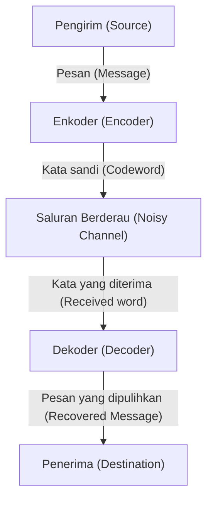

# Apa itu Kode Koreksi Kesalahan?

Dalam masyarakat digital, data selalu terancam oleh gangguan (noise). Goresan pada CD, data wahana antariksa yang dikirim dari luar angkasa, atau kode QR yang biasa kita pindai setiap hari. Data-data ini tidak hancur sepenuhnya oleh sedikit kehilangan atau gangguan berkat adanya mekanisme matematika kuat yang disebut "Kode Koreksi Kesalahan (Error-Correcting Codes, [ECC](/id/p/elliptic-curve-cryptography-math-cpp/))".

Artikel ini akan mengungkap secara rinci cara kerjanya, mulai dari konsep yang digagas oleh bapak teori informasi Claude Shannon, dasar-dasar pemeriksaan paritas, representasi matriks kode Hamming, hingga kode Reed-Solomon yang memanfaatkan lapangan Galois.

## 1. Teori Informasi Shannon dan Teorema Pengkodean Saluran

Pada tahun 1948, Claude Shannon menerbitkan makalah "A Mathematical Theory of Communication" dan membangun bidang yang sama sekali baru yaitu teori informasi. Salah satu teorema paling menakjubkan yang dibuktikan Shannon adalah "Teorema pengkodean saluran berderau (Noisy-channel coding theorem)".

Shannon secara matematis membuktikan bahwa, apa pun saluran komunikasi yang berderau, selama kecepatan komunikasi berada di bawah "Kapasitas Saluran (Channel Capacity)" $C$ dari saluran tersebut, informasi dapat dikirim secara praktis tanpa kesalahan. Ini berarti bahwa untuk mengurangi kesalahan, kita tidak perlu sekadar meningkatkan daya transmisi atau mengirim data yang sama berkali-kali (kode berulang), melainkan cukup melakukan "pengkodean cerdas".



## 2. Deteksi Kesalahan Paling Sederhana: Pemeriksaan Paritas

Cara paling sederhana untuk menemukan kesalahan adalah "Pemeriksaan Paritas (Parity Check)". Satu "bit paritas" ditambahkan di akhir bit data, dan disesuaikan sehingga jumlah total angka "1" selalu genap (paritas genap) atau ganjil (paritas ganjil).

Misalnya, saat mengirim data `1011`, jumlah angka 1 ada tiga. Jika menggunakan paritas genap, `1` ditambahkan sebagai bit paritas, dan data yang dikirim menjadi `10111`. Jika jumlah angka 1 menjadi ganjil di sisi penerima, maka diketahui bahwa kesalahan telah terjadi selama komunikasi.

Namun, pemeriksaan paritas memiliki kelemahan fatal.
1. **Hanya dapat mendeteksi kesalahan, tetapi tidak dapat memperbaikinya** (tidak diketahui bit mana yang terbalik).
2. **Tidak dapat dideteksi jika kesalahan 2 bit terjadi bersamaan** (karena genap/ganjilnya kembali seperti semula).

Batasan ini berhasil ditembus oleh "Kode Hamming" yang diciptakan oleh Richard Hamming.

## 3. Kode Hamming: Menentukan Lokasi Kesalahan

Kode Hamming adalah kode revolusioner yang dapat mendeteksi kesalahan 1 bit dan memperbaikinya secara otomatis dengan menggabungkan beberapa bit paritas secara cerdik. Salah satu contoh yang paling terkenal adalah "Kode Hamming(7,4)", yang menambahkan 3 bit paritas ke 4 bit data.

### Representasi Matriks Kode Hamming(7,4)

Kode Hamming didefinisikan menggunakan alat yang kuat dari aljabar linear: "Matriks Generator (Generator Matrix) $G$" dan "Matriks Pemeriksaan Paritas (Parity-Check Matrix) $H$".

Misalkan vektor data adalah $d = (d_1, d_2, d_3, d_4)$.
Matriks generator $G$ didefinisikan sebagai berikut (bentuk standar).

$$ G =  \begin{pmatrix} 1 & 0 & 0 & 0 & 1 & 1 & 0 \\ 0 & 1 & 0 & 0 & 1 & 0 & 1 \\ 0 & 0 & 1 & 0 & 0 & 1 & 1 \\ 0 & 0 & 0 & 1 & 1 & 1 & 1 \end{pmatrix} $$

Kata sandi (codeword) $c$ dihitung dengan $c = d \cdot G \pmod 2$.

Di sisi penerima, terhadap vektor $r$ yang diterima, matriks pemeriksaan paritas $H$ dikalikan untuk menghitung "Sindrom (Syndrome) $S$".

$$ S = r \cdot H^T \pmod 2 $$

Jika $S = (0, 0, 0)$, maka tidak ada kesalahan. Selain itu, nilai sindrom menunjukkan posisi bit di mana kesalahan terjadi!

### Contoh Implementasi Kode Hamming dengan Python

Berikut adalah simulasi sederhana dari kode Hamming(7,4) menggunakan Python.

```python
import numpy as np

# Matriks generator G (4x7)
G = np.array([
    [1, 0, 0, 0, 1, 1, 0],
    [0, 1, 0, 0, 1, 0, 1],
    [0, 0, 1, 0, 0, 1, 1],
    [0, 0, 0, 1, 1, 1, 1]
])

# Matriks pemeriksaan paritas H (3x7)
H = np.array([
    [1, 1, 0, 1, 1, 0, 0],
    [1, 0, 1, 1, 0, 1, 0],
    [0, 1, 1, 1, 0, 0, 1]
])

# Data asli
d = np.array([1, 0, 1, 1])

# Enkode (modulo 2)
c = np.dot(d, G) % 2
print(f"Kata sandi yang dikirim: {c}")

# Penambahan noise (membalikkan bit ke-3)
r = c.copy()
r[2] ^= 1
print(f"Data yang diterima: {r}")

# Perhitungan sindrom
S = np.dot(r, H.T) % 2
print(f"Sindrom: {S}")
```

## 4. Kode Reed-Solomon: Menghadapi Burst Error

Meskipun kode Hamming kuat terhadap kesalahan acak 1 bit, ia tidak dapat menangani fenomena di mana "bit rusak secara berurutan" seperti goresan pada CD (burst error). Solusi untuk masalah ini adalah "Kode Reed-Solomon (Reed-Solomon Codes, RS Codes)".

Kode RS digunakan di hampir semua penyimpanan data dan komunikasi modern, seperti kode QR, CD, DVD, Blu-ray, dan komunikasi luar angkasa.

### Keajaiban Lapangan Galois (Lapangan Hingga)

Inti dari kode RS adalah melakukan perhitungan di dunia matematika khusus (lapangan hingga) yang disebut "Lapangan Galois (Galois Field, GF)". Berbeda dengan angka biasa, dalam Lapangan Galois, hasil perhitungan empat operasi dasar (penjumlahan, pengurangan, perkalian, pembagian) akan selalu berada di dalam elemen lapangan tersebut (tidak ada luapan/overflow atau angka desimal).

Biasanya, komputer menangani data dalam unit 8 bit (1 byte). Oleh karena itu, Lapangan Galois $GF(2^8)$ yang memiliki 256 elemen sering digunakan.

### Cara Kerja Kode RS

Kode RS menganggap data sebagai koefisien polinomial di atas $GF(2^8)$.
Kita membuat polinomial berderajat $k-1$ yaitu $P(x)$, dengan $k$ buah simbol data sebagai koefisiennya.
Dengan menyubstitusikan berbagai nilai $x$ (titik evaluasi) ke dalam polinomial ini, kita menghitung $n$ buah titik. Inilah data (kata sandi) yang dikirim.

Di sisi penerima, karena adanya noise, beberapa titik mungkin akan bergeser (mengalami kesalahan) saat tiba. Namun, selama titik-titik benar yang tersisa cukup banyak, dengan menggunakan metode matematika seperti "Interpolasi Lagrange", kita dapat memulihkan polinomial asli $P(x)$ secara sempurna!

> **Penjelasan metaforis**
> Dengan 2 titik, kita bisa menarik garis lurus. Dengan 3 titik, kita bisa menggambar parabola (kurva kuadrat).
> Jika data asli adalah "garis lurus", dan kita mengirimkan 3 titik. Di sisi penerima, meskipun 1 titik bergeser, selama 2 titik lainnya benar, kita dapat menggambar ulang garis lurus asli dengan benar. Itulah prinsipnya.

## Kesimpulan: Matematika yang Mendukung Kehidupan Digital Kita

Fakta bahwa kita dapat dengan santai memindai kode QR dengan smartphone atau mendengarkan musik secara streaming, semuanya berkat fondasi matematika kuat yang disebut "Kode Koreksi Kesalahan", yang dibangun oleh para jenius seperti Shannon, Hamming, Reed, dan Solomon.

Mempertahankan data digital yang sempurna secara terus-menerus di dunia nyata yang penuh dengan gangguan. Itu benar-benar bisa disebut sebagai keajaiban yang diberikan matematika pada dunia nyata.
