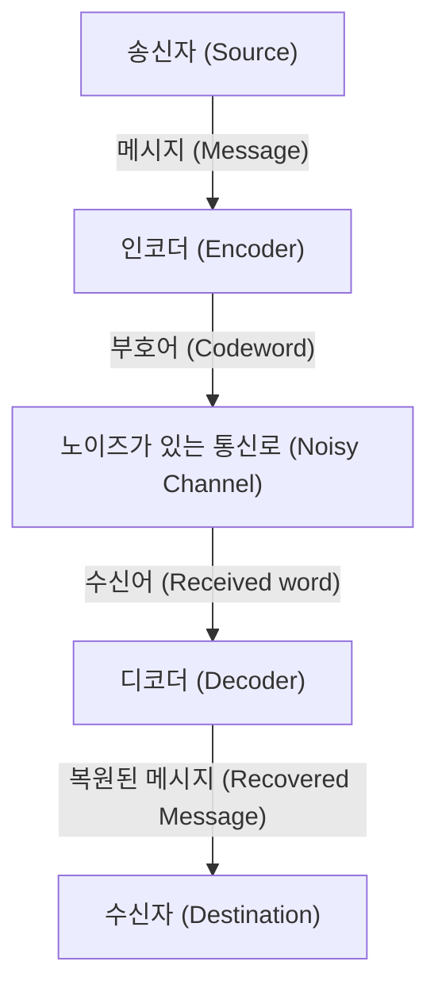

# 오류 정정 부호란 무엇인가?

디지털 사회에서 데이터는 항상 노이즈의 위협에 노출되어 있습니다. CD에 생긴 흠집, 우주 공간에서 전송되는 탐사선의 데이터, 혹은 우리가 일상적으로 스캔하는 QR 코드 등. 이러한 데이터가 약간의 손실이나 노이즈로 인해 완전히 파괴되지 않는 것은 '오류 정정 부호 (Error-Correcting Codes, ECC)'라는 강력한 수학적 메커니즘이 존재하기 때문입니다.

이 글에서는 정보 이론의 아버지인 클로드 섀넌이 제안한 개념부터 시작하여 패리티 검사의 기초, 해밍 부호의 행렬 표현, 그리고 갈루아 체(Galois Field)를 구사하는 리드-솔로몬 부호까지 그 작동 원리를 자세히 풀어보겠습니다.

## 1. 섀넌의 정보 이론과 통신로 부호화 정리

1948년 클로드 섀넌은 논문 "A Mathematical Theory of Communication"을 발표하며 정보 이론이라는 완전히 새로운 분야를 개척했습니다. 섀넌이 증명한 가장 놀라운 정리 중 하나가 '통신로 부호화 정리 (Noisy-channel coding theorem)'입니다.

섀넌은 어떠한 노이즈가 있는 통신로라 하더라도, 해당 통신로의 '통신로 용량 (Channel Capacity)' $C$를 밑도는 통신 속도라면 정보를 실질적으로 오류 없이 보낼 수 있다는 것을 수학적으로 증명했습니다. 이는 오류를 줄이기 위해 단순히 송신 전력을 높이거나 같은 데이터를 여러 번 보낼(반복 부호) 필요 없이 '현명한 부호화'를 수행하면 된다는 것을 의미합니다.



## 2. 가장 단순한 오류 검출: 패리티 검사

오류를 찾아내는 가장 단순한 방법은 '패리티 검사(Parity Check)'입니다. 데이터 비트의 마지막에 1비트의 '패리티 비트'를 추가하여 전체 '1'의 개수가 항상 짝수(짝수 패리티) 또는 홀수(홀수 패리티)가 되도록 조정합니다.

예를 들어, 데이터 `1011`을 보낼 경우 1의 개수는 3개입니다. 짝수 패리티를 사용할 경우 패리티 비트로 `1`을 추가하여 송신 데이터는 `10111`이 됩니다. 수신 측에서 1의 개수가 홀수가 되어 있다면 통신 중에 오류가 발생했음을 알 수 있습니다.

하지만 패리티 검사에는 치명적인 약점이 있습니다.
1. **오류를 검출할 수만 있을 뿐, 정정은 불가능하다** (어느 비트가 반전되었는지 알 수 없음).
2. **2비트의 오류가 동시에 발생하면 검출할 수 없다** (홀짝이 원래대로 돌아오기 때문).

이러한 한계를 돌파한 것이 리처드 해밍이 고안한 '해밍 부호'입니다.

## 3. 해밍 부호: 오류의 위치를 특정하다

해밍 부호는 여러 개의 패리티 비트를 교묘하게 조합하여 1비트의 오류를 검출하고 자동으로 정정할 수 있는 획기적인 부호입니다. 대표적인 예로 4비트의 데이터에 3비트의 패리티를 추가하는 '해밍(7,4) 부호'가 있습니다.

### 해밍(7,4) 부호의 행렬 표현

해밍 부호는 선형대수의 강력한 도구인 '생성 행렬 (Generator Matrix) $G$'와 '패리티 검사 행렬 (Parity-Check Matrix) $H$'를 사용하여 정의됩니다.

데이터 벡터를 $d = (d_1, d_2, d_3, d_4)$ 라고 합시다.
생성 행렬 $G$는 다음과 같이 정의됩니다 (표준형).

$$ G =  \begin{pmatrix} 1 & 0 & 0 & 0 & 1 & 1 & 0 \\ 0 & 1 & 0 & 0 & 1 & 0 & 1 \\ 0 & 0 & 1 & 0 & 0 & 1 & 1 \\ 0 & 0 & 0 & 1 & 1 & 1 & 1 \end{pmatrix} $$

부호어 $c$는 $c = d \cdot G \pmod 2$ 로 계산됩니다.

수신 측에서는 수신한 벡터 $r$에 대하여 패리티 검사 행렬 $H$를 곱하여 '신드롬 (Syndrome) $S$'를 계산합니다.

$$ S = r \cdot H^T \pmod 2 $$

만약 $S = (0, 0, 0)$ 이라면 오류가 없는 것입니다. 그 외의 경우에는 신드롬의 값이 오류가 발생한 비트 위치를 나타냅니다!

### Python을 이용한 해밍 부호 구현 예시

다음은 Python을 이용한 간단한 해밍(7,4) 부호의 시뮬레이션입니다.

```python
import numpy as np

# 생성 행렬 G (4x7)
G = np.array([
    [1, 0, 0, 0, 1, 1, 0],
    [0, 1, 0, 0, 1, 0, 1],
    [0, 0, 1, 0, 0, 1, 1],
    [0, 0, 0, 1, 1, 1, 1]
])

# 패리티 검사 행렬 H (3x7)
H = np.array([
    [1, 1, 0, 1, 1, 0, 0],
    [1, 0, 1, 1, 0, 1, 0],
    [0, 1, 1, 1, 0, 0, 1]
])

# 원본 데이터
d = np.array([1, 0, 1, 1])

# 인코딩 (모듈로 2)
c = np.dot(d, G) % 2
print(f"송신 부호어: {c}")

# 노이즈 추가 (3번째 비트 반전)
r = c.copy()
r[2] ^= 1
print(f"수신 데이터: {r}")

# 신드롬 계산
S = np.dot(r, H.T) % 2
print(f"신드롬: {S}")
```

## 4. 리드-솔로몬 부호: 버스트 오류에 맞서다

해밍 부호는 1비트의 랜덤 오류에는 강하지만, CD의 흠집처럼 '연속해서 비트가 파괴되는' 현상(버스트 오류)에는 대응할 수 없습니다. 이를 해결하는 것이 '리드-솔로몬 부호 (Reed-Solomon Codes, RS 부호)'입니다.

QR 코드, CD, DVD, 블루레이, 우주 통신 등 현대의 거의 모든 데이터 스토리지와 통신에서 RS 부호가 사용되고 있습니다.

### 갈루아 체(유한체)의 마법

RS 부호의 핵심은 '갈루아 체 (Galois Field, GF)'라는 특수한 수학의 세계(유한체)에서 계산을 수행하는 것입니다. 일반적인 수와 달리 갈루아 체에서는 사칙연산을 수행한 결과가 반드시 그 체의 요소 안에 포함됩니다 (오버플로우나 소수가 존재하지 않습니다).

보통 컴퓨터는 8비트(1바이트) 단위로 데이터를 다룹니다. 그렇기 때문에 $GF(2^8)$이라는 256개의 요소를 가진 갈루아 체가 자주 사용됩니다.

### RS 부호의 원리

RS 부호는 데이터를 $GF(2^8)$ 상의 다항식 계수로 간주합니다.
$k$개의 데이터 심볼을 계수로 하는 $k-1$차 다항식 $P(x)$를 만듭니다.
이 다항식에 다양한 $x$의 값(평가점)을 대입하여 $n$개의 점을 계산합니다. 이것이 송신되는 데이터(부호어)입니다.

수신 측에서는 노이즈로 인해 몇 개의 점이 어긋나서(오류가 발생하여) 도착합니다. 하지만 남은 올바른 점이 충분히 많다면, '라그랑주 보간법' 등의 수학적 기법을 이용하여 원래의 다항식 $P(x)$를 완벽하게 복원할 수 있습니다!

> **비유적인 설명**
> 2점이 있으면 직선을 그을 수 있습니다. 3점이 있으면 포물선(2차 곡선)을 그릴 수 있습니다.
> 만약 원래 데이터가 '직선'이고 3개의 점을 보냈다고 가정해 봅시다. 수신 측에서 1개의 점이 어긋나 있더라도 나머지 2개의 점이 올바르다면 원래의 직선을 올바르게 다시 그을 수 있다는 원리입니다.

## 요약: 수학이 지탱하는 우리의 디지털 라이프

우리가 무심코 스마트폰으로 QR 코드를 읽거나 음악을 스트리밍으로 재생할 수 있는 것은 섀넌, 해밍, 리드, 솔로몬과 같은 천재들이 구축한 '오류 정정 부호'라는 견고한 수학적 기반이 있기 때문입니다.

노이즈 투성이인 현실 세계에서 완벽한 디지털 데이터를 계속 유지하는 것. 그것은 그야말로 수학이 현실 세계에 건 마법이라고 할 수 있을 것입니다.
