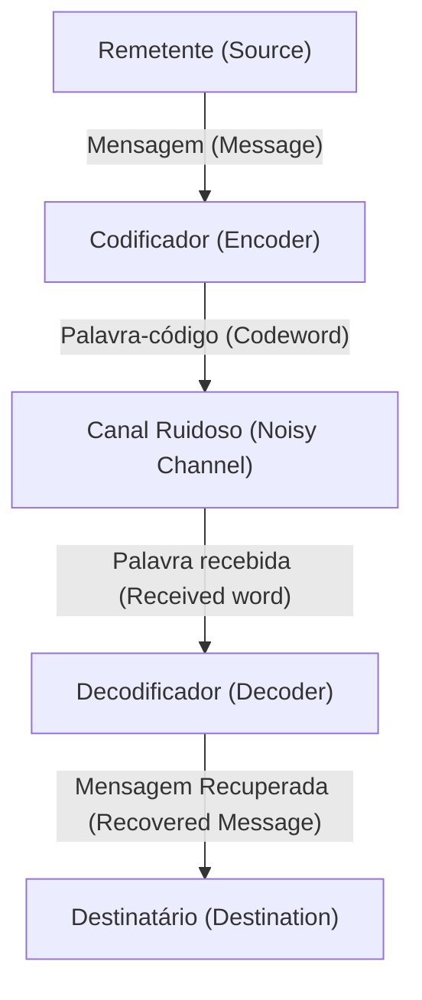

# O que são Códigos de Correção de Erros?

Na sociedade digital, os dados estão constantemente expostos à ameaça de ruído. Arranhões em um CD, dados de sondas espaciais transmitidos do espaço sideral ou os códigos QR que escaneamos diariamente. A razão pela qual esses dados não são completamente destruídos por uma pequena perda ou ruído é a existência de um poderoso mecanismo matemático chamado "Códigos de Correção de Erros (Error-Correcting Codes, ECC)".

Neste artigo, desvendaremos detalhadamente seu funcionamento, começando pelos conceitos propostos por Claude Shannon, o pai da teoria da informação, passando pelos fundamentos da verificação de paridade, a representação matricial do código de Hamming, até chegar aos códigos de Reed-Solomon que utilizam Corpos de Galois.

## 1. A Teoria da Informação de Shannon e o Teorema de Codificação de Canal

Em 1948, Claude Shannon publicou o artigo "A Mathematical Theory of Communication", estabelecendo o campo inteiramente novo da teoria da informação. Um dos teoremas mais surpreendentes que Shannon provou é o "Teorema de codificação de canal ruidoso (Noisy-channel coding theorem)".

Shannon provou matematicamente que, independentemente de quão ruidoso seja um canal de comunicação, desde que a taxa de transmissão seja inferior à "Capacidade do Canal (Channel Capacity)" $C$, é possível transmitir informações praticamente sem erros. Isso significa que, para reduzir erros, não é necessário simplesmente aumentar a potência de transmissão ou enviar os mesmos dados repetidamente (código de repetição), mas sim realizar uma "codificação inteligente".



## 2. A Detecção de Erros Mais Simples: Verificação de Paridade

O método mais simples para encontrar erros é a "verificação de paridade". Adiciona-se um "bit de paridade" de 1 bit no final dos bits de dados, ajustando de forma que o número total de "1"s seja sempre par (paridade par) ou ímpar (paridade ímpar).

Por exemplo, ao enviar os dados `1011`, o número de 1s é três. Se usarmos a paridade par, adicionamos `1` como bit de paridade, e os dados transmitidos se tornam `10111`. Se o número de 1s for ímpar no lado receptor, saberemos que ocorreu um erro durante a comunicação.

No entanto, a verificação de paridade tem pontos fracos fatais:
1. **Pode apenas detectar erros, mas não corrigi-los** (não se sabe qual bit foi invertido).
2. **Não consegue detectar se 2 bits de erro ocorrerem simultaneamente** (porque a paridade voltará ao normal).

A solução para essa limitação foi o "Código de Hamming", inventado por Richard Hamming.

## 3. Código de Hamming: Localizando o Erro

O código de Hamming é um código revolucionário que pode detectar um erro de 1 bit e corrigi-lo automaticamente, combinando habilmente múltiplos bits de paridade. Um exemplo típico é o "Código de Hamming (7,4)", que adiciona 3 bits de paridade a 4 bits de dados.

### Representação Matricial do Código de Hamming (7,4)

O código de Hamming é definido usando ferramentas poderosas de álgebra linear: a "Matriz Geradora (Generator Matrix) $G$" e a "Matriz de Verificação de Paridade (Parity-Check Matrix) $H$".

Seja o vetor de dados $d = (d_1, d_2, d_3, d_4)$.
A Matriz Geradora $G$ é definida da seguinte forma (forma padrão):

$$ G = \begin{pmatrix} 1 & 0 & 0 & 0 & 1 & 1 & 0 \\ 0 & 1 & 0 & 0 & 1 & 0 & 1 \\ 0 & 0 & 1 & 0 & 0 & 1 & 1 \\ 0 & 0 & 0 & 1 & 1 & 1 & 1 \end{pmatrix} $$

A palavra-código $c$ é calculada por $c = d \cdot G \pmod 2$.

No lado receptor, o vetor recebido $r$ é multiplicado pela matriz de verificação de paridade $H$ para calcular a "Síndrome (Syndrome) $S$".

$$ S = r \cdot H^T \pmod 2 $$

Se $S = (0, 0, 0)$, então não há erros. Caso contrário, o valor da síndrome indica a posição do bit onde ocorreu o erro!

### Exemplo de Implementação do Código de Hamming em Python

Abaixo está uma simulação simples do código de Hamming (7,4) usando Python.

```python
import numpy as np

# Matriz Geradora G (4x7)
G = np.array([
    [1, 0, 0, 0, 1, 1, 0],
    [0, 1, 0, 0, 1, 0, 1],
    [0, 0, 1, 0, 0, 1, 1],
    [0, 0, 0, 1, 1, 1, 1]
])

# Matriz de Verificação de Paridade H (3x7)
H = np.array([
    [1, 1, 0, 1, 1, 0, 0],
    [1, 0, 1, 1, 0, 1, 0],
    [0, 1, 1, 1, 0, 0, 1]
])

# Dados originais
d = np.array([1, 0, 1, 1])

# Codificação (Módulo 2)
c = np.dot(d, G) % 2
print(f"Palavra-código transmitida: {c}")

# Adição de ruído (inversão do 3º bit)
r = c.copy()
r[2] ^= 1
print(f"Dados recebidos: {r}")

# Cálculo da síndrome
S = np.dot(r, H.T) % 2
print(f"Síndrome: {S}")
```

## 4. Códigos de Reed-Solomon: Enfrentando Erros de Rajada

O código de Hamming é robusto contra erros aleatórios de 1 bit, mas não pode lidar com fenômenos onde "bits são corrompidos consecutivamente" (erros de rajada), como arranhões em um CD. Isso é resolvido pelos "Códigos de Reed-Solomon (Reed-Solomon Codes, RS)".

Os códigos RS são usados em quase todos os armazenamentos e comunicações de dados modernos, como códigos QR, CDs, DVDs, Blu-rays e comunicações espaciais.

### A Magia dos Corpos de Galois (Corpos Finitos)

O núcleo do código RS é realizar cálculos em um mundo matemático especial (corpo finito) chamado "Corpo de Galois (Galois Field, GF)". Ao contrário dos números normais, os resultados das quatro operações aritméticas no corpo de Galois sempre se enquadram nos elementos desse corpo (não ocorrem estouros ou decimais).

Normalmente, os computadores processam dados em unidades de 8 bits (1 byte). Portanto, frequentemente é usado um corpo de Galois com 256 elementos chamado $GF(2^8)$.

### Como Funciona o Código RS

O código RS trata os dados como coeficientes de um polinômio sobre $GF(2^8)$.
Cria-se um polinômio $P(x)$ de grau $k-1$ com $k$ símbolos de dados como coeficientes.
Substituindo vários valores de $x$ (pontos de avaliação) neste polinômio, calculam-se $n$ pontos. Estes são os dados transmitidos (palavra-código).

No lado receptor, alguns pontos chegam deslocados (com erros) devido ao ruído. No entanto, se sobrarem pontos corretos suficientes, é possível restaurar completamente o polinômio original $P(x)$ usando técnicas matemáticas como a "interpolação de Lagrange"!

> **Explicação Metafórica**
> Com 2 pontos, você pode desenhar uma linha reta. Com 3 pontos, pode desenhar uma parábola (curva de 2º grau).
> Se os dados originais fossem uma "linha reta" e você enviasse 3 pontos, mesmo que 1 ponto chegasse deslocado no receptor, se os 2 pontos restantes estiverem corretos, você poderá redesenhar a linha reta original corretamente, segundo este princípio.

## Conclusão: A Matemática que Sustenta Nossa Vida Digital

O fato de podermos escanear casualmente um código QR com um smartphone ou reproduzir música por streaming deve-se à sólida base matemática chamada "códigos de correção de erros", construída por gênios como Shannon, Hamming, Reed e Solomon.

Manter dados digitais perfeitos num mundo real cheio de ruídos. Isso pode ser considerado uma magia que a matemática lançou sobre o mundo real.
