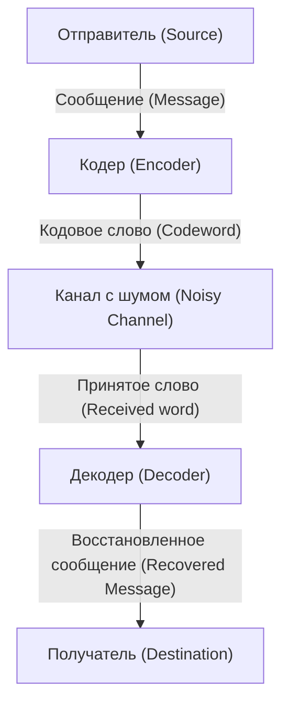

# Что такое коды, исправляющие ошибки?

В цифровом обществе данные постоянно подвергаются угрозе шума. Царапины на компакт-дисках, данные с космических зондов или QR-коды, которые мы сканируем каждый день. Эти данные не разрушаются полностью от небольших потерь или шума благодаря мощному математическому механизму: «Кодам, исправляющим ошибки» (Error-Correcting Codes, ECC).

В этой статье мы подробно разберем этот механизм, начиная с концепций, предложенных отцом теории информации Клодом Шенноном, основ проверок на четность, матричного представления кодов Хэмминга и заканчивая кодами Рида-Соломона, использующими поля Галуа.

## 1. Теория информации Шеннона и теорема кодирования канала

В 1948 году Клод Шеннон опубликовал свою статью «Математическая теория связи» (A Mathematical Theory of Communication), положив начало совершенно новой области — теории информации. Одной из самых удивительных теорем, доказанных Шенноном, является «Теорема кодирования канала с шумом» (Noisy-channel coding theorem).

Шеннон математически доказал, что для любого канала связи с шумом, если скорость передачи данных ниже «Пропускной способности канала» (Channel Capacity) $C$, информацию можно передавать практически без ошибок. Это означает, что для уменьшения количества ошибок нет необходимости просто увеличивать мощность передачи или многократно отправлять одни и те же данные (повторяющийся код), а достаточно использовать «умное кодирование».



## 2. Простейшее обнаружение ошибок: проверка на четность

Самый простой способ найти ошибку — это «проверка на четность» (parity check). В конец битов данных добавляется один «бит четности», и он настраивается так, чтобы общее количество «1» всегда было четным (четная четность) или нечетным (нечетная четность).

Например, если мы отправляем данные `1011`, количество единиц равно трем. При использовании четной четности в качестве бита четности добавляется `1`, и отправляемые данные становятся `10111`. На стороне приемника, если количество единиц оказывается нечетным, мы знаем, что во время передачи произошла ошибка.

Однако у проверки на четность есть фатальные недостатки:
1. **Она может только обнаружить ошибку, но не исправить ее** (неизвестно, какой бит перевернулся).
2. **Она не может обнаружить одновременное появление двух ошибок** (так как четность/нечетность возвращается к исходному состоянию).

Этот предел был преодолен «Кодом Хэмминга», изобретенным Ричардом Хэммингом.

## 3. Код Хэмминга: определение местоположения ошибки

Код Хэмминга — это революционный код, который может обнаружить ошибку в 1 бит и автоматически исправить ее, умело комбинируя несколько битов четности. Типичным примером является «Код Хэмминга (7,4)», который добавляет 3 бита четности к 4 битам данных.

### Матричное представление кода Хэмминга (7,4)

Коды Хэмминга определяются с использованием мощных инструментов линейной алгебры: «Порождающей матрицы» (Generator Matrix) $G$ и «Матрицы проверки на четность» (Parity-Check Matrix) $H$.

Пусть вектор данных равен $d = (d_1, d_2, d_3, d_4)$.
Порождающая матрица $G$ определяется следующим образом (стандартная форма):

$$ G =  \begin{pmatrix} 1 & 0 & 0 & 0 & 1 & 1 & 0 \\ 0 & 1 & 0 & 0 & 1 & 0 & 1 \\ 0 & 0 & 1 & 0 & 0 & 1 & 1 \\ 0 & 0 & 0 & 1 & 1 & 1 & 1 \end{pmatrix} $$

Кодовое слово $c$ вычисляется как $c = d \cdot G \pmod 2$.

На принимающей стороне мы умножаем полученный вектор $r$ на матрицу проверки на четность $H$ для вычисления «Синдрома» (Syndrome) $S$.

$$ S = r \cdot H^T \pmod 2 $$

Если $S = (0, 0, 0)$, ошибок нет. В противном случае значение синдрома указывает позицию бита, в котором произошла ошибка!

### Пример реализации кода Хэмминга на Python

Ниже приведена простая симуляция кода Хэмминга (7,4) на Python.

```python
import numpy as np

# Порождающая матрица G (4x7)
G = np.array([
    [1, 0, 0, 0, 1, 1, 0],
    [0, 1, 0, 0, 1, 0, 1],
    [0, 0, 1, 0, 0, 1, 1],
    [0, 0, 0, 1, 1, 1, 1]
])

# Матрица проверки на четность H (3x7)
H = np.array([
    [1, 1, 0, 1, 1, 0, 0],
    [1, 0, 1, 1, 0, 1, 0],
    [0, 1, 1, 1, 0, 0, 1]
])

# Исходные данные
d = np.array([1, 0, 1, 1])

# Кодирование (по модулю 2)
c = np.dot(d, G) % 2
print(f"Отправленное кодовое слово: {c}")

# Добавление шума (инверсия 3-го бита)
r = c.copy()
r[2] ^= 1
print(f"Полученные данные: {r}")

# Вычисление синдрома
S = np.dot(r, H.T) % 2
print(f"Синдром: {S}")
```

## 4. Код Рида-Соломона: противостояние пакетам ошибок

Хотя код Хэмминга устойчив к случайным ошибкам в 1 бит, он не может справиться с явлением, когда «биты разрушаются последовательно» (пакет ошибок), например, как в случае с царапиной на компакт-диске. Это решает «Код Рида-Соломона» (Reed-Solomon Codes, RS-коды).

Почти все современные системы хранения и передачи данных, включая QR-коды, CD, DVD, Blu-ray и космическую связь, используют RS-коды.

### Магия полей Галуа (Конечных полей)

Ядром RS-кода является то, что вычисления выполняются в особом математическом мире (конечном поле), называемом «Поле Галуа» (Galois Field, GF). В отличие от обычных чисел, результаты четырех арифметических операций в поле Галуа всегда остаются в пределах элементов этого поля (не существует переполнений или десятичных дробей).

Обычно компьютеры обрабатывают данные блоками по 8 бит (1 байт). Поэтому часто используется поле Галуа $GF(2^8)$, которое имеет 256 элементов.

### Как работает RS-код

RS-код рассматривает данные как коэффициенты многочлена над $GF(2^8)$.
Создается многочлен $P(x)$ степени $k-1$ с $k$ символами данных в качестве коэффициентов.
Подставляя различные значения $x$ (точки оценки) в этот многочлен, вычисляются $n$ точек. Это и есть отправляемые данные (кодовое слово).

На принимающей стороне из-за шума некоторые точки прибывают смещенными (с ошибками). Однако, если осталось достаточно много правильных точек, можно использовать математические методы, такие как «интерполяция Лагранжа», чтобы полностью восстановить исходный многочлен $P(x)$!

> **Метафорическое объяснение**
> Имея 2 точки, можно провести прямую. Имея 3 точки, можно нарисовать параболу (квадратичную кривую).
> Если исходные данные представляют собой «прямую», и мы отправляем 3 точки. Даже если на принимающей стороне одна точка смещена, если две другие точки верны, мы можем правильно перерисовать исходную прямую — таков принцип.

## Заключение: математика, которая поддерживает нашу цифровую жизнь

То, что мы можем непринужденно сканировать QR-коды нашими смартфонами или слушать потоковую музыку, возможно благодаря прочному математическому фундаменту под названием «коды, исправляющие ошибки», созданному такими гениями, как Шеннон, Хэмминг, Рид и Соломон.

Поддержание идеальных цифровых данных в реальном мире, полном шума. Это поистине можно назвать магией, которую математика привнесла в реальный мир.
