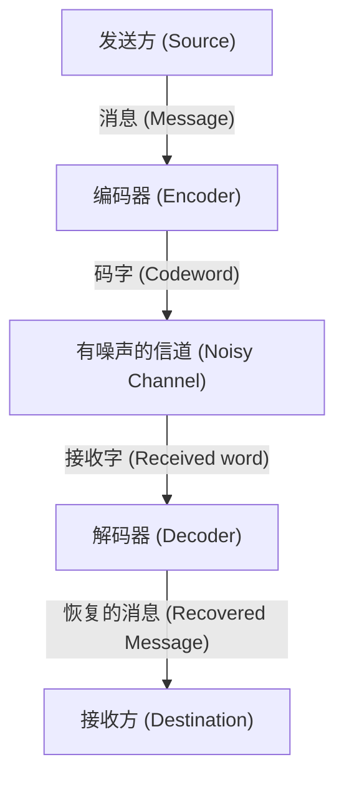

# 什么是纠错码？

在数字社会中，数据始终面临着噪声的威胁。CD上的划痕、从太空发回的探测器数据，或是我们日常扫描的二维码。这些数据之所以不会因为少许丢失或噪声而完全损坏，是因为存在一种强大的数学机制——“纠错码（Error-Correcting Codes, ECC）”。

本文将从信息论之父克劳德·香农提出的概念开始，深入解析奇偶校验的基础、汉明码的矩阵表示，直到运用伽罗瓦域的里德-所罗门码的工作原理。

## 1. 香农的信息论与信道编码定理

1948年，克劳德·香农发表了论文《通信的数学理论》（A Mathematical Theory of Communication），开创了信息论这一全新领域。香农证明的最令人惊叹的定理之一就是“信道编码定理”（Noisy-channel coding theorem）。

香农从数学上证明，无论在怎样有噪声的信道中，只要通信速率低于该信道的“信道容量”（Channel Capacity）$C$，就能实质上无误差地传输信息。这意味着，为了减少错误，我们不需要单纯地提高发射功率，也不必多次发送相同的数据（重复码），而是只需要进行“聪明的编码”。



## 2. 最简单的错误检测：奇偶校验

发现错误最简单的方法是“奇偶校验”。在数据位的末尾加上1位“校验位”，进行调整，使得整体“1”的数量始终为偶数（偶校验）或奇数（奇校验）。

例如，发送数据 `1011` 时，1的数量是3个。如果使用偶校验，就加上校验位 `1`，发送的数据就变成 `10111`。如果在接收端发现1的数量变成了奇数，就知道在通信过程中发生了错误。

然而，奇偶校验有一个致命的弱点：
1. **只能检测错误，不能纠正错误**（不知道是哪一位发生了反转）。
2. **如果同时发生2位错误则无法检测**（因为奇偶性又变回去了）。

突破这一限制的，是理查德·汉明发明的“汉明码”。

## 3. 汉明码：定位错误位置

汉明码是一种革命性的编码方式，通过巧妙地组合多个校验位，不仅能检测出1位错误，还能自动纠正。最具代表性的是为4位数据附加3位校验位的“汉明(7,4)码”。

### 汉明(7,4)码的矩阵表示

汉明码是利用线性代数中强大的工具——“生成矩阵 (Generator Matrix) $G$”和“校验矩阵 (Parity-Check Matrix) $H$”来定义的。

设数据向量为 $d = (d_1, d_2, d_3, d_4)$。
生成矩阵 $G$ 的定义如下（标准形式）：

$$ G =  \begin{pmatrix} 1 & 0 & 0 & 0 & 1 & 1 & 0 \\ 0 & 1 & 0 & 0 & 1 & 0 & 1 \\ 0 & 0 & 1 & 0 & 0 & 1 & 1 \\ 0 & 0 & 0 & 1 & 1 & 1 & 1 \end{pmatrix} $$

码字 $c$ 通过 $c = d \cdot G \pmod 2$ 计算得出。

在接收端，用接收到的向量 $r$ 乘以校验矩阵 $H^T$，计算出“伴随式 (Syndrome) $S$”。

$$ S = r \cdot H^T \pmod 2 $$

如果 $S = (0, 0, 0)$，则没有错误。否则，伴随式的值就会指示出发生错误的比特位置！

### Python实现汉明码的示例

下面是使用Python进行简单的汉明(7,4)码模拟。

```python
import numpy as np

# 生成矩阵 G (4x7)
G = np.array([
    [1, 0, 0, 0, 1, 1, 0],
    [0, 1, 0, 0, 1, 0, 1],
    [0, 0, 1, 0, 0, 1, 1],
    [0, 0, 0, 1, 1, 1, 1]
])

# 校验矩阵 H (3x7)
H = np.array([
    [1, 1, 0, 1, 1, 0, 0],
    [1, 0, 1, 1, 0, 1, 0],
    [0, 1, 1, 1, 0, 0, 1]
])

# 原始数据
d = np.array([1, 0, 1, 1])

# 编码 (模 2)
c = np.dot(d, G) % 2
print(f"发送码字: {c}")

# 添加噪声（反转第3个比特）
r = c.copy()
r[2] ^= 1
print(f"接收数据: {r}")

# 计算伴随式
S = np.dot(r, H.T) % 2
print(f"伴随式: {S}")
```

## 4. 里德-所罗门码：应对突发错误

汉明码对1位的随机错误有很强的抵抗力，但无法应对像CD划痕那样“连续发生比特损坏”的现象（突发错误）。解决这个问题的是“里德-所罗门码 (Reed-Solomon Codes, RS码)”。

二维码、CD、DVD、蓝光光盘以及太空通信等现代几乎所有的数据存储和通信中，都在使用RS码。

### 伽罗瓦域（有限域）的魔法

RS码的核心在于，在被称为“伽罗瓦域 (Galois Field, GF)”的特殊数学世界（有限域）中进行计算。与普通的数字不同，在伽罗瓦域中进行四则运算，结果必定落在该域的元素范围内（不存在溢出或小数）。

通常，计算机以8位（1字节）为单位处理数据。因此，经常使用拥有256个元素的伽罗瓦域 $GF(2^8)$。

### RS码的工作原理

RS码将数据视为 $GF(2^8)$ 上多项式的系数。
创建一个以 $k$ 个数据符号作为系数的 $k-1$ 次多项式 $P(x)$。
将不同的 $x$ 值（评估点）代入该多项式，计算出 $n$ 个点。这就是要发送的数据（码字）。

在接收端，由于噪声，到达的某些点会发生偏移（变成错误）。但是，只要剩下的正确点足够多，就可以利用“拉格朗日插值”等数学方法，完全恢复原来的多项式 $P(x)$！

> **形象的比喻**
> 有2个点就可以画一条直线。有3个点就可以画一条抛物线（二次曲线）。
> 假设原始数据是一条“直线”，发送了3个点。在接收端，即使有1个点发生了偏移，只要剩下的2个点是正确的，就能正确地重新画出原来的直线——这就是它的原理。

## 总结：支撑我们数字生活的数学

我们能够若无其事地用智能手机扫描二维码或播放流媒体音乐，全靠香农、汉明、里德、所罗门等天才们建立起来的“纠错码”这一坚实的数学基础。

在充满噪声的现实世界中，持续保持完美的数字数据。这简直就是数学在现实世界中施展的魔法。
