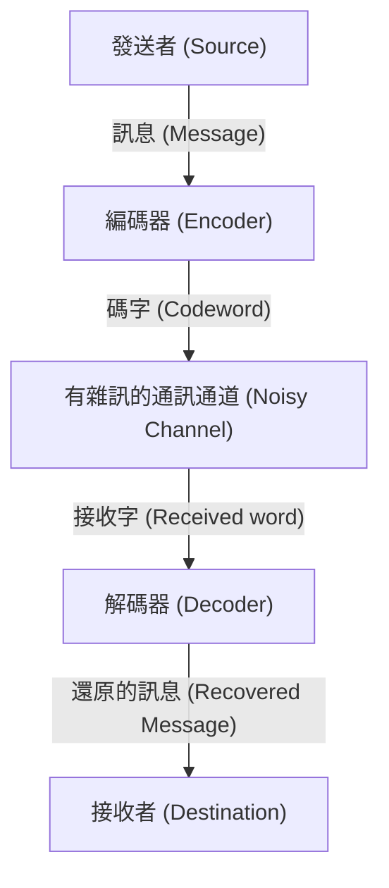

# 什麼是錯誤更正碼？

在數位社會中，資料隨時面臨著雜訊的威脅。CD上的刮痕、從宇宙空間傳回的探測器資料，或是我們日常掃描的QR Code。這些資料之所以不會因為些許的缺損或雜訊而完全損毀，是因為有一種名為「錯誤更正碼 (Error-Correcting Codes, ECC)」的強大數學機制存在。

本文將從資訊理論之父克勞德·夏農所提出的概念開始，為您詳細解析同位元檢查 (Parity Check) 的基礎、漢明碼 (Hamming Code) 的矩陣表示，以及運用伽羅瓦體 (Galois Field) 的里德-所羅門碼 (Reed-Solomon Codes) 的運作原理。

## 1. 夏農的資訊理論與通訊通道編碼定理

1948年，克勞德·夏農發表了論文《通訊的數學理論》(A Mathematical Theory of Communication)，開創了資訊理論這個全新的領域。夏農所證明最令人驚嘆的定理之一就是「通訊通道編碼定理 (Noisy-channel coding theorem)」。

夏農以數學證明，無論在多麼嘈雜的通訊通道中，只要通訊速度低於該通道的「通道容量 (Channel Capacity)」$C$，就能夠實質上無錯誤地傳送資訊。這意味著，為了減少錯誤，我們不需要單純地提高發射功率，也不必多次傳送相同的資料（重複碼），只需要進行「聰明的編碼」即可。



## 2. 最簡單的錯誤偵測：同位元檢查

找出錯誤最簡單的方法就是「同位元檢查」。在資料位元的最後加上1位元的「同位元 (Parity Bit)」，調整使整體的「1」的數量始終為偶數（偶數同位元）或奇數（奇數同位元）。

例如，若要傳送資料 `1011`，其中有3個1。若使用偶數同位元，就將同位元設為 `1` 並加在最後，傳送的資料就會變成 `10111`。在接收端，如果發現1的數量是奇數，就知道在通訊過程中發生了錯誤。

然而，同位元檢查有一個致命的弱點：
1. **只能偵測錯誤，無法更正**（不知道是哪一個位元發生了反轉）。
2. **若同時發生2個位元的錯誤就無法偵測**（因為奇偶性會變回原樣）。

突破這個極限的，是理查·漢明所發明的「漢明碼」。

## 3. 漢明碼：定位錯誤的位置

漢明碼巧妙地組合多個同位元，不僅能偵測出1個位元的錯誤，還能自動將其更正，是一種劃時代的編碼方式。最具代表性的是在4位元的資料加上3位元同位元的「漢明(7,4)碼」。

### 漢明(7,4)碼的矩陣表示

漢明碼是使用線性代數中強大的工具：「生成矩陣 (Generator Matrix) $G$」與「同位元檢查矩陣 (Parity-Check Matrix) $H$」來定義的。

假設資料向量為 $d = (d_1, d_2, d_3, d_4)$。
生成矩陣 $G$ 的定義如下（標準形式）：

$$ G = \begin{pmatrix} 1 & 0 & 0 & 0 & 1 & 1 & 0 \\ 0 & 1 & 0 & 0 & 1 & 0 & 1 \\ 0 & 0 & 1 & 0 & 0 & 1 & 1 \\ 0 & 0 & 0 & 1 & 1 & 1 & 1 \end{pmatrix} $$

碼字 (Codeword) $c$ 的計算方式為 $c = d \cdot G \pmod 2$。

在接收端，對接收到的向量 $r$ 乘上同位元檢查矩陣 $H^T$ 來計算「症狀 (Syndrome) $S$」：

$$ S = r \cdot H^T \pmod 2 $$

如果 $S = (0, 0, 0)$，就代表沒有錯誤。反之，症狀的值就會指出發生錯誤的位元位置！

### 使用 Python 實作漢明碼的範例

以下是使用 Python 實作簡單的漢明(7,4)碼模擬：

```python
import numpy as np

# 生成矩陣 G (4x7)
G = np.array([
    [1, 0, 0, 0, 1, 1, 0],
    [0, 1, 0, 0, 1, 0, 1],
    [0, 0, 1, 0, 0, 1, 1],
    [0, 0, 0, 1, 1, 1, 1]
])

# 同位元檢查矩陣 H (3x7)
H = np.array([
    [1, 1, 0, 1, 1, 0, 0],
    [1, 0, 1, 1, 0, 1, 0],
    [0, 1, 1, 1, 0, 0, 1]
])

# 原始資料
d = np.array([1, 0, 1, 1])

# 編碼 (Modulo 2)
c = np.dot(d, G) % 2
print(f"發送碼字: {c}")

# 加入雜訊 (反轉第3個位元)
r = c.copy()
r[2] ^= 1
print(f"接收資料: {r}")

# 計算症狀
S = np.dot(r, H.T) % 2
print(f"症狀: {S}")
```

## 4. 里德-所羅門碼：對抗突發性錯誤

漢明碼對於1個位元的隨機錯誤有很強的抵抗力，但卻無法應對像CD刮痕那樣「連續位元損毀」的現象（突發性錯誤）。解決這個問題的就是「里德-所羅門碼 (Reed-Solomon Codes, RS碼)」。

QR Code、CD、DVD、藍光光碟，以及宇宙通訊等，現代幾乎所有的資料儲存與通訊都使用了 RS碼。

### 伽羅瓦體（有限體）的魔法

RS碼的核心，是在稱為「伽羅瓦體 (Galois Field, GF)」這個特殊的數學世界（有限體）中進行計算。與一般的數字不同，在伽羅瓦體中進行四則運算的結果，必定會落在該體的元素內（不存在溢位或小數）。

通常，電腦是以8位元（1位元組）為單位來處理資料。因此，最常使用的是擁有256個元素的伽羅瓦體 $GF(2^8)$。

### RS碼的運作原理

RS碼將資料視為 $GF(2^8)$ 上多項式的係數。
以 $k$ 個資料符號作為係數，建立一個 $k-1$ 次的多項式 $P(x)$。
將各種 $x$ 的值（評估點）代入這個多項式中，計算出 $n$ 個點。這就是要發送的資料（碼字）。

在接收端，受到雜訊的影響，會有一些點產生偏移（變成錯誤）才抵達。然而，只要剩下的正確點數量夠多，就可以利用「拉格朗日插值法」等數學方法，完美還原出原本的多項式 $P(x)$！

> **比喻性說明**
> 有2個點就能畫出一條直線。有3個點就能畫出拋物線（二次曲線）。
> 假設原本的資料是一條「直線」，並且我們發送了3個點。在接收端，就算其中1個點產生了偏移，只要剩下的2個點是正確的，就能重新畫出原本那條正確的直線。這就是它的原理。

## 總結：支撐著我們數位生活的數學

我們之所以能若無其事地用智慧型手機掃描 QR Code，或是串流播放音樂，都是因為有夏農、漢明、里德、所羅門等天才們所建立的「錯誤更正碼」這個堅固的數學基礎。

在充滿雜訊的現實世界中，持續維持完美的數位資料。這簡直可以說是數學在現實世界中所施展的魔法吧。
