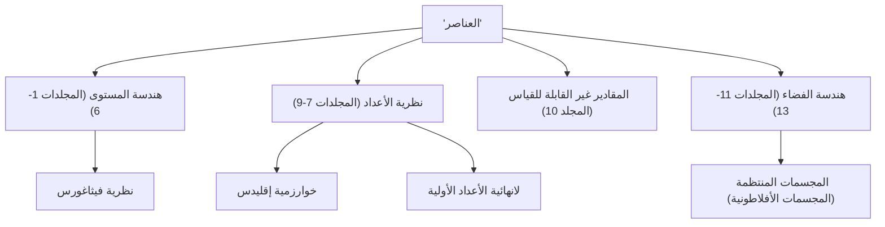

عند الحديث عن تاريخ الرياضيات، هناك نجم عملاق لا يمكن تجاهله. ذلك هو عالم الرياضيات اليوناني القديم **إقليدس**. يُعرف أيضًا باسم "أبو الهندسة"، وهو الرائد الذي أسس الرياضيات كنظام منطقي. في هذا المقال، سوف نتعمق في حلقات من حياة إقليدس، ومحتويات تحفته التاريخية "العناصر"، والإنجازات الرياضية المهمة التي تركها وراءه.

## حياة إقليدس وقصصه

فيما يتعلق بحياة إقليدس (حوالي 300 قبل الميلاد)، في الواقع هناك عدد قليل جدًا من السجلات التاريخية النهائية المتبقية. لا يمكن استنتاج مكان ولادته ونوع الحياة التي عاشها إلا من خلال الأوصاف المجزأة للعلماء في العصور اللاحقة. ومع ذلك، فمن المعروف على نطاق واسع أنه كان نشطًا في **الإسكندرية**، مصر، وكان يدير مدرسة للرياضيات في عهد بطليموس الأول.

### "لا يوجد طريق ملكي للهندسة"

واحدة من أشهر القصص المتعلقة بإقليدس هي تفاعله مع الملك المصري بطليموس الأول.
حاول الملك دراسة كتاب "العناصر" لإقليدس، ولكن لأن محتواه كان صعبًا وطويلًا جدًا، سأل إقليدس:
"ألا يوجد طريق أقصر أو أسهل لتعلم الهندسة؟"
على هذا، يقال إن إقليدس أجاب بحزم:

> "يا جلالة الملك، لا يوجد طريق ملكي للهندسة."

تضرب هذه العبارة في صميم الحقيقة وهي أنه لا توجد طرق مختصرة أو امتيازات خاصة لمن هم في السلطة في التعلم، ويجب على الجميع بذل جهود ثابتة على قدم المساواة. لقد تم تناقلها إلى كثير من الناس حتى يومنا هذا.

## أعظم الكتب مبيعًا في التاريخ: "العناصر"

أعظم إنجاز لإقليدس وأكثره ديمومة هو تجميع كتاب الرياضيات **"العناصر"**، ويتألف من 13 مجلدًا. هذا الكتاب عبارة عن تجميع للمعرفة الرياضية اليونانية القديمة ويقال إنه أكثر الكتب طبعًا في العالم بعد الكتاب المقدس.

الجانب الرائد في "العناصر" هو أنه أسس **نهجًا بديهيًا**، بدلاً من مجرد سرد النظريات الفردية. طريقة البدء من بضع مقدمات بديهية (بديهيات ومسلمات) وإثبات جميع النظريات فقط من خلال الاستنتاج المنطقي حددت المسار المستقبلي للرياضيات والعلوم.

### لغز المسلمة الخامسة (مسلمة التوازي)

في المجلد الأول من "العناصر"، تم سرد خمس مسلمات (مقدمات هندسية). من بينها، كانت المسلمة الخامسة (مسلمة التوازي) على النحو التالي:

"إذا قطع قاطع مستقيمين بحيث كان مجموع الزاويتين الداخليتين في جهة واحدة من القاطع أقل من قائمتين، فإن المستقيمين إذا امتدا إلى ما لا نهاية يتلاقيان في تلك الجهة التي يكون فيها مجموع الزاويتين أقل من قائمتين."

كانت هذه المسلمة أكثر تعقيدًا من الأربع الأخرى، واشتبه العديد من علماء الرياضيات: "أليست هذه نظرية يمكن إثباتها من المسلمات الأخرى، بدلاً من أن تكون مسلمة في حد ذاتها؟" باءت محاولات إثبات ذلك على مدى آلاف السنين بالفشل. ومع ذلك، في القرن التاسع عشر، تم اكتشاف **الهندسة اللاإقليدية** أخيرًا، وهي هندسة لا تنطبق فيها المسلمة الخامسة، مما أحدث ثورة في العالم الرياضي. يمكن القول إن هذا الحدث أثبت بشكل متناقض حدة حدس إقليدس.

## إنجازات إقليدس الرياضية العظيمة

ترك إقليدس إنجازات بارزة ليس فقط في الهندسة ولكن أيضًا في مجال نظرية الأعداد. نقدم هنا إنجازين مشهورين بشكل خاص.

### 1. خوارزمية إقليدس

**خوارزمية إقليدس** هي خوارزمية لإيجاد القاسم المشترك الأكبر (GCD) لعددين طبيعيين بكفاءة. ويطلق عليها أيضًا واحدة من أقدم الخوارزميات في تاريخ البشرية.

ليكن القاسم المشترك الأكبر لعددين طبيعيين $a$ و $b$ (حيث $a > b$) هو $\gcd(a, b)$. إذا كان ناتج قسمة $a$ على $b$ هو $q$ والباقي هو $r$، فإن العلاقة التالية تنطبق:

$$ a = bq + r $$

في هذا الوقت، يتم إنشاء المعادلة التالية:

$$ \gcd(a, b) = \gcd(b, r) $$

من خلال تكرار هذه العملية حتى يصبح الباقي $r$ مساويًا لـ $0$، يمكن العثور بكفاءة على القاسم المشترك الأكبر.

### 2. إثبات لانهائية الأعداد الأولية

في المجلد التاسع من "العناصر"، أثبت إقليدس وجود عدد لانهائي من الأعداد الأولية باستخدام برهان بالتناقض جميل جدًا وأنيق.

**ملخص الإثبات:**
لنفترض أن هناك عددًا محدودًا فقط من الأعداد الأولية، وليكن مجموعة جميع الأعداد الأولية هي $p_1, p_2, \dots, p_n$.
الآن، ضع في اعتبارك عددًا جديدًا $P$ تم الحصول عليه بإضافة $1$ إلى حاصل ضرب كل هذه الأعداد الأولية.

$$ P = p_1 p_2 \dots p_n + 1 $$

بما أن هذا العدد $P$ يترك باقيًا قدره $1$ عند قسمته على أي عدد أولي موجود $p_i$، فهو غير قابل للقسمة.
لذلك، إما أن يكون $P$ نفسه عددًا أوليًا جديدًا، أو أنه قابل للقسمة على عدد أولي جديد لم ندرجه.
في كلتا الحالتين، فإنه يتناقض مع الافتراض الأولي بأن "هناك عدد محدود فقط من الأعداد الأولية".
وبالتالي، يثبت أن **الأعداد الأولية موجودة بشكل لانهائي**.

## الخلاصة: إرث إقليدس

تتجاوز "العناصر" لإقليدس كونها مجرد كتاب مدرسي للرياضيات؛ فقد أثرت بشكل كبير على العلماء العظماء اللاحقين مثل نيوتن وأينشتاين باعتبارها المادة التعليمية النهائية للبشرية لتعلم التفكير المنطقي.

الأسلوب الذي أسسه في "استخلاص النتائج منطقيًا من المقدمات" تجذر بعمق خارج إطار الرياضيات، إلى الفلسفة، والعلوم، وأساس علوم الكمبيوتر الحديثة. كلما فكرنا منطقيًا في الأشياء، يمكننا دائمًا أن نشعر بأنفاس إقليدس.
