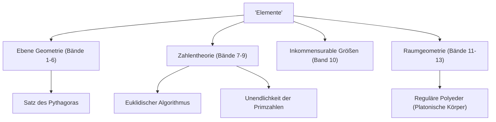

Wenn man über die Geschichte der Mathematik spricht, gibt es einen gigantischen Stern, der nicht ignoriert werden kann. Das ist der antike griechische Mathematiker **[Euklid](https://kenji.blog/de/p/euclid/)**. Auch bekannt als "Vater der Geometrie", war er der Pionier, der die Mathematik als logisches System etablierte. In diesem Artikel werden wir in die Episoden von [Euklid](https://kenji.blog/de/p/euclid/)s Leben, die Inhalte seines historischen Meisterwerks "Elemente" und die wichtigen mathematischen Errungenschaften, die er hinterlassen hat, eintauchen.

## [Euklid](https://kenji.blog/de/p/euclid/)s Leben und Episoden

Über das Leben von [Euklid](https://kenji.blog/de/p/euclid/) (um 300 v. Chr.) gibt es tatsächlich sehr wenige endgültige historische Aufzeichnungen. Wo er geboren wurde und was für ein Leben er führte, lässt sich nur aus fragmentarischen Beschreibungen von Gelehrten späterer Epochen ableiten. Es ist jedoch weithin bekannt, dass er im ägyptischen **Alexandria** aktiv war und während der Herrschaft von Ptolemaios I. eine Mathematikschule leitete.

### "Es gibt keinen Königsweg zur Geometrie"

Eine der berühmtesten Episoden im Zusammenhang mit [Euklid](https://kenji.blog/de/p/euclid/) ist seine Interaktion mit dem ägyptischen König Ptolemaios I.
Der König versuchte, [Euklid](https://kenji.blog/de/p/euclid/)s Buch "Elemente" zu studieren, aber da der Inhalt zu schwierig und langwierig war, fragte er [Euklid](https://kenji.blog/de/p/euclid/):
"Gibt es keinen kürzeren oder einfacheren Weg, um Geometrie zu lernen?"
Darauf soll [Euklid](https://kenji.blog/de/p/euclid/) entschieden geantwortet haben:

> "Mein Herr, es gibt keinen Königsweg zur Geometrie."

Dieser Satz trifft die Wahrheit, dass es beim Lernen keine Abkürzungen oder besonderen Privilegien für Machthaber gibt und dass jeder gleichermaßen stetige Anstrengungen unternehmen muss. Er wurde bis heute an viele Menschen weitergegeben.

## Der größte Bestseller der Geschichte: "Elemente"

[Euklid](https://kenji.blog/de/p/euclid/)s größte und dauerhafteste Errungenschaft ist die Zusammenstellung des Mathematikbuches **"Elemente"**, das aus 13 Bänden besteht. Dieses Buch ist eine Zusammenstellung antiken griechischen mathematischen Wissens und soll nach der Bibel das am meisten veröffentlichte Buch der Welt sein.

Der bahnbrechende Aspekt der "Elemente" ist, dass es einen **axiomatischen Ansatz** etablierte, anstatt nur einzelne Sätze aufzulisten. Die Methode, von wenigen selbstverständlichen Prämissen (Axiomen und Postulaten) auszugehen und alle Sätze ausschließlich durch logische Deduktion zu beweisen, bestimmte den zukünftigen Kurs von Mathematik und Wissenschaft.

### Das Geheimnis des fünften Postulats (Parallelenpostulat)

Im ersten Band der "Elemente" werden fünf Postulate (geometrische Prämissen) aufgeführt. Darunter befand sich das fünfte Postulat (Parallelenpostulat) wie folgt:

"Wenn eine gerade Linie zwei gerade Linien schneidet und dabei auf derselben Seite zwei innere Winkel bildet, deren Summe kleiner ist als zwei rechte Winkel, so schneiden sich die beiden Linien, wenn man sie unendlich verlängert, auf derjenigen Seite, auf der die Winkel liegen, deren Summe kleiner als zwei rechte Winkel ist."

Dieses Postulat war komplexer als die anderen vier, und viele Mathematiker vermuteten: "Ist dies nicht ein Satz, der aus den anderen Postulaten bewiesen werden kann, anstatt ein Postulat selbst?" Versuche, es über Tausende von Jahren hinweg zu beweisen, scheiterten alle. Im 19. Jahrhundert wurde jedoch schließlich die **Nichteuklidische Geometrie** entdeckt, eine Geometrie, in der das fünfte Postulat nicht gilt, was eine Revolution in der mathematischen Welt auslöste. Man kann sagen, dass dieses Ereignis paradoxerweise die Schärfe von [Euklid](https://kenji.blog/de/p/euclid/)s Intuition bewies.

## [Euklid](https://kenji.blog/de/p/euclid/)s große mathematische Errungenschaften

[Euklid](https://kenji.blog/de/p/euclid/) hinterließ nicht nur in der Geometrie, sondern auch im Bereich der Zahlentheorie herausragende Errungenschaften. Hier stellen wir zwei besonders berühmte Errungenschaften vor.

### 1. [Euklid](https://kenji.blog/de/p/euclid/)ischer Algorithmus

Der **[Euklid](https://kenji.blog/de/p/euclid/)ische Algorithmus** ist ein Algorithmus zur effizienten Bestimmung des größten gemeinsamen Teilers (ggT) zweier natürlicher Zahlen. Er wird auch als einer der ältesten Algorithmen in der Geschichte der Menschheit bezeichnet.

Sei der größte gemeinsame Teiler zweier natürlicher Zahlen $a$ und $b$ (wobei $a > b$) $\gcd(a, b)$. Wenn der Quotient bei der Division von $a$ durch $b$ $q$ ist und der Rest $r$ ist, gilt folgende Beziehung:

$$ a = bq + r $$

Zu diesem Zeitpunkt wird folgende Gleichung aufgestellt:

$$ \gcd(a, b) = \gcd(b, r) $$

Durch Wiederholen dieses Vorgangs, bis der Rest $r$ zu $0$ wird, kann der größte gemeinsame Teiler effizient gefunden werden.

### 2. Beweis der Unendlichkeit der Primzahlen

Im 9. Band der "Elemente" bewies [Euklid](https://kenji.blog/de/p/euclid/) durch einen sehr schönen und eleganten Widerspruchsbeweis, dass es unendlich viele Primzahlen gibt.

**Skizze des Beweises:**
Nehmen wir an, es gäbe nur endlich viele Primzahlen, und die Menge aller Primzahlen sei $p_1, p_2, \dots, p_n$.
Betrachten wir nun eine neue Zahl $P$, die wir erhalten, indem wir zum Produkt all dieser Primzahlen $1$ addieren.

$$ P = p_1 p_2 \dots p_n + 1 $$

Da diese Zahl $P$ bei der Division durch eine beliebige existierende Primzahl $p_i$ den Rest $1$ lässt, ist sie nicht teilbar.
Daher ist entweder $P$ selbst eine neue Primzahl, oder sie ist durch eine neue Primzahl teilbar, die wir nicht aufgelistet haben.
In jedem Fall widerspricht dies der ursprünglichen Annahme, dass "es nur endlich viele Primzahlen gibt".
Damit ist bewiesen, dass **Primzahlen unendlich existieren**.

## Fazit: [Euklid](https://kenji.blog/de/p/euclid/)s Vermächtnis

[Euklid](https://kenji.blog/de/p/euclid/)s "Elemente" geht darüber hinaus, nur ein Mathematikbuch zu sein; es hat spätere große Wissenschaftler wie Newton und Einstein als ultimatives Lehrmaterial für die Menschheit zum Erlernen des logischen Denkens stark beeinflusst.

Der von ihm etablierte Stil, "logisch Schlussfolgerungen aus Prämissen abzuleiten", hat über den Rahmen der Mathematik hinaus in Philosophie, Wissenschaft und das Fundament der modernen Informatik tief Fuß gefasst. Wann immer wir logisch über Dinge nachdenken, können wir immer den Atem von [Euklid](https://kenji.blog/de/p/euclid/) spüren.
