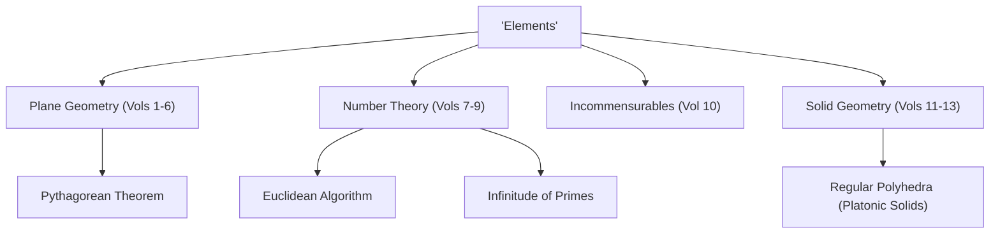

When talking about the history of mathematics, there is a giant star that cannot be ignored. That is the ancient Greek mathematician **[Euclid](https://kenji.blog/en/p/euclid/)**. Also known as the "Father of Geometry", he was the pioneer who established mathematics as a logical system. In this article, we will delve into the episodes of [Euclid](https://kenji.blog/en/p/euclid/)'s life, the contents of his historical masterpiece "Elements", and the important mathematical achievements he left behind.

## [Euclid](https://kenji.blog/en/p/euclid/)'s Life and Episodes

Regarding the life of [Euclid](https://kenji.blog/en/p/euclid/) (around 300 BC), there are actually very few definitive historical records left. Where he was born and what kind of life he led can only be inferred from fragmentary descriptions by scholars in later eras. However, it is widely known that he was active in **Alexandria**, Egypt, and ran a mathematics school during the reign of Ptolemy I.

### "There is no royal road to geometry"

One of the most famous episodes related to [Euclid](https://kenji.blog/en/p/euclid/) is his interaction with the Egyptian King Ptolemy I.
The king tried to study [Euclid](https://kenji.blog/en/p/euclid/)'s book "Elements", but because its content was too difficult and lengthy, he asked [Euclid](https://kenji.blog/en/p/euclid/):
"Is there no shorter or easier path to learning geometry?"
To this, [Euclid](https://kenji.blog/en/p/euclid/) is said to have replied firmly:

> "Sire, there is no royal road to geometry."

This phrase strikes at the truth that there are no shortcuts or special privileges for those in power in learning, and everyone must equally make steady efforts. It has been passed down to many people to this day.

## The Greatest Bestseller in History: "Elements"

[Euclid](https://kenji.blog/en/p/euclid/)'s greatest and most enduring achievement is the compilation of the mathematics book **"Elements"**, consisting of 13 volumes. This book is a compilation of ancient Greek mathematical knowledge and is said to be the most published book in the world after the Bible.

The groundbreaking aspect of "Elements" is that it established an **axiomatic approach**, rather than just listing individual theorems. The method of starting from a few self-evident premises (axioms and postulates) and proving all theorems solely through logical deduction determined the future course of mathematics and science.

### The Mystery of the Fifth Postulate (Parallel Postulate)

In the first volume of "Elements", five postulates (geometrical premises) are listed. Among them, the fifth postulate (parallel postulate) was as follows:

"If a line segment intersects two straight lines forming two interior angles on the same side that sum to less than two right angles, then the two lines, if extended indefinitely, meet on that side on which the angles sum to less than two right angles."

This postulate was more complex than the other four, and many mathematicians suspected, "Isn't this a theorem that can be proven from the other postulates, rather than a postulate itself?" Attempts to prove it spanning thousands of years all ended in failure. However, in the 19th century, **Non-[Euclide](https://kenji.blog/en/p/euclid/)an geometry**, a geometry in which the fifth postulate does not hold, was finally discovered, bringing a revolution to the mathematical world. It can be said that this event paradoxically proved the sharpness of [Euclid](https://kenji.blog/en/p/euclid/)'s intuition.

## [Euclid](https://kenji.blog/en/p/euclid/)'s Great Mathematical Achievements

[Euclid](https://kenji.blog/en/p/euclid/) left outstanding achievements not only in geometry but also in the field of number theory. Here we introduce two particularly famous achievements.

### 1. [Euclide](https://kenji.blog/en/p/euclid/)an Algorithm

The **[Euclide](https://kenji.blog/en/p/euclid/)an algorithm** is an algorithm for efficiently finding the greatest common divisor (GCD) of two natural numbers. It is also called one of the oldest algorithms in human history.

Let the greatest common divisor of two natural numbers $a$ and $b$ (where $a > b$) be $\gcd(a, b)$. If the quotient of dividing $a$ by $b$ is $q$ and the remainder is $r$, the following relationship holds:

$$ a = bq + r $$

At this time, the following equation is established:

$$ \gcd(a, b) = \gcd(b, r) $$

By repeating this process until the remainder $r$ becomes $0$, the greatest common divisor can be efficiently found.

### 2. Proof of the Infinitude of Primes

In the 9th volume of "Elements", [Euclid](https://kenji.blog/en/p/euclid/) proved that there are infinitely many prime numbers using a very beautiful and elegant proof by contradiction.

**Outline of the proof:**
Assume that there are only finitely many prime numbers, and let the set of all prime numbers be $p_1, p_2, \dots, p_n$.
Now, consider a new number $P$ obtained by adding $1$ to the product of all these prime numbers.

$$ P = p_1 p_2 \dots p_n + 1 $$

Since this number $P$ leaves a remainder of $1$ when divided by any existing prime number $p_i$, it is not divisible.
Therefore, either $P$ itself is a new prime number, or it is divisible by a new prime number that we did not list.
In either case, it contradicts the initial assumption that "there are only finitely many prime numbers".
Thus, it is proven that **prime numbers exist infinitely**.

## Conclusion: [Euclid](https://kenji.blog/en/p/euclid/)'s Legacy

[Euclid](https://kenji.blog/en/p/euclid/)'s "Elements" goes beyond being a mere mathematics textbook; it has greatly influenced later great scientists such as Newton and Einstein as the ultimate teaching material for humanity to learn logical thinking.

The style he established of "logically deriving conclusions from premises" has deeply taken root beyond the framework of mathematics, into philosophy, science, and the foundation of modern computer science. Whenever we think logically about things, we can always feel the breath of [Euclid](https://kenji.blog/en/p/euclid/).
