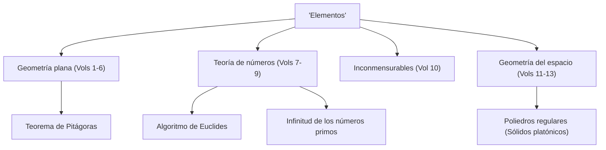

Al hablar de la historia de las matemáticas, hay una estrella gigante que no se puede ignorar. Ese es el antiguo matemático griego **[Euclides](https://kenji.blog/es/p/euclid/)**. También conocido como el "Padre de la Geometría", fue el pionero que estableció las matemáticas como un sistema lógico. En este artículo, profundizaremos en los episodios de la vida de [Euclides](https://kenji.blog/es/p/euclid/), el contenido de su obra maestra histórica "Elementos" y los importantes logros matemáticos que dejó.

## Vida y episodios de [Euclides](https://kenji.blog/es/p/euclid/)

En cuanto a la vida de [Euclides](https://kenji.blog/es/p/euclid/) (alrededor del 300 a. C.), en realidad quedan muy pocos registros históricos definitivos. Dónde nació y qué tipo de vida llevó solo se puede inferir de las descripciones fragmentarias de eruditos en épocas posteriores. Sin embargo, es ampliamente conocido que estuvo activo en **Alejandría**, Egipto, y dirigió una escuela de matemáticas durante el reinado de Ptolomeo I.

### "No hay camino real hacia la geometría"

Uno de los episodios más famosos relacionados con [Euclides](https://kenji.blog/es/p/euclid/) es su interacción con el rey egipcio Ptolomeo I.
El rey trató de estudiar el libro "Elementos" de [Euclides](https://kenji.blog/es/p/euclid/), pero debido a que su contenido era demasiado difícil y largo, le preguntó a [Euclides](https://kenji.blog/es/p/euclid/):
"¿No hay un camino más corto o más fácil para aprender geometría?"
A esto, se dice que [Euclides](https://kenji.blog/es/p/euclid/) respondió con firmeza:

> "Señor, no hay camino real hacia la geometría."

Esta frase señala la verdad de que no hay atajos o privilegios especiales para los que están en el poder en el aprendizaje, y todos deben hacer esfuerzos constantes por igual. Se ha transmitido a muchas personas hasta el día de hoy.

## El mayor éxito de ventas de la historia: "Elementos"

El mayor y más duradero logro de [Euclides](https://kenji.blog/es/p/euclid/) es la compilación del libro de matemáticas **"Elementos"**, que consta de 13 volúmenes. Este libro es una compilación del conocimiento matemático griego antiguo y se dice que es el libro más publicado en el mundo después de la Biblia.

El aspecto innovador de "Elementos" es que estableció un **enfoque axiomático**, en lugar de solo enumerar teoremas individuales. El método de partir de unas pocas premisas evidentes (axiomas y postulados) y probar todos los teoremas únicamente mediante deducción lógica determinó el curso futuro de las matemáticas y la ciencia.

### El misterio del quinto postulado (Postulado de las paralelas)

En el primer volumen de "Elementos", se enumeran cinco postulados (premisas geométricas). Entre ellos, el quinto postulado (postulado de las paralelas) era el siguiente:

"Si una línea recta corta a otras dos formando de un mismo lado ángulos interiores cuya suma es menor que dos rectos, las dos líneas rectas, prolongadas indefinidamente, se cortarán del lado del cual están los ángulos cuya suma es menor que dos rectos."

Este postulado era más complejo que los otros cuatro, y muchos matemáticos sospecharon: "¿No es este un teorema que puede probarse a partir de los otros postulados, en lugar de un postulado en sí mismo?" Los intentos de probarlo a lo largo de miles de años terminaron en fracaso. Sin embargo, en el siglo XIX, finalmente se descubrió la **Geometría no euclidiana**, una geometría en la que el quinto postulado no se cumple, lo que provocó una revolución en el mundo matemático. Se puede decir que este evento paradójicamente probó la agudeza de la intuición de [Euclides](https://kenji.blog/es/p/euclid/).

## Los grandes logros matemáticos de [Euclides](https://kenji.blog/es/p/euclid/)

[Euclides](https://kenji.blog/es/p/euclid/) dejó logros sobresalientes no solo en geometría sino también en el campo de la teoría de números. Aquí presentamos dos logros particularmente famosos.

### 1. Algoritmo de [Euclides](https://kenji.blog/es/p/euclid/)

El **Algoritmo de [Euclides](https://kenji.blog/es/p/euclid/)** es un algoritmo para encontrar eficientemente el máximo común divisor (MCD) de dos números naturales. También se le llama uno de los algoritmos más antiguos en la historia de la humanidad.

Sea el máximo común divisor de dos números naturales $a$ y $b$ (donde $a > b$) $\gcd(a, b)$. Si el cociente de dividir $a$ por $b$ es $q$ y el resto es $r$, se cumple la siguiente relación:

$$ a = bq + r $$

En este momento, se establece la siguiente ecuación:

$$ \gcd(a, b) = \gcd(b, r) $$

Al repetir este proceso hasta que el resto $r$ se convierta en $0$, se puede encontrar eficientemente el máximo común divisor.

### 2. Demostración de la infinitud de los números primos

En el noveno volumen de "Elementos", [Euclides](https://kenji.blog/es/p/euclid/) probó que hay un número infinito de números primos usando una prueba por contradicción muy hermosa y elegante.

**Resumen de la demostración:**
Suponga que solo hay un número finito de números primos, y sea el conjunto de todos los números primos $p_1, p_2, \dots, p_n$.
Ahora, considere un nuevo número $P$ obtenido al sumar $1$ al producto de todos estos números primos.

$$ P = p_1 p_2 \dots p_n + 1 $$

Dado que este número $P$ deja un resto de $1$ cuando se divide por cualquier número primo existente $p_i$, no es divisible.
Por lo tanto, o $P$ es en sí mismo un nuevo número primo, o es divisible por un nuevo número primo que no enumeramos.
En cualquier caso, contradice la suposición inicial de que "solo hay un número finito de números primos".
Por lo tanto, está probado que **los números primos existen infinitamente**.

## Conclusión: El legado de [Euclides](https://kenji.blog/es/p/euclid/)

Los "Elementos" de [Euclides](https://kenji.blog/es/p/euclid/) van más allá de ser un mero libro de texto de matemáticas; ha influido enormemente en grandes científicos posteriores como Newton y Einstein como el material didáctico definitivo para que la humanidad aprenda el pensamiento lógico.

El estilo que estableció de "derivar lógicamente conclusiones a partir de premisas" ha echado raíces profundamente más allá del marco de las matemáticas, en la filosofía, la ciencia y la base de la informática moderna. Siempre que pensamos lógicamente sobre las cosas, siempre podemos sentir el aliento de [Euclides](https://kenji.blog/es/p/euclid/).
