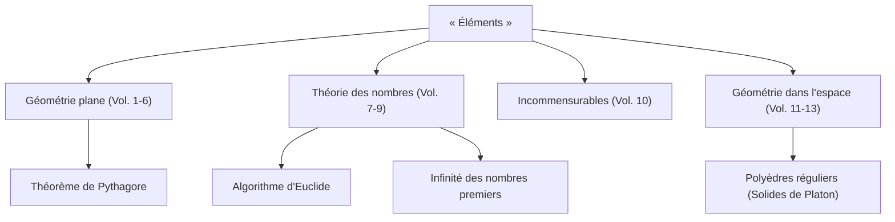

Lorsque l'on parle de l'histoire des mathématiques, il y a une étoile géante que l'on ne peut ignorer. Il s'agit de l'ancien mathématicien grec **Euclide**. Également connu sous le nom de « Père de la géométrie », il fut le pionnier qui établit les mathématiques comme un système logique. Dans cet article, nous plongerons dans les épisodes de la vie d'Euclide, le contenu de son chef-d'œuvre historique « Éléments », et les importantes réalisations mathématiques qu'il a laissées derrière lui.

## La vie et les épisodes d'Euclide

En ce qui concerne la vie d'Euclide (vers 300 av. J.-C.), il reste en fait très peu de documents historiques définitifs. Le lieu de sa naissance et le type de vie qu'il a mené ne peuvent être déduits que des descriptions fragmentaires des érudits des époques ultérieures. Cependant, il est largement connu qu'il fut actif à **Alexandrie**, en Égypte, et qu'il dirigea une école de mathématiques sous le règne de Ptolémée Ier.

### « Il n'y a pas de voie royale en géométrie »

L'un des épisodes les plus célèbres liés à Euclide est son interaction avec le roi égyptien Ptolémée Ier.
Le roi essaya d'étudier le livre « Éléments » d'Euclide, mais parce que son contenu était trop difficile et long, il demanda à Euclide :
« N'y a-t-il pas un chemin plus court ou plus facile pour apprendre la géométrie ? »
À cela, on dit qu'Euclide aurait répondu fermement :

> « Sire, il n'y a pas de voie royale en géométrie. »

Cette phrase touche à la vérité qu'il n'y a pas de raccourcis ou de privilèges spéciaux pour ceux qui sont au pouvoir dans l'apprentissage, et que chacun doit faire des efforts constants de manière égale. Elle a été transmise à de nombreuses personnes jusqu'à ce jour.

## Le plus grand best-seller de l'histoire : « Éléments »

L'accomplissement le plus grand et le plus durable d'Euclide est la compilation du livre de mathématiques **« Éléments »**, composé de 13 volumes. Ce livre est une compilation des connaissances mathématiques de la Grèce antique et est considéré comme le livre le plus publié au monde après la Bible.

L'aspect révolutionnaire des « Éléments » est qu'il a établi une **approche axiomatique**, plutôt que de simplement énumérer des théorèmes individuels. La méthode consistant à partir de quelques prémisses évidentes (axiomes et postulats) et à prouver tous les théorèmes uniquement par déduction logique a déterminé le cours futur des mathématiques et de la science.

### Le mystère du cinquième postulat (Postulat des parallèles)

Dans le premier volume des « Éléments », cinq postulats (prémisses géométriques) sont énumérés. Parmi eux, le cinquième postulat (postulat des parallèles) était le suivant :

« Si une droite tombant sur deux droites fait les angles intérieurs du même côté plus petits que deux droits, les deux droites, prolongées à l'infini, se rencontreront du côté où les angles sont plus petits que deux droits. »

Ce postulat était plus complexe que les quatre autres, et de nombreux mathématiciens ont soupçonné : « N'est-ce pas un théorème qui peut être prouvé à partir des autres postulats, plutôt qu'un postulat en soi ? » Les tentatives pour le prouver s'étalant sur des milliers d'années se sont toutes soldées par un échec. Cependant, au XIXe siècle, la **Géométrie non euclidienne**, une géométrie dans laquelle le cinquième postulat ne tient pas, a finalement été découverte, apportant une révolution dans le monde mathématique. On peut dire que cet événement a paradoxalement prouvé la finesse de l'intuition d'Euclide.

## Les grandes réalisations mathématiques d'Euclide

Euclide a laissé des réalisations exceptionnelles non seulement en géométrie mais aussi dans le domaine de la théorie des nombres. Nous présentons ici deux réalisations particulièrement célèbres.

### 1. Algorithme d'Euclide

L'**Algorithme d'Euclide** est un algorithme permettant de trouver efficacement le plus grand commun diviseur (PGCD) de deux nombres entiers naturels. Il est également qualifié de l'un des plus anciens algorithmes de l'histoire humaine.

Soit le plus grand commun diviseur de deux nombres entiers naturels $a$ et $b$ (où $a > b$) noté $\gcd(a, b)$. Si le quotient de la division de $a$ par $b$ est $q$ et le reste est $r$, la relation suivante s'applique :

$$ a = bq + r $$

À ce moment, l'équation suivante est établie :

$$ \gcd(a, b) = \gcd(b, r) $$

En répétant ce processus jusqu'à ce que le reste $r$ devienne $0$, le plus grand commun diviseur peut être trouvé efficacement.

### 2. Preuve de l'infinité des nombres premiers

Dans le 9ème volume des « Éléments », Euclide a prouvé qu'il existe une infinité de nombres premiers en utilisant une preuve par l'absurde très belle et élégante.

**Résumé de la preuve :**
Supposons qu'il n'y ait qu'un nombre fini de nombres premiers, et que l'ensemble de tous les nombres premiers soit $p_1, p_2, \dots, p_n$.
Maintenant, considérez un nouveau nombre $P$ obtenu en ajoutant $1$ au produit de tous ces nombres premiers.

$$ P = p_1 p_2 \dots p_n + 1 $$

Étant donné que ce nombre $P$ laisse un reste de $1$ lorsqu'il est divisé par n'importe quel nombre premier existant $p_i$, il n'est pas divisible.
Par conséquent, soit $P$ est lui-même un nouveau nombre premier, soit il est divisible par un nouveau nombre premier que nous n'avons pas répertorié.
Dans les deux cas, cela contredit l'hypothèse initiale selon laquelle « il n'y a qu'un nombre fini de nombres premiers ».
Ainsi, il est prouvé que **les nombres premiers existent en nombre infini**.

## Conclusion : L'héritage d'Euclide

Les « Éléments » d'Euclide vont au-delà d'un simple manuel de mathématiques ; ils ont grandement influencé plus tard de grands scientifiques tels que Newton et Einstein en tant que matériel pédagogique ultime pour que l'humanité apprenne la pensée logique.

Le style qu'il a établi de « déduire logiquement des conclusions à partir de prémisses » s'est profondément enraciné au-delà du cadre des mathématiques, dans la philosophie, la science et le fondement de l'informatique moderne. Chaque fois que nous pensons logiquement aux choses, nous pouvons toujours sentir le souffle d'Euclide.
