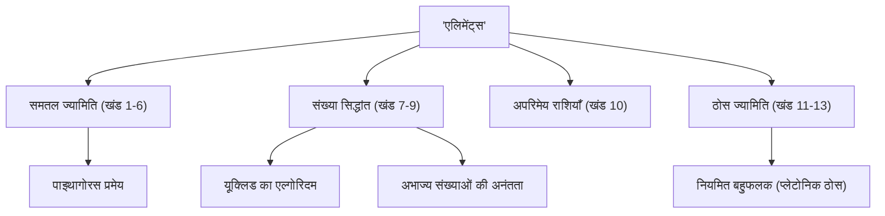

जब गणित के इतिहास की बात आती है, तो एक विशाल सितारा है जिसे अनदेखा नहीं किया जा सकता है। वह हैं प्राचीन यूनानी गणितज्ञ **[यूक्लिड](https://kenji.blog/hi/p/euclid/)**। "ज्यामिति के जनक" के रूप में भी जाने जाने वाले, वह ऐसे अग्रणी थे जिन्होंने गणित को एक तार्किक प्रणाली के रूप में स्थापित किया। इस लेख में, हम [यूक्लिड](https://kenji.blog/hi/p/euclid/) के जीवन के प्रसंगों, उनकी ऐतिहासिक उत्कृष्ट कृति "एलिमेंट्स" की सामग्री, और उनके द्वारा छोड़ी गई महत्वपूर्ण गणितीय उपलब्धियों के बारे में गहराई से जानेंगे।

## [यूक्लिड](https://kenji.blog/hi/p/euclid/) का जीवन और प्रसंग

[यूक्लिड](https://kenji.blog/hi/p/euclid/) के जीवन (लगभग 300 ईसा पूर्व) के बारे में, वास्तव में बहुत कम निश्चित ऐतिहासिक रिकॉर्ड बचे हैं। उनका जन्म कहाँ हुआ था और उन्होंने किस तरह का जीवन व्यतीत किया, इसका अनुमान केवल बाद के युगों के विद्वानों द्वारा दिए गए खंडित विवरणों से ही लगाया जा सकता है। हालाँकि, यह सर्वविदित है कि वे मिस्र के **अलेक्जेंड्रिया** में सक्रिय थे, और टॉलेमी प्रथम के शासनकाल के दौरान एक गणित स्कूल चलाते थे।

### "ज्यामिति के लिए कोई शाही रास्ता नहीं है"

[यूक्लिड](https://kenji.blog/hi/p/euclid/) से संबंधित सबसे प्रसिद्ध प्रसंगों में से एक मिस्र के राजा टॉलेमी प्रथम के साथ उनकी बातचीत है।
राजा ने [यूक्लिड](https://kenji.blog/hi/p/euclid/) की पुस्तक "एलिमेंट्स" का अध्ययन करने का प्रयास किया, लेकिन क्योंकि इसकी सामग्री बहुत कठिन और लंबी थी, उन्होंने [यूक्लिड](https://kenji.blog/hi/p/euclid/) से पूछा:
"क्या ज्यामिति सीखने का कोई छोटा या आसान रास्ता नहीं है?"
इस पर, [यूक्लिड](https://kenji.blog/hi/p/euclid/) ने दृढ़ता से उत्तर दिया था:

> "महाराज, ज्यामिति के लिए कोई शाही रास्ता नहीं है।"

यह वाक्यांश इस सच्चाई पर प्रहार करता है कि सीखने में सत्ता में बैठे लोगों के लिए कोई शॉर्टकट या विशेष विशेषाधिकार नहीं हैं, और सभी को समान रूप से निरंतर प्रयास करने चाहिए। यह आज तक कई लोगों को पारित किया गया है।

## इतिहास की सबसे बड़ी बेस्टसेलर: "एलिमेंट्स"

[यूक्लिड](https://kenji.blog/hi/p/euclid/) की सबसे बड़ी और सबसे स्थायी उपलब्धि 13 खंडों वाली गणित की पुस्तक **"एलिमेंट्स"** का संकलन है। यह पुस्तक प्राचीन यूनानी गणितीय ज्ञान का संकलन है और कहा जाता है कि बाइबिल के बाद दुनिया में सबसे अधिक प्रकाशित पुस्तक है।

"एलिमेंट्स" का अभूतपूर्व पहलू यह है कि इसने केवल अलग-अलग प्रमेयों को सूचीबद्ध करने के बजाय एक **स्वयंसिद्ध दृष्टिकोण** स्थापित किया। कुछ स्वयंसिद्ध परिसरों (स्वयंसिद्धों और अभिधारणाओं) से शुरू करने और सभी प्रमेयों को पूरी तरह से तार्किक कटौती के माध्यम से सिद्ध करने की विधि ने गणित और विज्ञान का भविष्य का पाठ्यक्रम निर्धारित किया।

### पाँचवीं अभिधारणा (समानांतर अभिधारणा) का रहस्य

"एलिमेंट्स" के पहले खंड में, पाँच अभिधारणाएँ (ज्यामितीय परिसर) सूचीबद्ध हैं। उनमें से, पाँचवीं अभिधारणा (समानांतर अभिधारणा) इस प्रकार थी:

"यदि कोई सीधी रेखा दो सीधी रेखाओं को काटते हुए एक ही तरफ दो आंतरिक कोण बनाती है जिनका योग दो समकोणों से कम है, तो दो रेखाएं, यदि अनिश्चित काल तक बढ़ाई जाती हैं, तो उस तरफ मिलती हैं जिस तरफ कोणों का योग दो समकोणों से कम होता है।"

यह अभिधारणा अन्य चार की तुलना में अधिक जटिल थी, और कई गणितज्ञों को संदेह था, "क्या यह एक प्रमेय नहीं है जिसे अन्य अभिधारणाओं से सिद्ध किया जा सकता है, बजाय इसके कि यह अपने आप में एक अभिधारणा हो?" हजारों वर्षों तक इसे सिद्ध करने के प्रयास विफल रहे। हालाँकि, 19वीं शताब्दी में, **गैर-[यूक्लिड](https://kenji.blog/hi/p/euclid/)ियन ज्यामिति**, एक ज्यामिति जिसमें पाँचवीं अभिधारणा लागू नहीं होती है, अंततः खोजी गई, जिससे गणितीय दुनिया में एक क्रांति आ गई। यह कहा जा सकता है कि इस घटना ने विरोधाभासी रूप से [यूक्लिड](https://kenji.blog/hi/p/euclid/) के अंतर्ज्ञान की तीक्ष्णता को सिद्ध किया।

## [यूक्लिड](https://kenji.blog/hi/p/euclid/) की महान गणितीय उपलब्धियाँ

[यूक्लिड](https://kenji.blog/hi/p/euclid/) ने न केवल ज्यामिति में बल्कि संख्या सिद्धांत के क्षेत्र में भी उत्कृष्ट उपलब्धियाँ छोड़ीं। यहाँ हम दो विशेष रूप से प्रसिद्ध उपलब्धियाँ प्रस्तुत करते हैं।

### 1. [यूक्लिड](https://kenji.blog/hi/p/euclid/) का एल्गोरिदम

**[यूक्लिड](https://kenji.blog/hi/p/euclid/) का एल्गोरिदम** दो प्राकृतिक संख्याओं का महत्तम समापवर्तक (GCD) कुशलतापूर्वक खोजने के लिए एक एल्गोरिदम है। इसे मानव इतिहास के सबसे पुराने एल्गोरिदम में से एक भी कहा जाता है।

मान लें कि दो प्राकृतिक संख्याओं $a$ और $b$ (जहाँ $a > b$) का महत्तम समापवर्तक $\gcd(a, b)$ है। यदि $a$ को $b$ से विभाजित करने पर भागफल $q$ है और शेषफल $r$ है, तो निम्नलिखित संबंध लागू होता है:

$$ a = bq + r $$

इस समय, निम्नलिखित समीकरण स्थापित होता है:

$$ \gcd(a, b) = \gcd(b, r) $$

इस प्रक्रिया को तब तक दोहराकर जब तक कि शेषफल $r$, $0$ न हो जाए, महत्तम समापवर्तक कुशलतापूर्वक पाया जा सकता है।

### 2. अभाज्य संख्याओं की अनंतता का प्रमाण

"एलिमेंट्स" के 9वें खंड में, [यूक्लिड](https://kenji.blog/hi/p/euclid/) ने विरोधाभास द्वारा बहुत ही सुंदर और सुरुचिपूर्ण प्रमाण का उपयोग करके सिद्ध किया कि अनंत संख्या में अभाज्य संख्याएँ हैं।

**प्रमाण की रूपरेखा:**
मान लें कि अभाज्य संख्याएँ केवल परिमित संख्या में हैं, और सभी अभाज्य संख्याओं का समुच्चय $p_1, p_2, \dots, p_n$ है।
अब, एक नई संख्या $P$ पर विचार करें जो इन सभी अभाज्य संख्याओं के गुणनफल में $1$ जोड़कर प्राप्त की गई है।

$$ P = p_1 p_2 \dots p_n + 1 $$

चूँकि यह संख्या $P$ किसी भी मौजूदा अभाज्य संख्या $p_i$ से विभाजित होने पर $1$ शेष छोड़ती है, इसलिए यह विभाज्य नहीं है।
इसलिए, या तो $P$ स्वयं एक नई अभाज्य संख्या है, या यह एक नई अभाज्य संख्या से विभाज्य है जिसे हमने सूचीबद्ध नहीं किया है।
दोनों ही मामलों में, यह प्रारंभिक धारणा का खंडन करता है कि "केवल परिमित संख्या में अभाज्य संख्याएँ हैं"।
इस प्रकार, यह सिद्ध होता है कि **अभाज्य संख्याएँ अनंत रूप से मौजूद हैं**।

## निष्कर्ष: [यूक्लिड](https://kenji.blog/hi/p/euclid/) की विरासत

[यूक्लिड](https://kenji.blog/hi/p/euclid/) की "एलिमेंट्स" एक मात्र गणित की पाठ्यपुस्तक होने से कहीं आगे जाती है; इसने मानवता को तार्किक सोच सीखने के लिए अंतिम शिक्षण सामग्री के रूप में न्यूटन और आइंस्टीन जैसे महान वैज्ञानिकों को बहुत प्रभावित किया है।

"परिसर से तार्किक रूप से निष्कर्ष निकालने" की उन्होंने जो शैली स्थापित की, वह गणित के ढांचे से परे, दर्शन, विज्ञान और आधुनिक कंप्यूटर विज्ञान की नींव में गहराई से जड़ें जमा चुकी है। जब भी हम चीजों के बारे में तार्किक रूप से सोचते हैं, तो हम हमेशा [यूक्लिड](https://kenji.blog/hi/p/euclid/) की सांस को महसूस कर सकते हैं।
