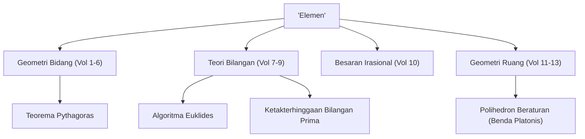

Saat berbicara tentang sejarah matematika, ada bintang raksasa yang tidak bisa diabaikan. Itu adalah matematikawan Yunani kuno **[Euklides](https://kenji.blog/id/p/euclid/)**. Juga dikenal sebagai "Bapak Geometri", ia adalah pelopor yang menetapkan matematika sebagai sistem logis. Dalam artikel ini, kita akan menggali episode kehidupan [Euklides](https://kenji.blog/id/p/euclid/), isi mahakarya sejarahnya "Elemen", dan pencapaian matematika penting yang ia tinggalkan.

## Kehidupan dan Episode [Euklides](https://kenji.blog/id/p/euclid/)

Mengenai kehidupan [Euklides](https://kenji.blog/id/p/euclid/) (sekitar 300 SM), sebenarnya hanya ada sedikit catatan sejarah definitif yang tersisa. Di mana ia dilahirkan dan kehidupan seperti apa yang ia jalani hanya dapat disimpulkan dari deskripsi terpisah-pisah oleh para sarjana di era selanjutnya. Namun, secara luas diketahui bahwa ia aktif di **Aleksandria**, Mesir, dan menjalankan sekolah matematika pada masa pemerintahan Ptolemeus I.

### "Tidak ada jalan kerajaan menuju geometri"

Salah satu episode paling terkenal yang terkait dengan [Euklides](https://kenji.blog/id/p/euclid/) adalah interaksinya dengan Raja Mesir Ptolemeus I.
Raja mencoba mempelajari buku [Euklides](https://kenji.blog/id/p/euclid/) "Elemen", tetapi karena isinya terlalu sulit dan panjang, ia bertanya kepada [Euklides](https://kenji.blog/id/p/euclid/):
"Apakah tidak ada jalan yang lebih pendek atau lebih mudah untuk mempelajari geometri?"
Untuk ini, [Euklides](https://kenji.blog/id/p/euclid/) dikatakan menjawab dengan tegas:

> "Baginda, tidak ada jalan kerajaan menuju geometri."

Frasa ini menyerang kebenaran bahwa tidak ada jalan pintas atau hak istimewa khusus bagi mereka yang berkuasa dalam belajar, dan setiap orang harus melakukan upaya yang gigih secara setara. Ini telah diwariskan kepada banyak orang hingga hari ini.

## Buku Terlaris Terbesar Sepanjang Sejarah: "Elemen"

Pencapaian [Euklides](https://kenji.blog/id/p/euclid/) yang paling besar dan bertahan lama adalah kompilasi buku matematika **"Elemen"**, yang terdiri dari 13 volume. Buku ini adalah kompilasi dari pengetahuan matematika Yunani kuno dan dikatakan sebagai buku yang paling banyak diterbitkan di dunia setelah Alkitab.

Aspek inovatif dari "Elemen" adalah ia menetapkan **pendekatan aksiomatik**, alih-alih hanya mendaftar teorema individu. Metode memulai dari beberapa premis yang terbukti dengan sendirinya (aksioma dan postulat) dan membuktikan semua teorema hanya melalui deduksi logis menentukan arah masa depan matematika dan sains.

### Misteri Postulat Kelima (Postulat Sejajar)

Dalam volume pertama "Elemen", lima postulat (premis geometris) didaftarkan. Di antara mereka, postulat kelima (postulat sejajar) adalah sebagai berikut:

"Jika sebuah garis lurus memotong dua garis lurus membentuk dua sudut dalam di sisi yang sama yang jumlahnya kurang dari dua sudut siku-siku, maka kedua garis tersebut, jika diperpanjang tanpa batas, bertemu di sisi tempat sudut-sudut tersebut dijumlahkan kurang dari dua sudut siku-siku."

Postulat ini lebih kompleks daripada keempat lainnya, dan banyak matematikawan mencurigai, "Bukankah ini teorema yang dapat dibuktikan dari postulat lain, daripada sebuah postulat itu sendiri?" Upaya untuk membuktikannya selama ribuan tahun semuanya berakhir dengan kegagalan. Namun, pada abad ke-19, **Geometri non-[Euklides](https://kenji.blog/id/p/euclid/)**, sebuah geometri di mana postulat kelima tidak berlaku, akhirnya ditemukan, membawa revolusi ke dunia matematika. Dapat dikatakan bahwa peristiwa ini secara paradoks membuktikan ketajaman intuisi [Euklides](https://kenji.blog/id/p/euclid/).

## Pencapaian Matematika Besar [Euklides](https://kenji.blog/id/p/euclid/)

[Euklides](https://kenji.blog/id/p/euclid/) meninggalkan pencapaian luar biasa tidak hanya dalam geometri tetapi juga dalam bidang teori bilangan. Di sini kami memperkenalkan dua pencapaian yang sangat terkenal.

### 1. Algoritma [Euklides](https://kenji.blog/id/p/euclid/)

**Algoritma [Euklides](https://kenji.blog/id/p/euclid/)** adalah sebuah algoritma untuk secara efisien menemukan faktor persekutuan terbesar (FPB) dari dua bilangan asli. Ia juga disebut salah satu algoritma tertua dalam sejarah manusia.

Misalkan faktor persekutuan terbesar dari dua bilangan asli $a$ dan $b$ (di mana $a > b$) adalah $\gcd(a, b)$. Jika hasil bagi dari membagi $a$ dengan $b$ adalah $q$ dan sisanya adalah $r$, hubungan berikut berlaku:

$$ a = bq + r $$

Pada saat ini, persamaan berikut ditetapkan:

$$ \gcd(a, b) = \gcd(b, r) $$

Dengan mengulangi proses ini sampai sisa $r$ menjadi $0$, faktor persekutuan terbesar dapat ditemukan secara efisien.

### 2. Bukti Ketakterhinggaan Bilangan Prima

Dalam volume ke-9 "Elemen", [Euklides](https://kenji.blog/id/p/euclid/) membuktikan bahwa ada bilangan prima yang jumlahnya tak terhingga dengan menggunakan bukti kontradiksi yang sangat indah dan elegan.

**Garis besar pembuktian:**
Asumsikan bahwa hanya ada bilangan prima yang jumlahnya berhingga, dan misalkan himpunan semua bilangan prima adalah $p_1, p_2, \dots, p_n$.
Sekarang, pertimbangkan angka baru $P$ yang diperoleh dengan menambahkan $1$ ke produk dari semua bilangan prima ini.

$$ P = p_1 p_2 \dots p_n + 1 $$

Karena angka $P$ ini menyisakan $1$ ketika dibagi dengan bilangan prima yang ada $p_i$, ia tidak habis dibagi.
Oleh karena itu, baik $P$ itu sendiri adalah bilangan prima baru, atau ia habis dibagi oleh bilangan prima baru yang tidak kita daftarkan.
Dalam kedua kasus tersebut, hal itu bertentangan dengan asumsi awal bahwa "hanya ada bilangan prima yang jumlahnya berhingga".
Jadi, terbukti bahwa **bilangan prima ada tanpa batas**.

## Kesimpulan: Warisan [Euklides](https://kenji.blog/id/p/euclid/)

"Elemen" [Euklides](https://kenji.blog/id/p/euclid/) melampaui sekadar buku teks matematika; itu telah sangat memengaruhi ilmuwan besar kemudian seperti Newton dan Einstein sebagai bahan pengajaran pamungkas bagi umat manusia untuk mempelajari pemikiran logis.

Gaya yang ia tetapkan untuk "secara logis menurunkan kesimpulan dari premis" telah berakar kuat di luar kerangka matematika, ke dalam filsafat, sains, dan fondasi ilmu komputer modern. Setiap kali kita berpikir secara logis tentang berbagai hal, kita selalu dapat merasakan napas [Euklides](https://kenji.blog/id/p/euclid/).
