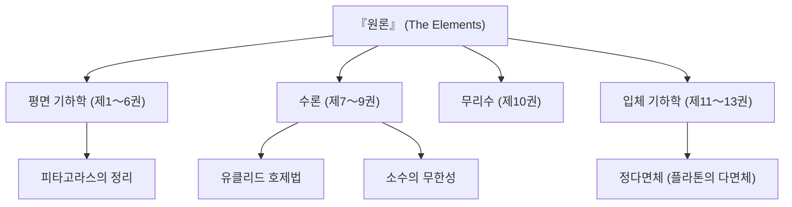

수학의 역사를 이야기할 때 결코 빼놓을 수 없는 거성이 있습니다. 바로 고대 그리스의 수학자 **[유클리드](https://kenji.blog/p/euclid/)** (에우클레이데스)입니다. "기하학의 아버지"라고도 불리는 그는 수학이라는 학문을 논리적인 체계로 확립한 선구자입니다. 본 기사에서는 [유클리드](https://kenji.blog/p/euclid/)의 생애와 에피소드, 역사적 걸작인 『원론』의 내용, 그리고 그가 남긴 중요한 수학적 업적에 대해 깊이 파헤쳐 보겠습니다.

## [유클리드](https://kenji.blog/p/euclid/)의 생애와 에피소드

[유클리드](https://kenji.blog/p/euclid/)(기원전 300년경)의 생애에 대해서는 사실 확실한 사료가 거의 남아 있지 않습니다. 그가 어디서 태어났고 어떤 삶을 살았는지는 후대 학자들의 단편적인 기록을 통해 추측할 수밖에 없습니다. 하지만 그가 이집트의 **알렉산드리아** 에서 활동했고, 프톨레마이오스 1세 시대에 수학 학교를 세웠다는 사실은 널리 알려져 있습니다.

### "기하학에는 왕도가 없다"

[유클리드](https://kenji.blog/p/euclid/)와 관련된 가장 유명한 에피소드 중 하나는 이집트 왕 프톨레마이오스 1세와의 대화입니다.
왕은 [유클리드](https://kenji.blog/p/euclid/)의 저서 『원론』을 배우려 했지만, 그 내용이 너무나 난해하고 방대했기 때문에 [유클리드](https://kenji.blog/p/euclid/)에게 이렇게 물었습니다.
"기하학을 배우는 데 좀 더 쉽고 빠른 길은 없는가?"
이에 대해 [유클리드](https://kenji.blog/p/euclid/)는 단호하게 이렇게 대답했다고 전해집니다.

> "폐하, 기하학에는 왕도가 없습니다 (There is no royal road to geometry)"

이 말은 학문에는 지름길이나 특별한 권력에 의한 특혜가 없으며, 누구나 똑같이 꾸준히 노력해야 한다는 진리를 꿰뚫고 있어, 현대에 이르기까지 많은 사람들에게 회자되고 있습니다.

## 사상 최대의 베스트셀러 『원론』

[유클리드](https://kenji.blog/p/euclid/)의 가장 크고 위대한 업적은 총 13권으로 구성된 수학서 **『원론』** (Elements)의 편찬입니다. 이 책은 고대 그리스의 수학적 지식을 집대성한 것으로, 성경 다음으로 세계에서 가장 많이 출판된 책으로도 알려져 있습니다.

『원론』의 획기적인 점은 개별 정리들을 나열하는 데 그치지 않고, **공리적 접근** 을 확립했다는 것입니다. 소수의 자명한 전제(공리와 공준)에서 출발하여 논리적인 연역만으로 모든 정리를 증명해 나가는 이 방식은 이후의 수학과 과학의 방향을 결정지었습니다.

### 제5공준(평행선 공준)의 수수께끼

『원론』의 제1권에는 5개의 공준(기하학적 전제)이 제시되어 있습니다. 그중 제5공준(평행선 공준)은 다음과 같은 내용이었습니다.

"한 직선이 두 직선과 만날 때, 같은 쪽에 있는 내각의 합이 두 직각보다 작으면, 이 두 직선을 무한히 연장할 때 내각의 합이 두 직각보다 작은 쪽에서 만난다."

이 공준은 다른 4개에 비해 복잡하여, "이것은 공준이 아니라 다른 공준들로부터 증명할 수 있는 정리가 아닐까?" 하고 많은 수학자들이 의심했습니다. 수천 년에 걸친 증명 시도는 모두 실패로 돌아갔지만, 19세기에 이르러 마침내 "제5공준이 성립하지 않는 기하학"인 **비[유클리드](https://kenji.blog/p/euclid/) 기하학** 이 발견되며 수학계에 혁명을 가져왔습니다. [유클리드](https://kenji.blog/p/euclid/)의 직관의 예리함이 역설적으로 증명된 사건이라고 할 수 있습니다.

## [유클리드](https://kenji.blog/p/euclid/)의 위대한 수학적 업적

[유클리드](https://kenji.blog/p/euclid/)는 기하학뿐만 아니라 수론 분야에서도 탁월한 업적을 남겼습니다. 여기서는 특히 유명한 두 가지 업적을 소개합니다.

### 1. [유클리드 호제법](https://kenji.blog/p/euclidean-algorithm/)

**[유클리드 호제법](https://kenji.blog/p/euclidean-algorithm/)** ([Euclide](https://kenji.blog/p/euclid/)an algorithm)은 두 자연수의 최대공약수(GCD)를 효율적으로 구하는 알고리즘입니다. 이는 인류 역사상 가장 오래된 알고리즘 중 하나로도 불립니다.

두 자연수 $a, b$ (단, $a > b$)의 최대공약수를 $\gcd(a, b)$라고 합시다. $a$를 $b$로 나눈 몫을 $q$, 나머지를 $r$이라고 하면 다음과 같은 관계가 성립합니다.

$$ a = bq + r $$

이때 다음 방정식이 성립합니다.

$$ \gcd(a, b) = \gcd(b, r) $$

이 과정을 나머지 $r$이 $0$이 될 때까지 반복함으로써 효율적으로 최대공약수를 구할 수 있습니다.

### 2. 소수가 무한히 존재한다는 증명

[유클리드](https://kenji.blog/p/euclid/)는 『원론』 제9권에서 소수가 무한히 존재한다는 사실을 매우 아름답고 우아한 귀류법을 사용하여 증명했습니다.

**증명의 개요:**
소수가 유한개밖에 없다고 가정하고, 모든 소수의 집합을 $p_1, p_2, \dots, p_n$이라고 합니다.
이제 이 모든 소수들의 곱에 $1$을 더한 새로운 수 $P$를 생각합니다.

$$ P = p_1 p_2 \dots p_n + 1 $$

이 수 $P$는 기존의 어떤 소수 $p_i$로 나누어도 $1$이 남으므로 나누어떨어지지 않습니다.
따라서 $P$ 자체가 새로운 소수이거나, 우리가 목록에 넣지 않은 새로운 소수로 나누어떨어진다는 뜻입니다.
어느 쪽이든 처음의 "소수는 유한개밖에 없다"는 가정과 모순됩니다.
그러므로 **소수는 무한히 존재한다** 는 것이 증명됩니다.

## 요약: [유클리드](https://kenji.blog/p/euclid/)가 남긴 것

[유클리드](https://kenji.blog/p/euclid/)의 『원론』은 단순한 수학 교과서에 머물지 않고, 인류가 논리적 사고를 배우기 위한 최고의 교재로서 뉴턴이나 아인슈타인과 같은 후대의 위대한 과학자들에게도 지대한 영향을 미쳤습니다.

"전제에서 논리적으로 결론을 도출한다"는 그가 확립한 스타일은 수학이라는 틀을 넘어 철학, 과학, 그리고 현대 컴퓨터 과학의 기반에까지 깊이 뿌리내리고 있습니다. 우리가 논리적으로 사물을 생각할 때, 그곳에는 항상 [유클리드](https://kenji.blog/p/euclid/)의 숨결이 느껴집니다.
