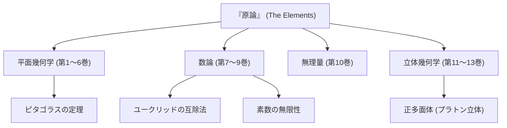

数学の歴史を語る上で、決して避けて通れない巨星がいます。それが古代ギリシャの数学者 **[ユークリッド](https://kenji.blog/p/euclid/)** （エウクレイデス）です。「幾何学の父」とも称される彼は、数学という学問を論理的な体系として確立した第一人者です。本記事では、[ユークリッド](https://kenji.blog/p/euclid/)の生涯のエピソード、歴史的傑作である『原論』の内容、そして彼が残した重要な数学的業績について深掘りしていきます。

## [ユークリッド](https://kenji.blog/p/euclid/)の生涯とエピソード

[ユークリッド](https://kenji.blog/p/euclid/)（紀元前300年頃）の生涯については、実は確たる史料がほとんど残っていません。彼がどこで生まれ、どのような人生を送ったのかは、後の時代の学者たちによる断片的な記述から推測するしかありません。しかし、彼がエジプトの **アレクサンドリア** で活動し、プトレマイオス1世の時代に数学の学校を開いていたことは広く知られています。

### 「幾何学に王道なし」

[ユークリッド](https://kenji.blog/p/euclid/)にまつわる最も有名なエピソードの一つが、エジプト王プトレマイオス1世とのやり取りです。
王は[ユークリッド](https://kenji.blog/p/euclid/)の著書『原論』を学ぼうとしましたが、その内容があまりにも難解で長大であったため、[ユークリッド](https://kenji.blog/p/euclid/)にこう尋ねました。
「幾何学を学ぶのに、もっと簡単で手っ取り早い道はないのか？」
これに対し、[ユークリッド](https://kenji.blog/p/euclid/)は毅然としてこう答えたと伝えられています。

> 「王よ、幾何学に王道なし（There is no royal road to geometry）」

この言葉は、学問には近道や特別な権力による優遇はなく、誰もが等しく地道な努力を重ねなければならないという真理を突いており、現代に至るまで多くの人々に語り継がれています。

## 史上最大のベストセラー『原論』

[ユークリッド](https://kenji.blog/p/euclid/)の最大にして最高の業績は、全13巻からなる数学書 **『原論』** （Elements）の編纂です。この書物は、古代ギリシャの数学的知識を集大成したものであり、聖書に次いで世界で最も多く出版された本とも言われています。

『原論』の画期的な点は、個々の定理を羅列するのではなく、 **公理的アプローチ** を確立したことです。少数の自明な前提（公理・公準）から出発し、論理的な演繹のみによってあらゆる定理を証明していくというこの手法は、その後の数学や科学の在り方を決定づけました。

### 第5公準（平行線公準）の謎

『原論』の第1巻には、5つの公準（幾何学的な前提）が掲げられています。その中で、第5公準（平行線公準）は次のような内容でした。

「1つの直線が2つの直線に交わり、同じ側の内角の和が2直角より小さいならば、この2つの直線は限りなく延長されると、内角の和が2直角より小さい側で交わる。」

この公準は他の4つに比べて複雑であり、「これは公準ではなく、他の公準から証明できる定理ではないか？」と多くの数学者が疑いました。数千年にもわたる証明の試みはすべて失敗に終わりましたが、19世紀になってついに「第5公準が成り立たない幾何学」である **非[ユークリッド](https://kenji.blog/p/euclid/)幾何学** が発見され、数学の世界に革命をもたらしました。[ユークリッド](https://kenji.blog/p/euclid/)の直感の鋭さが、逆説的に証明された出来事と言えるでしょう。

## [ユークリッド](https://kenji.blog/p/euclid/)の偉大な数学的業績

[ユークリッド](https://kenji.blog/p/euclid/)は幾何学だけでなく、数論の分野でも卓越した業績を残しています。ここでは特に有名な2つの業績を紹介します。

### 1. [ユークリッドの互除法](https://kenji.blog/p/euclidean-algorithm/)

**[ユークリッドの互除法](https://kenji.blog/p/euclidean-algorithm/)** （[Euclide](https://kenji.blog/p/euclid/)an algorithm）は、2つの自然数の最大公約数（GCD）を効率的に求めるアルゴリズムです。これは人類最古のアルゴリズムの一つとも呼ばれています。

2つの自然数 $a, b$ （ただし $a > b$）の最大公約数を $\gcd(a, b)$ とします。 $a$ を $b$ で割った商を $q$ 、余りを $r$ とすると、以下の関係が成り立ちます。

$$ a = bq + r $$

このとき、次の方程式が成立します。

$$ \gcd(a, b) = \gcd(b, r) $$

この手順を余り $r$ が $0$ になるまで繰り返すことで、効率的に最大公約数を求めることができます。

### 2. 素数が無限に存在することの証明

[ユークリッド](https://kenji.blog/p/euclid/)は『原論』第9巻において、素数が無限に存在することを非常に美しくエレガントな背理法を用いて証明しました。

**証明の概要：**
素数が有限個しかないと仮定し、すべての素数の集合を $p_1, p_2, \dots, p_n$ とします。
ここで、これらのすべての素数の積に $1$ を加えた新しい数 $P$ を考えます。

$$ P = p_1 p_2 \dots p_n + 1 $$

この数 $P$ は、既存のどの素数 $p_i$ で割っても $1$ 余るため、割り切れません。
したがって、$P$ 自身が新しい素数であるか、あるいは私たちがリストアップしなかった新しい素数で割り切れるかのどちらかです。
いずれにせよ、最初の「素数は有限個しかない」という仮定と矛盾します。
ゆえに、 **素数は無限に存在する** ことが証明されます。

## まとめ：[ユークリッド](https://kenji.blog/p/euclid/)が遺したもの

[ユークリッド](https://kenji.blog/p/euclid/)の『原論』は、単なる数学の教科書にとどまらず、人類が論理的思考を学ぶための最高の教材として、[ニュートン](https://kenji.blog/p/newton/)やアインシュタインといった後世の偉大な科学者たちにも多大な影響を与えました。

「前提から論理的に結論を導く」という彼の確立したスタイルは、数学という枠を超え、哲学や科学、そして現代のコンピューターサイエンスの基盤にまで深く根付いています。私たちが論理的に物事を考えるとき、そこには常に[ユークリッド](https://kenji.blog/p/euclid/)の息吹が感じられるのです。
