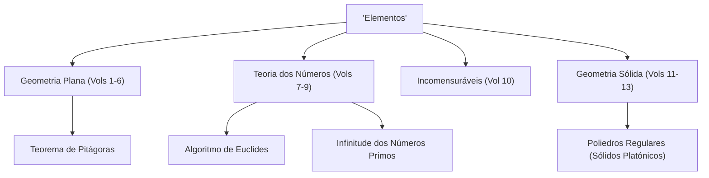

Quando se fala da história da matemática, há uma estrela gigante que não pode ser ignorada. Esse é o antigo matemático grego **[Euclides](https://kenji.blog/pt/p/euclid/)**. Também conhecido como o "Pai da Geometria", foi o pioneiro que estabeleceu a matemática como um sistema lógico. Neste artigo, iremos aprofundar os episódios da vida de [Euclides](https://kenji.blog/pt/p/euclid/), os conteúdos da sua obra-prima histórica "Elementos" e as importantes realizações matemáticas que ele deixou para trás.

## A vida e os episódios de [Euclides](https://kenji.blog/pt/p/euclid/)

No que diz respeito à vida de [Euclides](https://kenji.blog/pt/p/euclid/) (cerca de 300 a.C.), na verdade restam muito poucos registos históricos definitivos. Onde nasceu e que tipo de vida levou só pode ser inferido a partir de descrições fragmentárias de estudiosos em épocas posteriores. No entanto, é amplamente conhecido que ele esteve ativo em **Alexandria**, no Egito, e dirigiu uma escola de matemática durante o reinado de Ptolomeu I.

### "Não há caminho real para a geometria"

Um dos episódios mais famosos relacionados com [Euclides](https://kenji.blog/pt/p/euclid/) é a sua interação com o rei egípcio Ptolomeu I.
O rei tentou estudar o livro "Elementos" de [Euclides](https://kenji.blog/pt/p/euclid/), mas como o seu conteúdo era muito difícil e longo, perguntou a [Euclides](https://kenji.blog/pt/p/euclid/):
"Não há um caminho mais curto ou mais fácil para aprender geometria?"
A isto, diz-se que [Euclides](https://kenji.blog/pt/p/euclid/) respondeu firmemente:

> "Senhor, não há caminho real para a geometria."

Esta frase atinge a verdade de que não há atalhos ou privilégios especiais para aqueles que estão no poder na aprendizagem, e todos devem fazer esforços constantes da mesma forma. Tem sido transmitida a muitas pessoas até aos dias de hoje.

## O maior best-seller da história: "Elementos"

A maior e mais duradoura realização de [Euclides](https://kenji.blog/pt/p/euclid/) é a compilação do livro de matemática **"Elementos"**, composto por 13 volumes. Este livro é uma compilação de conhecimentos matemáticos da Grécia Antiga e diz-se que é o livro mais publicado no mundo depois da Bíblia.

O aspeto inovador de "Elementos" é que estabeleceu uma **abordagem axiomática**, em vez de apenas listar teoremas individuais. O método de partir de algumas premissas evidentes (axiomas e postulados) e provar todos os teoremas apenas através de dedução lógica determinou o curso futuro da matemática e da ciência.

### O mistério do quinto postulado (Postulado das Paralelas)

No primeiro volume de "Elementos", são listados cinco postulados (premissas geométricas). Entre eles, o quinto postulado (postulado das paralelas) era o seguinte:

"Se uma linha reta cortar duas linhas retas formando ângulos interiores do mesmo lado cuja soma seja inferior a dois ângulos retos, então as duas linhas, se prolongadas indefinidamente, encontram-se no lado em que os ângulos somam menos de dois ângulos retos."

Este postulado era mais complexo que os outros quatro, e muitos matemáticos suspeitaram: "Não será este um teorema que pode ser provado a partir dos outros postulados, em vez de ser um postulado em si mesmo?" As tentativas de o provar ao longo de milhares de anos terminaram todas em fracasso. No entanto, no século XIX, a **Geometria não euclidiana**, uma geometria na qual o quinto postulado não se aplica, foi finalmente descoberta, trazendo uma revolução ao mundo matemático. Pode dizer-se que este evento paradoxalmente provou a agudeza da intuição de [Euclides](https://kenji.blog/pt/p/euclid/).

## As grandes realizações matemáticas de [Euclides](https://kenji.blog/pt/p/euclid/)

[Euclides](https://kenji.blog/pt/p/euclid/) deixou realizações notáveis não apenas na geometria, mas também no campo da teoria dos números. Aqui apresentamos duas realizações particularmente famosas.

### 1. Algoritmo de [Euclides](https://kenji.blog/pt/p/euclid/)

O **Algoritmo de [Euclides](https://kenji.blog/pt/p/euclid/)** é um algoritmo para encontrar eficientemente o máximo divisor comum (MDC) de dois números naturais. É também chamado de um dos algoritmos mais antigos da história humana.

Seja o máximo divisor comum de dois números naturais $a$ e $b$ (onde $a > b$) $\gcd(a, b)$. Se o quociente da divisão de $a$ por $b$ for $q$ e o resto for $r$, aplica-se a seguinte relação:

$$ a = bq + r $$

Nesta altura, é estabelecida a seguinte equação:

$$ \gcd(a, b) = \gcd(b, r) $$

Ao repetir este processo até que o resto $r$ se torne $0$, o máximo divisor comum pode ser encontrado de forma eficiente.

### 2. Prova da Infinitude dos Números Primos

No 9.º volume de "Elementos", [Euclides](https://kenji.blog/pt/p/euclid/) provou que existe um número infinito de números primos usando uma prova por contradição muito bela e elegante.

**Resumo da prova:**
Suponha que existe apenas um número finito de números primos, e que o conjunto de todos os números primos é $p_1, p_2, \dots, p_n$.
Agora, considere um novo número $P$ obtido adicionando $1$ ao produto de todos estes números primos.

$$ P = p_1 p_2 \dots p_n + 1 $$

Dado que este número $P$ deixa um resto de $1$ quando dividido por qualquer número primo existente $p_i$, não é divisível.
Portanto, ou $P$ é por si só um novo número primo, ou é divisível por um novo número primo que não listámos.
Em qualquer caso, contradiz a suposição inicial de que "existe apenas um número finito de números primos".
Assim, fica provado que **os números primos existem infinitamente**.

## Conclusão: O legado de [Euclides](https://kenji.blog/pt/p/euclid/)

Os "Elementos" de [Euclides](https://kenji.blog/pt/p/euclid/) vão muito além de ser um mero livro de texto de matemática; influenciaram grandemente grandes cientistas posteriores como Newton e Einstein como o derradeiro material didático para a humanidade aprender o pensamento lógico.

O estilo que ele estabeleceu de "derivar logicamente conclusões a partir de premissas" enraizou-se profundamente para além da estrutura da matemática, na filosofia, na ciência e nos alicerces da ciência da computação moderna. Sempre que pensamos logicamente sobre as coisas, podemos sempre sentir o fôlego de [Euclides](https://kenji.blog/pt/p/euclid/).
