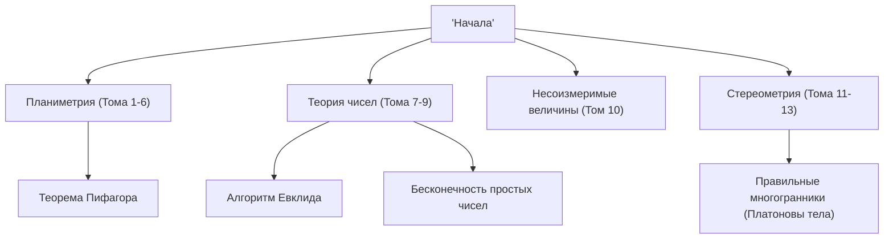

Говоря об истории математики, нельзя игнорировать такую гигантскую звезду. Это древнегреческий математик **Евклид**. Также известный как «Отец геометрии», он был пионером, который утвердил математику как логическую систему. В этой статье мы углубимся в эпизоды из жизни Евклида, содержание его исторического шедевра «Начала» и важные математические достижения, которые он оставил после себя.

## Жизнь и эпизоды Евклида

Относительно жизни Евклида (около 300 г. до н.э.) осталось очень мало достоверных исторических свидетельств. Где он родился и какую жизнь вел, можно только предполагать из фрагментарных описаний ученых более поздних эпох. Однако широко известно, что он вел активную деятельность в **Александрии**, Египет, и руководил математической школой во времена правления Птолемея I.

### «В геометрии нет царской дороги»

Один из самых известных эпизодов, связанных с Евклидом, — это его общение с египетским царем Птолемеем I.
Царь пытался изучать книгу Евклида «Начала», но поскольку ее содержание было слишком трудным и длинным, он спросил Евклида:
«Нет ли более короткого или легкого пути к изучению геометрии?»
На это, как говорят, Евклид твердо ответил:

> «Государь, к геометрии нет царской дороги».

Эта фраза указывает на ту истину, что в обучении нет коротких путей или особых привилегий для власть имущих, и каждый должен в равной степени прилагать постоянные усилия. Она передавалась многим людям вплоть до наших дней.

## Величайший бестселлер в истории: «Начала»

Величайшим и самым долговечным достижением Евклида является составление математической книги **«Начала»**, состоящей из 13 томов. Эта книга представляет собой компиляцию математических знаний Древней Греции, и говорят, что это самая издаваемая книга в мире после Библии.

Новаторским аспектом «Начал» является то, что в них был установлен **аксиоматический подход**, а не просто перечислены отдельные теоремы. Метод отталкивания от нескольких самоочевидных предпосылок (аксиом и постулатов) и доказательства всех теорем исключительно с помощью логической дедукции определил будущий курс математики и науки.

### Загадка пятого постулата (Постулат о параллельных)

В первом томе «Начал» перечислены пять постулатов (геометрических предпосылок). Среди них пятый постулат (постулат о параллельных) гласил следующее:

«Если прямая, падающая на две прямые, образует внутренние и по одну сторону углы, меньшие двух прямых, то эти две прямые при неограниченном продолжении встретятся с той стороны, где углы меньше двух прямых».

Этот постулат был более сложным, чем другие четыре, и многие математики подозревали: «Не является ли это теоремой, которую можно доказать из других постулатов, а не самим постулатом?» Попытки доказать его, длившиеся тысячи лет, закончились неудачей. Однако в 19 веке наконец была открыта **Неевклидова геометрия** — геометрия, в которой не выполняется пятый постулат, что произвело революцию в математическом мире. Можно сказать, что это событие парадоксальным образом доказало остроту интуиции Евклида.

## Великие математические достижения Евклида

Евклид оставил выдающиеся достижения не только в геометрии, но и в области теории чисел. Здесь мы представим два особенно известных достижения.

### 1. Алгоритм Евклида

**Алгоритм Евклида** — это алгоритм для эффективного нахождения наибольшего общего делителя (НОД) двух натуральных чисел. Его также называют одним из старейших алгоритмов в истории человечества.

Пусть наибольший общий делитель двух натуральных чисел $a$ и $b$ (где $a > b$) будет $\gcd(a, b)$. Если частное от деления $a$ на $b$ равно $q$, а остаток равен $r$, то выполняется следующее соотношение:

$$ a = bq + r $$

В этот момент устанавливается следующее равенство:

$$ \gcd(a, b) = \gcd(b, r) $$

Повторяя этот процесс до тех пор, пока остаток $r$ не станет равным $0$, можно эффективно найти наибольший общий делитель.

### 2. Доказательство бесконечности простых чисел

В 9-м томе «Начал» Евклид доказал, что существует бесконечно много простых чисел, используя очень красивое и элегантное доказательство от противного.

**Краткое изложение доказательства:**
Предположим, что существует только конечное число простых чисел, и пусть множество всех простых чисел будет $p_1, p_2, \dots, p_n$.
Теперь рассмотрим новое число $P$, полученное прибавлением $1$ к произведению всех этих простых чисел.

$$ P = p_1 p_2 \dots p_n + 1 $$

Поскольку это число $P$ дает остаток $1$ при делении на любое существующее простое число $p_i$, оно не делится ни на одно из них.
Следовательно, либо $P$ само является новым простым числом, либо оно делится на новое простое число, которое мы не перечислили.
В любом случае это противоречит первоначальному предположению о том, что «существует только конечное число простых чисел».
Таким образом, доказано, что **простые числа существуют бесконечно**.

## Заключение: Наследие Евклида

«Начала» Евклида — это не просто учебник математики; он оказал огромное влияние на более поздних великих ученых, таких как Ньютон и Эйнштейн, как идеальное учебное пособие для человечества по изучению логического мышления.

Установленный им стиль «логического выведения выводов из предпосылок» глубоко укоренился за рамками математики — в философии, науке и в основе современной информатики. Всякий раз, когда мы логически мыслим о вещах, мы всегда можем почувствовать дыхание Евклида.
